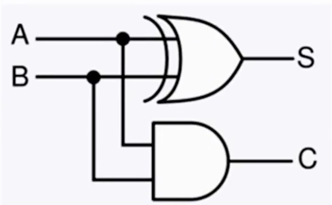

# 디지털 회로와 덧셈

- Cpu = 전자식 계산기
    - -> 산수 계산 (덥셈, 곱셈, 나누기, 뺄셈)

# 컴퓨터가 덧셈하는 방법 \#1

- 2진수 1+1 = 2진수 10(2)
- A가 1, B가 1이면 XOR 연산 결과는 0
- 동시에 A가 1, B가 1이면, AND 연산 결과는 1.
    - 1은 자리 올림(Carry)이다

        

        - ## 더하기를 구하는 방법
        - ### 예시1 
        - #### A = 0 / B = 1
        - A, B는 각각 1 Bit
        - A = 0이므로, 전기가 흐르지 않음
        - B는 둘 다 전기가 흐름
        - C는 0과 1의 합이기에, 1이 됨
        - S는 XOR이기 때문에 0,1이 전달되면 1이 됨.
        - 자리 올림은 없기 때문에 결과는 0

        - ### 예시 2
        - #### A = 1 / B = 1
        - S에 들어오는 두 회로는 1 -> S = 0이 됨
        - C는 AND연산자 -> 둘 다 1이 전달 -> 1이 됨.
        - 2진수에서 1(2)+1(2) = 10(2)

        - ### 이 것을 가지고 두 개의 1 Bit 덧셈이 가능

        - ### 예시 3
        - 알파벳 A는 ASCII의 65
        - 16진수로 표현하면, 0x41
        - 4에 해당하는 2진수는 0100(2)
        - 1에 해당하는 2진수는 0001(2)
        - 총 8 Bit
        - 반 가산기 8개 필요

        - 자리 올림까지, 3개의 bit를 처리해야 함
        - 전 가산기가 필요

        - 더하기만 되면 컴퓨터를 제작할 수 있다.

 
 

# 컴퓨터가 뺄셈하는 방법 \#2

- 6을 10으로 만드려면, 4라는 보수를 더하면 된다.
    - 4는 6에 대하여 10의 보수가 된다.

- 13-7 = 7
    - 13을 6에 대한 10의 보수인 4를 더하고
    - 10의 자리에서 1을 제거하면 7이 된다.

- <u>보수의 덧셈 = 뺄셈</u>

 
 

- 2진수에서 0은 -> 1로, 1은 -> 0으로 뒤집는 것 = 1의 보수 (= Not 연산)
- 그렇게 구한 1의 보수에다가 +1을 하면 = 2의 보수
- 어떤 숫자에 2의 보수를 더하면,
- 그 것이 2진수의 뺄셈이 되는 것

- #### 예제
- 13 = 1101
-  6 = 0110
- 6의 1의 보수 = 1001(2)
- 6의 2의 보수 = 1001(2) + 1(2) -> 1010(2) -> 10
    - 4 Bit를 넘는 범위는 버림

 
 

# 컴퓨터가 곱셈하는 방법 \#3

- 덧셈 연산을 여러 번 수행하면 됨
- 더 효율적인 방법 = Shift

- 예시1
- 4비트로 정수 5는 = 0101(2)
- 4비트 0101(2)를 왼쪽으로 한 칸씩 밀기 1010(2) -> 10
- 맨 오른쪽에는 자동으로 0이 채워짐 (Padding)
- <- 왼쪽으로 한 칸 밀면, x2
- <- 왼쪽으로 두 칸 밀면, x4

 
 

# 컴퓨터가 나눗셈하는 방법 \#4

- Shift하는 것은 동일
- 단, 방향이 반대 -> 오른쪽으로 Shift
- 예시
- 4비트로 6을 표현하면, 0110(2)
- 오른쪽으로 -> 한 칸씩 밀면, 0011(2)
- 0011(2) = 3
- Padding이 왼쪽에서 발생.

 

- 4bit = 2의 4제곱 = 0~15이 다룰 수 있는 제일 큰 수.
- 8bit = 2의 8제곱 = 0~255까지 다룰 수 있음
- 32bit = 2의 32제곱 = 0~4,294,967,295까지 다룰 수 있음(42억)

 

- ### 나눗셈 = 뺄셈으로 구현되는 것
- 예시
- 15라는 숫자
- 15 - 5 = 10
- 10은 5보다 큼.
- 10에서 5를 또 뺌.
- 5에서 5를 또 뺄 수 있으니 뺌.
- 총 5를 3번 뺌.