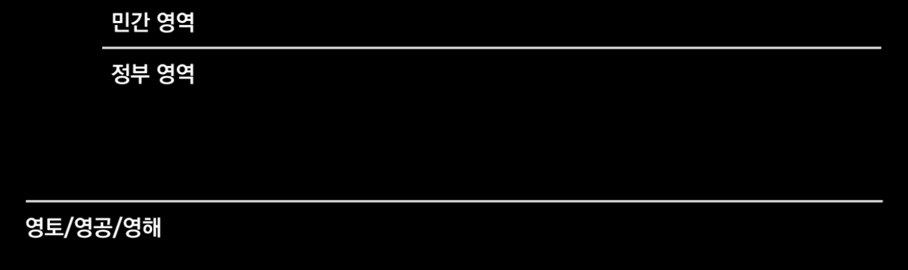
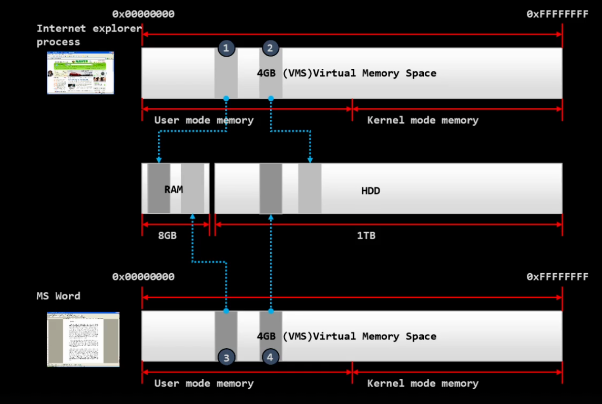

# 동시성

- 개별 사건이 동시에 일어나는 일.
    - `유튜브 시청` & `게임 실행`

# 병렬성

- 같은 일을 여러 주체가 동시에 진행하는 것

 
 

# 원자성

- 한 주체만 할 수 있는 어떤 일을, 두 주체가 동시에 할 수 없는 것.
- `Lock` ~ `unLock` 시점까지 원자성을 보장
    - 화장실에 들어가 문을 잠그고, 나올 때 까지 화장실 사용을 보장

# 동기화

- 잠금장치
    - 동기화는 여러 개의 주체(스레드, 프로세스)가 어떤 순서와 규칙에 맞게 서로 협력할 수 있도록 제어하는 것
    - 즉, 서로 발을 맞추는 것
    - 누가 먼저 들어가고, 누가 기다리고, 언제 풀어줄지까지 관리하는 개념
    - 예) 신호등

# 교착상태(Dead Lock)

- 여러 주체(스레드/프로세스)가 서로가 가진 자원을 기다리면서 무한정 멈춰 있는 상태
- 즉, 아무도 앞으로 진행하지 못하는 막힘 현상

 
 

# 컴퓨터의 구성요소
- H/W, S/W로 구성
- S/W
    - 1. Application
    - 2. System -> O/S

## 프로그램, 프로세스, 스레드

    -프로그램은 설치하는 것
    -설치된 프로그램을 실행하면 프로세스(PID)가 생성
    -스레드는 프로세스 속에 존재하는 `실행 단위`
    -스레드는 프로세스에게 할당된 자원을 `공유`

- 용도에 따른 기억공간 구분

    - Stack = Thread = 독립 공간(내 방)
    - Heap = Process = 공용 공간(거실)

- 프로세스
    - <u>*컴퓨터 세상에서 나 = 프로세스라는 모습으로 존재</u>

 
 

# 국가, 국민으로 이해하는 컴퓨터 세상

- 비유로 이해하기
    

    - 존립기반
        - 하위 토대가 없으면 상위 개념이 존재할 수 없는 경우.
            - ex) 영토가 없는 국가는 없다

    - 컴퓨터 = 국가
        - 하드웨어 = 영토

    - S/W 
        - System = 정부 영역 = O/S
        - Application = 민간 영역 = 국민의 각 주거 공간
            - 고유의 메모리를 가짐

    - Kernel
        - 다른 집을 탐색할 수 있음 = 검찰, 경찰

# OS의 핵심 Kernel

- 컴퓨터라는 국가의 법은 `Kernel`로 구현

    - 1. 입출력 제어(I/O)
    - 2. 자원 관리(CPU+Memory)
    - 3. 접근 통제

- Kernel 영역 / 사용자(User) 영역은 완전히 다른 세상

 
 

# 가상 메모리 시스템 \#1

- Page
    - 페이징 파일은 Ram처럼 사용하는 하드 디스크 영역

# 가상 메모리 시스템 \#2

## 가상 메모리 시스템을 사용하는 이유
- 각 프로세스 공간을 완벽하게 분리하고 통제
- 프로세스 오류가 운영체제에 영향을 주지 못하게 차단 가능
- 메모리가 부족해도 여러 프로그램들이 작동하는 등 자원을 효율적으로 활용