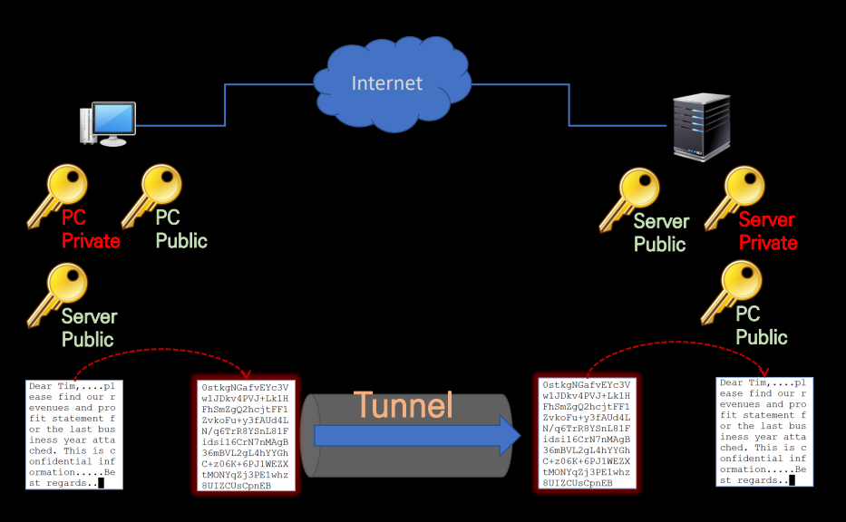
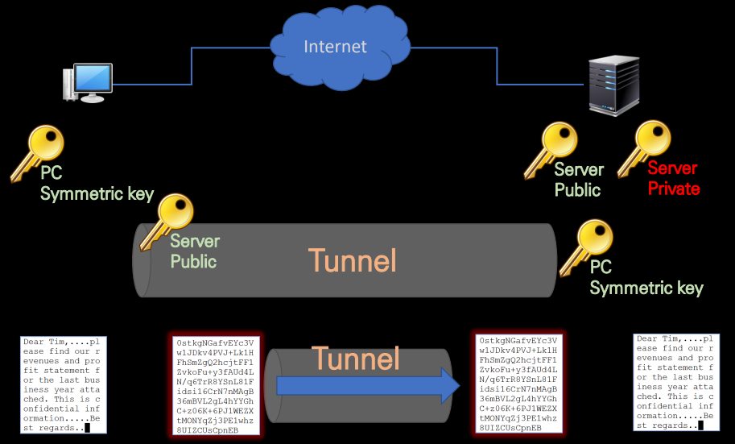
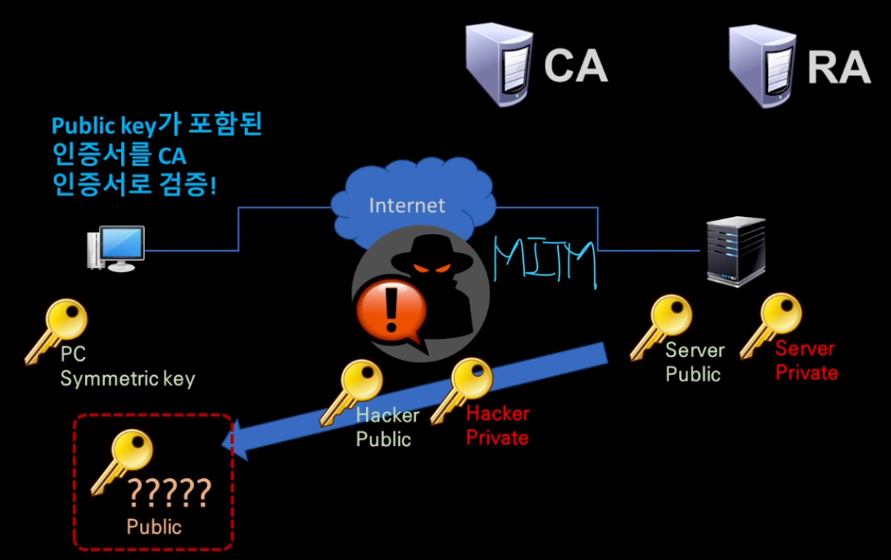
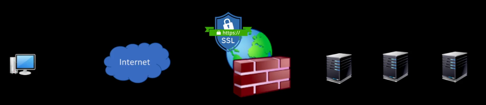

# 인터넷을 위한 비대칭키 체계

## 대칭키 인터넷 환경 문제

- Key 자체가 정보 -> 노출되면 안 됨.
- 대칭키(Symmetric Key)는 하나의 키로 암호화, 복호화
    - 암호문이 노출되면 보안에 위험
    - 키를 어떻게 안전하게 Server에 전달할까?
        - 방법이 없음
        - 인터넷 환경에 부적합
            - USB로 미국에 출장 갈 수는 없음

- 비대칭키로 해결
    
    - PC와 Server의 비밀통신
    1. PC와 Server의 Key 생성
        - PC Public Key
        - Server Private Key
    2. 인터넷에서 Key를 교환
        - PC's `Public Key`  -> Server  
        - Server's `Public Key` -> PC

    2-1. PC
        - Server가 전송한 `Public Key`를 암호화
        - 이 암호화 된 평문을 Server의 Private Key를 사용하여 복호화

    2-2. Server
        - PC가 전송한 PC Public Key를 이용하여 암호화
        - PC는 PC자신의 Private Key로 암호를 복호화

    3. 터널 Tunnel
        - TCP/IP 통신

- Key 생성 (Publick Key-Private Key)에 자원이 많이 소모됨

 
 

# 혼합 사용으로 효율 극대화

- 대칭키를 사용하지 않을 수는 없음
    

- 1. Server에서 비대칭키 생성(Public Key-Private Key)
    - Server의 Public Key를 PC로 보내서 암호화하는데 사용
- 2. PC에서 대칭키(Symmetric Key) 생성
    - Server에서 전달 받은 Public Key를 이용해서 암호화 처리 후, 터널로 전송
- 3. Server의 Private Key로 암호문을 풀기 -> 대칭키 추출

- 대칭키는 효율이 좋음
- 대칭키로 평문을 암호화
- Server도 PC만든 Public Key를 가지고 있음
- PC가 만든 이 Key = `Session Key`

 
 

# 비대칭키 체계의 문제점

- PC입장에서 악의적인 공격을 방지하여 Server에서 전송된 Public Key를 신뢰해도 되는가?
    - Man In the Middle (중간자 공격)
        - PC <-> (정보가 통신되는 경로) <-> Server
        - 통신하는 중간에서 해커가 Server의 Public Key를 가로채서 해커의 Publick Key를 PC에 전송
        - Server의 Publick Key로 신뢰하고 PC는 Session Key를 암호화하여 전송
        - 해커는 자신의 Private Key로, PC가 Server의 Public Key라고 믿고 있는 해커의 Private Key로 복호화
        - 그렇게 탈취한 Session Key와 Server에서 전송된 Public Key를 이용하여 해커의 데이터를 암호화
- 검증이 필요
    - 여러 인증 체계

---

# 공개 키 신뢰를 위한 검증 체계

- 수신한 Key를 신뢰할 수 있는가?

    

    - 키-쌍을 생성할 때 전산 자원을 많이 소모
        - 나무젓가락은 한 번만 쓰고 버려도 되지만,
        - 쇠 젓가락은 한 번만 쓰고 버리기에는 아깝다.
    - 기존에는 키-쌍을 매 번 생성했지만,
    - 1회 생성 후, 일정 기간 사용

 
 

# 웹 서비스와 공인 인증서

- Public한 인터넷 환경
    

- Web Server 분석할 때
    - SSL인증서가 어디에 설치되는지를 확인하면 된다

- WEB / WAS / DB

- DMZ
    - Web Application Fire(방화벽) 위치에 보통 SSL인증서가 위치