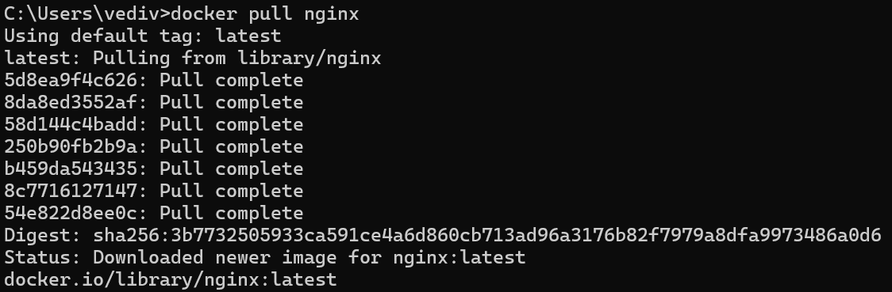
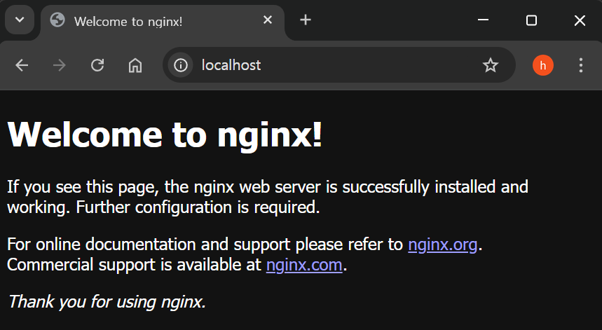
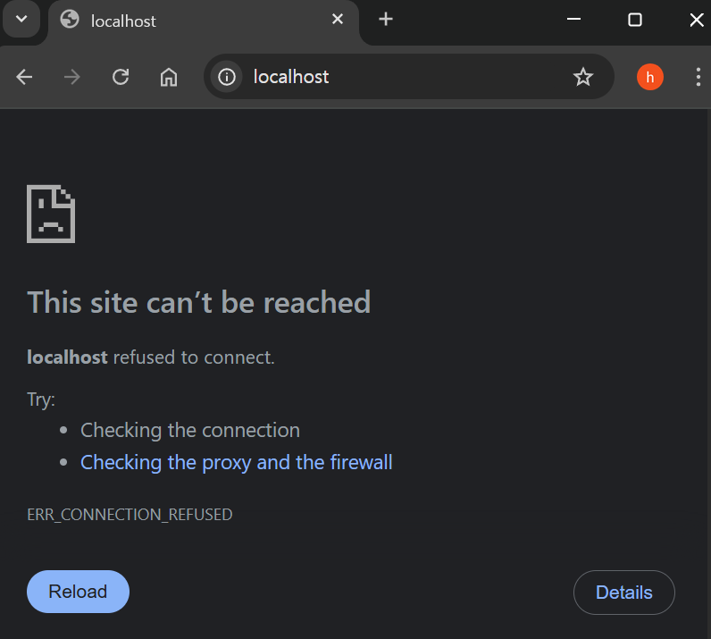
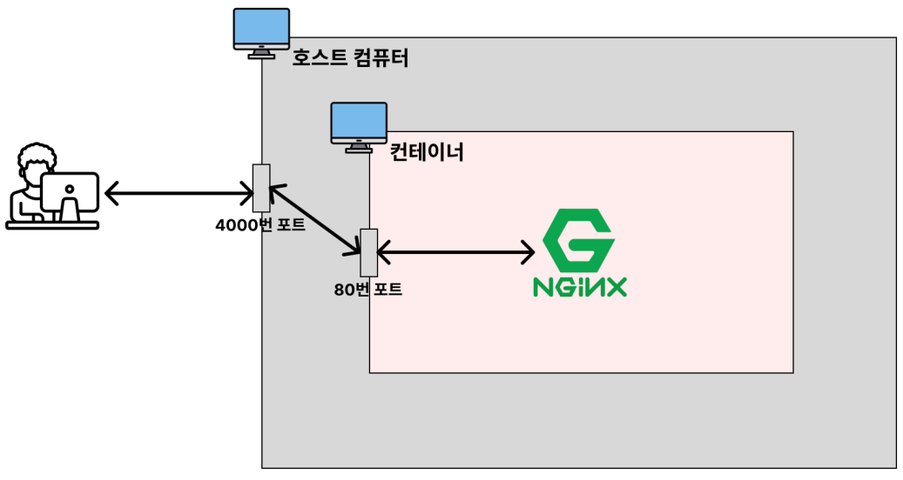

# 📖 Docker를 왜 배우는 걸까?

> 이식성 : 특정 프로그램을 다른 곳으로 쉽게 옮겨서 설치 및 실행할 수 있는 특성

- 매번 귀찮은 **설치 과정을 일일이 거치지 않아도 된다.**
- **항상 일관되게** 프로그램을 설치할 수 있다. (버전, 환경 설정, 옵션, 운영 체제 등)
- 각 프로그램이 독립적인 환경에서 실행되기 때문에 **프로그램 간에 서로 충돌이 일어나지 않는다.**

<br>
<br>
<br>

# 📖 IP와 Port의 개념

## IP의 개념

> 네트워크 상에서의 <u>특정 컴퓨터를 가리키는 주소</u>

## Port의 개념

> 한 컴퓨터 내에서 실행되고 있는 <u>특정 프로그램의 주소</u>

## 잘 알려진 포트(well-known port)

- 포트 번호는 0 ~ 65,535번까지 사용 가능
- 이 중, 0 ~ 1023번까지의 포트 번호는 주요 통신을 위한 규약에 따라 이미 정해져 있는 포트 번호

> 이렇게 규약을 통해 역할이 정해져있는 포트 번호를 보고 잘 알려진 포트(well-known port)

### 자주 사용되는 포트 번호
- 22번 (SSH, Secure Shell Protocol)
    - 원격 접속을 위한 포트 번호
    - EC2 인스턴스에 연결할 때 22번 포트를 사용
- 80번 (HTTP)
    - HTTP로 통신을 할 때 사용
- 443번 (HTTPS)
    - HTTPS로 통신을 할 때 사용

    
<br>
<br>
<br>

# 📖 Docker / Container / Image

## Docker란 ?
- 컨테이너를 사용하여 각각의 프로그램을 분리된 환경에서 실행 및 관리할 수 있는 툴

<br>

## 컨테이너(Container)란?
- 하나의 컴퓨터 환경 내에서 여러개의 미니 컴퓨터 환경을 구성할 수 있는 형태
- 컨테이너를 포함하고 있는 컴퓨터를 ‘호스트(host) 컴퓨터’

<br>

### 컨테이너(Container)의 독립성
- 디스크 (저장 공간)
    - 각 컨테이너마다 저장 공간을 가지고 있다.
    - 일반적으로 A 컨테이너 내부에서 B 컨테이너 내부에 있는 파일에 접근할 수 없다.
- 네트워크 (IP, Port)
    - 각 컨테이너마다 고유의 네트워크를 가지고 있다.
    - 컨테이너는 각자의 IP 주소를 가지고 있다.

<br>

## 이미지(Image)란?

>  닌텐도의 칩과 같은 역할을 하는 개념

- 이미지(Image)는 프로그램을 실행하는 데 필요한 설치 과정, 설정, 버전 정보 등을 포함
- 즉, 프로그램을 실행하는 데 필요한 모든 것을 포함


---

<br>

## Nginx 설치하기

docker에서 Nginx 설치 명령어

```
docker pull nginx
```




### Nginx Image가 다운되었는지 확인

```
docker image ls
```

### Nginx 실행

```
docker run --name webserver -d -p 80:80 nginx
```

#### Nginx 접속하기

`localhost:80`


#### Nginx 종료하기

```
docker stop webserver
```

---

# 📍 자주 사용되는 Docker 명령어

- 자주 사용되는 명령어만 기본적으로 익히기
- 그 외 명령어는 필요할 때 검색해서 사용하면 됨

<br>

## 이미지(Image) 다운로드

-  `docker pull 이미지명`

    ```
    $ docker pull nginx     (docker pull nginx:latest와 동일하게 작동)
    ```

### 특정 버전 이미지 다운로드

- `docker pull 이미지명:태그명`

    ```
    $ docker pull nginx:stable-perl
    ```

<br>
<br>

## 이미지 조회 / 삭제

- 이미지 조회

    ```
    docker image ls
    ```

- 이미지 삭제

    ```
    docker image rm <Image name>
    ```

    - 컨테이너에서 사용 중이지 않은 이미지만 삭제 가능

<br>

- 이미지 강제 삭제

    ```
    docker image rm -f <Image name>
    ```

<br>

- 컨테이너에서 사용하고 있지 않은 전체 이미지 삭제

    ```
    docker image rm -f $(docker images -q)
    ```

<br>

## 컨테이너 생성

- 이미지를 토대로 컨테이너를 생성

    - 미니 컴퓨터를 생성
        ```
        docker create nginx
        ```

    - 컨테이너를 실행

        ```
        docker start <CONTAINER ID> 

        # docker ps -a로 container id를 확인 가능
        ```

- 이미지를 다운 받지 않아도 docker hub에서 자동 다운 & 설치가능

    - mysql image가 없는 상황에서의 명령어

        ```
        docker create mysql
        ```

---

## 컨테이너 삭제

    - docker ps -a 명령어를 통해 CONTAINER ID를 확인

        ```
        docker rm <CONTAINER ID>

        # CONTAINER ID의 일부만 입력해도 삭제 가능
        ```

    - 동시 삭제도 가능

        ```
        docker rm 07e 156 78e
        ```

---

## docker create와 docker start는 docker run 명령어로 한 번에 실행 가능

```
docker run nginx
```

---

## foreground

- 내가 실행 시킨 프로그램의 내용이 화면에서 출력되는 상태
- 실시간으로 실행 중인 프로그램의 상태를 확인하는 장점
- 다른 프로그램을 실행할 수 없는 단점

## background

- 내가 실행 시킨 프로그램의 내용이 컴퓨터 내부적으로 실행되는 상태

---

## docker run nginx를 백그라운드에서 실행하기

- d옵션으로 실행

    ```
    docker run -d nginx
    ```

- 이 상태에서 다른 명령어 실행 가능

## 컨테이터 이름을 붙여서 생성하기

 - `my-web-server` 라는 이름을 붙여서 nginx 생성하기

    ```
    docker run -d --name my-web-server nginx
    ```

## 컨테이너의 특징

- local에서 nginx접속해보기

    ```
    localhost:80
    ```

    - 연결되지 않음

        

---

<br>
<br>
<br>

### 이유



- 컨테이너 특징 : 독립적 ➡️ `호스트 컴퓨터의 네트워크`와 `컨테이터 컴퓨터 네트워크`가 분리
- 외부에서 컨테이너 네트워크에 접근 불가
- 포트를 연결해야 함.

    ```
    docker run -d -p 4000:80 nginx

    docker ps -a

    # PORTS
    # 0.0.0.:4000->80/tcp
    ```

    1. 사용자가 4000번 PORT로 요청을 보내면, 80번 PORT와 연결시킨다는 뜻

- localhost:4000으로 연결 요청

    