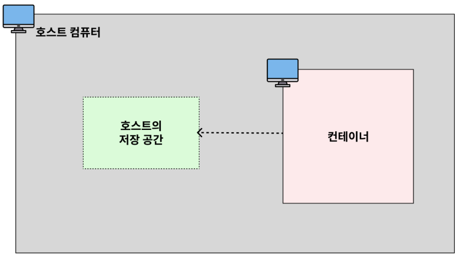
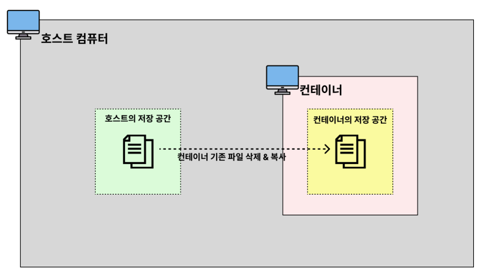
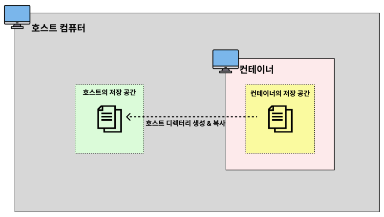

# 📖 Docker를 왜 배우는 걸까?

> 이식성 : 특정 프로그램을 다른 곳으로 쉽게 옮겨서 설치 및 실행할 수 있는 특성

### ✅ 매 번 귀찮은 **설치 과정을 일일이 거치지 않아도 된다.**
### ✅ **항상 일관되게** 프로그램을 설치할 수 있다. (버전, 환경 설정, 옵션, 운영 체제 등)
### ✅ 각 프로그램이 독립적인 환경에서 실행되기 때문에 **프로그램 간에 서로 충돌이 일어나지 않는다.**

<br>
<br>
<br>

# 📖 IP와 Port의 개념

## IP의 개념

> 네트워크 상에서의 <u>특정 컴퓨터를 가리키는 주소</u>

## Port의 개념

> 한 컴퓨터 내에서 실행되고 있는 <u>특정 프로그램의 주소</u>

## 잘 알려진 포트(well-known port)

- 포트 번호는 `0` ~ `65,535`번까지 사용 가능
- 이 중, `0` ~ `1023`번까지의 포트 번호는 주요 통신을 위한 규약에 따라 이미 정해져 있는 포트 번호

> 이렇게 규약을 통해 역할이 정해져있는 포트 번호를 보고 잘 알려진 포트(well-known port)

### 자주 사용되는 포트 번호
- `22번` (SSH, Secure Shell Protocol)
    - 원격 접속을 위한 포트 번호
    - EC2 인스턴스에 연결할 때 22번 포트를 사용
- `80번` (HTTP)
    - HTTP로 통신을 할 때 사용
- `443번` (HTTPS)
    - HTTPS로 통신을 할 때 사용

    
<br>
<br>
<br>

# 📖 Docker / Container / Image

## Docker란 ?
- 컨테이너를 사용하여 각각의 프로그램을 분리된 환경에서 실행 및 관리할 수 있는 툴

<br>

## 컨테이너(Container)란?
- 하나의 컴퓨터 환경 내에서 `여러 개의 미니 컴퓨터 환경`을 구성할 수 있는 형태
- 컨테이너를 포함하고 있는 컴퓨터를 `‘호스트(host) 컴퓨터’`

<br>

### 컨테이너(Container)의 독립성
- 디스크 (저장 공간)
    - 각 컨테이너마다 저장 공간을 가지고 있다.
    - 일반적으로 `A 컨테이너` 내부에서 `B 컨테이너` 내부에 있는 파일에 접근할 수 없다.
- 네트워크 (IP, Port)
    - 각 컨테이너마다 고유의 네트워크를 가지고 있다.
    - 컨테이너는 각자의 IP 주소를 가지고 있다.

<br>

## 이미지(Image)란?

>  닌텐도의 칩과 같은 역할을 하는 개념

- 이미지(Image)는 프로그램을 실행하는 데 필요한 설치 과정, 설정, 버전 정보 등을 포함
- 즉, 프로그램을 실행하는 데 필요한 모든 것을 포함


---

<br>

## Nginx 설치하기

docker에서 Nginx 설치 명령어

```
docker pull nginx
```


### Nginx Image가 다운되었는지 확인

```
docker image ls
```

### Nginx 실행

```
docker run --name webserver -d -p 80:80 nginx
```

#### Nginx 접속하기

`localhost:80`


#### Nginx 종료하기

```
docker stop webserver
```

---

# 📍 자주 사용되는 Docker 명령어

- 자주 사용되는 명령어만 기본적으로 익히기
- 그 외 명령어는 필요할 때 검색해서 사용하면 됨

<br>

## 이미지(Image) 다운로드

-  `docker pull 이미지명`

    ```
    $ docker pull nginx     (docker pull nginx:latest와 동일하게 작동)
    ```

### 특정 버전 이미지 다운로드

- `docker pull 이미지명:태그명`

    ```
    $ docker pull nginx:stable-perl
    ```

<br>
<br>

## 이미지 조회 / 삭제

- 이미지 조회

    ```
    docker image ls
    ```

- 이미지 삭제

    ```
    docker image rm <Image name>
    ```

    - 컨테이너에서 사용 중이지 않은 이미지만 삭제 가능

<br>

- 이미지 강제 삭제

    ```
    docker image rm -f <Image name>

    # -f 옵션 : force -> 강제로 처리
    ```

<br>

- 컨테이너에서 사용하고 있지 않은 전체 이미지 삭제

    ```
    docker image rm -f $(docker images -q)
    ```

<br>

## 컨테이너 생성

- 이미지를 토대로 컨테이너를 생성

    - 미니 컴퓨터를 생성
        ```
        docker create nginx
        ```

    - 컨테이너를 실행

        ```
        docker start <CONTAINER ID> 

        # docker ps -a로 container id를 확인 가능
        ```

- 이미지를 다운 받지 않아도 docker hub에서 자동 다운 & 설치가능

    - mysql image가 없는 상황에서의 명령어

        ```
        docker create mysql
        ```

---

## 컨테이너 삭제

- docker ps -a 명령어를 통해 CONTAINER ID를 확인

    ```
    docker rm <CONTAINER ID>

    # CONTAINER ID의 일부만 입력해도 삭제 가능
    ```

- 동시 삭제도 가능

    ```
    docker rm 07e 156 78e
    ```

---

## docker create와 docker start는 docker run 명령어로 한 번에 실행 가능

```
docker run nginx
```

---

## foreground

- 내가 실행 시킨 프로그램의 내용이 화면에서 출력되는 상태
- 실시간으로 실행 중인 프로그램의 상태를 확인하는 장점
- 다른 프로그램을 실행할 수 없는 단점

## background

- 내가 실행 시킨 프로그램의 내용이 컴퓨터 내부적으로 실행되는 상태

---

## docker run nginx를 백그라운드에서 실행하기

- d 옵션으로 실행

    ```
    docker run -d nginx
    ```

- 이 상태에서 다른 명령어 실행 가능

## 컨테이터 이름을 붙여서 생성하기

 - `my-web-server` 라는 이름을 붙여서 nginx 생성하기

    ```
    docker run -d --name my-web-server nginx
    ```

## 컨테이너의 특징

- local에서 nginx접속해보기

    ```
    localhost:80
    ```

    - 연결되지 않음

        

---

<br>
<br>
<br>

### 80 PORT에 연결이 안 되는 이유


- 컨테이너 특징 : 독립적 
    - ➡️ `호스트 컴퓨터의 네트워크`와 `컨테이터 컴퓨터 네트워크`가 분리
- 외부에서 컨테이너 네트워크에 접근 불가
- 포트를 연결해야 함.

    ```
    docker run -d -p 4000:80 nginx

    docker ps -a

    # PORTS
    # 0.0.0.:4000->80/tcp
    ```

    1. 사용자가 4000번 PORT로 요청을 보내면, 80번 PORT와 연결시킨다는 뜻

- 웹 브라우저에서 localhost:4000으로 연결 요청 TEST


<br>
<br>
<br>

## 실행 중인 컨테이너 조회 명령어

```
docker ps
```

## 모든 컨테이너 조회 명령어

```
docker ps -a
```

## 컨테이너 종료 명령어 1

```
docker stop <CONTAINER ID>
```

- 시스템 종료 버튼과 같은 명령어

## 컨테이너 종료 명령어 2

```
docker kill <CONTAINER ID>
```
- 전원 플러그 뽑아 버리는 것과 같은 명령어
- 파일 손상 가능성이 높음

## 컨테이너 삭제 명령어

```
docker rm <CONTAINER ID>
```

- 컨테이너가 실행 중일 때는, 컨테이너를 삭제할 수 없기 때문에, 중지 후 삭제 시도


## 중지되어 있는 모든 컨테이너 삭제 명령어

```
docker rm $(docker ps -qa)
```


## 실행되어 있는 컨테이너 삭제 명령어

```
docker rm -f <CONTAINER ID>
```


<br>
<br>
<br>

## 컨테이너 로그 조회

- 에러 발생 시, 로그를 확인하며 디버깅

> `docker run nginx` 명렁어를 통해 foreground로 실행시키면, 다른 작업을 할 수 없음.

- background로 실행하기

    ```
    docker run -d nginx
    ```

<br>

- log 명령어

    ```
    docker logs <CONTIANER ID>
    ```

<br>

- 마지막 10줄말 출력하기

    ```
    docker logs --tail 10 <CONTAINER ID>
    ```

<br>

- 실시간으로 생성되는 로그 확인 명령어

    ```
    docker logs -f <CONTAINER ID>
    ```

    
<br>

- 명령어 실행 시점부터 실시간으로 생성되는 로그 확인 명령어 (기존 log는 미출력)

    ```
    docker logs --tail 0 -f <CONTAINER ID>
    ```


<br>
<br>
<br>

## 실행 중인 컨테이너 내부에 접속하기 (exec -it)

- `컨테이너` = `미니 컴퓨터`

### 1. nginx를 background에서 실행하기

```
docker run -d nginx
```

### 2. nginx가 실행 중인 컨테이너 접속하기
```
docker exec -it <CONTAINER ID> or <NAMES> bash
```

### 3. 다시 HOST 컴퓨터로 빠져나오기
```
exit
```


<br>
<br>
<br>

## Docker 전체 흐름 정리

> "NGINX를 docker에서 실행시킬거야"

### 1. NGINX 이미지 다운

```
docker pull nginx
```

- docker run 명렁어는 이미지가 없으면 자동으로 이미지를 다운로드하기 때문에 pull 명령어는 생략해도 되는 명령어

### 2. 다운 받은 이미지를 컨테이너에 올리기
```
docker run --name webserver -d -p 80:80 nginx
```
- `--name` : 이름 부여
- `-d` : background 실행
- `-p 80:80` : port mapping


<br>
<br>
<br>

## Docker로 Redis 실행하기

### 1. Redis 이미지 다운과 실행을 동시에 하기

```
docker run -d -p 6379:6379 redis
```

### 2. 이미지가 설치됐는지 확인
```
docker iamge ls
```

### 3. Redis가 실행되고 있는 컨테이너에 접속
```
docker exet -it <CONTAINER ID> or <NAMES> bash
```
- `bash` : bash 환경에서 실행

### 4. Redis 프로그램 실행
```
redis-cli
```

### 5. Redis 이미지가 설치된 컨테이너 삭제
```
docker rm -f <CONTAINER ID> or <NAMES>
```

### 6. Redis 이미지 삭제
```
docker image rm <IMAGE ID> or <REPOSITORY>
```

<br>
<br>
<br>

# 📍 Docker Volume을 활용한 데이터 유실 방지

<br>

## Docker Volume

### ✅ 컨테이너가 가진 문제점
- Docker를 활용하면 특정 프로그램을 컨테이너로 띄울 수 있다.
- 이 프로그램에 기능이 추가되면 새로운 이미지를 만들어서 컨테이너를 실행시켜야 한다.
- 이 때, Docker는 기존 컨테이너에서 변경된 부분을 수정하지 않고, 새로운 컨테이너를 만들어서 통째로 갈아끼우는 방식으로 교체를 한다. 이게 효율적이라고 생각했던 것이다.
- 이런 특징 때문에 기존 컨테이너를 새로운 컨테이너로 교체하면, 기존 컨테이너 내부에 있던 데이터도 같이 삭제된다.
-  만약 이 컨테이너가 MySQL을 실행시키는 컨테이너였다면 MySQL에 저장된 데이터도 같이 삭제 돼버린다.
- 따라서 컨테이너 내부에 저장된 데이터가 삭제되면 안 되는 경우에는 볼륨(Volume)이라는 개념을 활용해야 한다.

### ✅ Docker Volume(도커 볼륨)이란?
- 도커의 볼륨(Volume)이란 도커 컨테이너에서 데이터를 영속적으로 저장하기 위한 방법이다.
- 볼륨(Volume)은 컨테이너 자체의 저장 공간을 사용하지 않고, 호스트 자체의 저장 공간을 공유해서 사용하는 형태이다.
    

### ✅ 볼륨(Volume)을 사용하는 명령어

```
$ docker run -v [호스트의 디렉토리 절대경로]:[컨테이너의 디렉토리 절대경로] [이미지명]:[태그명]
```
- [호스트의 디렉토리 절대 경로] 에 디렉토리가 이미 존재할 경우, 호스트의 디렉터리가 컨테이너의 디렉터리를 덮어씌운다.

    

<br>

- [호스트의 디렉토리 절대 경로] 에 디렉토리가 존재하지 않을 경우, 호스트의 디렉터리 절대 경로에 디렉터리를 새로 만들고 컨테이너의 디렉터리에 있는 파일들을 호스트의 디렉터리로 복사해온다.

    

---

## Windows에서 lsof, kill, sudo 명령어가 작동하지 않을 때 대처 방법

### ✅ 사용 중인 포트 검색

**Windows**

```java
netstat -ano | findstr [포트 번호]

netstat -ano | findstr 8080
```

**Mac**

```java
lsof -i :[포트 번호]

lsof -i :8080
```

### ✅ 프로세스 종료

**Windows**

```java
taskkill /f /pid [프로세스 아이디]

taskkill /f /pid 8872
```

**Mac**

```java
kill -9 [프로세스 아이디]

kill -9 8872
```

### ✅ 관리자 권한으로 실행

**Windows**

아래 그림과 같이 실행시키고자 하는 터미널(cmd, powershell 등)을 마우스 우클릭 한 후 ‘**관리자 권한으로 실행**’ 메뉴를 누르면 된다.


<br>
<br>
<br>

## Docker로 MySQL 실행하기

```
docker run -p 3306:3306 -d mysql
```
- `-p` : Host Port ↔ Container Port를 연결하는 옵션
- `-d` : 컨테이너를 백그라운드에서 실행하라는 옵션


## 해당 Port가 이미 사용 중인 경우

- 출력되는 Error Message

    `Ports are not available: exposing prot TCP 0.0.0.:3306 ...`

- 3306 PORT에 실행되고 있는 프로그램 조회

    ```
    sudo lsof -i:3306
    ```

- 3306 PORT에 실행되고 있는 프로그램 종료시키기

    ```
    sudo kill <PID>
    ```

- 3306 PORT에 실행되고 있는 프로그램이 종료되었는지 확인하기 위해 조회

    ```
    sudo lsof -i:3306
    ```
- 비어있는 3306에 mysql 설치하기

    ```
    docker run -p 3306:3306 -d mysql
    ```

- 컨테이너 리스트 조회

    ```
    docker ps
    ```

### 가정 1. 비어있는 3306에 mysql을 설치했지만 컨테이너 목록에 표출되지 않는 상황

- debugging 하기

    ```
    docker ps -a
    ```

    - 분명히 비어있는 3306에 설치한 mysql 이미지가 존재.

- log 확인하기

    ```
    docker logs <CONTAINER ID> or <NAMES>
    ```
    - `Database is uninitialized and password option is net specified`라는 message를 확인
    
- 초기 비밀번호 설정하기    
    - docker hub - mysql을 보면 아래와 같이 설정하라고 나와있음
        ```
        $ docker run --name some-mysql -e MYSQL_ROOT_PASSWORD=my-secret-pw -d mysql:tag
        ```
        - `-e MYSQL_ROOT_PASSWORD`=my-secret-pw : 환경변수 설정. MySQL 공식 이미지에서 루트 비밀번호 초기화에 필요

- 초기 비밀번호 설정 후, 실행 및 확인


---

### 환경 변수로 설정한 값 확인하기

- 환경 변수로 설정한 값

    ```
    -e MYSQL_ROOT_PASSWORD=my-secret-pw
    ```

- 컨테이너로 접속

    ```
    docker exec -it <CONTAINER ID> or <NAMES> bash
    ```

- 컨테이너 환경 변수에 저장되어 있는 값을 조회

    ```
    ecoh $MYSQL_ROOT_PASSWORD
    ```

---

### 가정2. 컨테이너를 교체할 때, MySQL의 데이터도 사라지는 상황

- MySQL 설치하기

    ```
    $ docker run --name some-mysql -e MYSQL_ROOT_PASSWORD=my-secret-pw -d mysql:tag
    ```

- MySQL 컨테이너 접속

    ```
    docker exec -it <CONTANER ID> or <NAMES> bash
    ```
- MySQL 프로그램 접속

    ```
    mysql -u root -p
    Enter Password: 
    ```

- 설치되어 있는 Database 조회

    ```
    show databases;
    ```

- 테이블 생성

    ```
    create database mydb;
    ```

- MySQL 컨테이너 삭제하기

    ```
    docker rm -f <CONTAINER ID>
    ```
---

- 다시 MySQL 설치하기

    ```
    $ docker run --name some-mysql -e MYSQL_ROOT_PASSWORD=my-secret-pw -d mysql:tag
    ```
- MySQL 컨테이너 접속

    ```
    docker exec -it <CONTANER ID> or <NAMES> bash
    ```
- MySQL 프로그램 접속

    ```
    mysql -u root -p
    Enter Password: 
    ```

- 설치되어 있는 Database 조회

    ```
    show databases;
    ```

> 생성한 mydb가 사라짐

- 이를 방지하기 위해 `Volume`을 활용

---

## 볼륨(Volume)을 활용해 MySQL 컨테이너 띄우기

- 기존 설치된 MySQL 삭제하기

    ```
    docker rm -f <CONTAINER ID>
    ```

- MySQL 데이터 정보를 HOST에 저장

    - MySQL 데이터 정보를 저장할 폴더 생성

        ```
        mkdir docker-mysql
        ```

- Volume 생성

    ```
    $ cd /Users/jaeseong/Documents/Develop
    $ mkdir docker-mysql # MySQL 데이터를 저장하고 싶은 폴더 만들기

    # docker run -e MYSQL_ROOT_PASSWORD=password123 -p 3306:3306 -v {호스트주소}:{MySQL 데이터 저장 경로} {이미지 명}
    $ docker run -e MYSQL_ROOT_PASSWORD=123 -p 3306:3306 -v "/Users/vediv/Documents/docker-mysql:/var/lib/mysql" -d mysql

    # 윈도우에서 생성하는 방법
    docker run -e MYSQL_ROOT_PASSWORD=password123 -p 3306:3306 -v "{호스트주소}:/var/lib/mysql" -d mysql


    ```

        - HOST 디렉터리(\Users\vediv\Documents\docker-mysql)를 컨테이너 /var/lib/mysql에 마운트 됨
        - 컨테이너를 지워도 데이터는 호스트에 보존

        > {MySQL 데이터 저장 경로}인 `/var/lib/mysql` 이 경로는 docker hub 공식문서에 명시됨

---

### Volume을 활용해 만든 MySQL 컨테이너 테스트

- 컨테이너 접속
    ```
    docker exec -it <CONTAINER ID> bash
    ```

- MySQL 프로그램 접속

    ```
    mysql -u root -p
    Enter Password: 
    ```

- 설치되어 있는 Database 조회

    ```
    show databases;
    ```

- 테이블 생성

    ```
    create database mydb;
    ```

- 컨테이너에서 빠져나와서 MySQL 컨테이너 삭제

    ```
    docker rm -f <CONTAINER ID>
    ```

---

- 다시 MySQL 설치하기

    ```
    $ docker run -e MYSQL_ROOT_PASSWORD=123 -p 3306:3306 -v "/Users/vediv/Documents/docker-mysql:/var/lib/mysql" -d mysql
    ```
- MySQL 컨테이너 접속

    ```
    docker exec -it <CONTANER ID> or <NAMES> bash
    ```
- MySQL 프로그램 접속

    ```
    mysql -u root -p
    Enter Password: 
    ```

- 설치되어 있는 Database 조회

    ```
    show databases;
    ```

> 데이터가 남아있음

- ✅ Volume 정보의 초기 비밀번호 값은 `docker-mysql` 폴더에 생성된 설정 파일에 저장되어 있기에 비밀번호를 변경하려면 해당 파일을 삭제하고 설치하면 됨.

---

### Volume을 활용해 PostgreSQL 띄우기

- postgresql 설치
    ```
    $ docker run -e POSTGRES_PASSWORD=root -p 5432:5432 -v "/Users/vediv/Documents/docker-postgres/postgresql_data:/var/lib/postgresql/data " -d postgres 
    ```

- postgresql 접속

    ```
    docker exec -it <NAMES> psql -U postgres
    ```

    ```
    docker exec -it names<> bash
    psql -U postgres
    ```

    - `-v` : HOST 경로를 컨테이너 내부 경로에 마운트하는 옵션

---

### Volume을 활용해 MongoDB 띄우기

- MongoDB 설치
    ```
    $ docker run -e MONGO_INITDB_ROOT_USERNAME=root -e MONGO_INITDB_ROOT_PASSWORD=root -p 27017:27017 -v "/Users/vediv/Documents/docker-mongodb/data:/data/db" -d mongo 
    ```

- MongoDB 접속

    ```
    docker exec -it mongodb bash

    mongosh -u root -p root
    ```