# 📍 배포(Deployment)란?

개발자들은 “이제 기능 구현도 끝났고 테스트도 끝났으니 배포하자!"라는 말을 자주 한다.

> 여기서 배포란 무슨 뜻일까? 배포(Deployment)란?

다른 사용자들이 인터넷을 통해서 사용할 수 있게 만드는 걸 의미한다. 

쉽게 얘기해서 우리가 만든 웹 페이지나 서버를 다른 사람들이 사용하려면 인터넷 상에 배포가 돼있어야 한다.

자신의 컴퓨터에서 개발을 할 때는 localhost라는 주소로 테스트도 하고 개발을 한다.

하지만 이 localhost는 다른 컴퓨터에서는 접근이 불가능한 주소이다.

배포를 하게 되면 IP(ex. 124.16.2.1)나 도메인(ex. www.naver.com)과 같이 고유의 주소를 부여받게 되고, 

다른 컴퓨터에서 그 주소로 접속할 수 있게 된다.

이게 바로 배포(Deployment)다.

따라서 어떤 서비스를 완성했다면, 그 다음 단계로 해야 하는 게 배포(Deployment)이다.

코딩을 배울 때도 기본적인 백엔드 서버를 만들 수 있는 역량이 갖춰졌다면, 그 다음에 배워야 하는 게 배포(Deployment)이다. 

<br>
<br>
<br>

# 📍 EC2란? / EC2를 왜 배울까? / 현업에서 EC2는 주로 언제 쓸까?

## ✅ EC2(Elastic Compute Cloud)란?

>💡 한 줄 요약 : 외부 컴퓨터를 빌려 원격으로 접속해 사용하는 서비스이다.
- EC2를 쉽게 얘기하면 하나의 컴퓨터를 의미.

## ✅ EC2(Elastic Compute Cloud)를 왜 배울까?

서버를 배포하기 위해서는 컴퓨터가 필요하다.

내가 가진 컴퓨터에서 서버를 배포해 다른 사용자들이 인터넷을 통해 접근할 수 있게 만들 수도 있다.

하지만 내 컴퓨터로 서버를 배포하면 24시간 동안 컴퓨터를 켜놔야 한다.

그리고 인터넷을 통해 내 컴퓨터에 근할 수 있게 만들다보니 보안적으로도 위험할 수도 있다.

이러한 불편함 때문에 내가 가지고 있는 컴퓨터를 사용하지 않고, AWS EC2라는 컴퓨터를 빌려서 사용하는 것이다.

이 외에도 AWS EC2는 여러 부가기능들(로깅, 오토스케일링, 로드밸런싱 등)을 많이 가지고 있다.

## ✅ 현업에서는 ?
현업에서도 실제 서버를 배포할 때 AWS EC2를 아주 많이 사용한다.

백엔드 서버를 배포해야 할 때면 EC2에 서버를 배포해서 사용한다.

> “그러면 프론트엔드 웹 페이지를 배포할 때는 AWS EC2를 사용하지 않는걸까?”

프론트엔드 웹 페이지를 배포할 때 AWS EC2를 사용할 수도 있다.

하지만 AWS EC2보다 vercel, netlify 또는 AWS S3를 사용해서 주로 배포한다.

이게 어떤 것들인지 모를 경우 “AWS EC2는 백엔드 서버를 배포할 때 주로 사용하는구나“라고만 기억해도 괜찮다. 


<br>
<br>
<br>

# 📍 EC2 세팅하기

## 💡 1. 리전(Region) 선택하기

### ✅ AWS EC2 서비스로 들어가서 리전(Region) 선택하기

- AWS EC2를 시작하기 위해서는 우선적으로 리전(Region)을 먼저 선택해야 한다.

    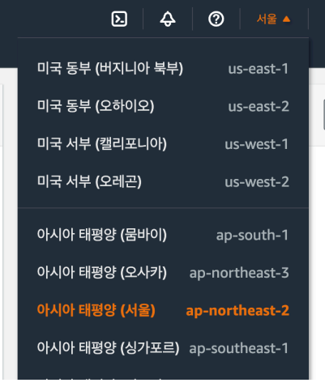

### ✅ 리전(Region)이란?
- 리전(Region)이란 인프라를 지리적으로 나누어 배포한 각각의 데이터 센터를 의미한다.

    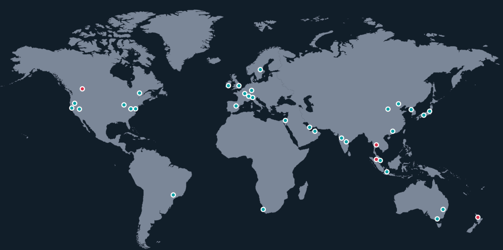


- 조금 더 쉽게 풀어서 EC2에 대입해서 생각해보자.
- 우린 EC2가 컴퓨터를 빌려서 원격으로 접속해 사용하는 서비스라는 걸 알고 있다.
- 여기서 EC2를 통해 빌려서 쓸 수 있는 컴퓨터들이 전 세계적으로 다양하게 분포해있다.
- 이렇게 컴퓨터들이 위치한 위치를 보고 AWS에서는 리전(Region)이라고 한다.

### ✅ 리전(Region)의 특징
1. AWS는 전 세계적으로 다양한 Region을 보유하고 있다.
2. 각 Region은 고유의 이름을 가지고 있다.

    ex) `us-east-1` , `eu-west-3`

### ✅ 리전(Region)은 어떤 기준으로 선택할까?

사람들이 애플리케이션을 사용할 때는 네트워크를 통해 통신하게 된다.

이 때, 사용자의 위치와 애플리케이션을 실행시키고 있는 컴퓨터와 위치가 멀면 멀수록 속도가 느려진다. 

따라서 애플리케이션의 주된 사용자들의 위치와 지리적으로 가까운 리전(Region)을 선택하는 것이 유리하다.

예를 들어, 

한국 유저들이 주로 사용하는 서비스를 만들거라면 리전(Region)을 아시아 태평양(서울)로 택하면 된다.

### ✅ 많이 하는 실수

아시아 태평양(서울) 리전에서 EC2를 생성해놓고, 실수로 미국 동부(버지니아 북부) 리전에 들어가서 생성한 
EC2가 없어졌다고 당황하는 경우가 있다.

리전(Region)마다 EC2가 따로따로 관리가 되고 있으니 이 점 유의하자


## 💡 2. EC2 기본 설정

> 모든 것을 익힐 필요 없다. 가장 자주 사용하고 중요한 `20%`만 익히고 나머지는 필요할 때 방법을 찾아서 사용하자.

### 1. 인스턴스 시작 버튼 클릭하기

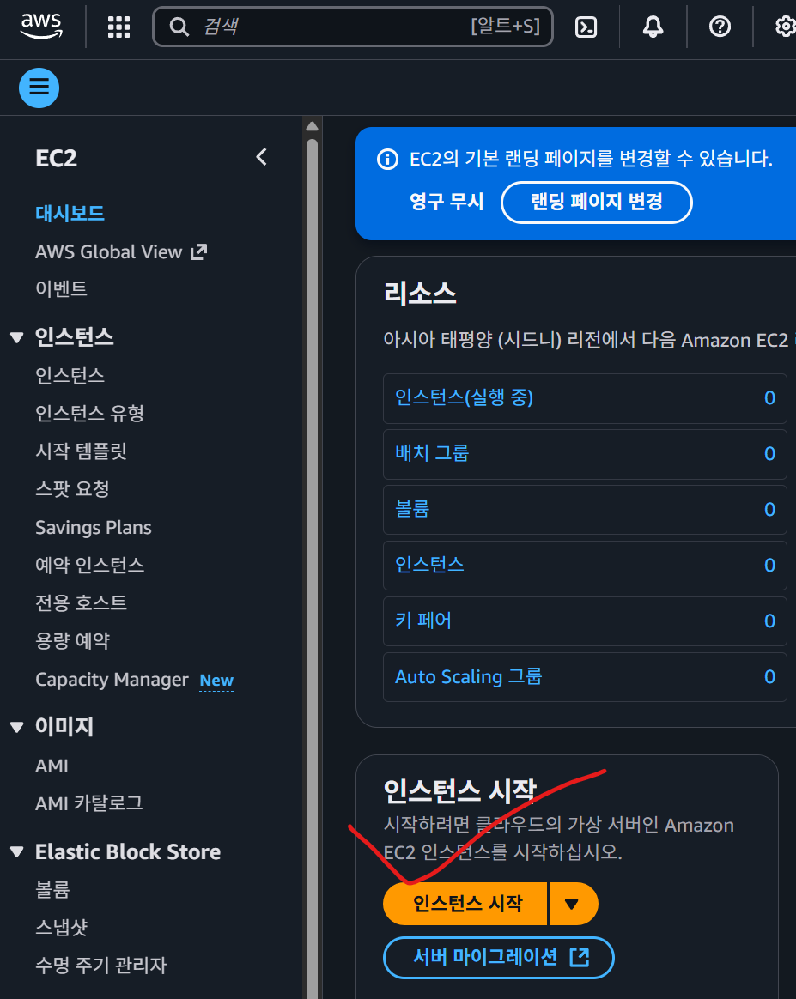

<br>

### 2. 이름 및 태그


- 다양한 EC2 사용, 다양한 서버 종류 사용
- 기능별, 개발용 서버, 배포용 서버 등으로 나눔
- 식별할 수 있는 이름 작성

<br>

### 3. Application and OS Images (Amazon Machine Image)

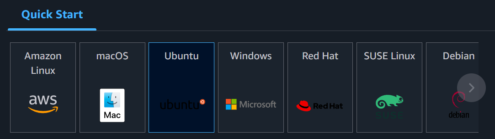

- 윈도우나 맥보다 훨씬 가벼운 우분투를 많이 사용

<br>

### 4. 인스턴스 유형

- 인스턴스 = 컴퓨터 한 대를 의미
- 인스턴스 유형 = 컴퓨터의 사양

    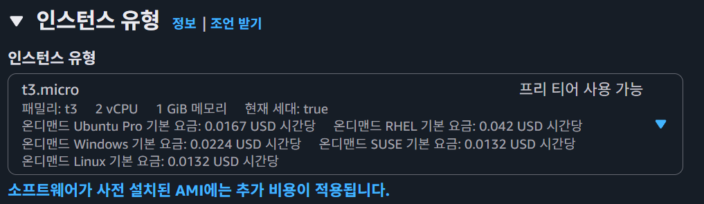


<br>

- 키 페어(Key Pair)는 무슨 뜻일까?
    - EC2 컴퓨터에 접근할 때 사용하는 비밀번호라고 생각하면 된다.
    - 말 그대로 열쇠(Key, 키)의 역할을 한다.
    
        


- 키 페어 이름은 어떤 EC2에 접근하기 위한 키 페어였는 지 알아볼 수 있게 지정하면 좋다.
- RSA 와 .pem 을 선택한 후에 키 페어를 생성하면 된다. ED25519 가 뭔지, .ppk 가 뭔지는 몰라도 된다. 중요하지 않다.

    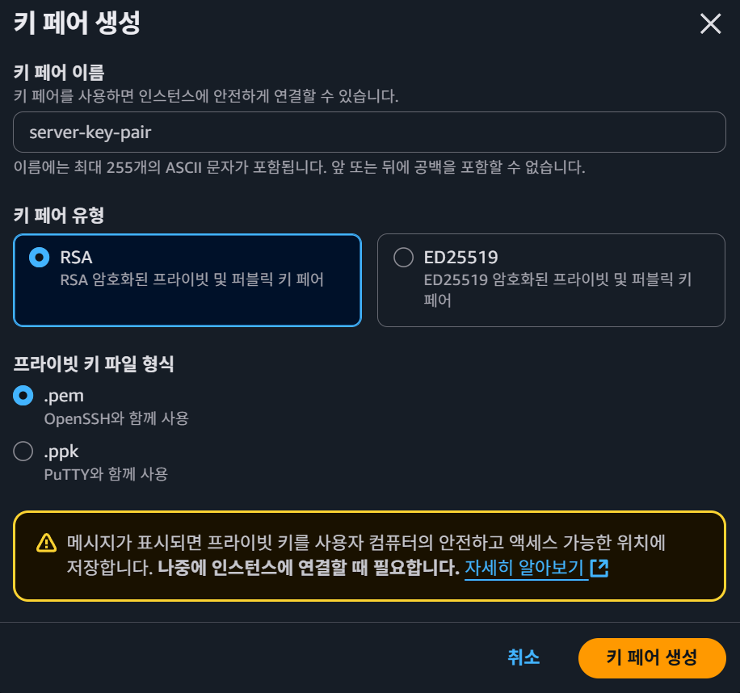

- 키 페어를 생성하면 파일이 하나 다운받아질텐데, 그 파일은 잃어버리면 안 되니 잘 보관해놔야 한다.
- 실습에서는 키 페어 를 활용해서 EC2에 접근하지 않고, 더 편한 방법으로 접근할 예정이다. 


<br>
<br>
<br>

## 💡 2. EC2 보안 그룹 설정

- 편집 클릭

    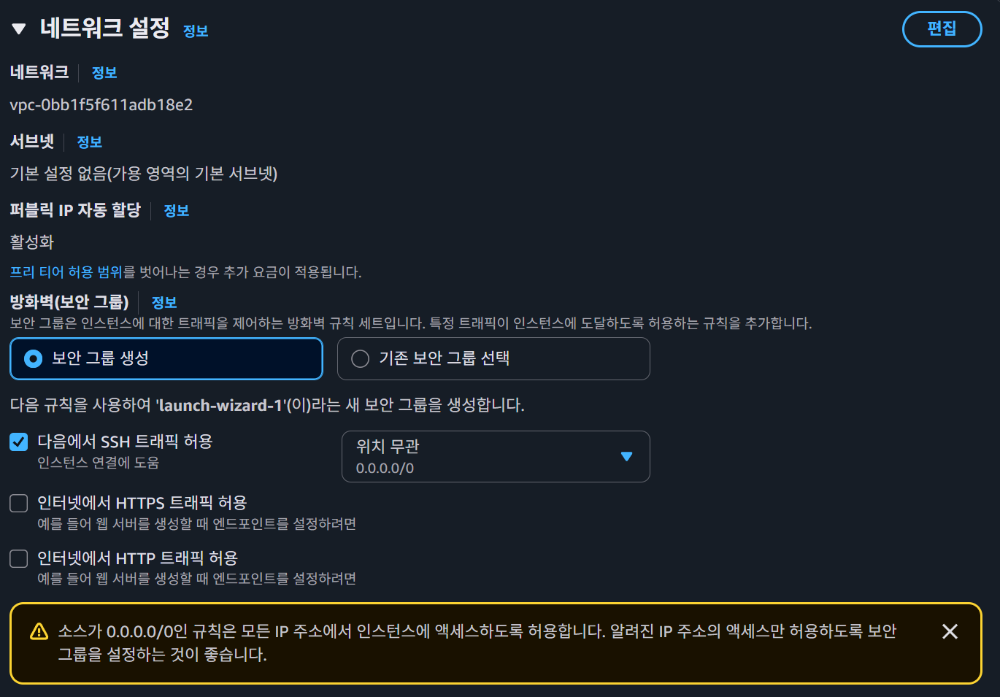

<br>

- 네트워크 설정

    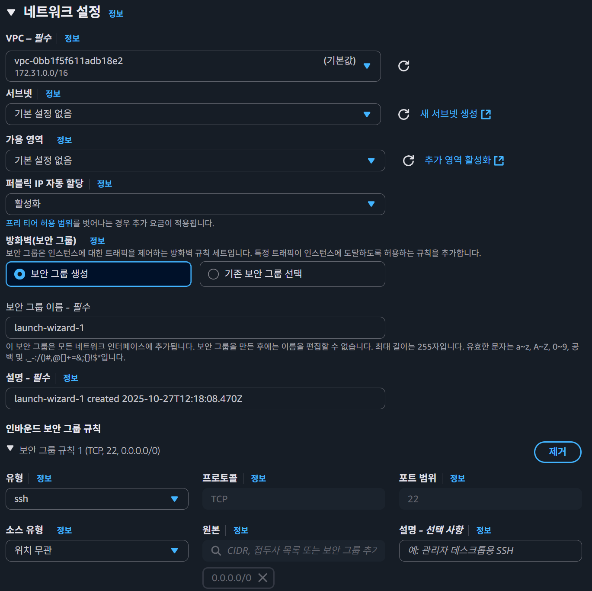

    - 네트워크 설정 칸을 보면 VPC와 Security Groups(보안 그룹)가 보인다.
    - 여기서 VPC라는 개념은 AWS를 입문하는 입장에서는 크게 중요하지 않으니 패스. 
    - VPC를 몰라도 서버를 배포하는 데 아무 문제가 없다.

> Security Groups(보안 그룹)은 서버를 배포할 때 중요한 개념이므로 자세히 알아보자.

<br>
<br>

### ✅ 보안 그룹(Security Group)이란?

- 보안 그룹(Security Group)이란, AWS 클라우드에서의 네트워크 보안을 의미

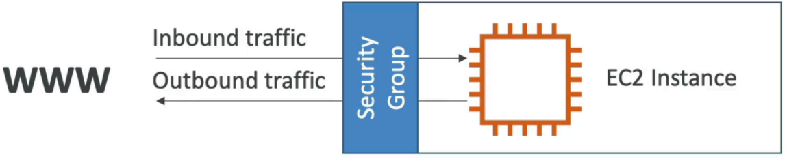

- EC2 인스턴스를 집이라고 생각한다면, 보안 그룹은 집 바깥 쪽에 쳐져있는 울타리와 대문이라고 생각하면 된다.

- 집에 접근할 때 울타리의 대문에서 접근해도 되는 요청인지 보안 요원이 검사를 하는 것과 비슷하다.

- 인터넷에서 일부 사용자가 EC2 인스턴스에 접근(액세스)하려고 한다고 가정해보자. 

- 위 그림과 같이 EC2 인스턴스 주위에 방화벽 역할을 할보안 그룹(Security Group)을 만들고 보안 그룹에 규칙을 지정한다. 

    > `인바운드 트래픽`
    
    - 즉, `외부`에서 ➡️ `EC2 인스턴스`로 보내는 트래픽에서 어떤 트래픽만 허용할 지 설정할 수 있다.

    > `아웃바운드 트래픽`
    
    - 즉, `EC2 인스턴스`에서 ➡️ `외부`로 나가는 트래픽에서 어떤 트래픽만 허용할 지 설정할 수 있다.

- 보안 그룹을 설정할 때는 허용할 IP 범위와 포트(port)를 설정할 수 있다.

- 그러면 EC2 인스턴스를 생성할 때 어떻게 보안 그룹(Security Group)을 설정해야 하는 지 알아보자.

### ✅ 보안그룹 설정

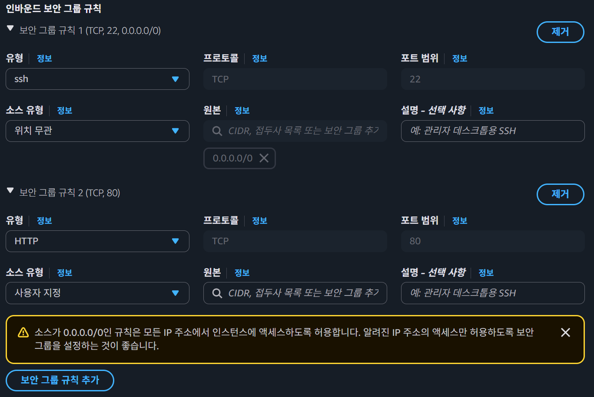

- 외부에서 EC2로 접근할 포트는 22번 포트와 80번 포트라고 생각해서 이 2가지에 대해 인바운드 보안 그룹 규칙을 추가했다.

- 왜냐하면 22번 포트는 우리가 EC2에 원격 접속할 때 사용하는 포트이고, 80번 포트에는 백엔드 서버를 띄울 예정이기 때문이다.

- 그리고 어떤 IP에서든 전부 접근할 수 있게 만들기 위해 소스 유형은 위치 무관으로 설정했다. 

<br>
<br>
<br>

## 💡 3. 스토리지 구성

### ✅ 스토리지 구성

우리가 쓰고 있는 노트북이나 데스크톱 컴퓨터는 전부 하드디스크를 가지고 있다.

하드디스크는 컴퓨터에서 파일을 저장하는 공간이다. 

EC2도 하나의 컴퓨터이다 보니 여러 파일들을 저장할 저장 공간이 필요하다.

이 저장 공간을 보고 EBS(Elastic Block Storage)라고 부른다. 

즉, EBS란 EC2 안에 부착되어 있는 일종의 하드디스크라고 생각하면 된다.

EBS와 같은 저장 공간을 조금 더 포괄적인 용어로 스토리지(Storage), 볼륨(Volume)이라고 부른다.

<br>

### ✅ 세팅
- 스토리지의 종류를 보면 gp3 이외에도 여러가지 종류의 스토리지가 있다.

    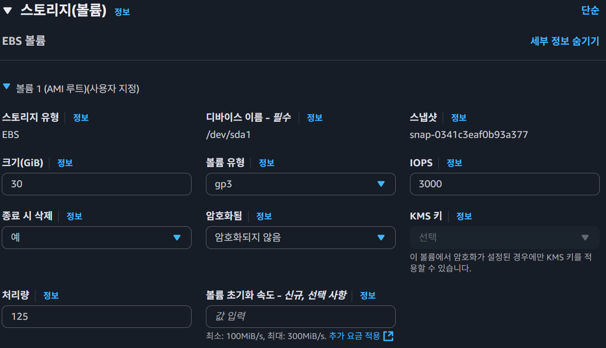
    

- 하지만 가성비가 좋은 gp3를 선택해주자.
- 용량을 30GiB를 설정한 이유는 프리 티어에서 30GiB까지 무료로 제공해주기 때문이다.
- 이 스토리지의 크기는 추후에 늘릴 수도 있으므로 처음 설정할 때 너무 큰 고민을 할 필요는 없다. 

<br>

- 인스턴스 시작 버튼 클릭하기

    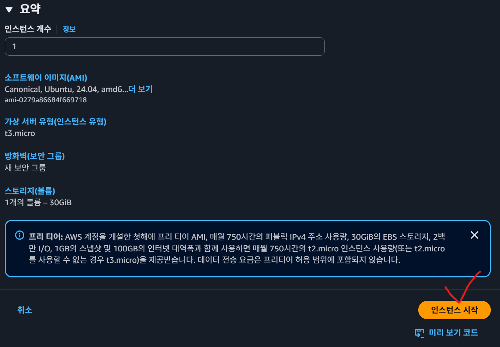

<br>
<br>
<br>


## 4. 💡 EC2 접속하기

- 세부 정보에서 눈여겨 봐야 할 부분은 2가지 밖에 없다. 퍼블릭 IPv4 주소와 인스턴스 상태이다.

    ### 퍼블릭 IPv4 주소

    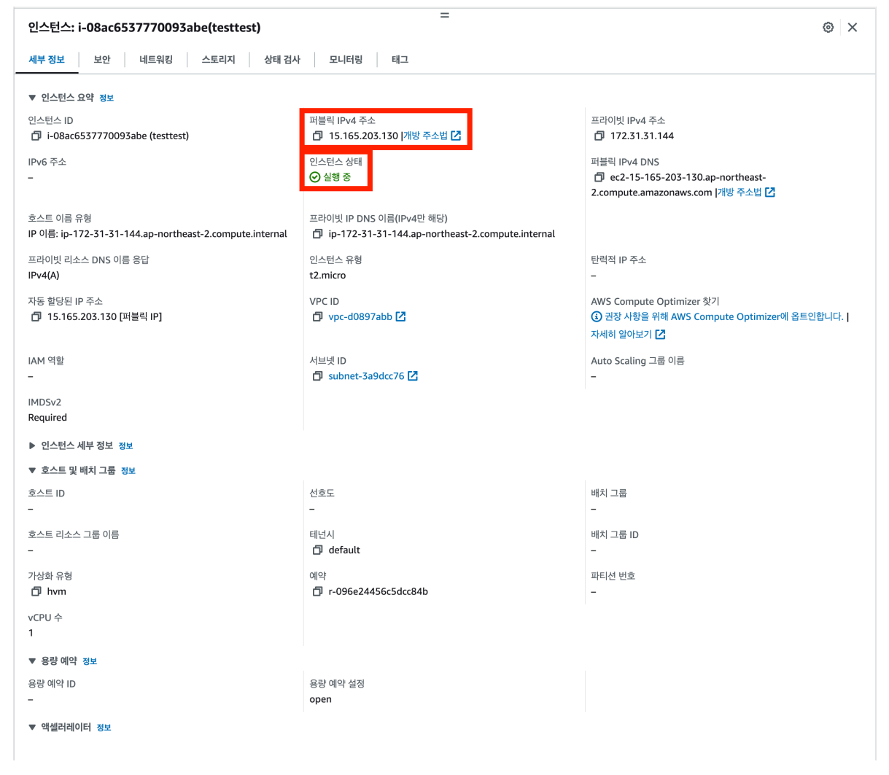

    - 퍼블릭 IPv4 주소는 EC2 인스턴스가 생성되면서 부여받은 IP 주소이다. 
    - EC2 인스턴스에 접근하려면 이 IP 주소로 접근하면 된다.
    - 인스턴스 상태는 말그대로 EC2 인스턴스가 실행 중이라는 뜻은 컴퓨터가 켜져있다는 뜻이다. 

<br>
<br>

### EC2 인스턴스를 중지, 재부팅, 종료도 할 수 있다.

- 우리가 쓰는 컴퓨터와 아주 유사하다.

    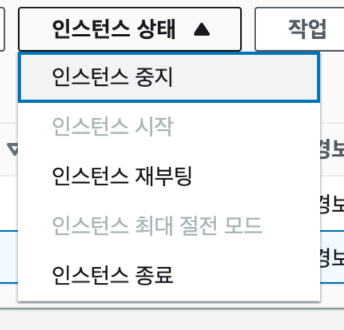

    - 재부팅은 말그대로 컴퓨터를 재시작시키는걸 의미하고, 중지는 컴퓨터를 잠시 꺼놓는 걸 의미한다.
    - 🚨🚨종료는 컴퓨터를 아예 삭제시킨다는 걸 의미한다.🚨🚨
    - EC2 인스턴스를 한 번 종 료하면 도중에 취소할 수 없으니 조심해야 한다.

<br>
<br>

### 보안 (보안 그룹)

- 인스턴스 생성 시 설정한 보안 그룹에 대한 정보

    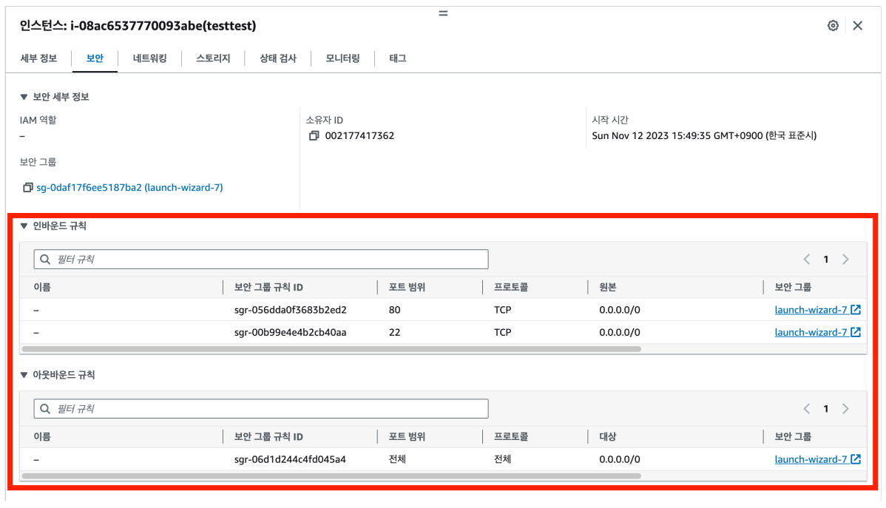

<br>
<br>

### 네트워크

- 퍼블릭 IPv4 주소는 생성한 EC2 인스턴스의 IP 주소를 뜻

    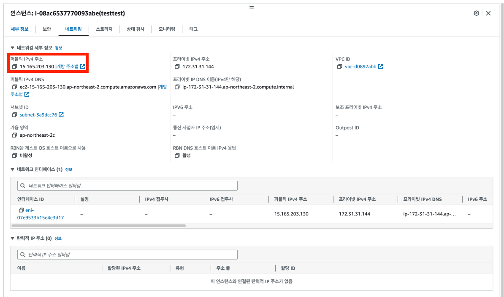

    - 아웃바운드 규칙 
        - 대상 `0.0.0.0/0` : 모든 IP의 접근 허용을 의미

<br>
<br>

### 스토리지

- 인스턴스 생성 시 설정한 스토리지에 대한 정보

    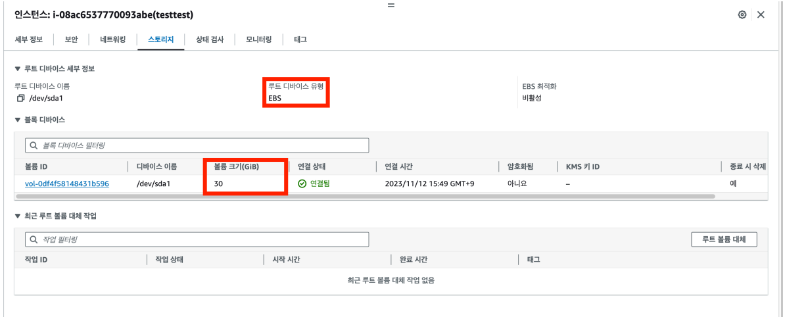


<br>
<br>

### 상태 검사

- 잘 안보는 창

<br>
<br>

### 모니터링

- 리소스 현황을 한 눈에 볼수 있는 창

    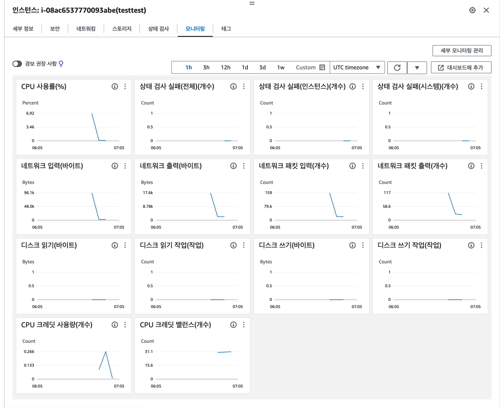


---

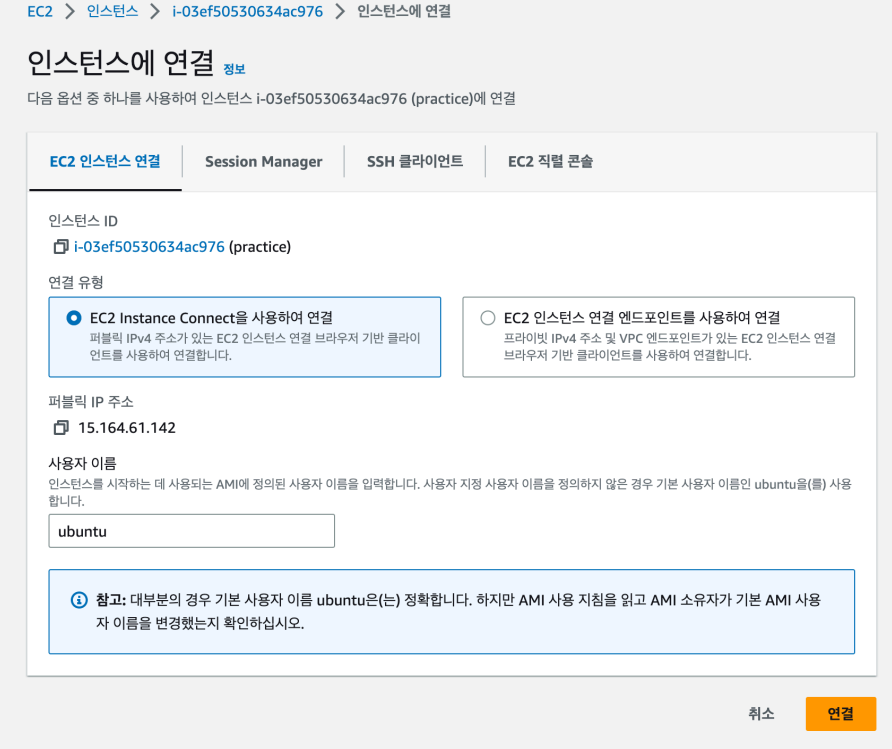

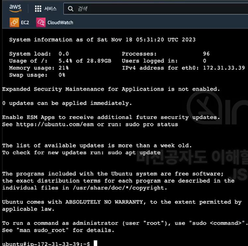

<br>
<br>
<br>

## 5. 탄력적 IP 연결하기

### ✅ 탄력적 IP가 왜 필요할까?

- EC2 인스턴스를 생성하면 IP를 할당받는다.

- 하지만 이렇게 할당받은 IP는 임시적인 IP이다. 

- EC2 인스턴스를 잠깐 중지시켰다가 다시 실행시켜보면 IP가 바뀌어있다.

- EC2 인스턴스를 중지시켰다가 다시 실행시킬 때마다 IP가 바뀌면 굉장히 불편하다.

- 그래서 중지시켰다가 다시 실행시켜도 바뀌지 않는 고정 IP를 할당받아야 한다.

> 그게 바로 탄력적 IP이다.

- 현업에서도 EC2 인스턴스를 생성하면 탄력적 IP를 대부분 필수적으로 설정한다.

    

<br>

- 탄력적 IP 주소 할당 버튼 클릭

    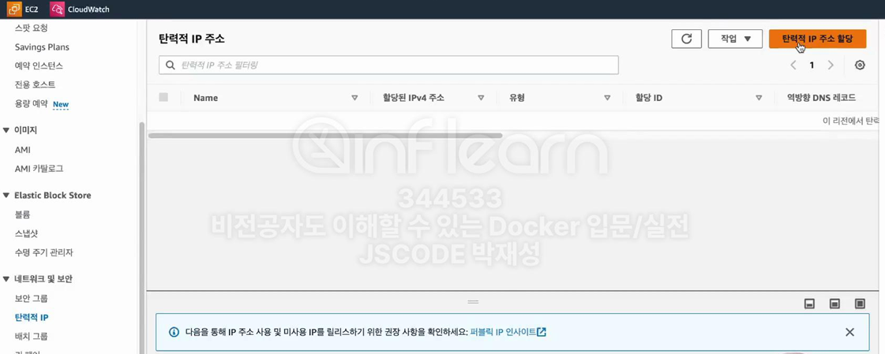

<br>

- 기본 설정 그대로 할당

    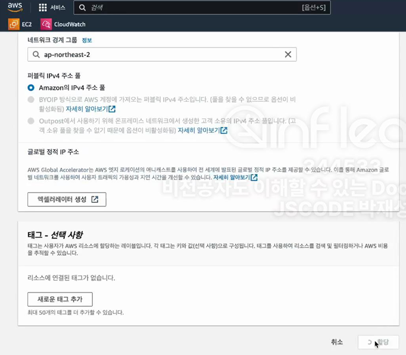

<br>

- 할당된 새로운 IP 주소

    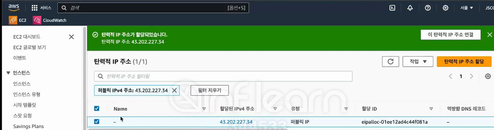

<br>

- 작업/탄력적 IP주소 연결 버튼 클릭

    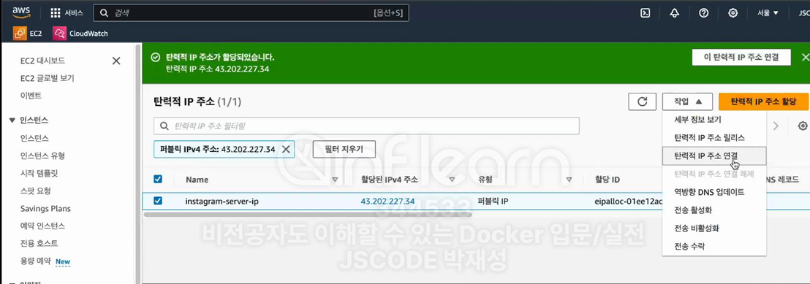

<br>

- 생성한 인스턴스를 선택 후, 연결 버튼 클릭

    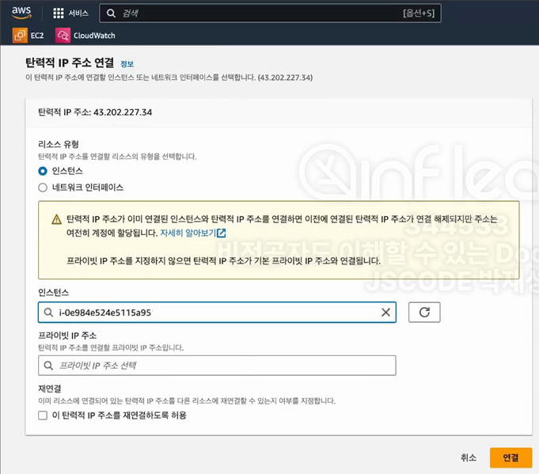

    
<br>

- 생성한 인스턴스를 선택 후, 연결 버튼 클릭

   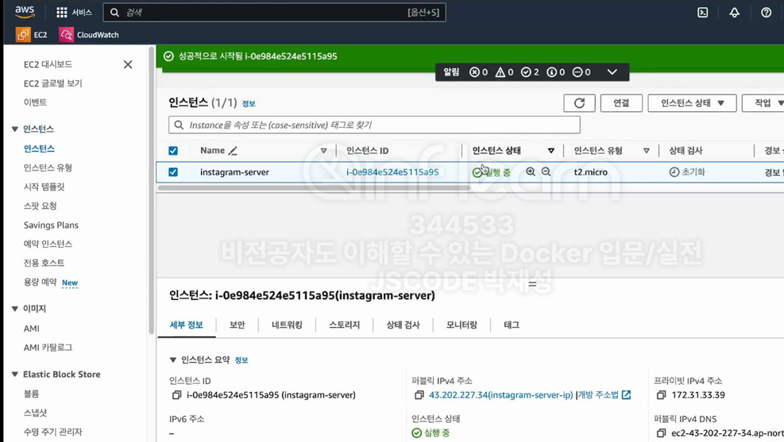

    - 탄력적 IP 주소 연결로 인스턴스를 종료해도 고정된 IP 주소를 사용한다.

<br>
<br>
<br>

## [실습] Express 서버를 EC2에 배포하기

- EC2 인스턴스에 접속하기

    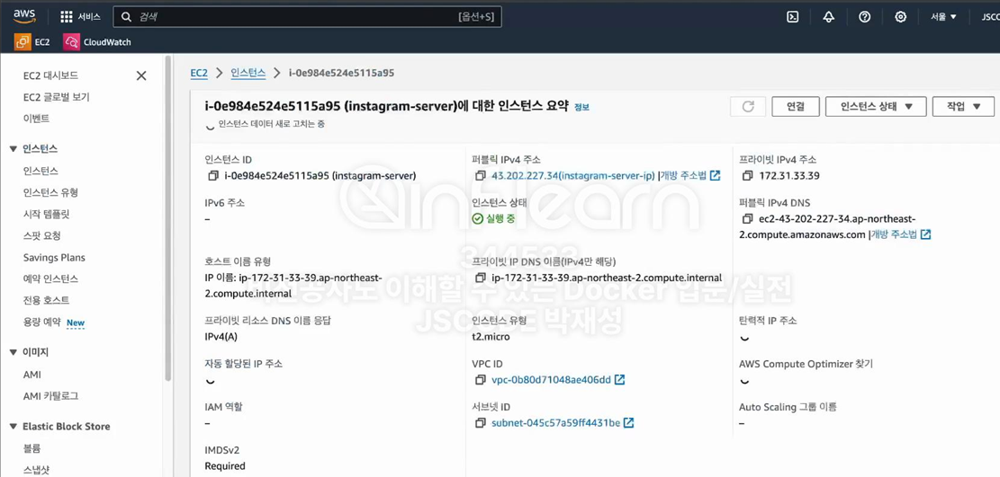

- 연결 버튼 클릭

    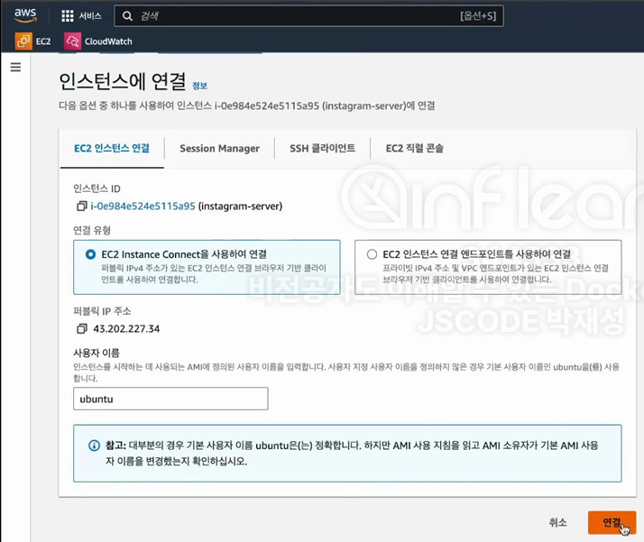

### ✅ 1. Ubuntu 환경에서 Node.js 설치하는 법

- Ubuntu 환경에서 Express 서버를 실행시키려면 Node.js가 설치되어 있어야 한다.
- 그래서 Ubuntu에 우선 Node.js를 설치해보자.

    - https://github.com/nodesource/distributions

        ```
        # 관리자 권한으로 변경
        $ sudo su


        # Node.Js 설치 명령어 입력
        $ apt-get update && /

        apt-get install -y ca-certificates curl gnupg && /

        mkdir -p /etc/apt/keyrings && /

        curl -fsSL https://deb.nodesource.com/gpgkey/nodesource-repo.gpg.key | sudo gpg --dearmor -o / etc/apt/keyrings/nod

        NODE_MAJOR=20 && /

        echo "deb [signed-by=/etc/apt/keyrings/nodesource.gpg] https://deb.nodesource.com/ node_$NODE_MAJOR.x nodistro

        apt-get update && /

        apt-get install nodejs -y
        ```

### ✅ 2. 잘 설치됐는 지 확인하기

```
$ node -v
```

### ✅ 3. Github으로부터 Express 프로젝트 clone하기

`https://github.com/JSCODE-EDU/ec2-express-sample`

```
$ git clone https://github.com/JSCODE-EDU/ec2-express-sample

$ cd ec2-express-sample

$ npm i
```

- 소스 코드

    ```js
    require('dotenv').config();
    
    const express = require('express');
    const app = express();
    const port = 80;

    app.get('/', (req, res) => {
        res.send(`.env 테스트 : ${process.env.DATABASE_NAME}`);
    })

    app.listen(port, () => {
        console.log(`Example app listening on port ${port}`)
    })
    ```

### ✅ 4. .env 파일 직접 만들기

- `.env` 와 같은 민감한 파일은 Git으로 버전 관리를 하지 않는게 일반적이다. 

- 따라서 `.env` 파일은 별도로 EC2 인스턴스에 올려주어야 한다. 

- 하지만 `.env` 파일을 EC2 인스턴스에 올리는 작업보다는, `.env` 파일을 직접 만드는 게 훨씬 간단하다.

    `.env`

    ```
    $ vi .env

    DATABASE_NAME=my_database

    :wq
    ```

### ✅ 5. pm2 설치해서 서버 실행시키기

- Node 기반의 서버는 pm2를 활용해서 많이 실행시킨다.

    - 서비스를 운영하는 데 있어서 유용한 기능들을 pm2가 많이 가지고 있기 때문이다.

        ```
        # pm2 설치하기
        $ sudo npm i -g pm2

        # pm2 서버를 app.js 기반으로 실행
        $ sudo pm2 start app.js
        ```

### ✅ 6. 잘 작동하는 지 확인하기

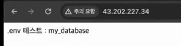


<br>
<br>
<br>


## [실습] Spring Boot 서버를 EC2에 배포하기

### ✅ 1. JDK 설치하기

- JDK 17버전 설치

    ```
    $ sudo apt update && / 
    sudo apt install openjdk-17-jdk -y
    ```

<br>

### ✅ 2. 잘 설치됐는 지 확인하기

```bash
$ java -version
```
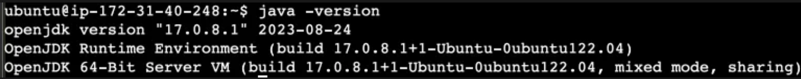


<br>


### ✅ 3. Github으로부터 Spring Boot 프로젝트 clone하기

```
$ git clone https://github.com/JSCODE-EDU/ec2-spring-boot-sample.git
$ cd ec2-spring-boot-sample
```

<br>


### ✅ 4. `application.yml` 파일 직접 만들기

`application.yml`와 같은 민감한 정보가 포함된 파일은 Git으로 버전 관리를 하지 않는게 일반적이다. 

따라서 `application.yml` 파일은 별도로 EC2 인스턴스에 올려주어야 한다.

하지만 `application.yml` 파일을 EC2 인스턴스에 올리는 작업보다는, `application.yml` 파일을 직접 만드는 게 훨씬 간단하다. 

**src/main/resources/application.yml**

```bash
server:
port: 80
```

<br>


### ✅ 5. 서버 실행시키기

```bash
# gradlew 파일이 존재하는 경로에서 빌드하기
$ ./gradlew clean build 

# 빌드된 파일이 위치한 경로로 이동
$ cd ~/ec2-spring-boot-sample/build/libs


$ sudo java -jar ec2-spring-boot-sample-0.0.1-SNAPSHOT.jar
```

**참고) 백그라운드에서 Spring Boot 실행시키기**

```jsx
$ sudo nohup java -jar ec2-spring-boot-sample-0.0.1-SNAPSHOT.jar &
```

### ✅ 6. 잘 작동하는 지 확인하기

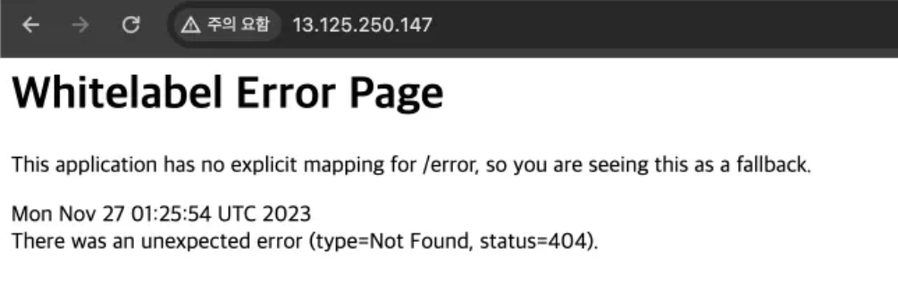