# 📍 

## Ubuntu에서 Docker, Docker Compose 설치하기

### 1. EC2 인스턴스 생성하기

- EC2 선택 및 인스턴스 시작 버튼 클릭하기
    <div style="display:flex; gap:5px;">
        
        
    </div>

<br>

- 인스턴스 이름 입력

    


<br>

- 운영체제 - `Ubuntu` 선택

    

<br>

- 인스턴스 유형 선택 - 프리티어(t2.micro)

    

<br>

- 키 페어 생성

    

    - 상단의 편집 버튼을 클릭하여 세부 설정하기

        - SSH 허용하기
        - Port 전부 개방하기
            - 유형 ➡️ `모든 TCP` 선택
            - 소스 유형 ➡️ `위치 무관` 선택
            - 실습을 위한 설정, Port를 전부 개방하면 안 된다.

<br>

- 보안 그룹 설정

    

<br>

- 스토리지 설정

    

    - 기본 설정 그대로 사용

- 인스턴스 시작 버튼 클릭하기


### 2. Ubuntu에서 Docker, Docker Compose 설치하기

```
sudo apt-get update && \
sudo apt-get install -y apt-transport-https ca-certificates curl software-properties-common && \
curl -fsSL https://download.docker.com/linux/ubuntu/gpg | sudo apt-key add - && \
sudo apt-key fingerprint 0EBFCD88 && \
sudo add-apt-repository "deb [arch=amd64] https://download.docker.com/linux/ubuntu $(lsb_release -cs) stable" && \
sudo apt-get update && \
sudo apt-get install -y docker-ce && \
sudo usermod -aG docker ubuntu && \
newgrp docker && \
sudo curl -L "https://github.com/docker/compose/releases/download/2.27.1/docker-compose-$(uname -s)-$(uname -m)" -o /usr/local/bin/docker-compose && \
sudo chmod +x /usr/local/bin/docker-compose && \
sudo ln -s /usr/local/bin/docker-compose /usr/bin/docker-compose
```

### 3. ✅ 잘 설치됐는 지 확인하기

```
# Docker 버전 확인
$ docker -v 
    > Docker version xx.x.x, build xxxxxxx

# Docker Compose 버전 확인
$ docker compose version
    > ubuntu@ip-xxx-xx-xx-xxx:~$
```

<br>
<br>
<br>

## AWS ECR(Elastic Container Registry)이 뭘까? 왜 배울까?

### ✅ AWS ECR이 뭘까?

- 필요한 이미지를 다운로드 받을 때 Dockerhub이라는 곳에서 다운받는다고 했었다. 
- Dockerhub에서는 이미지를 저장 및 다운받을 수 있는 저장소 역할을 한다고도 했다. 

→ [이미지(Image) 다운로드](https://www.notion.so/Image-8c40d4d34bfa495fab2a14f20efd4cd7?pvs=21) 

Dockerhub과 동일한 역할을 하는 서비스가 하나 더 있다. 그게 바로 AWS ECR이다. AWS ECR도 이미지를 저장 및 다운받을 수 있는 저장소 역할을 한다. 우리는 이 AWS ECR에 대해 배울 것이다. 

### ✅ 왜 Dockerhub 대신에 AWS ECR을 사용하는가?

- 최근에는 AWS 클라우드 환경에서 인프라를 구축하는 일이 많아졌다. 
- AWS ECR을 사용하면 다른 AWS Resource와의 연동이 편하고, AWS 내에서 한 번에 관리할 수 있기에 편하다는 장점이 있다. 

    > (물론, Dockerhub을 사용해도 크게 문제는 없다 😊)

### ✅ AWS ECR을 왜 배우는지?


Docker를 사용하지 않았을 때 **많은 사람들이 사용하는 배포 전략 중 하나는 Github을 활용하는 방법**이다.

프로젝트 코드를 Github에 Push 한 뒤에, AWS EC2에 접속해서 해당 코드를 Pull 받아서 실행시키는 방식을 많이 사용한다.

이 방식은 프로젝트 코드 전체를 EC2로 이동시켜야 하며, 프로젝트 코드를 실행시킬 런타임 환경(Node, JDK 등)도 설치되어 있어야만 실행이 된다. 

<br>


Docker의 가장 큰 장점은 **이식성**이다.

**Docker만 깔려있으면 어디에서든 내가 원하는 프로젝트를 실행시킬 수 있다는 게 장점**이다.

이 때 Github을 활용해 프로젝트 코드 전체를 EC2로 옮겨 Docker 기반으로 실행시켜도 된다.

하지만 프로젝트에서 필요한 코드에 대해서만 Docker 이미지로 빌드해, EC2에서는 그 이미지만 다운받아서 
실행시키는 게 훨씬 심플하다. 

정리하자면 **AWS ECR을 배우는 이유는 훨씬 간단하게 프로젝트를 배포하고 실행시키기 위해서이다.**

<br>
<br>
<br>

## AWS ECR(Elastic Container Registry) 사용해보기

### ✅ AWS CLI 설치

[최신 버전의 AWS CLI설치 또는 업데이트 - AWS Command Line Interface](https://docs.aws.amazon.com/ko_kr/cli/latest/userguide/getting-started-install.html)

**[맥(Mac OS)]**

```bash
$ brew install awscli
$ aws --version # 잘 출력된다면 정상 설치된 상태
```

**[윈도우(Windows)]**

1. 이 링크(https://awscli.amazonaws.com/AWSCLIV2.msi)를 다운받아 설치하기
2. cmd를 실행시켜서 아래 명령어 입력해보기
    
    ```bash
    $ aws --version # 잘 출력된다면 정상 설치된 상태
    ```

<br>    
<br>    
<br>    

> 💡 AWS ECR을 사용하기 위해서 `AWS Command Line`을 설치해야 함

**[우분투(Ubuntu)]**

1. `sudo apt install unzip`
    
    ```bash
    $ sudo apt install unzip
    ```
    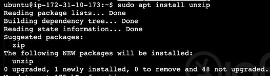

<br>

2. `curl "https://awscli.amazonaws.com/awscli-exe-linux-x86_64.zip" -o "awscliv2.zip"`
    
    ```bash
    $ curl "https://awscli.amazonaws.com/awscli-exe-linux-x86_64.zip" -o "awscliv2.zip"
    ```
    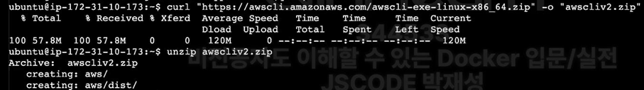

<br>

3. `unzip awscliv2.zip`
    
    ```bash
    $ unzip awscliv2.zip
    ```

    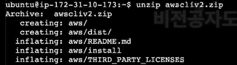

<br>

4. `sudo ./aws/install`
    
    ```bash
    $ sudo ./aws/install
    ```

    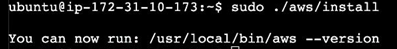

<br>

5. `aws --version`
    
    ```bash
    $ aws --version
    ```

    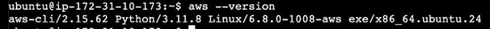

<br>
<br>

### ✅ IAM 생성하기

💡 IAM을 생성하는 이유 : ECR에 접근하기 위한 권한을 얻기 위해서 생성

1. **IAM에서 사용자 생성하기**
    
    - 사용자 추가 버튼 클릭

        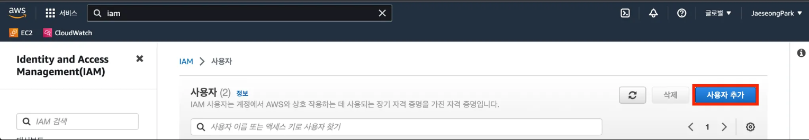

    - IAM 권한 이름 작성
    
        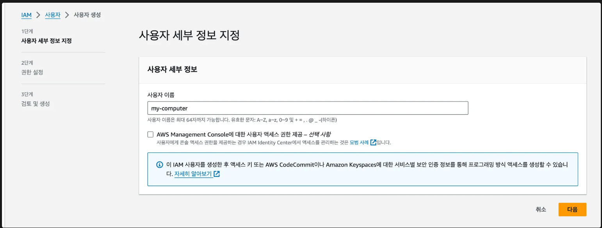
    
    - 직접 정책 연결 선택
        
        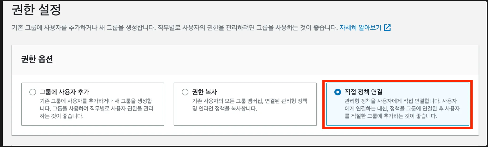
    
    - AmazonEC2ContainerRegistryFullAccess 권한 정책 선택 후, 다음 클릭, 사용자 생성 클릭
        
        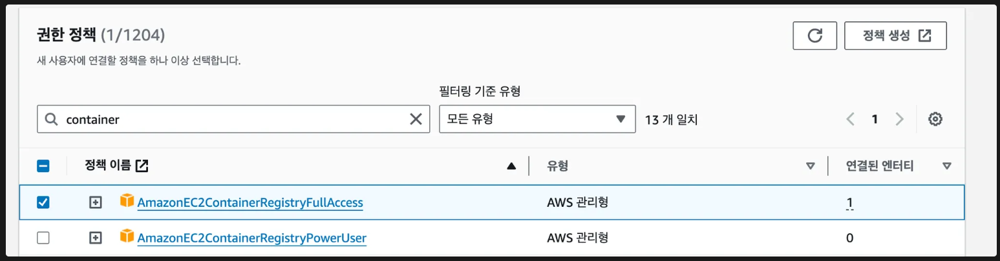
        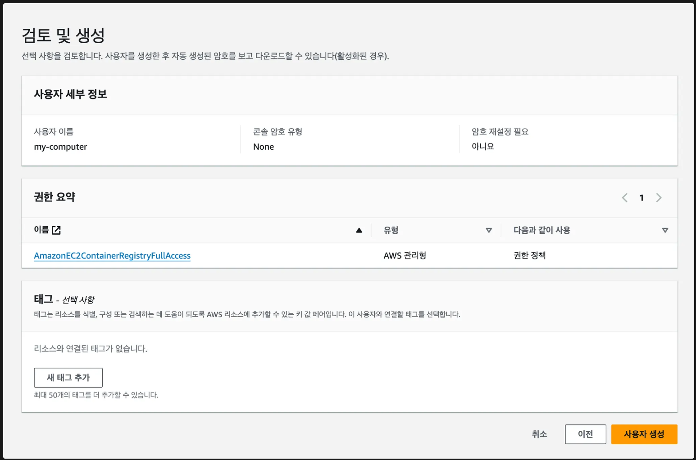
    
    - 사용자 이름 클릭 후, 보안 자격 증명 탭 클릭
    
    
    
    - 하단에 액세스 키 만들기 버튼 클릭
    
        
        
    

1. **Access Key 발급받기**
    
    
    
<br>

- AWS 외부에서 실행되는 애플리케이션 선택 후, 다음 버튼 클릭

    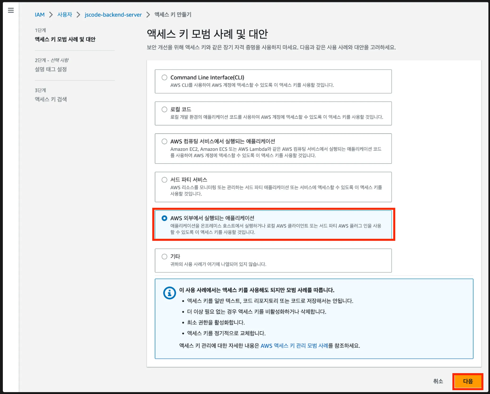
    
<br>

- 액세스 키 만들기 버튼 클릭

    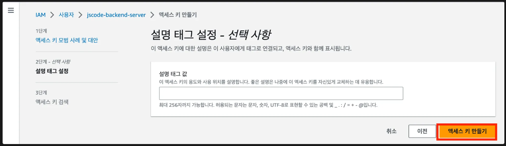

<br>

- 액세스 키 별도의 파일에 잘 저장해두기

    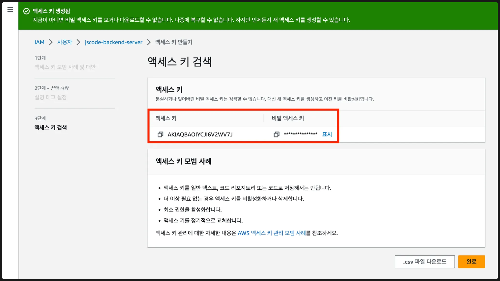

    > AWS Command Line 프로그램에 액세스 키를 등록할 예정

<br>    
<br>    

1. AWS CLI로 액세스 키 등록하기
    
    ```bash
    $ aws configure
    AWS Access Key ID [None]: <위에서 발급한 Key id>
    AWS Secret Access Key [None]: <위에서 발급한 Secret Access Key>
    Default region name [None]: ap-northeast-2
    Default output format [None]:
    ```
    
    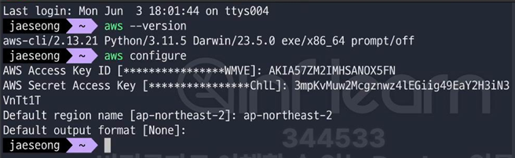

<br>

2. EC2 인스턴스에 설치된 Ubuntu OS에서도 동일하게 등록하기

    ```bash
    $ aws configure
    AWS Access Key ID [None]: <위에서 발급한 Key id>
    AWS Secret Access Key [None]: <위에서 발급한 Secret Access Key>
    Default region name [None]: ap-northeast-2
    Default output format [None]:
    ```
    
    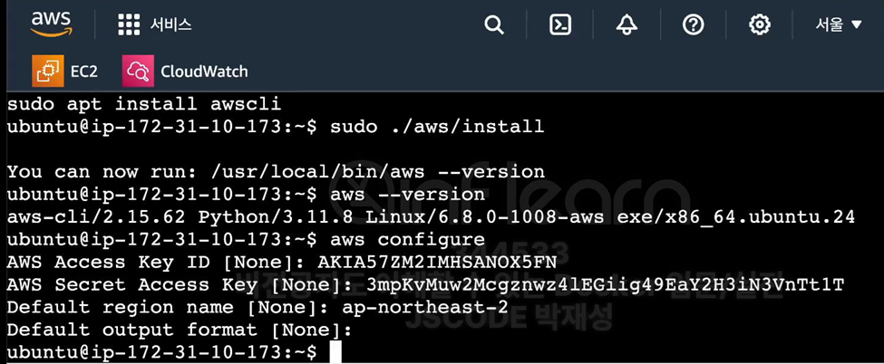

<br>

### ✅ AWS ECR(Elastic Container Registry) 세팅하기

> Docker 이미지를 저장할 수 있는 저장소를 만들어보자.

<br>

- eleastic container registry 검색

    - ECR = Docker Hub과 비슷한 개념, 이미지를 다운로드하고 저장할 수 있는 공간

    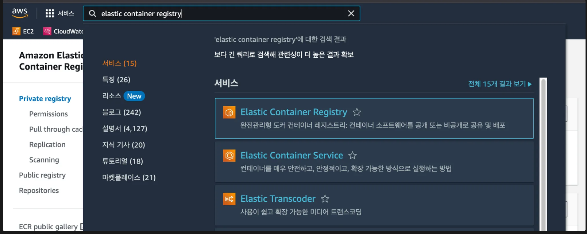

- Create Private Repository 

    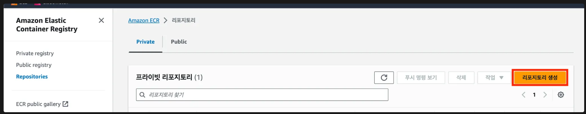

    - 하나의 리파지토리에 하나의 이미지를 저장하고 관리하는 편이다.
    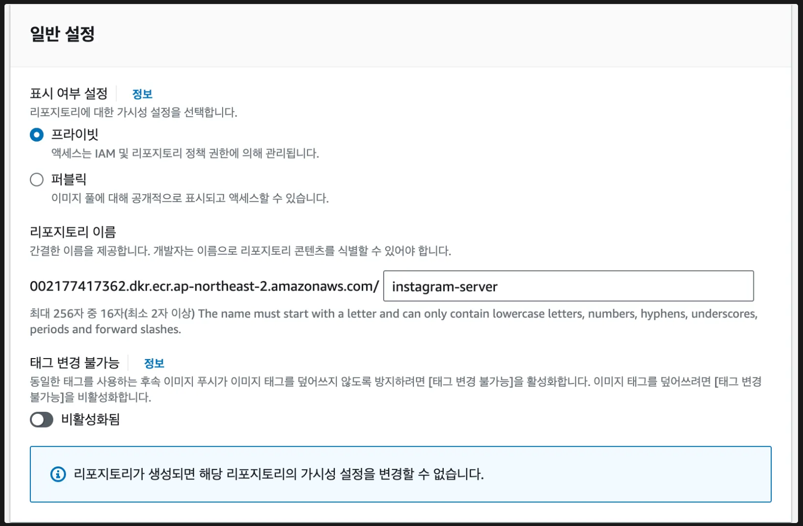

- 일반적으로 하나의 리포지토리에는 한 종류의 이미지만 저장하고 관리한다.

<br>

### ✅ AWS ECR 이미지를 저장하고 다운로드 해보기

- 이미지 빌드해서 AWS ECR에 Push, Pull 해보기

1. **Dockerfile 작성하기**
    
    ```bash
    FROM openjdk:17-jdk
    
    ENTRYPOINT ["/bin/bash", "-c", "sleep 500"]
    ```
    

1. **이미지 빌드 및 push 하기**
 
    - **이미지 Push할 때 어떤 명령어를 써야 하는 지 가르쳐주는 위치**
        
        ```bash
        $ aws ecr get-login-password --region ap-northeast-2 | docker login --username AWS --password-stdin 002177417362.dkr.ecr.ap-northeast-2.amazonaws.com
        $ docker build -t instagram-server .
        $ docker tag instagram-server:latest 002177417362.dkr.ecr.ap-northeast-2.amazonaws.com/instagram-server:latest
        $ docker push 002177417362.dkr.ecr.ap-northeast-2.amazonaws.com/instagram-server:latest
        ```
        
        > AWS ECR에 들어가서 ‘푸시 명령 보기’ 버튼을 누르면, 어떻게 이미지를 Push하면 되는 지 친절하게 설명이 나와있다.

        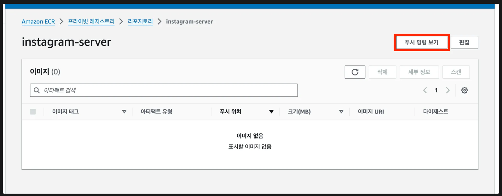

        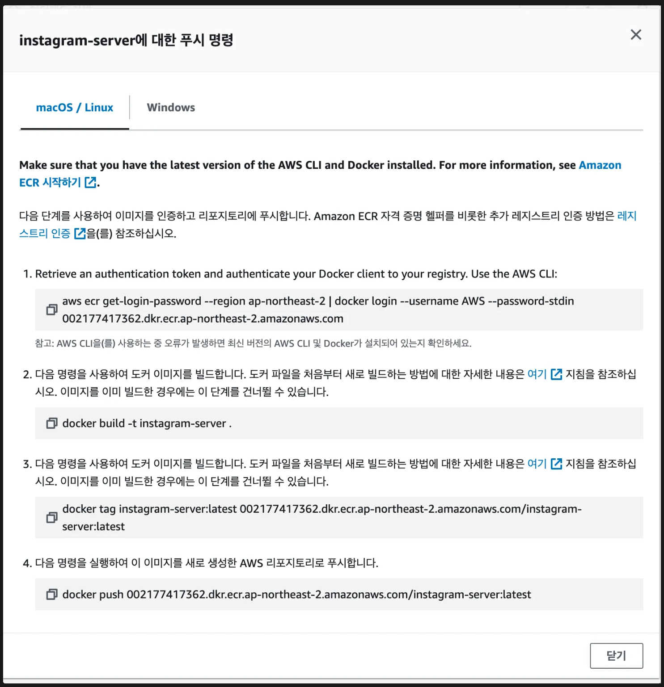

        - 1. ECR에 접근할 수 있는 권한이 있는 계정인지 확인하는 명령어

                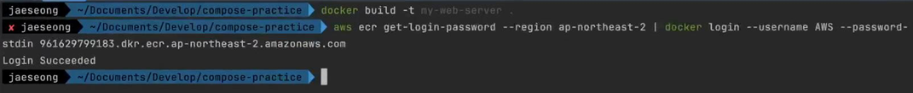
    
        - 2. 현재 경로에 특정 이미지 이름을 붙여서 이미지를 생성하는 명령어

                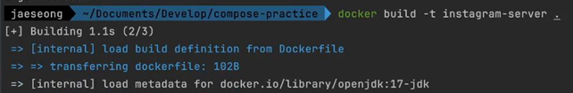
    
        - 3. 이름을 붙인 이미지의 이름을 ECR에 올리기 위해 변경하는 명령어

        - 4. AWS ECR로 이미지를 PUSH하는 명령어
        
             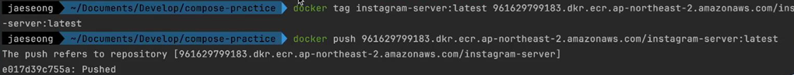
        
        - 5. push한 이미지

                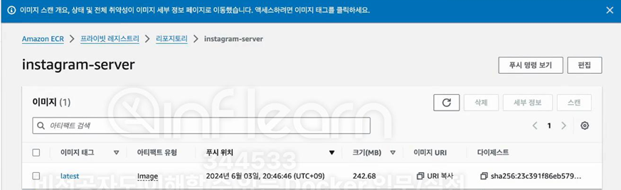

1. **이미지 Pull 받아보기**
    
    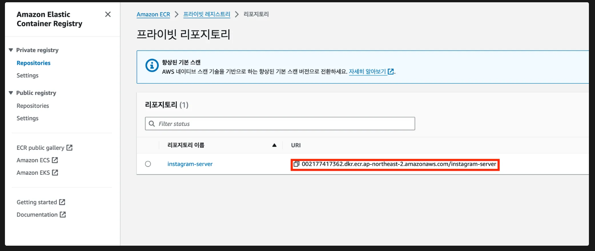
    
    ```bash
    $ docker image rm -f [Container ID] # 기존 갖고있던 이미지 지우기
    $ docker pull 002177417362.dkr.ecr.ap-northeast-2.amazonaws.com/instagram-server
    $ docker image ls
    ```
    
    - Repository의 URI를 복사해서 Pull

        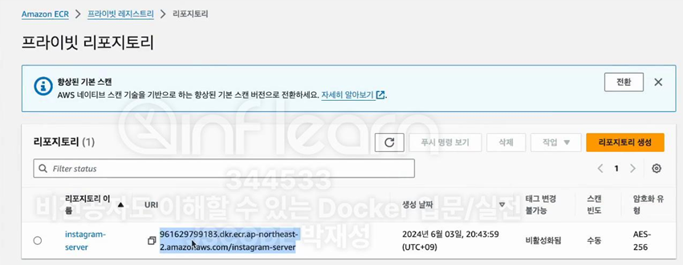


<br>
<br>
<br>

## AWS EC2에 Spring Boot 배포하기

### ✅ Docker CLI로 배포하기

1. **로컬 환경에서 프로젝트 셋팅**
    
    [start.spring.io](https://start.spring.io/)
    
    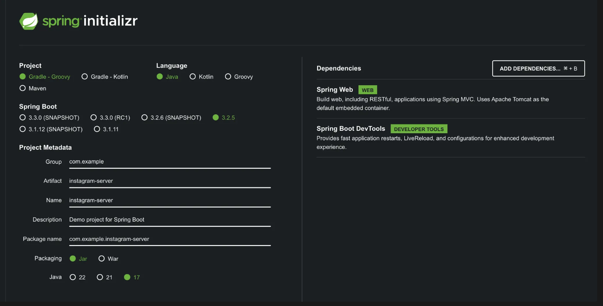
    
    - Java 17 버전 선택
    
2. **간단한 코드 작성**
    
    **AppController**
    
    ```java
    @RestController
    public class AppController {
        @GetMapping("/")
        public String home() {
            return "Docker, World!";
        }
    }
    ```
    
3. **Dockerfile 작성하기**
    
    **Dockerfile**
    
    ```docker
    FROM openjdk:17-jdk
    
    COPY build/libs/*SNAPSHOT.jar app.jar
    
    ENTRYPOINT ["java", "-jar", "/app.jar"]
    ```
    

1. **Spring Boot 프로젝트 빌드하기**
    
    ```bash
    $ ./gradlew clean build
    $ aws ecr get-login-password --region ap-northeast-2 | docker login --username AWS --password-stdin 002177417362.dkr.ecr.ap-northeast-2.amazonaws.com
    $ docker build -t instagram-server .
    $ docker tag instagram-server:latest 002177417362.dkr.ecr.ap-northeast-2.amazonaws.com/instagram-server:latest
    $ docker push 002177417362.dkr.ecr.ap-northeast-2.amazonaws.com/instagram-server:latest
    ```
    

1. **AWS EC2에서 AWS CLI 설치 및 액세스 키 등록하기**
    
    (아래 설명 참고하기)
    
    [[실습] AWS ECR(Elastic Container Registry) 사용해보기](https://www.notion.so/AWS-ECR-Elastic-Container-Registry-26a540f1c41d4340bba5820429d5d834?pvs=21) 
    

1. **AWS ECR로부터 이미지 다운받아 컨테이너 띄우기**
    
    ```bash
    $ aws ecr get-login-password --region ap-northeast-2 | docker login --username AWS --password-stdin 002177417362.dkr.ecr.ap-northeast-2.amazonaws.com
    $ docker pull 002177417362.dkr.ecr.ap-northeast-2.amazonaws.com/instagram-server 
    $ docker run -d -p 8080:8080 002177417362.dkr.ecr.ap-northeast-2.amazonaws.com/instagram-server
    ```
    

> **아래와 같은 에러가 발생했다면?**
> 

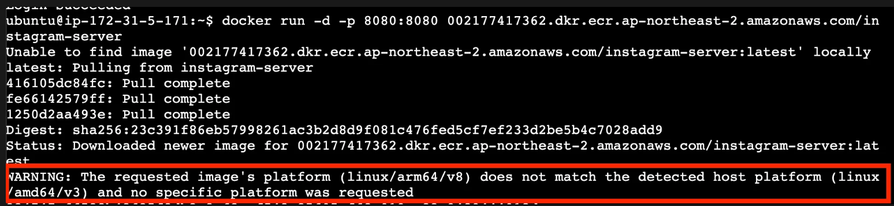

이 에러의 원인은 CPU 아키텍처 환경이 다르다는 뜻이다. 조금 더 자세히 설명하자면, 이미지 빌드는 M1과 같은 ARM 기반의 환경에서 진행하고, 이미지 실행은 ARM 기반의 환경이 아닌 곳에서 할 때 위와 같은 에러가 발생한다.

위 에러를 해결하기 위해서는 이미지를 실행시키고자 하는 CPU 아키텍처에 맞춰서 이미지를 빌드해야 한다. 로컬 환경에서 아래와 같이 다시 빌드한 뒤 AWS ECR로 Push하자. 

```
$ ./gradlew clean build
$ aws ecr get-login-password --region ap-northeast-2 | docker login --username AWS --password-stdin 002177417362.dkr.ecr.ap-northeast-2.amazonaws.com
$ docker build **--platform linux/amd64** -t instagram-server .
$ docker tag instagram-server:latest 002177417362.dkr.ecr.ap-northeast-2.amazonaws.com/instagram-server:latest
$ docker push 002177417362.dkr.ecr.ap-northeast-2.amazonaws.com/instagram-server:latest
```

- **AWS EC2의 CPU 아키텍처 확인하는 방법**
    
    ```
    $ lscpu
    ```
    
    
    
    - `x86_64` = `linux/amd64`
    

1. **잘 작동하는 지 확인하기**
    
    ```
    $ docker ps
    $ docker logs
    ```
    
    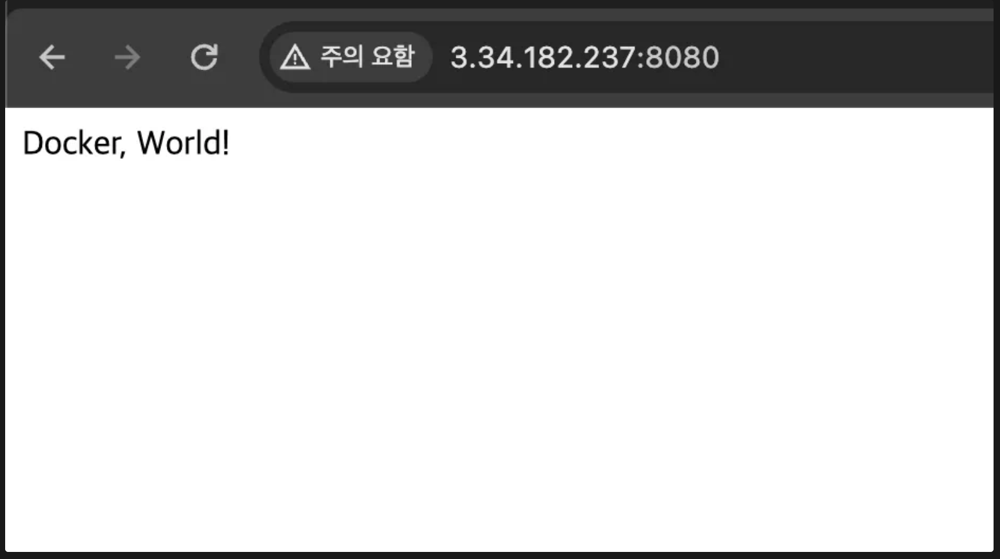
    

### ✅ Docker Compose로 배포하기

Docker Compose의 장점 중 하나는 **복잡한 명령어로 실행시키던 걸 간소화 시킬 수 있다는 점**이 있다. 따라서 Docker CLI 말고 Docker Compose를 활용해서 Spring Boot 서버를 배포해보자. 

1. **폴더 만들기**
    
    ```
    $ mkdir instagram-server
    ```
    
2. **AWS EC2에 compose.yml 만들기**
    
    **compose.yml**
    
    ```
    services:
      instagram-server:
        image: 002177417362.dkr.ecr.ap-northeast-2.amazonaws.com/instagram-server:latest
        ports:
          - 8080:8080
    ```
    
3. **실행시켜보기**
    
    ```
    $ docker compose up --build -d
    ```
    
    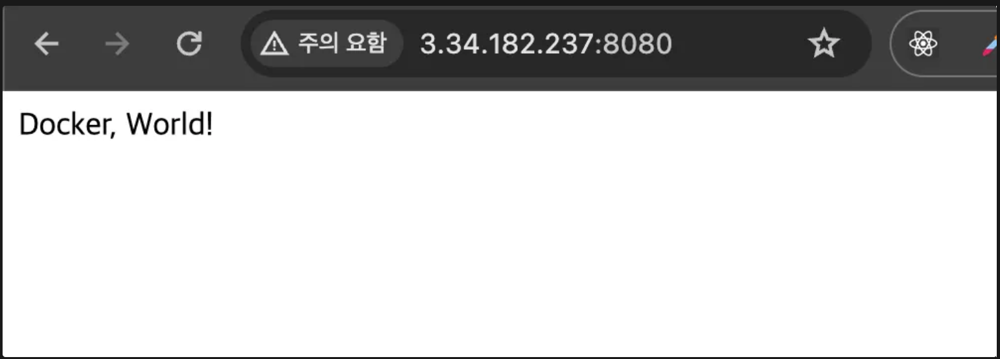
    

1. **새로운 기능이 업데이트 됐다고 가정**
    
    **AppController**
    
    ```
    @RestController
    public class AppController {
      @GetMapping("/")
      public String home() {
        **return "New, World!";**
      }
    }
    ```
    
    ```
    $ ./gradlew clean build
    $ aws ecr get-login-password --region ap-northeast-2 | docker login --username AWS --password-stdin 002177417362.dkr.ecr.ap-northeast-2.amazonaws.com
    $ docker build **--platform linux/amd64** -t instagram-server .
    $ docker tag instagram-server:latest 002177417362.dkr.ecr.ap-northeast-2.amazonaws.com/instagram-server:latest
    $ docker push 002177417362.dkr.ecr.ap-northeast-2.amazonaws.com/instagram-server:latest
    ```
    

1. **AWS EC2에 업데이트 된 내용 반영하기**
    
    ```
    $ docker compose pull
    $ docker compose up --build -d
    ```
    
    - `docker compose pull` : `compose.yml`에 작성된 이미지를 다운로드 또는 업데이트 할 때 사용한다.

<br>
<br>
<br>

## # AWS EC2에 Spring Boot, MySQL, Redis 배포하기

`Spring Boot`에서 `MySQL`과 `Redis`를 같이 한 번에 배포해야 하는 상황이라고 가정

AWS EC2라고 해서 지금까지 배운 내용과 크게 다를 건 없다.

compose.yml에 MySQL, Redis의 내용만 추가해주면 끝이다.

<br>

### ✅ AWS EC2에서 Spring Boot, MySQL, Redis 배포하기

1. **compose.yml에 MySQL, Redis 관련 내용 추가하기**
    
    **compose.yml**
    
    ```
    services:
      instagram-server:
        image: 002177417362.dkr.ecr.ap-northeast-2.amazonaws.com/instagram-server:latest
        ports:
          - 8080:8080
        **depends_on:
          my-db:
            condition: service_healthy
          my-cache-server:
            condition: service_healthy**
      **my-db:
        image: mysql
        environment:
          MYSQL_ROOT_PASSWORD: pwd1234
          MYSQL_DATABASE: mydb
        volumes:
          - ./mysql_data:/var/lib/mysql
        ports:
          - 3306:3306
        healthcheck:
          test: [ "CMD", "mysqladmin", "ping" ]
          interval: 5s
          retries: 10**
      **my-cache-server:
        image: redis
        ports:
          - 6379:6379
        healthcheck:
          test: [ "CMD", "redis-cli", "ping" ]
          interval: 5s
          retries: 10**
    ```
    

1. **컨테이너 실행시키기**
    
    ```bash
    $ docker compose up -d --build
    
    # 잘 실행되고 있는 지 확인
    $ docker ps
    $ docker compose ps
    $ docker compose logs 
    ```