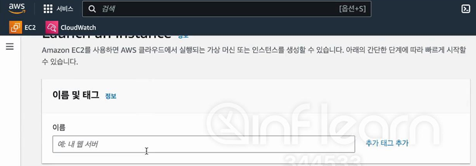
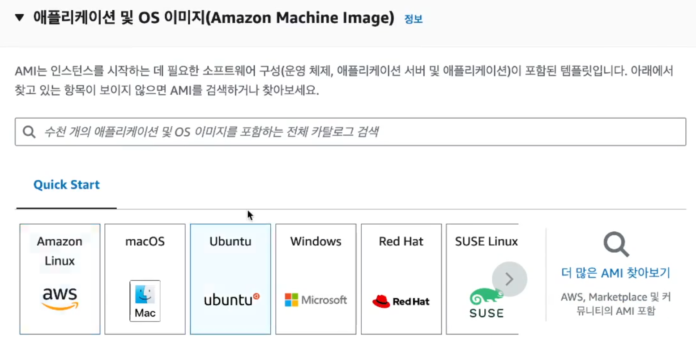
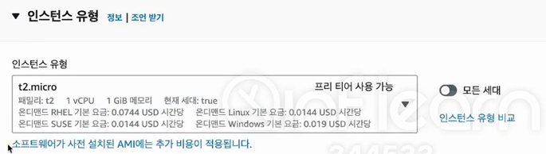
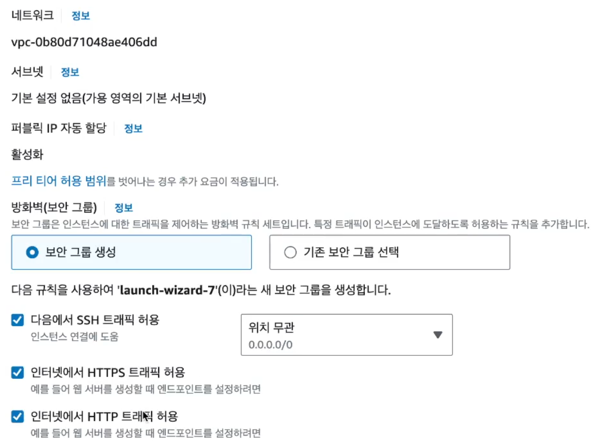
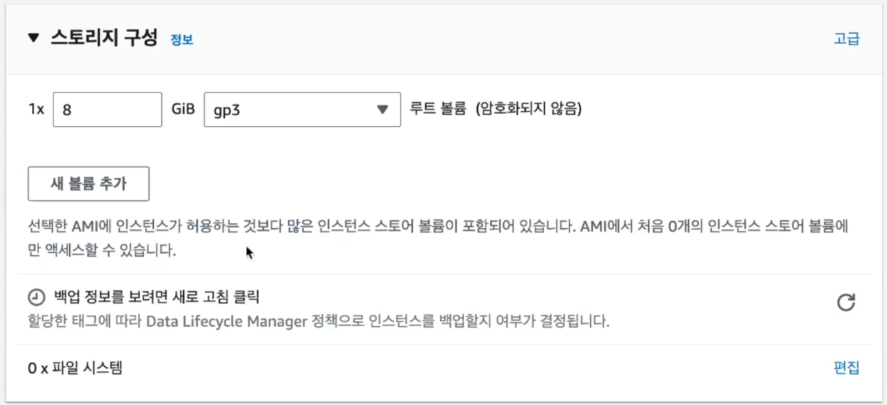
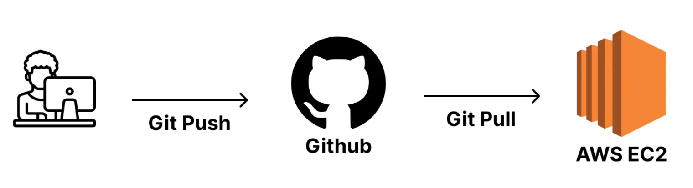
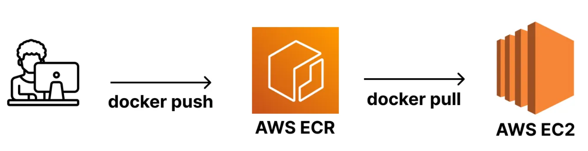

# 📍 

## Ubuntu에서 Docker, Docker Compose 설치하기

### 1. EC2 인스턴스 생성하기

- EC2 선택 및 인스턴스 시작 버튼 클릭하기
    <div style="display:flex; gap:5px;">
        
        
    </div>

<br>

- 인스턴스 이름 입력

    


<br>

- 운영체제 - `Ubuntu` 선택

    

<br>

- 인스턴스 유형 선택 - 프리티어(t2.micro)

    

<br>

- 키 페어 생성

    

    - 상단의 편집 버튼을 클릭하여 세부 설정하기

        - SSH 허용하기
        - Port 전부 개방하기
            - 유형 ➡️ `모든 TCP` 선택
            - 소스 유형 ➡️ `위치 무관` 선택
            - 실습을 위한 설정, Port를 전부 개방하면 안 된다.

<br>

- 보안 그룹 설정

    

<br>

- 스토리지 설정

    

    - 기본 설정 그대로 사용

- 인스턴스 시작 버튼 클릭하기


### 2. Ubuntu에서 Docker, Docker Compose 설치하기

```
sudo apt-get update && \
sudo apt-get install -y apt-transport-https ca-certificates curl software-properties-common && \
curl -fsSL https://download.docker.com/linux/ubuntu/gpg | sudo apt-key add - && \
sudo apt-key fingerprint 0EBFCD88 && \
sudo add-apt-repository "deb [arch=amd64] https://download.docker.com/linux/ubuntu $(lsb_release -cs) stable" && \
sudo apt-get update && \
sudo apt-get install -y docker-ce && \
sudo usermod -aG docker ubuntu && \
newgrp docker && \
sudo curl -L "https://github.com/docker/compose/releases/download/2.27.1/docker-compose-$(uname -s)-$(uname -m)" -o /usr/local/bin/docker-compose && \
sudo chmod +x /usr/local/bin/docker-compose && \
sudo ln -s /usr/local/bin/docker-compose /usr/bin/docker-compose
```

### 3. ✅ 잘 설치됐는 지 확인하기

```
# Docker 버전 확인
$ docker -v 
    > Docker version xx.x.x, build xxxxxxx

# Docker Compose 버전 확인
$ docker compose version
    > ubuntu@ip-xxx-xx-xx-xxx:~$
```

<br>
<br>
<br>

## AWS ECR(Elastic Container Registry)이 뭘까? 왜 배울까?

### ✅ AWS ECR이 뭘까?

- 필요한 이미지를 다운로드 받을 때 Dockerhub이라는 곳에서 다운받는다고 했었다. 
- Dockerhub에서는 이미지를 저장 및 다운받을 수 있는 저장소 역할을 한다고도 했다. 

→ [이미지(Image) 다운로드](https://www.notion.so/Image-8c40d4d34bfa495fab2a14f20efd4cd7?pvs=21) 

Dockerhub과 동일한 역할을 하는 서비스가 하나 더 있다. 그게 바로 AWS ECR이다. AWS ECR도 이미지를 저장 및 다운받을 수 있는 저장소 역할을 한다. 우리는 이 AWS ECR에 대해 배울 것이다. 

### ✅ 왜 Dockerhub 대신에 AWS ECR을 사용하는가?

- 최근에는 AWS 클라우드 환경에서 인프라를 구축하는 일이 많아졌다. 
- AWS ECR을 사용하면 다른 AWS Resource와의 연동이 편하고, AWS 내에서 한 번에 관리할 수 있기에 편하다는 장점이 있다. 

    > (물론, Dockerhub을 사용해도 크게 문제는 없다 😊)

### ✅ AWS ECR을 왜 배우는지?



Docker를 사용하지 않았을 때 **많은 사람들이 사용하는 배포 전략 중 하나는 Github을 활용하는 방법**이다.

프로젝트 코드를 Github에 Push 한 뒤에, AWS EC2에 접속해서 해당 코드를 Pull 받아서 실행시키는 방식을 많이 사용한다.

이 방식은 프로젝트 코드 전체를 EC2로 이동시켜야 하며, 프로젝트 코드를 실행시킬 런타임 환경(Node, JDK 등)도 설치되어 있어야만 실행이 된다. 

<br>



Docker의 가장 큰 장점은 **이식성**이다.

**Docker만 깔려있으면 어디에서든 내가 원하는 프로젝트를 실행시킬 수 있다는 게 장점**이다.

이 때 Github을 활용해 프로젝트 코드 전체를 EC2로 옮겨 Docker 기반으로 실행시켜도 된다.

하지만 프로젝트에서 필요한 코드에 대해서만 Docker 이미지로 빌드해, EC2에서는 그 이미지만 다운받아서 
실행시키는 게 훨씬 심플하다. 

정리하자면 **AWS ECR을 배우는 이유는 훨씬 간단하게 프로젝트를 배포하고 실행시키기 위해서이다.**