# 📍 Docker Compose를 활용해 컨테이너 관리하기

## Docker Compose를 사용하는 이유

### ✅ Docker Copmose란?
여러 개의 Docker 컨테이너들을, 하나의 서비스로 정의하고 구성해 하나의 묶음으로 관리할 수 있게 도와주는 툴이다.

### ✅ Docker Compose를 사용하는 이유

#### 1. 여러 개의 컨테이너를 관리하는 데 용이
    여러 개의 컨테이너로 이루어진 복잡한 애플리케이션을 한 번에 관리할 수 있게 해준다.
    여러 컨테이너를 하나의 환경에서 실행하고 관리하는 데 도움이 된다.

#### 2. 복잡한 명령어로 실행시키던 걸 간소화 시킬 수 있음

- 이전에 MySQL 이미지를 컨테이너로 실행시킬 때 아래와 같은 명령어를 실행시켰다.

```
$ docker run -e MYSQL_ROOT_PASSWORD=password123 -p 3306:3306 -v /Users/jaeseong/Documents/
Develop/doc
```

- 너무 복잡하지 않은가? Docker Compose를 사용하면 위와 같이 컨테이너를 실행시킬 때마다 복잡한 명령어를 입력하지 않아도 된다.
- 단순히 docker compose up 명령어만 실행시키면 된다. 

<br>
<br>
<br>

## Docker Compose 전체 흐름 느껴보기(with Nginx)

### ✅ 기존 Docker CLI로 컨테이너를 실행시킬 때

```
$ docker run --name webserver -d -p 80:80 nginx
```

### ✅ Docker Compose로 컨테이너를 실행시킬 때


### 1. compose.yml 파일 작성하기

`compose.yml`
    ```
    services:
        my-web-server:
            container_name: webserver
            image: nginx
            ports:
                - 80:80
    ```

`compose.yml` 파일 해석
    ```
    # Docker Compose에서는 하나의 컨테이너를 `service`라고 함
    services:
        
        # 서비스에 대한 이름을 설정
        my-web-server:

            # 컨테이너의 이름을 설정
            container_name: webserver

            # 이미지
            image: nginx

            # PORT Mapping
            ports:
                - 80:80
    ```

- `services: my-web-server` : Docekr Compose에서 하나의 컨테이너를 서비스(service)라고 부른다. 이 옵션은 서비스에 이름을 붙이는
기능이다.
- `container_name: web-server` : 컨테이너를 띄울 때 붙이는 별칭이다. CLI에서 --name web-server 역할과 동일하다.
- `image: nginx` : 컨테이너를 실행시킬 때 어떤 이미지를 사용할 지 정의하는 명령어이다. $ docker run [이미지명] 와 동일한 역할이다.
- `ports` : 포트 매핑은 어떻게 할 지를 설정하는 옵션이다. CLI에서 -p 80:80 역할과 동일하다.

### 2. compose 파일 실행시키기

```
$ docker compose up -d
```

    - `-d` : back ground에서 실행시키기

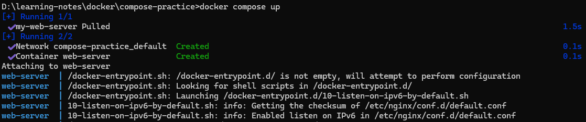

### 3. compose 실행 현황 보기

```
$ docker compose ps
$ docker ps
```
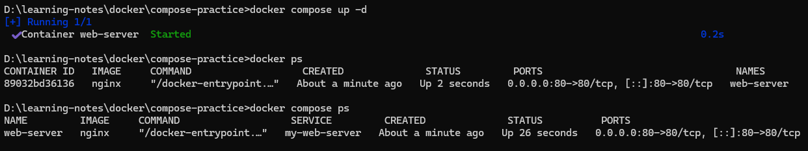

### 4. localhost:80 들어가보기

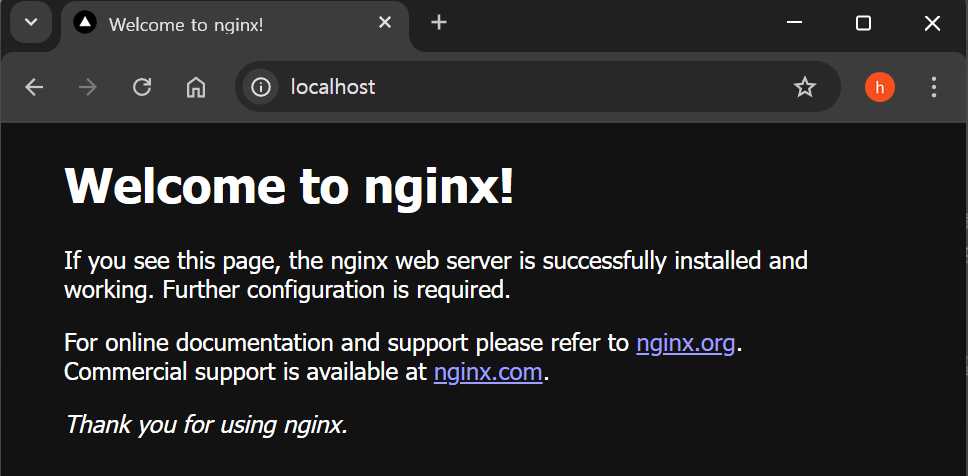

### 5. compose로 실행된 컨테이너 삭제

```
$ docker compose down
```

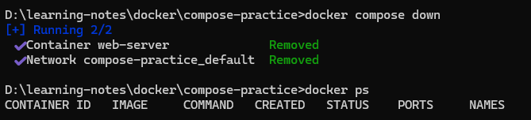

<br>
<br>
<br>

## 자주 사용하는 Docker Compose CLI 명령어

>💡 `docker-compose`로 시작하는 명령어는 더 이상 업데이트를 지원하지 않는 Docker Compose의 v1 명령어. 

- v2부터는 docker compose 로 시작하는 명령어를 사용.

    - 아래 명령어들은 compose.yml 이 존재하는 디렉토리에서 실행시켜야 한다.


### ✅ compose 파일 작성
`compose.yml`
    ```
    services:
        websever:
            container_name: webserver
            image: nginx
            ports:
                - 80:80
    ```

<br>

### ✅ compose.yml에서 정의한 컨테이너 실행

```
# 포그라운드에서 실행
$ docker compose up 

# 백그라운드에서 실행
$ docker compose up -d 
```
- `-d` : 백그라운드에서 실행

    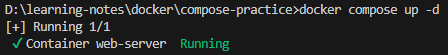

<br>

### ✅ Docker Compose로 실행시킨 컨테이너 확인하기
# compose.yml에 정의된 컨테이너 중 실행 중인 컨테이너만 보여준다.

```
# 실행 중인 컨테이너
$ docker compose ps

# compose.yml에 정의된 모든 컨테이너를 보여준다.
$ docker compose ps -a
```
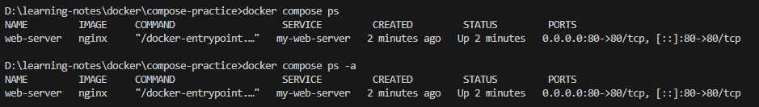

<br>

### ✅ Docker Compose 로그 확인하기
- compose.yml에 정의된 모든 컨테이너의 로그를 모아서 출력한다.

```
$ docker compose logs
```
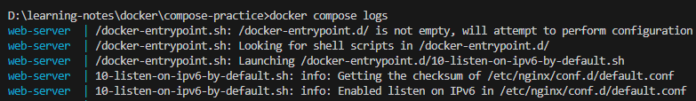

<br>

### ✅ 컨테이너를 실행하기 전에 이미지 재빌드하기

- 자주 사용하는 Docker Compose CLI 명령어 1

    ```
    # 포그라운드에서 실행
    $ docker compose up --build 

    # 백그라운드에서 실행
    $ docker compose up --build -d 
    ```

    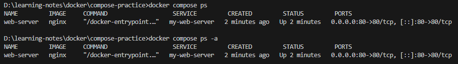

    - compose.yml 에서 정의한 이미지 파일에서 코드가 변경 됐을 경우
        - 이미지를 다시 빌드해서 컨테이너를 실행시켜야 코드 변경된 부분이 적용
    - 그러므로 이럴 때에는 --build 옵션을 추가해서 사용해야 한다.

#### 참고
- `docker compose up` vs `docker compose up --build`

- `docker compose up`
    - 이미지가 없을 때만 빌드해서 컨테이너를 실행시킨다.
    - 이미지가 이미 존재하는 경우 이미지를 빌드하지 않고 컨테이너를 실행시킨다.
- `docker compose up --build`
    - 이미지가 있건 없건 무조건 빌드를 다시해서 컨테이너를 실행시킨다.

### ✅ 이미지 다운받기 / 업데이트하기

```
$ docker compose pull
```
- compose.yml 에서 정의된 이미지를 다운 받거나 업데이트 한다.
    - 로컬 환경에 이미지가 없다면 이미지를 다운 받는다.
    - 로컬 환경에 이미 이미지가 있는 경우, 
        - Dockerhub의 이미지와 다른 이미지일 경우, 최신 이미지를 업데이트 한다.

### ✅ Docker Compose에서 이용한 컨테이너 종료하기

```
$ docker compose down
```

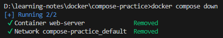


<br>
<br>
<br>

## Docker Compose로 Redis 실행시키기

### ✅ Docker CLI로 컨테이너를 실행시킬 때
$ docker run -d -p 6379:6379 redis


### ✅ Docker Compose로 컨테이너를 실행시킬 때

- compose.yml 파일 작성
    `compose.yml`

    ```
    services:
        my-cache-server:
            image: redis
            ports:
            - 6379:6379
    ```

- compose 파일 실행시키기
    ```
    $ docker compose up -d
    ```
    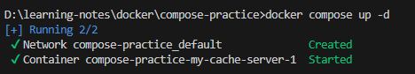

- compose 실행 현황 보기
    ```
    $ docker compose ps

    or

    $ docker ps
    ```

    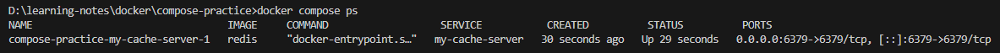

- 컨테이너 실행시킬 때 에러 없이 잘 실행됐는 지 로그 체크

    ```
    $ docker logs [컨테이너 ID 또는 컨테이너명]
    ```

    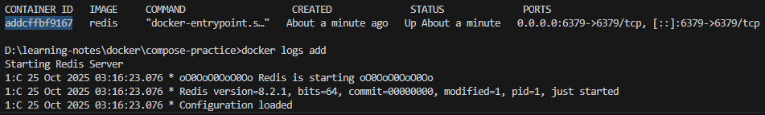

    or

    ```
    $ docker compose logs
    ```

    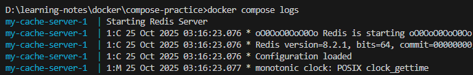

- Redis 컨테이너에 접속

    ```
    $ docker exec -it [컨테이너 ID 또는 컨테이너명] bash
    ```

- 컨테이너에서 redis 사용해보기

    ```
    $ redis-cli
    
    127.0.0.1:6379> set 1 jscode
    127.0.0.1:6379> get 1
    ```

- compose로 실행된 컨테이너 삭제

    ```
    $ docker compose down
    ```


<br>
<br>
<br>

## Docker Compose로 MySQL 실행시키기

### ✅ Docker CLI로 컨테이너를 실행시킬 때

```
$ docker run -e MYSQL_ROOT_PASSWORD=pwd1234 -p 3306:3306 -v /Users/jaeseong/Documents/
Develop/docker-my
```

### ✅ Docker Compose로 MySQL 실행시키기

- compose 파일 작성하기

`compose.yml`

```
services:
    my-db:
        image: mysql
        environment:
            MYSQL_ROOT_PASSWORD: pwd1234
        volumes:
            - ./mysql_data:/var/lib/mysql
        ports:
            - 3306:3306
```
- `environment: ...` :
    - CLI에서 -e MYSQL_ROOT_PASSWORD=password 역할과 동일
- `volumes: ...`
    - CLI에서 -v {호스트 경로}:/var/lib/mysql 역할과 동일

<br>

- compose 파일 실행시키기

    ```
    $ docker compose up -d
    ```

    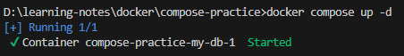

<br>

- compose 실행 현황 보기

    ```
    $ docker compose ps

    or

    $ docker ps
    ```

    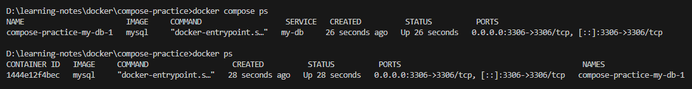

<br>

- 잘 작동하는 지 DBeaver에 연결시켜보기

    

<br>

- volume의 경로에 데이터가 저장되고 있는 지 확인하기

<br>

- compose로 실행된 컨테이너 삭제

    ```
    $ docker compose down
    ```

    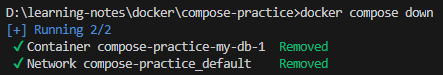


<br>
<br>
<br>

## Docker Compose로 Spring Boot 실행시키기

- 프로젝트 세팅

    - start.spring.io

    - Java 17
    - Spring Web
    - Spring Boot DevTools

<br>

- 간단한 코드 작성

    - `AppController`

        ```
        @RestController
            public class AppController {
                @GetMapping("/")
                public String home() {
                    return "Hello, World!";
                }
        }
        ```

<br>

- Dockerfile 작성하기

`Dockerfile`

```
FROM openjdk:17-jdk
COPY build/libs/*SNAPSHOT.jar /app.jar
ENTRYPOINT ["java", "-jar", "/app.jar"]
```

<br>

- Spring Boot 프로젝트 빌드하기

    ```
    $ ./gradlew clean build
    ```

<br>

- compose 파일 작성하기

    - compose를 작성하지 않고 Docker CLI로 실행시킬 때

        ```
        $ docker build -t hello-server .
        $ docker run -d -p 8080:8080 hello-server
        ```
- `compose.yml`

    `원본 파일`
    ```
    services:
        my-server:
            build: .
            ports:
            - 8080:8080
    ```

    `해석`
    ```
    services:

        # `my-server`라는 이름으로 컨테이너가 구성
        my-server:

            # . 경로에 위치한 Dockerfile로 빌드되어 생성된 이미지를 기반으로
            build: .

            # HOST에서 8080으로 요청하면, CONTAINER에서 8080과 mapping하여 연결
            ports:
            - 8080:8080
    ```

<br>

- `build: .` : compose.yml 이 존재하는 디렉토리( . )에 있는 Dockerfile로 이미지를 생성해 컨테이너를 띄우겠다는 의미.

<br>

- compose 파일 실행시키기

    ```
    $ docker compose up -d --build
    ```

    - `jar` 파일이 변경되면, 이미지를 새로 빌드해야 함
    - 이미지를 다시 빌드하고 컴포즈를 실행시키는 명령어

        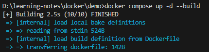

<br>

- compose 실행 현황 보기

    ```
    $ docker compose ps
    $ docker ps
    ```

    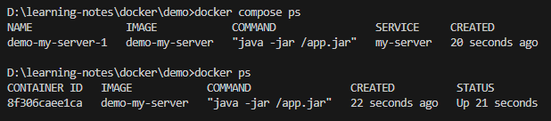


- localhost:8080으로 들어가보기

    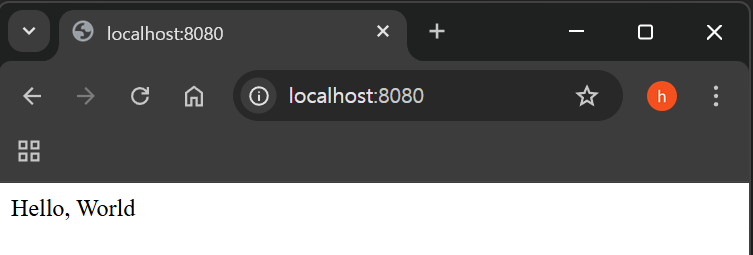

<br>

- compose로 실행된 컨테이너 삭제

    ```
    $ docker compose down
    ```

<br>
<br>
<br>

## Docker Compose로 Nest.js 실행시키기


- Nest CLI 설치

    ```
    $ npm i -g @nestjs/cli
    # nest new {프로젝트명}
    $ nest new my-server
    ```

<br>

- Dockerfile 작성하기

    `Dockerfile`

    ```
    FROM node
    WORKDIR /app
    COPY . .
    RUN npm install
    RUN npm run build
    EXPOSE 3000
    ENTRYPOINT [ "node", "dist/main.js" ]
    ```

- .dockerignore 작성하기

    `.dockerignore`
    ```
    node_modules
    ```

    - 이미지를 생성할 때 npm install 을 통해 처음부터 깔끔하게 필요한 의존성만 설치
    - 따라서 호스트 컴퓨터에 있는 node_modules는 컨테이너로 복사해갈 필요가 없다.

- compose 파일 작성하기

    - compose를 작성하지 않고 Docker CLI로 실행시킬 때

        ```
        $ docker build -t my-server .
        $ docker run -d -p 3000:3000 my-server
        ```

`compose.yml`

```
services:
    my-server:

    # Dockerfile을 기준으로 빌드 - Dockerfile의 경로
    build: .
    ports:
    - 3000:3000
```

<br>

- compose 파일 실행시키기

    ```
    $ docker compose up -d --build
    ```
    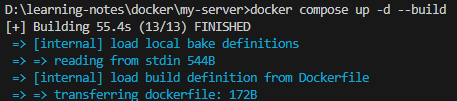

<br>

- compose 실행 현황 보기

    ```
    $ docker compose ps
    $ docker ps
    ```

    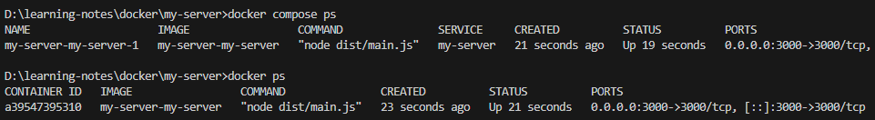

<br>

- localhost:3000으로 들어가보기

    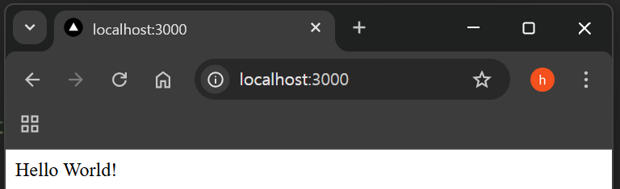

<br>

- compose로 실행된 컨테이너 삭제

    ```
    $ docker compose down
    ```

    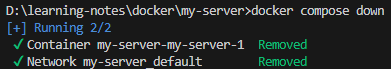


<br>
<br>
<br>

## Docker Compose로 Next.js 실행시키기


- Next.js 프로젝트 만들기

    ```
    $ npx create-next-app@latest
    ```

- Dockerfile 작성하기
    
    `Dockerfile`

    ```
    FROM node:20-alpine
    WORKDIR /app
    COPY . .
    RUN npm install
    RUN npm run build
    EXPOSE 3000
    ENTRYPOINT [ "npm", "run", "start" ]
    ```
- .dockerignore 작성하기

    `.dockerignore`
    ```
    node_modules
    ```

- compose 파일 작성하기
    - compose를 작성하지 않고 Docker CLI로 실행시킬 때
        ```
        $ docker build -t my-web-server .
    
        $ docker run -d -p 80:3000 my-web-server
        ```
`compose.yml`

```
services:
    my-web-server:
    build: .
    ports:
    - 80:3000   # 80 PORT 요청하면, 3000 PORT 연결
```

- compose 파일 실행시키기

    ```
    $ docker compose up -d --build
    ```

    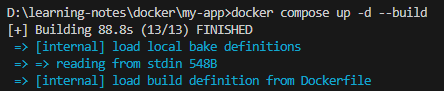

-  compose 실행 현황 보기

    ```
    $ docker compose ps
    $ docker ps
    ```

    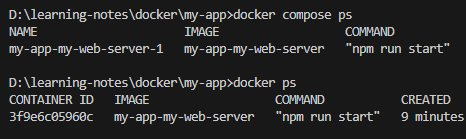

- localhost:80으로 들어가보기

    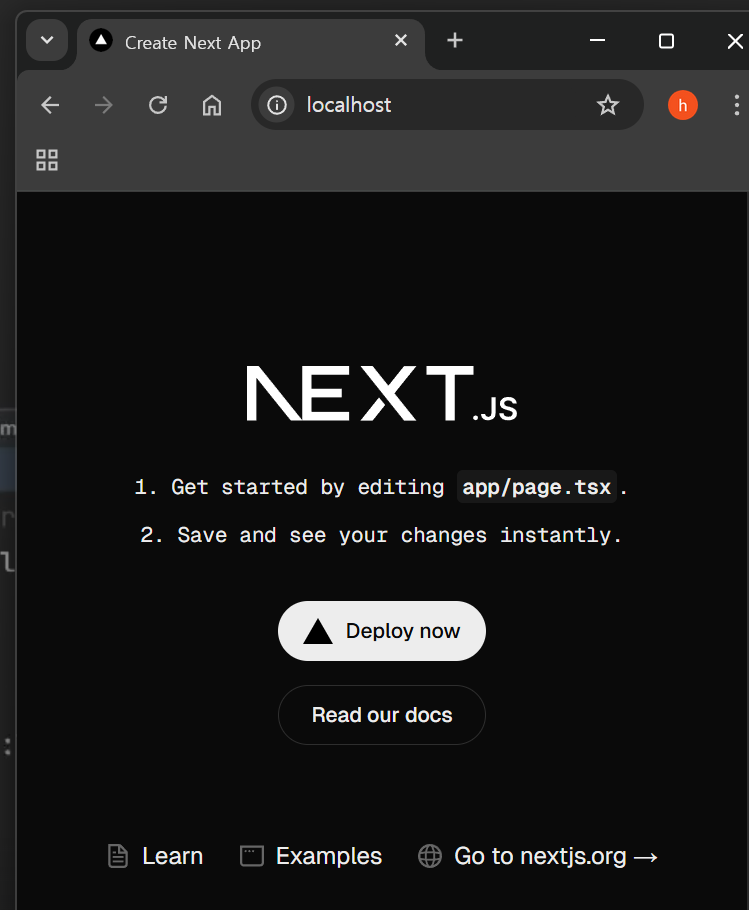

- compose로 실행된 컨테이너 삭제

    ```
    $ docker compose down
    ```

    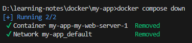

<br>
<br>
<br>

## Docker Compose로 Nginx 실행시키기


- HTML, CSS 파일 만들기

    `index.html`
    ```
    <!DOCTYPE html>
        <head>
            <meta charset="UTF-8">
            <link rel="stylesheet" href="style.css">
        </head>
        <body>
            <h1>My Web Page</h1>
        </body>
    </html>
    ```

<br>

- Nginx의 기본 설정에 의하면 메인 페이지(첫 페이지)의 파일명을 index.html 이라고 지어야 한다.

<br>

`style.css`

```
* {
    color: blue;
}
```

<br>

- Dockerfile 작성하기

    `Dockerfile`

    ```
    FROM nginx
    COPY ./ /usr/share/nginx/html
    ```

<br>

- compose 파일 작성하기
    - compose를 작성하지 않고 Docker CLI로 실행시킬 때

        ```
        $ docker build -t my-web-server .
        $ docker run -d -p 80:80 my-web-server
        ```

    `compose.yml`

    ```
    services:
        my-web-server:
            build: .
            ports:
            - 80:80
    ```

<br>

- compose 파일 실행시키기

    ```
    $ docker compose up -d --build
    ```

    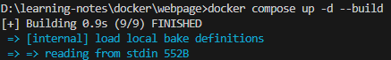

<br>

- compose 실행 현황 보기

    ```
    $ docker compose ps
    $ docker ps
    ```

    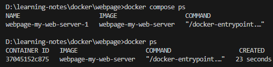

<br>

- localhost:80으로 들어가보기

    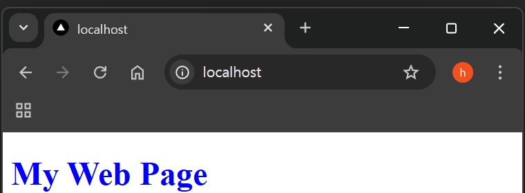

<br>

- compose로 실행된 컨테이너 삭제

    ```
    $ docker compose down
    ```

    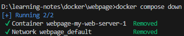