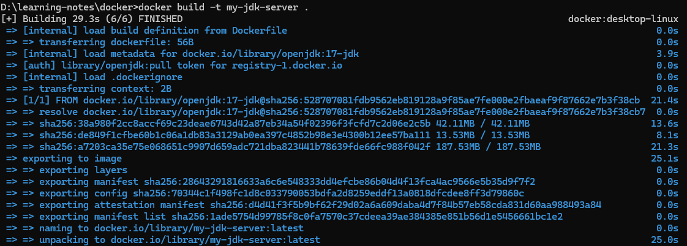
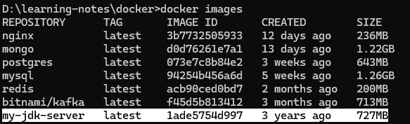
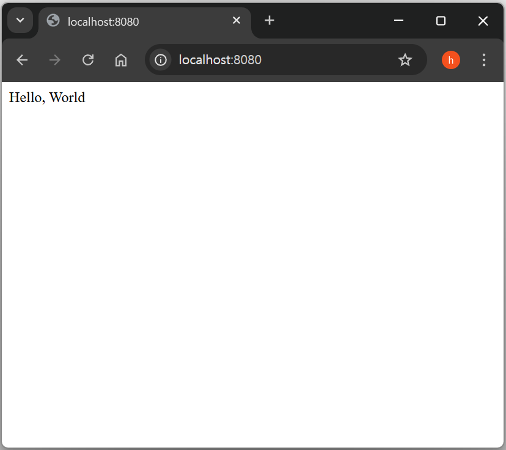
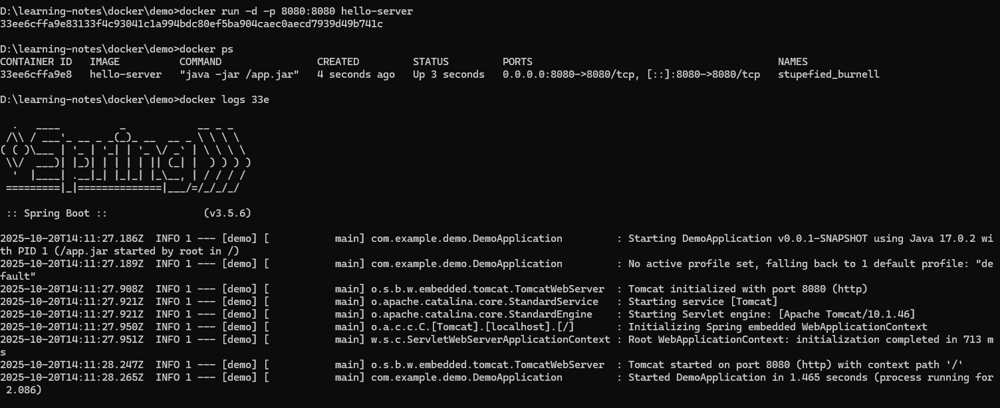
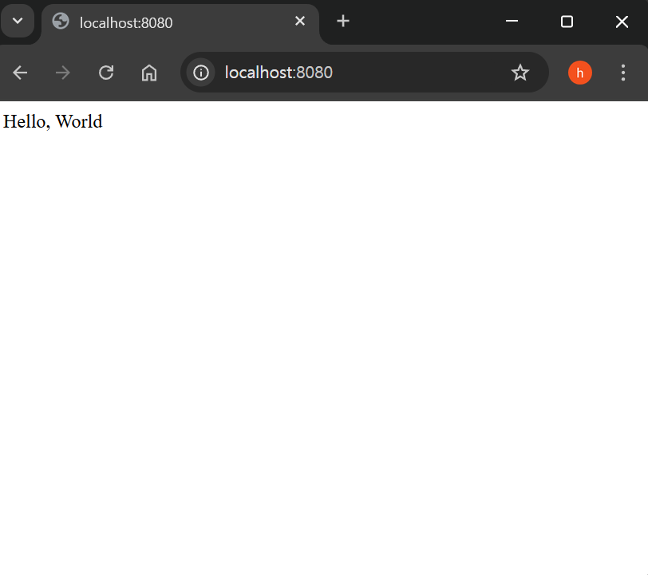
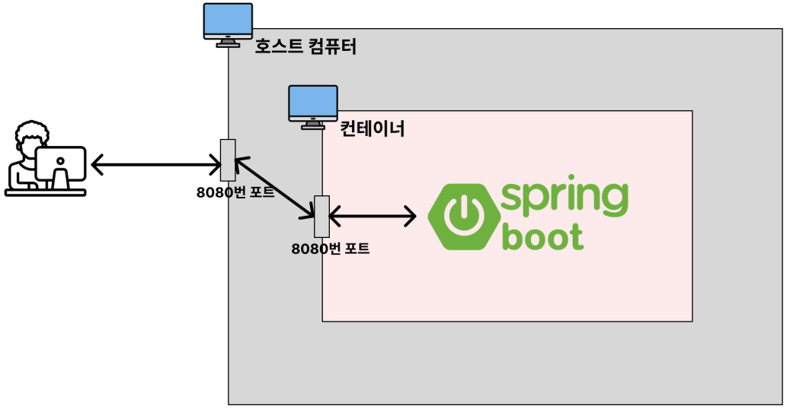

# 📍 Dockerfile로 이미지를 직접 생성하기

## Dockerfile이란?

- Docker 이미지는 Dockerhub을 통해 다운받아서 사용할 수 있다.
- 이 Docker 이미지들도 누군가 만들어서 Dockerhub에 올려놓은 것.
> 그럼 도대체 이 Dcoker 이미지는 어떻게 만드는 걸까?

- Dockerfile이라는 걸 활용해서 Docker 이미지를 만들 수 있다.
- Dockerhub에 올려놓은 Docker 이미지가 아닌, 나만의 Docker 이미지를 만들고 싶을 수 있다. 

- 예를 들어, 내가 만든 Spring Boot 프로젝트가 있다.
- 내가 만든 Spring Boot 프로젝트 자체를 Docker 이미지로 만들고 싶을 수 있다.
- 이럴 때에도 Dockerfile을 활용하면 나만의 Docker 이미지를 만들 수 있게 된다.

>정리하자면, Dockerfile이란 Docker 이미지를 만들게 해주는 파일이다.


<br>
<br>
<br>

## 베이스 이미지

### ✅ 의미
- FROM 은 베이스 이미지를 생성하는 역할을 한다.
- Docker 컨테이너를 특정 초기 이미지를 기반으로 추가적인 세팅을 할 수 있다.
- 여기서 얘기한 ‘특정 초기 이미지’가 곧 베이스 이미지이다.

>조금 더 쉽게 설명해보겠다.

- 우리가 윈도우 컴퓨터를 새로 사서 실행시켜보면 기본 프로그램들(인터넷, 그림판, 메모장 등)이 많이 깔려있다.
- 베이스 이미지도 이와 똑같다.
- 컨테이너를 새로 띄워서 미니 컴퓨터 환경을 구축할 때 기본 프로그램이 어떤게 깔려있으면 좋겠는 지 선택하는 옵션이라고 생각하면 된다.
- 누군가는 JDK가 깔려있는 컴퓨터 환경이 세팅되기를 바랄 수도 있고, 누군가는 Node가 깔려있는 컴퓨터 환경이 세팅되기를 바랄 수도 있다.
- 필요에 따라 베이스 이미지를 고르면 된다.

### ✅ 사용법
```
FROM [이미지명]
FROM [이미지명]:[태그명]

# 태그명 을 적지 않으면 해당 이미지의 최신(latest) 버전을 사용한다. 
```

<br>
<br>
<br>

## 베이스 이미지 생성하기

- 베이스 이미지 설정
    
    ```
    FROM openjdk:17-jdk
    ```
    - 베이스 이미지
    - 해당 이미지를 사용해서 컨테이너가 생성됐을 때, 기본적으로 설치되어 있도록 설정

- 베이스 이미지 생성

    ```
    docker build -t my-jdk-server .
    ```

    

    생성된 이미지

    

- 생성한 이미지로 컨테이너 생성하기

    - 실행
    ```
    docker run -d my-jdk-server
    
    836d44d61ae608355397990e45ca4f019a0bf57382f544a975f6c82038b309d1

    # 실행 됨
    ```
    
    - 실행됐지만, 바로 종료 
    ```
    docker ps -a

    CONTAINER ID  IMAGE          COMMAND  CREATED       STATUS                     PORTS  NAMES
    836d44d61ae6  my-jdk-server  "jshell" 6 seconds ago Exited (0) 5 seconds ago          trusting_clarke
    ```

    - log 확인하기
    ```
    docker logs 836

    Oct 20, 2025 12:19:37 PM java.util.prefs.FileSystemPreferences$1 run
    INFO: Created user preferences directory.
    |  Welcome to JShell -- Version 17.0.2
    |  For an introduction type: /help intro

    jshell>

    # 특별한 에러 없음
    ```


<br>
<br>
<br>

- 컨테이너는 해야할 내부 작업이 끝나게 되면 자동으로 종료.
- `Dockerfile`은 컨테이너가 작업해야할 목록을 적어놓은 파일.
- `FROM openjdk:17-jdk` 이 외 수행해야할 작업이 없으므로 종료.

## 컨테이너에 접속해서 openjdk:17-jdk 설치 확인하기

- 실행하기

    ```
    docker exec -it my-jdk17-server
    ```

    - 컨테이너가 실행 중이지 않으므로, 접속 불가.

- 접속 가능하게 하기, `Dockerfile` 수정

    ```
    ENTRYPOINT ["/bin/bash", "-c", "sleeep 500"]
    ```

- Docker Build

    ```
    docker build -t my-jdk-server .

    # Dockerfile의 현재 경로
    ```

- Docker run

    ```
    docker run -d my-jdk-server
    ```

- Check

    ```
    docker ps
    ```

- logs

    ```
    docker logs my-jdk-server
    ```

- 컨테이너 접속하기

    ```
    docker exec -it my-jdk-server bash
    ```

- 자바 버전 확인하기

    ```
    java -version
    ```


<br>
<br>
<br>

## 컨테이너에 접속해서 node 설치 확인하기

- `Dockerfile` 수정

    ```
    FROM node

    ENTRYPOINT ["/bin/bash", "-c", "sleeep 500"]
    ```

- Docker Build

    ```
    docker build -t my-node-server .

    # Dockerfile의 현재 경로
    ```

- Docker run

    ```
    docker run -d my-node-server
    ```

- Check

    ```
    docker ps
    ```

- logs

    ```
    docker logs my-node-server
    ```

- 컨테이너 접속하기

    ```
    docker exec -it my-node-server bash
    ```

- 노드 버전 확인하기

    ```
    node -v
    ```


<br>
<br>
<br>

## 종료된 컨테이너에 접속해서 디버깅하기

> 프로그래밍을 할 때 중간중간 잘 작동하는 지 확인하는 습관은 굉장히 중요.

- 어떤 명령어를 입력하고 난 뒤에 명령어가 정상적으로 수행됐는 지 어떻게 확인할 수 있는 지 방법을 찾아봐야 한다.
- 이 습관이 몸에 익으면 어떤 명령어를 수행하더라도 그 명령어가 어떻게 작동하는 지 파헤칠 수 있게 된다. - 또한 어떤 명령어를 실행시킨 뒤에 에러가 생기더라도 금방 발견할 수 있어서 디버깅도 훨씬 수월하다.

> Docker를 사용하면 대부분의 코드가 컨테이너 내부에서 작동한다.
- 그러다보니 어떤 과정으로 처리됐는 지, 잘 처리는 됐는 지를 직접적으로 눈에 보이지 않는다.
- 이 때문에 Docker 학습에 어려움을 겪는다.

> 이를 해결하기 위해 우리는 2가지 방법을 이미 익혔다.
- docker logs 를 활용해 컨테이너 로그 확인하기
- docker exec -it 를 활용해 컨테이너 내부에 직접 들어가보기
- 위 방법 중 docker exec -it 은 실행 중인 컨테이너에만 쓸 수 있는 명령어이다.
- 종료된 컨테이너는 아래와 같은 에러가 발생한다.

>하지만 이미지를 만들면서 컨테이너를 실행시켜보면, 컨테이너의 특성상 명령어 처리가 다 끝나는대로 컨테이너가 종료된다.
- 그러다보니 내부적으로 어떻게 컨테이너가 형성됐는 지 디버깅을 하는데 어려움을 겪는다.

### 어떻게 해야 할까?

#### Dockerfile
```
FROM openjdk:17-jdk

...

# 500초 동안 시스템을 일시정지 시키는 명령어
ENTRYPOINT ["/bin/bash", "-c", "sleep 500"] 
```

- 위 명령어를 추가함으로써 컨테이너가 바로 종료되는 걸 막을 수 있다.
- 그런 뒤에 docker exec -it 를 활용해 컨테이너 내부에 직접 들어가서 디버깅을 하면 된다.


<br>
<br>
<br>

## COPY : 파일 복사(이동)

- 호스트 컴퓨터의 (파일) ➡️ 컨테이너로 전달하는 기능

    ### app.txt

    - `config.txt` 생성

        ```
        Config File
        ```

    
    - `Dockerfile` 생성

        ```
        FROM ubuntu

        # HOST 컴퓨터의 app.txt를 컨테이너의 절대 경로인 /app.txt 경로로 복사
        COPY app.txt /app.txt
        # '/' = 절대 경로


        ENTRYPOINT ["/bin/bash", "-c", "sleep 500"]  
        ```

    - Build

        ```
        docker build -t my-server .
        ```

    - 컨테이너 실행

        ```
        docker run -d my-server
        ```

    - 컨테이너 접속

        ```
        docker exec -it my-server bash
        ```

    - `ls` and `cat app.txt`
        - 컨테이너로 복사 됨


<br>
<br>

- 호스트 컴퓨터의 (폴더) ➡️ 컨테이너로 전달하는 기능

    ### my-app/config.txt
    
    - `config.txt` 생성

        ```
        Config File
        ```

    - `Dockerfile` 생성

        ```
        FROM ubuntu

        # HOST 컴퓨터의 config.txt를 복사할거야
        # 컨테이너 안, 절대 경로인 /my-app 경로로 복사할거야
        COPY my-app /my-app/

        # '/' = 절대 경로
        # 디렉터리 복사 = 끝 부분 '/' 입력


        ENTRYPOINT ["/bin/bash", "-c", "sleep 500"]  
        ```

    - Build

        ```
        docker build -t my-server .
        ``` 

    - 컨테이너 실행

        ```
        docker run -d my-server
        ```

    - 컨테이너 접속

        ```
        docker exec -it my-server bash
        ```

    - `ls` and `cat app.txt`
        - 컨테이너로 복사 됨

<br>
<br>

- 호스트 컴퓨터의 (폴더) ➡️ 컨테이너로 전달하는 기능

    ### readme.txt

    - `readme.txt` 생성

        ```
        My Readme
        ```
    
    - `Dockerfile` 생성

        ```
        FROM ubuntu

        # HOST 컴퓨터의 .txt로 끝나는 모든 파일을 복사할거야
        # wild card 사용

        # 컨테이너 안, 절대 경로인 text-files/ 폴더를 생성해서 복사할거야
        COPY *.txt  /text-files/

        # '/' = 절대 경로
        # 디렉터리 복사 = 끝 부분 '/' 입력


        ENTRYPOINT ["/bin/bash", "-c", "sleep 500"]  
        ```

    - Build

        ```
        docker build -t my-server .
        ``` 

    - 컨테이너 실행

        ```
        docker run -d my-server
        ```

    - 컨테이너 접속

        ```
        docker exec -it my-server bash
        ```

    - `ls` and `cd text-files`
        - 컨테이너로 복사 됨

<br>
<br>

- 특정 파일만 제외하고, 호스트 컴퓨터의 (파일) ➡️ 컨테이너로 전달하는 기능

    ### .dockerignore

    - `.dockerignore` 생성

        ```
        # 제외할 파일을 작성
        readme.txt
        ```
    
    - `Dockerfile` 생성

        ```
        FROM ubuntu

        # HOST 컴퓨터의 모든 파일을 복사할거야
        # 컨테이너 안, 절대 경로인 / (root) 경로로 복사할거야
        COPY ./ /

        # '/' = 절대 경로
        # 디렉터리 복사 = 끝 부분 '/' 입력


        ENTRYPOINT ["/bin/bash", "-c", "sleep 500"]  
        ```

    - Build

        ```
        docker build -t my-server .
        ``` 

    - 컨테이너 실행

        ```
        docker run -d my-server
        ```

    - 컨테이너 접속

        ```
        docker exec -it my-server bash
        ```

    - `ls` and `cd text-files`
        - 컨테이너로 복사 됨

<br>
<br>
<br>

## ENTRYPOINT : 컨테이너가 시작할 때 실행되는 명령어

### ✅ 의미
- ENTRYPOINT 는 컨테이너가 생성되고 최초로 실행할 때 수행되는 명령어를 뜻한다.
- 쉽게 설명하자면 ENTRYPOINT 에는 미니 컴퓨터의 전원을 키고나서 실행시키고 싶은 명령어를 적으면 된다.

### ✅ 사용법
- 문법
    ```
    ENTRYPOINT [명령문...]
    ```
- 예시

    ```
    ENTRYPOINT ["node", "dist/main.js"]
    ```

### 🎯 예제

#### Dockerfile

```
FROM ubuntu

ENTRYPOINT ["/bin/bash", "-c", "echo hello"]
```

```
$ docker build -t my-server .
$ docker run -d my-server
$ docker ps -a
$ docker logs [Container ID]
```

<br>
<br>
<br>

### 실습

- `Dockerfile` 생성

    ```
    FROM ubuntu

    ENTRYPOINT ["/bin/bash", "-c", "echo hello"]
    ```

    - ubuntu 베이스 이미지를 생성
    - 이미지를 컨테이너로 실행하는 순간, ENTRYPOINT ["/bin/bash", "-c", "echo hello"] 명령어 입력


- Build

    ```
    docker build -t my-server .
    ``` 

- 컨테이너 실행

    ```
    docker run -d my-server
    ```

- 컨테이너 확인

    ```
    docker ps
    ```

    - ENTRYPOINT ["/bin/bash", "-c", "echo hello"]를 실행하고 컨테이너가 종료 됨

- 로그 확인

    ```
    docker logs my-server

    hello
    ```

<br>
<br>
<br>

## Spring Boot - Dokcer

- https://start.spring.io/ 접속 및 프로젝트 설정

    - Spring Web 추가
    - Spring Boot DevTools 추가

    - GENERATE

- IDE로 프로젝트 열기

    - AppController.java

        ```
        @RestController
        public class AppController {

            @GetMapping("/")
            public String home() {
                return "Hello, World";
            }
        }
        ```
    
    - 프로그램 실행 및 접속 테스트

        

- 프로젝트 이미지 생성하기 - Dockerfile

    - root 경로에 `Dockerfile` 생성

- Dockerfile 작성

    `Dockerfile`
    ```
    # Spring Boot Proejct를 실행하기위한 JDK
    FROM openjdk:17-jdk
    ```

- Spring Boot Project 종료 및 Build

    ```
    ./gradlew clean build
    ```

- Build된 Jar파일을 컨테이너로 복사되게 설정

    `Dockerfile`
    ```
    FROM openjdk:17-jdk

    # Copy를 통해 빌드한 파일(Jar)을 컨테이너로 복사
    # 컨테이너 안에서 빌드한 파일(Jar)을 실행시키려고 함
    COPY build/libs/*SNAPSHOT.jar app.jar

    # SNAPSHOT.jar로 끝나는 파일을 지정
    # 컨테이너 안 app.jar라는 이름으로 복사하겠다
    # (app.jar) 상대 경로를 작성해도 컨테이너 내부 절대 경로에 파일이 복사가 됨
    # /app.jar로 작성해도 됨

    # 컨테이너가 실행될 때, 최초로 실행시킬 명령어
    ENTRYPOINT ["java", "-jar" "/app.jar"]
    ```

- 다시, Spring Boot Project Build

    ```
    ./gradlew clean build
    ```

- Docker Image 생성하기

    ```
    docker build -t hello-server .
    ```
    - `.` = Dockerfile이 위치한 경로

- 생성한 이미지 컨테이너에 실행

    - 8080 port mapping

    ```
    docker run -d -p 8080:8080 hello-server
    ```

- `docker ps` 및 `docker logs <CONTAINER ID>`로 확인

### Docker로 가동한 Spring Boot Project


### 접속 화면


### 아키텍처


<br>
<br>
<br>

## RUN : 이미지 생성 과정에서 사용할 명령문 실행

### ✅ 의미
RUN 은 이미지 생성 과정에서 명령어를 실행시켜야 할 때 사용한다.

### ✅ 사용법

- 문법
```
RUN [명령문]
```

- 예시
```
RUN npm install
```

<br>

### ✅ RUN vs ENTRYPOINT
- RUN 명령어와 ENTRYPOINT 명령어가 헷갈릴 때가 있다.
- 둘 다 같이 명령어를 실행시키기 때문이다.
> 하지만 엄연히 둘의 사용 용도는 다르다.
- RUN 은 `이미지 생성 과정`에서 필요한 명령어를 실행시킬 때 사용.
- ENTRYPOINT 는 생성된 이미지를 기반으로 `컨테이너를 생성한 직후`에 명령어를 실행시킬 때 사용.

<br>

### 🎯 예제

미니 컴퓨터 환경이 ubuntu로 구성되었으면 좋겠고 git이 깔려있으면 좋겠다고 가정하자.
> 이런 환경을 구성하기 위해 `Dockerfile`을 활용해 `ubuntu`, `git`이 깔려있는 이미지를 만들면 된다.

<br>

#### 1. Dockerfile 작성하기
`Dockerfile`

```
FROM ubuntu

# Git을 설치하고 Image를 만들어
RUN apt update && apt install -y git

# Image를 다 만들고, 컨테이너에 실행시킬 때, 이 명령어를 수행해
ENTRYPOINT ["/bin/bash", "-c", "sleep 500"]
```

#### 2. 이미지 빌드 및 컨테이너 실행

```
$ docker build -t my-server .
$ docker run -d my-server
$ docker exec -it [Container ID] bash
$ git -v # 컨테이너 내에 git이 잘 설치됐는 지 확인
```
