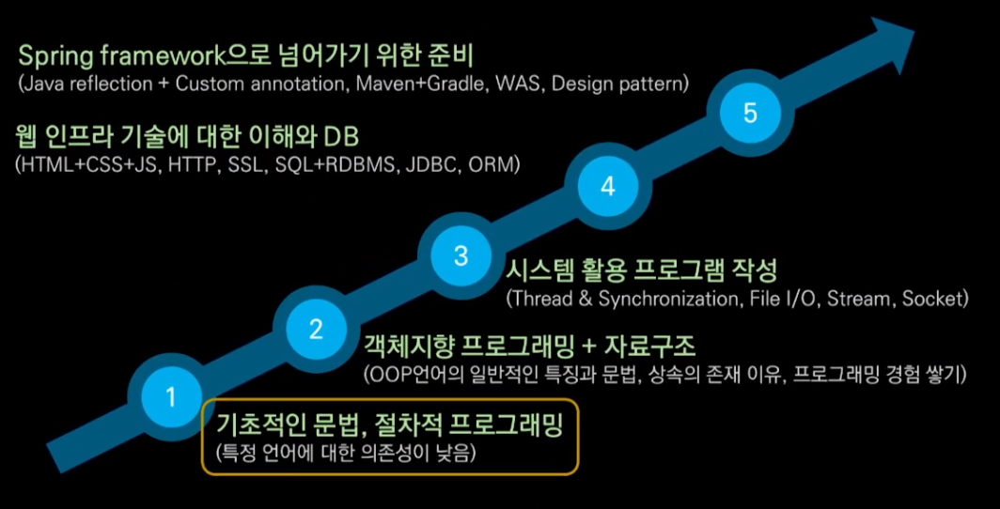

# 학습 순서

- Java 기반의 Backend 개발자
    

  - 모든 언어에서 통용되는 문법을 Java라는 언어로 배울 예정
  - 절차적 프로그래밍에 특화된 내용
  - 프로그래밍에 대해 탐구

  - 1~3 Java 영역
  
## 절차적 프로그래밍에 대한 이해

- 문제를 정의하고 해결 방법에 대해 글로 쓰는 것이 우선
- 절대로 타자치면서 생각하지 말 것
- 변수, 상수 및 범위, 경우의 수를 파악하는 연습이 필요

  - 틀린 그림 찾기가 아닌 문제를 해결하는 사고력

## Java 언어 문법
- 모든 예제는 직접 작성하는 것이 중요
- 객체지향은 제외하고 Class에 대한 개념과 문법까지 학습