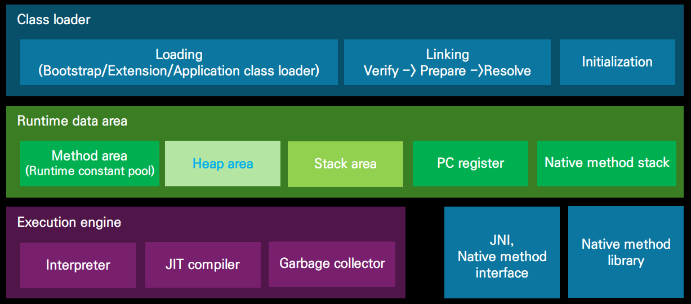

# Java의 특징
- JVM 기반 OOP언어
  - 가상화 공간에서 작동
- C/C++의 가장 특징인 메모리 관리와 책임 이슈를 구조적으로 제거한 언어
- OS(or Platform)에 대한 의존성 없음
- 컴파일러, 인터프리터 특징을 모두 가짐
  - 하이브리드
- 문법적으로 C/C++과 매우 유시

---

# JVM 구성 요소

- Heap 메모리는 알아서 관리가 잘 된다
    - new 연산자로 생성된 객체가 저장되는 메모리 위치

---

# JIT(Just In Time) Compiler

- Java Byte Code를 기계어로 번역
- JVM이 반복되는 코드의 효율을 높일 목적으로 사용
- 실행 기록을 분석해 자주 사용되는 코드에 적용(반복문)
- 프로그램을 오래 실행할수록 성능개선에 유리

---

# 하드웨어 수준 자료형

- 정수
  - Bit 수에 따라 표현 범위 결정
  - 2의 보수를 더하는 방식으로 뺄셈 구현
- IEEE 754 기반 실수
  - 단정도 (float)
  - 배정도 (double, 소수점 이하 15번째 자리까리 유효)
  - 특수정도

### 이 하드웨어 위에 소프트웨어는 위의 영향을 다 받는다.

## 정수

### 덧셈
- 12 + 9 = 21
  - 12 (1100(2)) + 9 (1001(2)) = 21(10101(2))
    - 10101(2) = 16+4+1

### 뺄셈
- 12 - 9 = 3
  - 1의 보수 = 0과 1을 뒤집는 것
    - 9 = 1001(2)
  - 2의 보수 = 1의 보수 + 1
    - 2의 보수 = 0110(2) + 1 -> 0111(2)
    - 12 (1100(2))에 9의 2보수(0111(2))를 더하기
    - 0011(2) -> 3
  - 10011(2)
    - 자리 버림
    - 0011(2) -> 3
    

---

# 실수형과 부동 소수점의 오차

- IEEE(Institute of Electrical and Electronics Engineers, 전기전자 기술자협회)가 규정한 표준사용
- IEEE 754 표준
    - 소수점 이하 정보를 표시할 수 형식
    - 부동 소수점 표현
      - 100.0, 10.0 * 10, 1.0 * 102은 같은 값에 대한 표현
       
    - 두 정수 사이에는 무수히 많은 실수가 존재하기 때문에 일정 수준이 오류(부동소수점 오차)를 인정함

## 심심치 않게 나오는 면접 질문
    4.9999998과 5.0은 같다고 할 수 있나요?

- 거꾸로 질문을 해야한다
- 단정도와 배정도 중 어떤 기준으로 말씀을 드릴까요?
  - 단정도 = float 소수점 이하 6번째 자리까지만 인식 
  - 배정도 = double 소수점 이하 15번째 자리까지 인정

---

# Java 자료형 

## 기본형

- 정수
  - Byte(1), short(2), char(2), int(4), long(8)
- 실수
  - float, double
- 논리
  - boolean(true/false)

    | 자료형   | 크기 (bit)   | 표현범위                                    | 설명                          |
    |----------|------------|---------------------------------------------|-------------------------------|
    | byte     | 8 (1byte)  | -2⁷ ~ (2⁷ - 1)                             | 0 표현은 양수범위에 포함       |
    | short    | 16 (2byte) | -2¹⁵ ~ (2¹⁵ - 1)                           | -                             |
    | char     | 16 (2byte) | 0 ~ (2¹⁶ - 1)                              | 0~65535 범위 유니코드          |
    | int      | 32 (4byte) | -2³¹ ~ (2³¹ - 1)                           | -                             |
    | long     | 64 (8byte) | -2⁶³ ~ (2⁶³ - 1)                           | -                             |
    | float    | 32 (4byte) | 1.4×10⁻⁴⁵ ~ (3.4×10³⁸)                     | 유효범위: 소수점 이하 7자리     |
    | double   | 64 (8byte) | 4.9×10⁻³²⁴ ~ (1.8×10³⁰⁸)                   | 유효범위: 소수점 이하 15자리    |

- char Type은 인코딩 체계가 관여

## Non-primitive or Derived Type 유도형
    Java에서 객체로 언급하는 대상

- String 문자열을 다루기 위한 Class
- Class
  - Array, List, Queue, Stack
  - Interface

## 그 외 형식

- 무치형
  - void
- 함수형
  - testFunc(int a)

---

# 객체, 클래스, 인스턴스

- 객체(Object)란 특정 목적을 가진 코드와 연산에 필요한 자료(변수)들을 한 세트로 묶어 구현할 대상
- Class는 객체를 기술하기 위한 문법으로 새로운 자료형이 될 수 있음
- 인스턴스는 특정 자료형에 대한 변수
  - 객체라는 형식의 실체가 만들어지면 그것을 인스턴스라고 한다.
    - int a;
      (a는 int 형식에 대한 인스턴스)
    - String hello = new String(“Hello”);
      (hello는 새로 생성된 String 클래스 인스턴스에 대한 참조)

---

# 문자와 문자(배)열 및 인코딩

- 영문 혹은 한글 한 글자는 '문자'로 규정
- 문자를 연속되게 이어진 형태를 배열로 나열하면 '문자(배)열'

## 문자, 문자(배)열

- char형은 한 문자(유니코드)를 저장하기 위한 자료형
  - char ch = 'A';
- char형은 정수 형식에 속함
  - 'A'+1 = 66; 연산이 가능
- ㅊchar형 자료가 여럿 연속되게 이어진 배열 형태가 '문자열'

## Unicode와 인코딩 규칙
- C언어의 문자열은 MBCS(Multi-bytes Character Sets)와 Unicode 문자열로 나눔
  - Java에서 문자열의 끝은 Null이 아님
- 유니코드는 한글 영문 모두 한글자가 2바이트
- Java는 기본적으로 UTF-16 BE체계와 Modified UTF-8체계 병행

