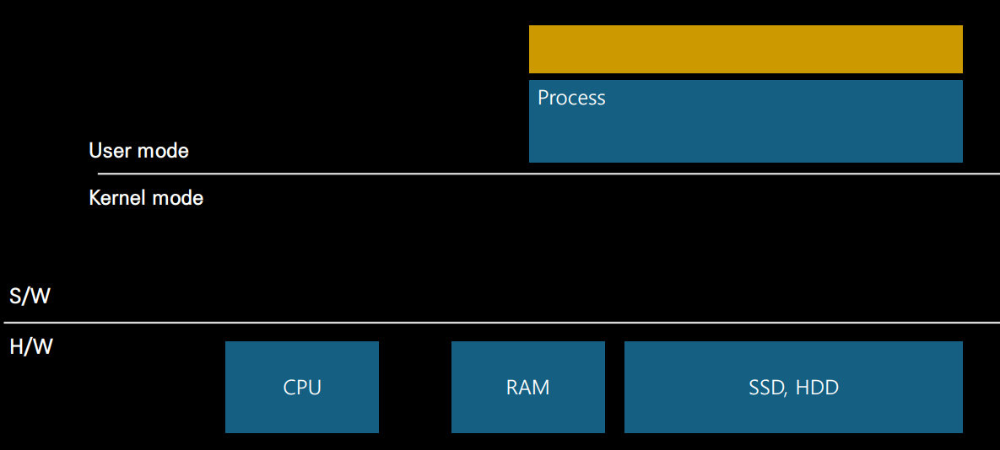
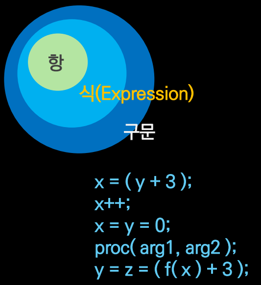

# 고급어와 저급어

- CPU가 인식할 수 있는 명령어 = 기계어
  - CPU 접점에 전기 신호(+5v)를 전달하면 1, 그렇지 않으면 0
  - 2진수로 표기 가능 (보통 16진수로 변환하여 표기)
- 장치에 의존적인 기계어를 사람이 이해하기 용이한 문자열 표기로 정의한 것이 고급어
  - C, C++
  - Java

---

- ### Native Code
  - CPU가 이해할 수 있는 코드 체계

 

- ### Computer = H/W + S/W
  - H/W
    - Physical
  - S/W
    - logical = Virtual
    - 하드웨어를 소프트웨어로 구현 -> 가상화
    - <b><u>Virtual Machine = S/W로 구현된 CPU</u></b>
    
---

 

# JVM

- S/W로 구현된 Virtual Machine인 Java Virtual Machine(JVM)이 고급어 코드를 `Java Byte code`로 번역, 즉 컴파일
  - JVM 기계어
  - Java라는 프로그램이 기계가 인식할 수 있는 기계어로 번역을 통해 실행
  - Java는 C/C++과 같은 Native Code에 비해 상대적으로 성능이 떨어진다.

- 가상화 기술
  - 기존에 하드웨어로 존재하던 것을 소프트웨어로 구현해 낸 것

 

# 항, 식, 구문

- 여러 항이 모여 식을 이룸
- 식은 평가 대상
  - (식을 평가하기 위해서 계산(연산)을 해야 함)
- 여러 식을 모아 하나의 구문을 이루고, 고급어 기준의 실행 단위가 됨
- 연속되는 구문을 위에서 아래 방향으로 순차적 실행

 

# Compiler, Interpreter

| 구분        | Compiler (컴파일러) | Interpreter (인터프리터) |
|-------------|----------------------|---------------------------|
| 정의        | 고급어 소스코드를 기계어로 번역하는 프로그램 | 고급어 소스코드를 직접 실행하는 프로그램이나 환경 |
| 실행 방식   | 전체 소스코드를 모두 기계어로 변환한 후 실행 | 보통 한 번에 한 줄 단위로 실행 |
| 성능        | 성능 최적화가 용이하여 다수 언어가 채택 | 성능(특히 속도) 면에서 컴파일러 방식보다 느림 |
| 대표 언어   | C, C++ 등 | JavaScript, Python 등 |
