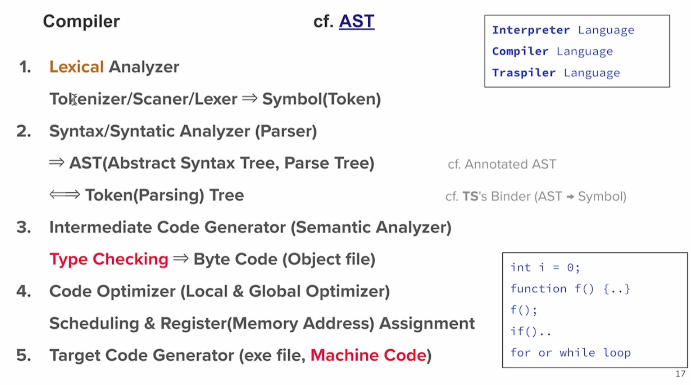

### 🕸️ Web의 탄생 배경 (feat. Browser)

#### 🔹 1989년

* **URL, HTTP, HTML**의 탄생 → **HyperText Browser** 개발
* 개발자: **Tim Berners-Lee**

#### 🔹 1993년

* **NCSA Mosaic** 그래픽 웹 브라우저 개발 (모자이크)
* 개발 기관: **일리노이 대학교(University of Illinois at Urbana-Champaign, UIUC)**
* NCSA: National Center for Supercomputing Applications

#### 🔹 1994년

* Mosaic Communications에서 **Mosaic Netscape 0.9** 개발
* 주요 인물: **Jim Clark**, **Marc Andreessen** (모자이크 개발 주도)
* ‘Mozilla’ = Mosaic + Godzilla의 조합

#### 🔹 1995년

* **Mosaic Netscape → Netscape Navigator**로 이름 변경

  * 이유: Mosaic 상표권 문제 해결
  * 점유율: 당시 웹 브라우저 시장의 **75%** 차지
  * 회사명: Mosaic Communications → Netscape Communications로 변경

---

### 💬 인용 문구

* “브라우저는 준비되었는데… 사이트가 별로 없네?”
* “Java Applet은 너무 무겁고 Sandbox 문제도 있고...”

---

## 💡 JS의 탄생과 발전 요약

### 🎯 탄생 배경

* 목표: **"모든 사용자가 편하게 웹사이트를 만들게 하자!"**
* 방법: **Scheme Runtime**을 **Netscape**에 내장(Embed)하자!
* **Self**, **Scheme** 전문가인 **Brendan Eich** 영입 → JS의 아버지

---

### 🔨 개발 초기

* 코드명 **Mocha** → **LiveScript** 완성 (📅 1995년 9월)
* 당시 웹의 표준은 \*\*Applet(Java)\*\*였으나, JS는 **더 가볍고 빠름**

---

### 🧪 이름 변경

* “**Live**는 Java 같지 않아서 사람들이 안 쓸지도 몰라”
* 그래서:
  👉 **LiveScript → JavaScript**로 이름 변경 (📛 마케팅 전략)

---

### 🤦 이름 바꿔도 혼동은 여전

* 사람들은 Java와 JavaScript를 계속 혼동
* MS도 **JScript**(1996, IE3)로 대응 → 이름만 다를 뿐 거의 동일

---

### 🌍 표준화 노력

* **ECMA**에 표준화를 제안 → **TC39 위원회** 출범

---

### 📌 관련 기술 및 발전 흐름

* jQuery (2006)
* CSS3 (2005)
* JSON (2001)
* TypeScript (2012)
* React (2011)
* ReactTS (2020)
* Dart / Kotlin / ...

---

## 🖥️ 컴퓨터 구조 요약

### ✅ CPU (중앙처리장치)

1. **ALU (Arithmetic and Logical Unit)**

   * 산술 및 논리 연산을 수행
   * 누산기(Accumulator): 연산 결과를 저장

2. **CU (Control Unit)**

   * 제어 장치: 명령어의 해석과 실행을 지시

3. **Register (레지스터)**

   * 초고속 임시 저장장치
   * 주요 레지스터:

     * **Program Counter (PC)**: 다음 실행할 명령어 주소
     * **Address Register (AR)**: 주소 저장
     * **Buffer Register (BR)**: 데이터 임시 저장
     * **Instruction Register (IR)**: 명령어 저장
     * **Flag Register**: 조건 플래그 (예: carry, zero 등)

4. **General Purpose Register (범용레지스터)**

   * 예: t0\~t9 (계산/주소/버퍼/연산 등)
   * Stack Pointer, Input/Output Register, Limit Register 등도 포함

---

### ✅ Cache Memory (캐시 메모리)

* CPU와 메인 메모리 사이의 속도 차이를 줄이는 고속 메모리
* **L1, L2, L3 캐시**로 구성 (L1이 가장 빠르지만 작음)
* **Hit Ratio** = `hit / (hit + miss)`
  → 캐시 효율성 지표

---

### ✅ MMU (Memory Management Unit)

* 논리 주소 → 물리 주소로 변환
* 관련 레지스터:

  * **Base Register**: 시작 주소
  * **Limit Register**: 허용 범위(끝 주소)

---

### ✅ System Bus (시스템 버스)

* CPU ↔ Memory 및 I/O 장치 간 데이터 통로
* 구성 요소:

  * **Address Bus**: 주소 전송
  * **Data Bus**: 데이터 전송
  * **Control Bus**: 제어 신호 전송

---

### ✅ Memory (주기억장치 / RAM)

* 사용자 프로그램과 커널을 저장
* 구성:

  * **Kernel 영역** (OS 커널, 커널 모드)
  * **User 영역** (코드, 데이터, 스택, 힙 등)

    * Code: 실행 명령어
    * Data: 정적 변수 등
    * Stack: 함수 호출, 지역변수
    * Heap: 동적 할당 메모리

---

### ✅ Disk/SSD (보조 기억 장치)

* 비휘발성 저장장치
* 외부 장치 포함

---

## 🧠 요약 정리

| 구성 요소          | 역할              |
| -------------- | --------------- |
| **CPU**        | 연산, 제어          |
| **Register**   | 초고속 임시 저장       |
| **Cache**      | 메모리 접근 속도 향상    |
| **MMU**        | 주소 변환 (논리 → 물리) |
| **Memory**     | 실행 중 프로그램 저장    |
| **Disk/SSD**   | 장기 저장소          |
| **System Bus** | 정보 전달 통로        |

---

---

## 🧠 컴파일러 동작의 5단계 요약

### 🔸 1. **Lexical Analyzer (어휘 분석기)**

* **역할**: 코드의 문자 흐름을 \*\*토큰(Token)\*\*으로 분리
* **구성 요소**: Tokenizer / Scanner / Lexer
* **결과**: `int`, `function`, `if`, `{`, `}`, `(`, `)` 등으로 나눠진 **심볼(토큰)** 생성

---

### 🔸 2. **Syntax Analyzer (구문 분석기, Parser)**

* **역할**: 토큰의 문법적 구조를 분석하여 **AST (Abstract Syntax Tree)** 생성
* **참고**:

  * **Parse Tree**와 **AST**는 구조적으로 유사
  * TypeScript에서는 AST → Symbol 로 변환 (cf. TS’s Binder)

---

### 🔸 3. **Intermediate Code Generator (중간 코드 생성기)**

* **역할**: AST를 바탕으로 중간 표현(IR, Intermediate Representation)을 생성
* **중요**: 이 과정에서 **Type Checking**(타입 검사) 수행
* **결과**: **Byte Code** 또는 **Object File** 형태 생성

---

### 🔸 4. **Code Optimizer (코드 최적화기)**

* **역할**: 코드 실행 성능을 향상시키기 위해 최적화 수행
* **범위**:

  * **Local Optimizer**: 함수 내에서 최적화
  * **Global Optimizer**: 여러 함수, 전체 프로그램 범위에서 최적화
* **작업**: 명령어 **스케줄링**, **레지스터/메모리 주소** 할당

---

### 🔸 5. **Target Code Generator (목표 코드 생성기)**

* **역할**: 실제 실행 가능한 \*\*기계어(Machine Code)\*\*로 변환
* **출력**: `.exe`, `.out`, `.o` 등의 **실행 파일**

---

## 📌 참고 용어

* **AST (Abstract Syntax Tree)**: 소스 코드를 트리 형태로 추상화한 구조
* **Machine Code**: CPU가 직접 이해하고 실행할 수 있는 코드

