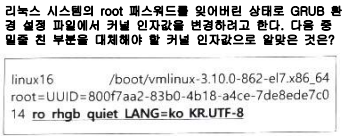

# <1과목 : 리눅스 실무의 이해>

- 📍리눅스 커널은 `리누스 토발즈`가 만들었는데, 이것은 `앤드루 S. 타넨바움`이 개발한 교육용 유닉스인 `미닉스`를 참고해서 만들었다.

---

- 📍특정 프로세스의 표준 출력을 다른 프로세스의 표준 입력으로 쓰이게 하는 대표적인 프로세스 간 통신 기술은 `파이프`이다.

---

- 📍`Apache License`가 부여된 소프트웨어는 누구든 자유롭게 부분 혹은 전체를 개인적 또는 상업적 목적으로 이용할 수 있다. 또한 재배포 시에도 소스 코드 또는 수정한 소스 코드를 포함하여 반드시 공개할 필요가 없다. 대표적인 프로그램에는 Hadoop, Tomcat 등이 있다.
    - dpkg는 Debian Package의 줄임말.

- 📍`Debian`은 패키지 설치 및 업데이트 할 때, dpkg 또는 apt-get명령을 사용하고, 칼리 리눅스도 이 리눅스 배포판을 기반으로 만들었다.

---

- 📍`고가용성 클러스터`는 다수의 웹 서버를 운영중으로 웹 서버 앞단에 로드 밸런서를 이용하여 부하분산 역할을 수행하도록 구성하였다. 로드 밸런서 역할을 수행하는 시스템의 오류에 대비하려고 한다.

    - 로드 밸런서(Load Balancere)
        - 여러 대의 웹 서버(또는 애플리케이션 서버)들 사이에 **들어오는 네트워크 트래픽(예: 사용자의 요청)**을 적절히 분산시키는 장치 또는 소프트웨어
            - 이 역할을 통해 특정 서버 하나에 트래픽이 집중되어 과부하가 걸리는 상황을 방지하고, 전체 서비스의 안정성, 속도, 가용성을 높일 수 있음
    
    <h4>고가용성 클러스터에 대한 다른 관점의 설명</h4>

    - 하드웨어나 소프트웨어의 일부에 장애가 발생해도 서비스가 중단되지 않도록 여러 시스템을 클러스터로 묶어 구성한 환경
        - 목적: 서비스의 무중단 운영 또는 다운타임 최소화
        - 방법: 다수의 서버가 서로를 감시(heartbeat)하고, 장애 시 자동으로 역할을 넘기는 페일오버(Failover) 기능 포함
        - 웹 서비스 환경에서는 일반적으로 로드 밸런서 + 다중 웹 서버 구성에서 이 개념이 사용

    <h4>기타 클러스터 개념</h4>

    - <h4>고계산용 클러스터 (High Performance Computing Cluster)</h4>
    
        → 병렬 연산을 통해 대규모 과학, 공학, 시뮬레이션 작업을 빠르게 처리하는 컴퓨터 시스템

    - <h4>베어울프 클러스터 (Beowulf Cluster)</h4>

        → 저비용 일반 PC들을 리눅스와 오픈소스 소프트웨어로 연결해 고성능 병렬 처리를 구현한 클러스터

    - <h4>HPC 클러스터 (High Performance Computing Cluster)</h4>

        → 고계산용 클러스터와 동일한 의미로, 연산 성능 극대화를 위한 병렬 컴퓨팅 환경을 뜻

---

- 📍10GB 용량의 하드디스크 6개가 장착된 시스템에 스페어 디스크로 하나 사용하고, RAID-5로 구성하려고 한다면, `실제 디스크 용량은 40GB`이다.

    - ### (RAID-5 구성에서 실제 디스크 용량이 40GB인 이유)

        - RAID란?
            - Redundant Array of Independent Disks의 약자로, 여러 개의 하드 디스크(또는 SSD)를 하나처럼 묶어서 데이터 저장의 안정성과 성능을 높이기 위한 기술

        - #### 1. 기본 구 성 조건
            - 디스크 개수: 6개
            - 각 디스크 용량: 10GB
            - 그 중 1개는 **스페어 디스크**로 사용 → RAID에는 **사용되지 않음**
                
                - 스페어 디스크란?
                    
                    RAID 어레이(RAID 구성 디스크 집합)에는 포함되지 않지만, 디스크에 장애가 발생했을 때 자동으로 교체용으로 사용되는 디스크

            - 나머지 5개 디스크로 RAID-5 구성

        - #### 2. RAID-5의 저장 방식
            - RAID-5는 **N개의 디스크 중 1개 분량을 패리티(Parity) 저장 용도로 사용**
                - 디스크 하나가 고장 나도 그 데이터를 다시 계산해서 복구할 수 있도록 도와주는 ‘안전망 역할'
                - 패리티 = ‘검증 정보’
                - RAID-5와 같은 구성에서, 데이터를 각 디스크에 나누어 저장하면서 추가적으로 한 디스크 분량만큼의 검증값(패리티)을 함께 저장
                    - ⭐“검증값을 저장한다”는 말은,원본 데이터를 모두 저장하지 않고, 그 **데이터가 무엇이었는지를 유추할 수 있는 수학적 계산 결과(=검증값)** 만 따로 저장한다는 뜻입니다.

            쉽게 말해,

            데이터 전체를 다시 만들 수 있는 “힌트”만 저장한다는 뜻이에요.
                - 나머지 **(N - 1)개의 디스크만 데이터 저장에 사용**

            따라서:

            - RAID에 사용되는 디스크 수: 5개
            - RAID-5에서 사용 가능한 데이터 공간: **5 - 1 = 4개 디스크 분량**
            - 각 디스크가 10GB이므로:  
            → **10GB × 4 = 40GB** 사용 가능

        - #### 3. 결과
            - 총 디스크 용량: 10GB × 6개 = 60GB
            - 사용 가능한 용량: 40GB
            - 나머지:
            - 10GB는 패리티 저장용
            - 10GB는 스페어 디스크로 대기 중

        - #### 4. 요약
            | 항목            | 수치  |
            |----------------|--------|
            | 총 디스크 개수 | 6개    |
            | 스페어 디스크  | 1개    |
            | RAID-5 구성 디스크 | 5개 |
            | 사용 가능 용량 | 40GB   |
            | 패리티 용량    | 10GB   |

---

- 📍
    
    
     
     ① rw single ② rw rescue ③ rw systemd=/bin/sh ❹ rw init-/bin/sh

    - 📖 문제 분석

        - 이 문제는 root 비밀번호를 잊어버린 경우 비밀번호를 재설정하기 위해, GRUB에서 부팅 시 직접 커널 파라미터를 조작해 root 쉘에 진입하려는 상황.

            - *GRUB은 리눅스 시스템에서 부팅할 때 사용되는 **부트로더(Boot Loader)**. (GRand Unified Bootloader)

        - 🔑 왜 GRUB에서 커널 인자 변경으로 해결하는가?
            
            - 📌 문제 상황:
            
                - root 비밀번호를 잊었음 → 로그인 불가
                - root 권한이 없으면 /etc/shadow 등의 중요한 설정을 수정할 수 없음
                - 운영체제를 정상 부팅하면 로그인 단계에서 막히기 때문에 우회가 필요

                    - ### 🔥 왜 GRUB에서 root 계정까지 조작할 수 있을까?
                        - #### GRUB은 운영체제보다 먼저 실행.
                        - BIOS/UEFI → GRUB → 커널 → systemd 순으로 부팅
                        - 즉, 운영체제가 올라오기 전에 GRUB에서 커널에게 “어떻게 부팅할지” 지시 가능
                        
                         

                        - 2. GRUB에서 커널 인자를 통해 쉘로 직접 진입 가능
                            - GRUB 메뉴에서 linux 줄을 수정해  `rw init=/bin/sh` 입력
                            - 그러면 운영체제가 정상 부팅되는 대신, 커널이 직접 /bin/sh를 실행
                            - 이때는 로그인 없이 바로 root 권한의 쉘에 들어가게 됨

    - 🎯 해결 방법
        - root 비밀번호를 초기화하기 위해서는

            - 루트 파일 시스템을 읽기-쓰기 모드로 마운트해야 하므로 ro를 rw로 바꿔야 하고,
            - 초기화 프로그램을 쉘로 지정해야 하므로 init=/bin/sh 또는 systemd.unit=rescue.target 등을 추가해야 함

                - rw: 루트 파일 시스템을 읽기/쓰기(read-write)로 마운트
                - init=/bin/sh: 부팅 후 가장 먼저 실행할 init 프로세스를 /bin/sh로 지정 → 즉, bash 쉘 하나만 띄워주는 모드로, 비밀번호 재설정에 유리함
    
    - ❌ 오답 분석

        | 선택지                    | 내용                                 | 왜 틀렸는가 또는 정답 이유                                     |
        |---------------------------|--------------------------------------|--------------------------------------------------------------|
        | ① `rw single`             | 단일 사용자 모드 (single user mode)   | CentOS 7 이상에서는 이 상태에서도 root 패스워드를 요구함       |
        | ② `rw rescue`             | 구조 모드 진입                        | rescue 모드 역시 root 비밀번호를 요구함                        |
        | ③ `rw systemd=/bin/sh`    | `systemd`를 `/bin/sh`로 대체          | 문법이 틀렸음. `systemd.unit=/bin/sh` 형식이어야 하며, 효과적이지 않음 |
        | ④ `rw init=/bin/sh`       | 쉘로 직접 진입 (init 프로세스를 쉘로 지정) | ✅ **정답**: 비밀번호 없이 root 쉘에 직접 접근 가능함             |

        - init=/bin/sh는
            - **리눅스 커널이 시스템을 부팅할 때, 평소처럼 systemd나 init 프로세스를 타지 않고 곧바로 /bin/sh를 실행하도록 지시하는 명령어.**
            - /bin/sh는 리눅스 시스템에 기본적으로 존재하는 "쉘(Shell)"을 실행하는 파일

---

- 📍  다음 중 ssh 데몬이 리눅스 부팅 시에 실행되도록 설정하는
명령으로 알맞은 것은?

    - ❶ systemctl enable sshd ② systemctl status sshd   ③ systemctl active sshd ④ systemctl start sshd

        | 번호 | 명령어                     | 의미                                                    | 정오                      |
        | -- | ----------------------- | ----------------------------------------------------- | ----------------------- |
        | ①  | `systemctl enable sshd` | **sshd 서비스를 부팅 시 자동 실행되도록 설정 (Enable at boot)**       | ✅ **정답**                |
        | ②  | `systemctl status sshd` | 현재 sshd 서비스의 상태(status)를 확인                   | ❌ 자동 실행 설정과는 무관         |
        | ③  | `systemctl active sshd` | 존재하지 않는 명령어 `active` → 올바른 systemctl 명령 아님            | ❌ **잘못된 명령어**           |
        | ④  | `systemctl start sshd`  | sshd 서비스를 즉시 시작(start)하지만, **부팅 시 자동 실행은 아님** | ❌ 일시적 실행일 뿐, enable은 아님 |

        - ssh 데몬이란, 리눅스 시스템에서 원격 접속을 가능하게 해주는 백그라운드 서비스

---

- 📍   다음 중 원격지 X 서버에 응용 프로그램을 전송하기 위해, X 클라이언트에서 진행해야 하는 과정으로 알맞은 것은?

   - ① xauth 명령으로 서버 주소를 등록한다.    ② xhpst 명령으로 서버 주소를 등록한다.
   
   - ❸ 환경변수인 DISPLAY의 값을 서버 주소로 변경한다.    ④ 환경변수인 TERM의 값을 서버 주소로 변경한다

        | 번호 | 명령                | 설명                                            | 정오       |
        | -- | ----------------- | --------------------------------------------- | -------- |
        | ①  | `xauth`           | X 서버 인증을 관리하는 명령이지만, **서버 주소 설정은 아님**         | ❌        |
        | ②  | `xhpst`           | ❌ 존재하지 않는 명령어. 오타 또는 허구의 명령                   | ❌        |
        | ③  | `DISPLAY` 환경변수 설정 | **X 서버의 주소와 화면 번호를 지정하는 핵심 환경변수**             | ✅ **정답** |
        | ④  | `TERM` 환경변수 설정    | 터미널 종류를 지정 (`xterm`, `vt100` 등), **X 서버와 무관** | ❌        |

        - 📖 문제 분석

            - ✅ 용어 : X Window 시스템이란?
                
                - 리눅스/유닉스 계열에서 GUI 환경을 사용하는 시스템은 보통 **X Window System (X11)** 이라는 구조를 따름름
                - 이 구조는 **"입출력 방향이 일반적인 서버-클라이언트 구조와 반대"** 라는 특징
            
            - ✅ "원격지 X 서버에 응용 프로그램을 전송한다"는 뜻
                
                - 원격 리눅스 서버에서 GUI 프로그램(ex. xclock, gedit, firefox)을 실행하고, 그 프로그램의 창을 내 컴퓨터 화면(=X 서버)에 출력하는 것을 의미
                - 응용 프로그램은 서버에서 실행

                    - 화면은 내 컴퓨터에 표시

                - 🎯 이것이 바로 "X 클라이언트 → X 서버로 전송"의 의미

            - 개념

                | 용어                           | 의미                                             |
                | ---------------------------- | ---------------------------------------------- |
                | **X Window System (X11)**    | 리눅스 GUI를 위한 전체 시스템 (X Server + X Client 포함)    |
                | **X Server**                 | 키보드/마우스 입력 받고, **화면에 출력하는 주체 (내 컴퓨터)**         |
                | **X Client**                 | GUI 프로그램 (gedit, firefox 등), X Server에게 출력 요청함 |
                | **DISPLAY 변수**               | "이 프로그램을 어디 X Server에 띄울까?"를 지정하는 주소           |
                | **xclock, gedit, wireshark** | X Client 역할을 하는 프로그램들                          |

                

- 📍

- 📍

- 📍