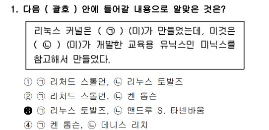
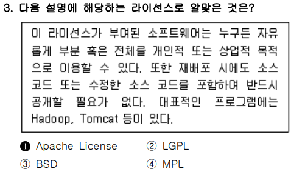
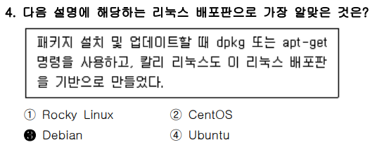
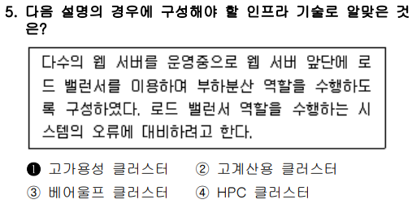
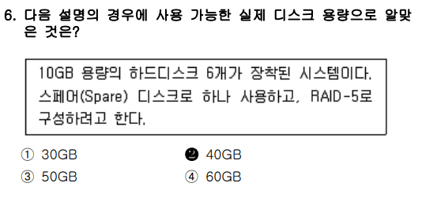
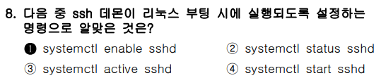
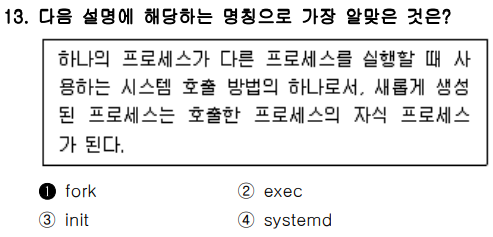

# <1과목 : 리눅스 실무의 이해>

# 📍


리눅스 커널은 `리누스 토발즈`가 만들었는데, 이것은 `앤드루 S. 타넨바움`이 개발한 교육용 유닉스인 `미닉스`를 참고해서 만들었다.

---

<br>
<br>
<br>

# 📍


특정 프로세스의 표준 출력을 다른 프로세스의 표준 입력으로 쓰이게 하는 대표적인 프로세스 간 통신 기술은 `파이프`이다.

---

<br>
<br>
<br>


# 📍


`Apache License`가 부여된 소프트웨어는 누구든 자유롭게 부분 혹은 전체를 개인적 또는 상업적 목적으로 이용할 수 있다. 또한 재배포 시에도 소스 코드 또는 수정한 소스 코드를 포함하여 반드시 공개할 필요가 없다. 대표적인 프로그램에는 Hadoop, Tomcat 등이 있다.
    - dpkg는 Debian Package의 줄임말.

<br>
<br>
<br>


# 📍


`Debian`은 패키지 설치 및 업데이트 할 때, dpkg 또는 apt-get명령을 사용하고, 칼리 리눅스도 이 리눅스 배포판을 기반으로 만들었다.

---

<br>
<br>
<br>


# 📍



`고가용성 클러스터`는 다수의 웹 서버를 운영중으로 웹 서버 앞단에 로드 밸런서를 이용하여 부하분산 역할을 수행하도록 구성하였다. 로드 밸런서 역할을 수행하는 시스템의 오류에 대비하려고 한다.

- 로드 밸런서(Load Balancere)
    - 여러 대의 웹 서버(또는 애플리케이션 서버)들 사이에 **들어오는 네트워크 트래픽(예: 사용자의 요청)**을 적절히 분산시키는 장치 또는 소프트웨어
        - 이 역할을 통해 특정 서버 하나에 트래픽이 집중되어 과부하가 걸리는 상황을 방지하고, 전체 서비스의 안정성, 속도, 가용성을 높일 수 있음

<h4>고가용성 클러스터에 대한 다른 관점의 설명</h4>

- 하드웨어나 소프트웨어의 일부에 장애가 발생해도 서비스가 중단되지 않도록 여러 시스템을 클러스터로 묶어 구성한 환경
    - 목적: 서비스의 무중단 운영 또는 다운타임 최소화
    - 방법: 다수의 서버가 서로를 감시(heartbeat)하고, 장애 시 자동으로 역할을 넘기는 페일오버(Failover) 기능 포함
    - 웹 서비스 환경에서는 일반적으로 로드 밸런서 + 다중 웹 서버 구성에서 이 개념이 사용

<h4>기타 클러스터 개념</h4>

- <h4>고계산용 클러스터 (High Performance Computing Cluster)</h4>

    → 병렬 연산을 통해 대규모 과학, 공학, 시뮬레이션 작업을 빠르게 처리하는 컴퓨터 시스템

- <h4>베어울프 클러스터 (Beowulf Cluster)</h4>

    → 저비용 일반 PC들을 리눅스와 오픈소스 소프트웨어로 연결해 고성능 병렬 처리를 구현한 클러스터

- <h4>HPC 클러스터 (High Performance Computing Cluster)</h4>

    → 고계산용 클러스터와 동일한 의미로, 연산 성능 극대화를 위한 병렬 컴퓨팅 환경을 뜻

---

<br>
<br>
<br>


# 📍



10GB 용량의 하드디스크 6개가 장착된 시스템에 스페어 디스크로 하나 사용하고, RAID-5로 구성하려고 한다면, `실제 디스크 용량은 40GB`이다.

- ### (RAID-5 구성에서 실제 디스크 용량이 40GB인 이유)

    - RAID란?
        - Redundant Array of Independent Disks의 약자로, 여러 개의 하드 디스크(또는 SSD)를 하나처럼 묶어서 데이터 저장의 안정성과 성능을 높이기 위한 기술

    - #### 1. 기본 구 성 조건
        - 디스크 개수: 6개
        - 각 디스크 용량: 10GB
        - 그 중 1개는 **스페어 디스크**로 사용 → RAID에는 **사용되지 않음**
            
            - 스페어 디스크란?
                
                RAID 어레이(RAID 구성 디스크 집합)에는 포함되지 않지만, 디스크에 장애가 발생했을 때 자동으로 교체용으로 사용되는 디스크

        - 나머지 5개 디스크로 RAID-5 구성

    - #### 2. RAID-5의 저장 방식
        - RAID-5는 **N개의 디스크 중 1개 분량을 패리티(Parity) 저장 용도로 사용**
            - 디스크 하나가 고장 나도 그 데이터를 다시 계산해서 복구할 수 있도록 도와주는 ‘안전망 역할'
            - 패리티 = ‘검증 정보’
            - RAID-5와 같은 구성에서, 데이터를 각 디스크에 나누어 저장하면서 추가적으로 한 디스크 분량만큼의 검증값(패리티)을 함께 저장
                - ⭐“검증값을 저장한다”는 말은,원본 데이터를 모두 저장하지 않고, 그 **데이터가 무엇이었는지를 유추할 수 있는 수학적 계산 결과(=검증값)** 만 따로 저장한다는 뜻입니다.

        쉽게 말해,

        데이터 전체를 다시 만들 수 있는 “힌트”만 저장한다는 뜻이에요.
            - 나머지 **(N - 1)개의 디스크만 데이터 저장에 사용**

        따라서:

        - RAID에 사용되는 디스크 수: 5개
        - RAID-5에서 사용 가능한 데이터 공간: **5 - 1 = 4개 디스크 분량**
        - 각 디스크가 10GB이므로:  
        → **10GB × 4 = 40GB** 사용 가능

    - #### 3. 결과
        - 총 디스크 용량: 10GB × 6개 = 60GB
        - 사용 가능한 용량: 40GB
        - 나머지:
        - 10GB는 패리티 저장용
        - 10GB는 스페어 디스크로 대기 중

    - #### 4. 요약
        | 항목            | 수치  |
        |----------------|--------|
        | 총 디스크 개수 | 6개    |
        | 스페어 디스크  | 1개    |
        | RAID-5 구성 디스크 | 5개 |
        | 사용 가능 용량 | 40GB   |
        | 패리티 용량    | 10GB   |

---

<br>
<br>
<br>


# 📍

    

    
- ### 📖 문제 분석

    - 이 문제는 root 비밀번호를 잊어버린 경우 비밀번호를 재설정하기 위해, GRUB에서 부팅 시 직접 커널 파라미터를 조작해 root 쉘에 진입하려는 상황.

        - *GRUB은 리눅스 시스템에서 부팅할 때 사용되는 **부트로더(Boot Loader)**. (GRand Unified Bootloader)

    - 🔑 왜 GRUB에서 커널 인자 변경으로 해결하는가?
        
        - 📌 문제 상황:
        
            - root 비밀번호를 잊었음 → 로그인 불가
            - root 권한이 없으면 /etc/shadow 등의 중요한 설정을 수정할 수 없음
            - 운영체제를 정상 부팅하면 로그인 단계에서 막히기 때문에 우회가 필요

                - ### 🔥 왜 GRUB에서 root 계정까지 조작할 수 있을까?
                    - #### GRUB은 운영체제보다 먼저 실행.
                    - BIOS/UEFI → GRUB → 커널 → systemd 순으로 부팅
                    - 즉, 운영체제가 올라오기 전에 GRUB에서 커널에게 “어떻게 부팅할지” 지시 가능
                    
                    <br>

                    - 2. GRUB에서 커널 인자를 통해 쉘로 직접 진입 가능
                        - GRUB 메뉴에서 linux 줄을 수정해  `rw init=/bin/sh` 입력
                        - 그러면 운영체제가 정상 부팅되는 대신, 커널이 직접 /bin/sh를 실행
                        - 이때는 로그인 없이 바로 root 권한의 쉘에 들어가게 됨


- 🎯 해결 방법
    - root 비밀번호를 초기화하기 위해서는

        - 루트 파일 시스템을 읽기-쓰기 모드로 마운트해야 하므로 ro를 rw로 바꿔야 하고,
        - 초기화 프로그램을 쉘로 지정해야 하므로 init=/bin/sh 또는 systemd.unit=rescue.target 등을 추가해야 함

            - rw: 루트 파일 시스템을 읽기/쓰기(read-write)로 마운트
            - init=/bin/sh: 부팅 후 가장 먼저 실행할 init 프로세스를 /bin/sh로 지정 → 즉, bash 쉘 하나만 띄워주는 모드로, 비밀번호 재설정에 유리함

- ❌ 오답 분석

    | 선택지                    | 내용                                 | 왜 틀렸는가 또는 정답 이유                                     |
    |---------------------------|--------------------------------------|--------------------------------------------------------------|
    | ① `rw single`             | 단일 사용자 모드 (single user mode)   | CentOS 7 이상에서는 이 상태에서도 root 패스워드를 요구함       |
    | ② `rw rescue`             | 구조 모드 진입                        | rescue 모드 역시 root 비밀번호를 요구함                        |
    | ③ `rw systemd=/bin/sh`    | `systemd`를 `/bin/sh`로 대체          | 문법이 틀렸음. `systemd.unit=/bin/sh` 형식이어야 하며, 효과적이지 않음 |
    | ④ `rw init=/bin/sh`       | 쉘로 직접 진입 (init 프로세스를 쉘로 지정) | ✅ **정답**: 비밀번호 없이 root 쉘에 직접 접근 가능함             |

    - init=/bin/sh는
        - **리눅스 커널이 시스템을 부팅할 때, 평소처럼 systemd나 init 프로세스를 타지 않고 곧바로 /bin/sh를 실행하도록 지시하는 명령어.**
        - /bin/sh는 리눅스 시스템에 기본적으로 존재하는 "쉘(Shell)"을 실행하는 파일

---

<br>
<br>
<br>


# 📍



    | 번호 | 명령어                     | 의미                                                    | 정오                      |
    | -- | ----------------------- | ----------------------------------------------------- | ----------------------- |
    | ①  | `systemctl enable sshd` | **sshd 서비스를 부팅 시 자동 실행되도록 설정 (Enable at boot)**       | ✅ **정답**                |
    | ②  | `systemctl status sshd` | 현재 sshd 서비스의 상태(status)를 확인                   | ❌ 자동 실행 설정과는 무관         |
    | ③  | `systemctl active sshd` | 존재하지 않는 명령어 `active` → 올바른 systemctl 명령 아님            | ❌ **잘못된 명령어**           |
    | ④  | `systemctl start sshd`  | sshd 서비스를 즉시 시작(start)하지만, **부팅 시 자동 실행은 아님** | ❌ 일시적 실행일 뿐, enable은 아님 |

    - ssh 데몬이란, 리눅스 시스템에서 원격 접속을 가능하게 해주는 백그라운드 서비스

---

<br>
<br>
<br>


# 📍


| 번호 | 명령                | 설명                                            | 정오       |
| -- | ----------------- | --------------------------------------------- | -------- |
| ①  | `xauth`           | X 서버 인증을 관리하는 명령이지만, **서버 주소 설정은 아님**         | ❌        |
| ②  | `xhpst`           | ❌ 존재하지 않는 명령어. 오타 또는 허구의 명령                   | ❌        |
| ③  | `DISPLAY` 환경변수 설정 | **X 서버의 주소와 화면 번호를 지정하는 핵심 환경변수**             | ✅ **정답** |
| ④  | `TERM` 환경변수 설정    | 터미널 종류를 지정 (`xterm`, `vt100` 등), **X 서버와 무관** | ❌        |

- 📖 문제 분석

    - ✅ 용어 : X Window 시스템이란?
        
        - 리눅스/유닉스 계열에서 GUI 환경을 사용하는 시스템은 보통 **X Window System (X11)** 이라는 구조를 따름름
        - 이 구조는 **"입출력 방향이 일반적인 서버-클라이언트 구조와 반대"** 라는 특징
    
    - ✅ "원격지 X 서버에 응용 프로그램을 전송한다"는 뜻
        
        - 원격 리눅스 서버에서 GUI 프로그램(ex. xclock, gedit, firefox)을 실행하고, 그 프로그램의 창을 내 컴퓨터 화면(=X 서버)에 출력하는 것을 의미
        - 응용 프로그램은 서버에서 실행

            - 화면은 내 컴퓨터에 표시

        - 🎯 이것이 바로 "X 클라이언트 → X 서버로 전송"의 의미

    - 개념

        | 용어                           | 의미                                             |
        | ---------------------------- | ---------------------------------------------- |
        | **X Window System (X11)**    | 리눅스 GUI를 위한 전체 시스템 (X Server + X Client 포함)    |
        | **X Server**                 | 키보드/마우스 입력 받고, **화면에 출력하는 주체 (내 컴퓨터)**         |
        | **X Client**                 | GUI 프로그램 (gedit, firefox 등), X Server에게 출력 요청함 |
        | **DISPLAY 변수**               | "이 프로그램을 어디 X Server에 띄울까?"를 지정하는 주소           |
        | **xclock, gedit, wireshark** | X Client 역할을 하는 프로그램들                          |

---

<br>
<br>
<br>


# 📍               


### ✅ 문제 분석 및 개념 정리

---

#### 🔷 **문제 핵심 요점**

"**원격지 X 서버에 응용 프로그램을 전송하기 위해 X 클라이언트에서 진행해야 하는 과정**"을 묻는 문제.

이 문제의 핵심 키워드:

* **X 서버 (X Server)**:
    - 그래픽 **출력**을 담당하는 서버.
    - 사용자 **디스플레이가 있는 컴퓨터**.
* **X 클라이언트 (X Client)**:
    - 실행되는 응용 프로그램.
    - **출력을 원격 디스플레이로 보내고 싶어하는 쪽**.

---

### 📌 기본 개념 정리

#### 1. **X Window System의 구조**

| 구성요소           | 역할                                              |
| -------------- | ----------------------------------------------- |
| **X Server**   | 키보드/마우스 입력을 받고 화면에 그래픽을 출력. 즉, **사용자의 PC**      |
| **X Client**   | 원격에서 실행되는 응용 프로그램. gedit, xclock, etc.          |
| **DISPLAY 변수** | X Client가 **출력을 보낼 X Server를 지정**할 때 사용하는 환경 변수 |

> 💡 **X Server는 사용자 디바이스에 존재하고, X Client는 원격 서버에서 실행됩니다.**

예: SSH로 접속한 리눅스 서버에서 `xclock`을 실행하면, \*\*사용자 PC(=X Server)\*\*의 화면에 시계가 뜸.

---

### 🔍 보기별 상세 분석

#### ✅ ③ 환경변수인 `DISPLAY`의 값을 서버 주소로 변경한다. → **정답**

* **설명**: X Client가 어느 X Server로 화면 출력을 보낼지를 지정하는 핵심 변수.
* 예시:

  ```bash
  export DISPLAY=192.168.0.10:0.0
  ```
    | 항목            | 의미                                         |
    | -------------- | -------------------------------------------- |
    | `192.168.0.10` | **X Server**, 즉 GUI 화면을 출력할 PC의 IP 주소 |
    | `:0`           | 첫 번째 디스플레이 세션                         |
    | `.0`           | 첫 번째 스크린 (대부분 0만 사용함)               |


  → 원격지 응용프로그램이 **192.168.0.10의 화면(:0.0)에 출력됨**
* **출제 의도**: X Client가 X Server에 출력하기 위한 필수 환경 설정을 물어봄.

    - DISPLAY는 리눅스나 유닉스 계열 시스템에서 사용하는 X 윈도우 시스템의 핵심 환경 변수
    - **"그래픽 화면을 어디에 출력할지"** 를 X 클라이언트 프로그램에게 알려주는 역할

---

#### ❌ ① `xauth` 명령으로 서버 주소를 등록한다.

* `xauth`는 \*\*X 인증 정보(cookie)\*\*를 관리하는 명령어.
* 보안상 인증된 X Server만 연결할 수 있도록 도와줌.
* 하지만 `xauth`는 **DISPLAY 환경 설정을 대신할 수 없고**, 부가적인 설정일 뿐.
* **오답 이유**: DISPLAY 설정이 없이 `xauth`만으로는 출력이 되지 않음.

---

#### ❌ ② `xhpst` 명령으로 서버 주소를 등록한다.

* **존재하지 않는 명령어입니다.**
* `xhost`와 오타로 보이며, `xhost`는 다음을 의미할 수 있음:

  ```bash
  xhost + 192.168.0.20
  ```

  → X Server에서 **특정 클라이언트 IP에 접근 권한을 허용**.
* 즉, `xhost`는 **서버 측에서 수행하는 보안 설정**일 뿐,
  **클라이언트에서 X Server 주소를 지정하지는 않음.**
* **오답 이유**: 명령어 자체가 틀렸거나, 오해의 소지가 있음.

---

#### ❌ ④ `TERM` 환경변수의 값을 서버 주소로 변경한다.

* `TERM`은 터미널 타입(bash, xterm, vt100 등)을 나타내는 환경 변수.
* 이는 **텍스트 기반 터미널 출력**에만 영향이 있고, **X 윈도우 GUI 출력과는 무관**.
* **오답 이유**: X 윈도우와 무관한 변수 설정임.

    - `TERM`은 리눅스/유닉스 환경에서 사용되는 **터미널 종류(터미널 에뮬레이터의 타입)** 를 지정하는 **환경 변수(Environment Variable)**.
    - 텍스트 기반 프로그램이 어떤 방식으로 글자와 색을 출력해야 할지를 결정하는 데 사용
---

### 🧠 출제 의도 해석

이 문제는 단순 지식보다도 **X Server와 Client의 관계, DISPLAY 설정이 왜 필요한지**를 이해하고 있는지를 묻는 문제.

즉, GUI 환경에서 원격지 응용 프로그램이 **어디에 출력되는가**에 대한 **기본 구조 이해**를 테스트.

* DISPLAY 설정은 **X Client가 X Server에게 ‘여기로 출력해라’라고 알려주는 것**
* 실제 환경에서도 원격지에 `gedit`, `xclock` 등을 실행할 때 반드시 설정해야 함

---

### 🧾 정리

| 보기                | 설명                             | 맞/틀 |
| ----------------- | ------------------------------ | --- |
| ① xauth 명령        | 인증 설정 도구이나 DISPLAY 설정은 아님      | ❌   |
| ② xhpst 명령        | 존재하지 않음 (오타 or 잘못된 지문)         | ❌   |
| ③ DISPLAY 환경변수 설정 | X Client가 X Server를 지정하는 핵심 설정 | ✅   |
| ④ TERM 환경변수 설정    | 터미널 타입 설정, GUI와 무관             | ❌   |

---

### ✅ 결론 한 줄 요약

**X Client가 원격지 X Server에 GUI 출력을 보내려면 반드시 `DISPLAY` 환경변수를 통해 서버 주소를 지정해야 한다.**

### ✅ 핵심 요지
- X Client는 그래픽 프로그램을 실행하는 쪽
- X Server는 그래픽을 실제로 **출력해주는 쪽(=모니터, 마우스, 키보드가 있는 PC)**

---

<br>
<br>
<br>


# 📍               


이 문제는 리눅스 실기 환경 또는 GUI 설정 이해를 묻는 **시각형 식별 문제** ,

"**로그인 화면을 담당하는 프로그램이 무엇인지 정확히 알고 있는가?**"를 확인하는 것이 출제 의도.

---

## ✅ 문제 해석

> **그림**은 사용자 계정 목록을 보여주는 GUI 로그인 화면

> → 이는 \*\*리눅스 GUI 환경에서 로그인 세션을 시작하기 위해 사용하는 ‘디스플레이 매니저(Display Manager)’\*\*의 화면입니다.

---

## ✅ 보기별 해설

| 번호        | 보기                        | 의미                           | 정답 여부 | 이유                                |
| --------- | ------------------------- | ---------------------------- | ----- | --------------------------------- |
| ① **GDM** | **GNOME Display Manager** | 로그인 화면(디스플레이 매니저)을 담당하는 프로그램 | ✅ 정답  | 그림에 보이는 GUI 로그인 화면은 GDM이 출력한 화면   |
| ② KDE     | **K Desktop Environment** | 전체 데스크탑 환경 이름 (GNOME과 같은 계열) | ❌ 오답  | 로그인 화면 자체를 담당하는 프로그램은 아님          |
| ③ GNOME   | **데스크탑 환경 전체(GUI 환경)**    | 창, 패널, 설정 등 포함하는 사용자 환경      | ❌ 오답  | 로그인 전 단계에서 GNOME은 아직 실행되지 않음      |
| ④ Mutter  | **GNOME의 윈도우 매니저**        | 창 배치 및 효과 등 렌더링 담당           | ❌ 오답  | 로그인 화면이 아니라, 로그인 **후**에 동작하는 구성요소 |

---

## 🧠 출제 의도 분석

이 문제는 **단순 용어 암기인지**, 또는
\*\*리눅스 GUI의 구조(GDM → GNOME → Mutter 순서)\*\*를 제대로 이해하고 있는지를 확인하려는 문제입니다.

> ⛳ 출제자는 수험자가 **GDM(로그인) ↔ GNOME(환경) ↔ Mutter(창 매니저)** 역할을 명확히 구분할 수 있는지를 보고 싶었던 것.

---

## 📌 GDM이 하는 일 요약

| 역할        | 설명                                    |
| --------- | ------------------------------------- |
| 로그인 화면 출력 | 사용자 목록, 비밀번호 입력 UI                    |
| 세션 선택     | GNOME, KDE, XFCE 등 어떤 데스크탑 환경으로 로그인할지 |
| 로그인 처리    | PAM을 통한 사용자 인증 후, 세션 실행               |

---

## ✅ 정답

> ✅ **1번 GDM**

---

### ✅ 결론 한 줄 요약

**이 문제는 리눅스 GUI 로그인 구조에서 GDM의 역할을 알고 있는지를 묻는 문제로, GDM은 로그인 화면을 출력하는 프로그램이므로 정답은 ①번입니다.**
KDE, GNOME, Mutter는 로그인 이후 동작하는 구성요소들로 오답입니다.

---

<br>
<br>
<br>


# 📍


이 문제는 **백틱(back quotes: `` ` ` ``)** 을 이용한 **명령어 치환(command substitution)** 의 동작 원리를 이해하고 있는지를 묻는 문제.

---

## ✅ 명령어 분석

```
echo "My Home is `pwd`"
```

* **`pwd`**: 현재 작업 디렉토리를 출력하는 명령어
* **`` `pwd` ``**: **백틱** (`back quote`)으로 감싸면 → `pwd` 명령의 **실행 결과가 문자열 안에 치환됨**
* 따라서 이 명령은 아래와 같이 동작:

```bash
echo "My Home is /home/ihd"
```

→ 실제 출력 결과는:

```
My Home is /home/ihd
```

---

## 🔍 보기별 분석

| 번호                         | 보기                         | 의미                          | 정답 여부          | 이유 |
| -------------------------- | -------------------------- | --------------------------- | -------------- | -- |
| ① `My Home is 'pwd'`       | 문자열 그대로 `'pwd'`로 출력됨       | ❌                           | 명령 치환이 아님      |    |
| ② `My Home is '/home/ihd'` | 따옴표 포함 결과 → 실제 echo 결과와 다름 | ❌                           | 출력 결과에는 따옴표 없음 |    |
| ③ `My Home is /home/ihd`   | ✅ 정답                       | 명령어 실행 결과 (`pwd`)가 치환되어 출력됨 |                |    |
| ④ `My Home is pwd`         | `pwd` 문자열 그대로 출력됨          | ❌                           | 실행 결과가 아님      |    |

---

## 🧠 출제 의도

* `echo`, `pwd`, `` `command` ``의 동작 원리를 함께 아는지 확인
* 특히 \*\*명령어 치환(backquote)\*\*이 실제 문자열 내부에서 **어떻게 동작하는지를 묻는 응용형 문제**

---

### ✅ 결론 한 줄 요약

**echo "My Home is `pwd`"는 pwd 명령의 실행 결과를 문자열 안에 치환하여 출력하므로, 정답은 ③번 "My Home is /home/ihd"입니다.**

---

## ✅ JavaScript의 `${}` (템플릿 리터럴)과 차이 

JavaScript의 `${}` (템플릿 리터럴)과, **핵심 개념은 비슷하지만 동작 원리는 다름.**

JavaScript의 `${}` 와 리눅스 쉘(Bash)에서의 `` `command` `` 또는 `$(command)`는

**"치환(Substitution)"이라는 측면에서 유사하지만, 구체적인 동작 방식은 서로 다름.**

---

### ✅ JavaScript의 `${}` (템플릿 리터럴)

```javascript
const data = "home";
console.log(`My Home is ${data}`);
```

* 템플릿 문자열 안에서 `${변수}`를 사용하여 변수 값을 삽입함
* **정적 문자열 안에 동적으로 값을 삽입하는 문법**
* 작동 시점: **자바스크립트 엔진이 문자열 생성 시 해석**

---

### ✅ 리눅스 쉘의 `` `command` `` 또는 `$(command)`

```bash
echo "My Home is `pwd`"
# 또는
echo "My Home is $(pwd)"
```

* **쉘 명령어의 실행 결과를 치환해서 문자열에 삽입**
* 예: `pwd` → `/home/user`가 되므로 전체 문자열은 `"My Home is /home/user"`
* 작동 시점: **쉘이 명령어를 파싱하고 실행할 때 해석**

---

<br>
<br>
<br>


# 📍


이 문제는 셸 명령에서 조건식(`test`)의 **종료 상태 코드(\$?)** 를 이해하고 있는지를 묻는 문제.

---

## ✅ 명령어 분석

```bash
# test 20 -gt 30
# echo $?
```

### 🔍 `test 20 -gt 30` 의 의미

* `test` 명령은 조건식을 평가하여 **참이면 0, 거짓이면 1** 을 반환합니다.
* `20 -gt 30`은 **20이 30보다 크냐?** → ❌ **거짓**


## ✅ 먼저 -gt는 무슨 뜻인가?
- -gt는 greater than의 약자입니다.
- 즉, **`a -gt b`는 “a가 b보다 크냐?”** 를 판단합니다.

    예:

    ```
    test 5 -gt 3    → 참 (exit code: 0)
    test 3 -gt 5    → 거짓 (exit code: 1)
    ```

## ✅ 그러면 test 20 -gt 30은?

```
test 20 -gt 30
```
→ 해석: “20이 30보다 큰가?”

→ 20 < 30 이므로 조건은 거짓
→ test 명령은 거짓이면 exit code 1을 반환

```
echo $?
```

결과: 1


---

## ✅ `$?` 의 의미

* `$?` 는 **가장 최근 실행된 명령어의 종료 상태(exit code)** 를 반환
* 셸에서:

  * `0` → **성공 (참)**
  * `1` → **실패 (거짓)**

---

## 🎯 따라서

```bash
test 20 -gt 30    # → 거짓이므로 종료 상태는 1
echo $?           # → 1 출력
```

---

## 보기 분석

| 번호    | 보기              | 의미   | 정답 여부 |
| ----- | --------------- | ---- | ----- |
| ① 0   | 조건이 참일 때 나오는 값  | ❌    |       |
| ② 1   | 조건이 거짓일 때 나오는 값 | ✅ 정답 |       |
| ③ 10  | 무관              | ❌    |       |
| ④ -10 | 무관              | ❌    |       |

---

### ✅ 결론 한 줄 요약

**`test 20 -gt 30`은 거짓이므로 종료 상태는 1이며, `echo $?`의 결과는 1이므로 정답은 ②번입니다.**


---

### 🔍 JavaScript와 Bash 비교

| 항목       | JavaScript                 | Bash (Shell)            |
| -------- | -------------------------- | ----------------------- |
| 문법       | `` `My home is ${data}` `` | `` `pwd` `` 또는 `$(pwd)` |
| 치환 대상    | **변수 또는 표현식**              | **명령어 실행 결과**           |
| 평가 시점    | 템플릿 문자열 해석 시               | 명령어 실행 시점               |
| 내부 작동 방식 | 자바스크립트 런타임에서 처리            | Bash 파서 + 명령어 실행 결과로 처리 |

---

### 💡 공통점과 차이

| 구분 | 공통점                                      | 차이점                                     |
| -- | ---------------------------------------- | --------------------------------------- |
| ✔  | 문자열 안에 동적 값 삽입 가능                        | JavaScript는 변수/표현식, Bash는 **명령어 실행 결과** |
| ✔  | 런타임 시점에 치환됨                              | JavaScript는 엔진 해석, Bash는 셸 명령어 실행 후 치환  |
| ❌  | Bash는 `${변수}`는 변수 참조이고 `${command}`는 불가능 | Bash의 `${}`와 `` ` ` ``은 완전히 다른 역할       |

---

#### ✅ 결론 한 줄 요약

**JavaScript의 `${}`와 Bash의 `` `command` `` 또는 `$(command)`는 모두 문자열 안에서 동적인 값을 치환하는 문법이라는 점에서 유사하지만,**

**JS는 변수/표현식을 치환하고, Bash는 명령어 실행 결과를 치환한다는 점에서 근본적으로 다름.**


---

<br>
<br>
<br>


# 📍


이 문제는 **리눅스 시스템에서 프로세스 생성 방식**을 이해하고 있는지를 묻는 대표적인 이론 문제.

---

## ✅ 문제 핵심 요약

> **"하나의 프로세스가 다른 프로세스를 실행할 때 사용하는 시스템 호출"**

> → **"자식 프로세스가 생성된다"**

> 이 설명은 명확하게 **`fork()` 시스템 호출**에 대한 설명.

---

## ✅ 보기별 해설

| 번호 | 보기       | 설명                                                     | 정답 여부          |
| -- | -------- | ------------------------------------------------------ | -------------- |
| ①  | **fork** | 부모 프로세스가 자신을 복제해 **자식 프로세스를 생성**함                      | ✅ 정답           |
| ②  | exec     | 기존 프로세스의 메모리 공간을 **다른 프로그램으로 덮어쓰는 시스템 호출**             | ❌ (fork 이후 사용) |
| ③  | init     | **PID 1번**: 부팅 후 최초로 실행되어 시스템 초기화 및 서비스 관리 수행          | ❌              |
| ④  | systemd  | 현대 리눅스 시스템의 대표적인 **init 시스템**으로, 서비스 단위(Unit) 관리 등을 수행 | ❌              |

---

## ✅ fork vs exec 차이

| 항목  | fork                 | exec                      |
| --- | -------------------- | ------------------------- |
| 역할  | **새로운 프로세스 생성**      | 기존 프로세스를 **다른 프로그램으로 교체** |
| 결과  | 부모 + 자식 프로세스 존재      | 자식 프로세스만 존재 (덮어쓰기됨)       |
| 메모리 | 부모와 거의 동일한 메모리 공간 생성 | 완전히 새로운 프로그램으로 메모리 교체     |

---

## 🧠 출제 의도

* **프로세스 생성 구조 (`fork` → `exec`)의 이해**
* 자식 프로세스 구조와 시스템 호출 흐름에 대한 기초 지식

---

### ✅ 결론 한 줄 요약

**프로세스가 새로운 자식 프로세스를 생성할 때 사용하는 시스템 호출은 `fork()`이므로 정답은 ①번 fork입니다.**


---

<br>
<br>
<br>


# 📍


---

<br>
<br>
<br>


# 📍


---

<br>
<br>
<br>


# 📍


---

<br>
<br>
<br>


