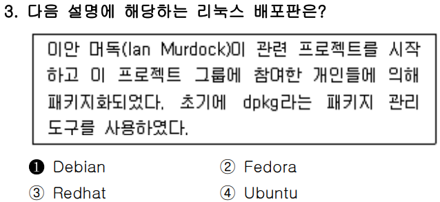
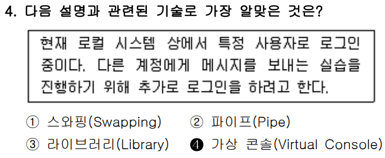
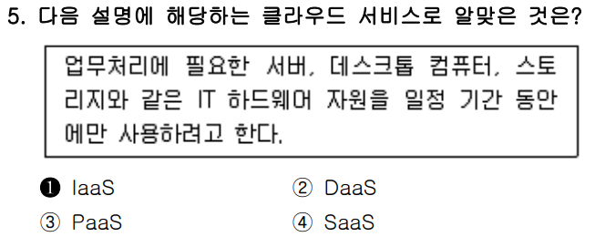
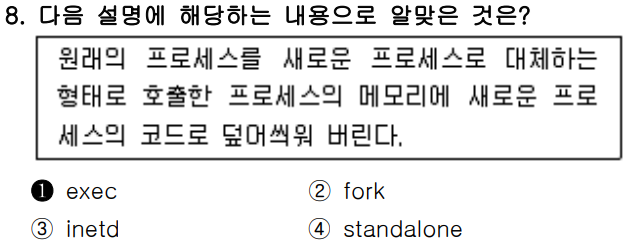
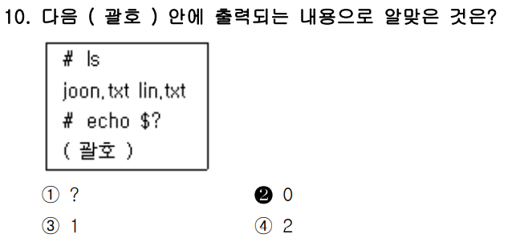
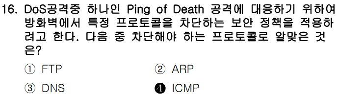
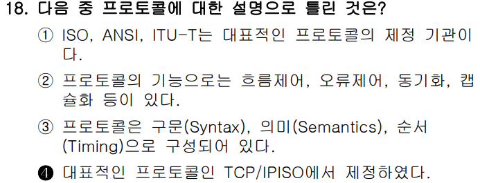

# 📍


문제는 "2차적 저작물의 소스 코드 공개 정책"과 관련된 주요 라이선스를 구분하는 문제로, 단순 암기가 아닌 **라이선스의 철학과 조건**을 정확히 이해해야 합니다.

---

### ✅ 문제 분석 및 개념 정리

---

#### 🔷 **문제 핵심 요점**

> **“다음 중 2차적 저작물(=파생 소프트웨어)의 소스 코드 공개 정책이 나머지와 다른 것은?”**

**핵심 키워드:**

* **2차적 저작물 (Derivative work)**: 오픈소스 소프트웨어를 기반으로 새롭게 만든 프로그램
* **소스 코드 공개 의무**: 새로 만든 프로그램의 소스 코드를 반드시 공개해야 하는지 여부
* **라이선스 간 정책 차이**: 강한 카피레프트(공개 의무 있음) vs 약한 카피레프트 또는 퍼미시브 라이선스(공개 의무 없음)

---

### 🧠 출제 의도 해석

이 문제는 단순히 "BSD는 가볍다"를 외우는 것이 아니라, **다양한 오픈소스 라이선스의 기본 원칙과 차이점**을 구조적으로 이해하고 있는지를 테스트합니다.

**특히 GPL과 BSD의 대조**가 핵심입니다.

---

### 📌 기본 개념 정리

#### 1. **주요 오픈소스 라이선스별 정책 비교**

| 라이선스     | 공개 의무                | 카피레프트 성격 | 사용 예시          | 특징                         |
| -------- | -------------------- | -------- | -------------- | -------------------------- |
| **GPL**  | 있음 ✅                 | 강함       | 리눅스 커널         | **2차적 저작물도 무조건 소스 공개해야 함** |
| **LGPL** | 있음 (단, 라이브러리 링크는 예외) | 중간       | glibc          | **링크만 하면 소스 공개 안 해도 됨**    |
| **MPL**  | 있음 ✅ (단, 수정한 파일만)    | 약함       | Firefox        | **파일 단위로만 소스 공개하면 됨**      |
| **BSD**  | 없음 ❌                 | 매우 약함    | FreeBSD, macOS | **상업적 사용 및 비공개 배포 가능**     |

---

### 🔍 보기별 상세 분석

#### ✅ ② BSD → **정답**

* **BSD 라이선스는 소스 코드 공개 의무가 없음**
* 파생 소프트웨어를 만들더라도 **소스 코드를 비공개로 둘 수 있음**
* 사용자가 **변경사항을 공개할 의무가 전혀 없음**
* 때문에 **상용 소프트웨어 개발에 매우 유리**하고 자유도가 높음

---

#### ❌ ① GPL

* **강력한 카피레프트 라이선스**
* 프로그램을 수정하거나 재배포하면 **반드시 그 소스 코드도 공개**해야 함
* 상업적 이용도 가능하지만, 소스 공개는 필수

---

#### ❌ ③ LGPL

* **GPL의 완화 버전**
* 주로 라이브러리에 사용
* 라이브러리를 링크만 한다면 **소스 공개 의무는 없음**
* 하지만 라이브러리를 **수정했다면 공개해야 함**

---

#### ❌ ④ MPL (Mozilla Public License)

* **파일 단위 카피레프트**
* 수정한 파일은 공개해야 하지만, **전체 프로젝트 소스까지 공개할 필요는 없음**
* **상업적 사용 가능**하지만, 수정한 파일은 반드시 공개

---

### 🧾 정리

| 보기 | 라이선스 | 2차적 저작물 공개 의무 | 설명                   | 정/오 |
| -- | ---- | ------------- | -------------------- | --- |
| ①  | GPL  | 있음 ✅          | 강한 카피레프트             | ❌   |
| ②  | BSD  | 없음 ❌          | 퍼미시브 라이선스, 상업적 사용 가능 | ✅   |
| ③  | LGPL | 있음 (링크만 제외) ✅ | 라이브러리용 완화형 GPL       | ❌   |
| ④  | MPL  | 있음 ✅ (파일 단위)  | 수정한 파일만 공개하면 됨       | ❌   |

---

### ✅ 결론 한 줄 요약

**BSD 라이선스만이 2차적 저작물의 소스 코드 공개 의무가 없기 때문에, 정답은 ②번이다.**


<br>
<br>
<br>

# 📍


---

### ✅ 문제 분석 및 개념 정리

---

#### 🔷 **문제 핵심 요점**

> “다수의 웹 서버를 운영하는 환경에서 유용한 클러스터 조합은 무엇인가?”

이 문제는 **웹 서비스의 특성과 클러스터링 유형**을 올바르게 이해하고, 각 환경에 **적합한 클러스터 전략**을 선택할 수 있는지를 묻습니다.

---

### 🧠 출제 의도 해석

이 문제는 단순히 클러스터 이름을 외우는 것이 아니라,
다음과 같은 실무적 이해를 테스트합니다:

* **웹 서버의 부하 분산 필요성**
* \*\*고가용성(서비스 지속성)\*\*의 중요성
* **클러스터 구성 방식의 역할**

---

### 📌 기본 개념 정리

#### 1. 클러스터(Cluster)란?

* 여러 대의 서버를 묶어 **하나의 시스템처럼 동작**하게 하는 기술
* **성능 향상**, **장애 대응**, **확장성 확보** 목적

#### 2. 주요 클러스터 유형

| 클러스터 유형                                    | 목적            | 설명                            |
| ------------------------------------------ | ------------- | ----------------------------- |
| **부하분산 클러스터 (Load Balancing)**             | **성능 향상**     | 트래픽을 여러 서버에 분산. 웹 서버에서 필수     |
| **고가용성 클러스터 (High Availability, HA)**      | **무중단 서비스**   | 서버 중 하나가 죽어도 다른 서버가 즉시 서비스 인계 |
| **고계산용 클러스터 (High Performance Computing)** | 연산 집중         | 과학 계산, AI 모델 훈련 등 대규모 계산용     |
| **베어울프(클러스터)**                             | 저비용 슈퍼컴퓨터 구축용 | 동일 사양 PC 여러 대를 묶는 구조          |

---

### 🧠 웹 서버에 적합한 조합은?

* **웹 서비스의 핵심 요건**은 다음 두 가지입니다:

  1. **접속자가 많기 때문에 부하 분산 필요** → 부하분산 클러스터
  2. **24시간 무중단 서비스가 요구됨** → 고가용성 클러스터

---

### 🔍 보기별 상세 분석

#### ✅ ② 부하분산 클러스터와 고가용성 클러스터 → **정답**

* **부하분산**: 사용자 요청을 여러 웹 서버에 분산하여 **처리 속도 향상**
* **고가용성**: 특정 서버 장애 발생 시 자동으로 다른 서버로 **서비스 인계**

→ 실제 웹 호스팅, 클라우드 웹 서비스 환경에서 **가장 일반적인 조합**

---

#### ❌ ① 고계산용 클러스터와 부하분산 클러스터

* 고계산용은 웹 서버가 아닌 \*\*고성능 연산 서버(HPC)\*\*에 적합
* 웹 환경에 불필요한 구성

#### ❌ ③ 고계산용 클러스터와 고가용성 클러스터

* 마찬가지로 고계산용은 **웹 트래픽 처리 목적이 아님**
* 계산 작업에 집중한 클러스터이므로 부적절

#### ❌ ④ 베어울프 클러스터와 부하분산 클러스터

* 베어울프는 **HPC(슈퍼컴퓨터)** 용도로 등장한 구조
* 웹 서버 운영과는 관계가 거의 없음

---

### 🧾 정리

| 보기 | 조합 구성       | 웹 환경 적합 여부 | 설명                  |
| -- | ----------- | ---------- | ------------------- |
| ①  | 고계산용 + 부하분산 | ❌          | 계산용이라 웹과 무관         |
| ②  | 부하분산 + 고가용성 | ✅          | **정답. 웹 운영에 최적 조합** |
| ③  | 고계산용 + 고가용성 | ❌          | 고성능 연산 환경용          |
| ④  | 베어울프 + 부하분산 | ❌          | 슈퍼컴 구축용. 웹 환경과 무관   |

---

### ✅ 결론 한 줄 요약

**웹 서버 운영에 가장 적합한 클러스터 조합은 ‘부하분산 클러스터 + 고가용성 클러스터’이므로, 정답은 ②번이다.**


<br>
<br>
<br>

# 📍




---

### ✅ 문제 분석 및 개념 정리

---

#### 🔷 **문제 핵심 요점**

> **"이안 머독(Ian Murdock)이 시작한 프로젝트이며, `dpkg`를 사용하는 배포판은?"**

이 문제는 **리눅스 배포판의 역사와 패키지 시스템의 계열 구분**에 대한 이해를 묻는 문제입니다.

---

### 🧠 출제 의도 해석

이 문제는 단순히 "누가 만들었는가"가 아니라,
다음 두 가지 관점을 함께 파악할 수 있어야 풀 수 있습니다:

1. 리눅스 배포판의 **기원과 개발자**
2. 해당 배포판이 사용하는 **패키지 관리 도구 계열**

---

### 📌 기본 개념 정리

#### 1. **Debian 계열과 RPM 계열**

| 구분     | Debian 계열           | Red Hat 계열              |
| ------ | ------------------- | ----------------------- |
| 대표 배포판 | **Debian, Ubuntu**  | Red Hat, Fedora, CentOS |
| 패키지 형식 | `.deb`              | `.rpm`                  |
| 패키지 도구 | `dpkg`, `apt`       | `rpm`, `yum`, `dnf`     |
| 철학     | **완전한 자유 소프트웨어** 지향 | 기업 중심 (RHEL 등 상용 배포 포함) |

#### 2. **이안 머독 (Ian Murdock)**

* 1993년, **Debian 프로젝트 창시자**
* **Debian = Debra(당시 여자친구 이름) + Ian**
* 비영리 프로젝트로 시작되었으며, **자유 소프트웨어 운동에 기반**

---

### 🔍 보기별 상세 분석

#### ✅ ① Debian → **정답**

* 설명 그대로, **이안 머독**이 만든 프로젝트
* `dpkg`, `apt` 등 **.deb 패키지 기반**
* 모든 설명과 **일치**

---

#### ❌ ② Fedora

* **Red Hat 계열 배포판**
* `rpm`, `dnf` 사용
* **dpkg와는 무관**

#### ❌ ③ Redhat

* RPM 기반 기업용 배포판
* Red Hat Enterprise Linux(RHEL)의 기반
* 역시 `dpkg`와 무관

#### ❌ ④ Ubuntu

* 헷갈릴 수 있음!
* **Ubuntu는 Debian 기반**이긴 하지만,
* **창시자는 마크 셔틀워스(Mark Shuttleworth)**
* 따라서 문제의 설명과는 **일치하지 않음**

---

### 🧾 정리

| 보기 | 배포판    | 창시자               | 패키지 관리 도구     | 설명 일치 여부    |
| -- | ------ | ----------------- | ------------- | ----------- |
| ①  | Debian | **Ian Murdock**   | `dpkg`, `apt` | ✅           |
| ②  | Fedora | Red Hat           | `rpm`, `dnf`  | ❌           |
| ③  | Redhat | Red Hat           | `rpm`, `yum`  | ❌           |
| ④  | Ubuntu | Mark Shuttleworth | `dpkg`, `apt` | ❌ (창시자 불일치) |

---

### ✅ 결론 한 줄 요약

**‘이안 머독’이 만든 프로젝트이며 `dpkg`를 사용하는 배포판은 Debian이므로, 정답은 ①번이다.**


<br>
<br>
<br>

# 📍




---

### ✅ 문제 분석 및 개념 정리

---

#### 🔷 **문제 핵심 요점**

> **“현재 특정 사용자로 로그인 중인데, 다른 사용자로 추가 로그인하려고 한다”**
> → 이에 **관련된 기술이 무엇인지**를 묻는 문제

**핵심 키워드 정리:**

* **현재 로그인된 상태에서 다른 사용자로 추가 로그인**
* **다중 사용자 세션**
* **동시에 여러 터미널을 사용하는 상황**

---

### 🧠 출제 의도 해석

이 문제는 단순 명령어를 외우는 것이 아니라, 다음과 같은 **리눅스 시스템 구조**에 대한 이해를 확인합니다:

1. **로컬 콘솔 환경에서 여러 사용자 세션을 어떻게 분리하는가?**
2. 리눅스의 \*\*가상 콘솔(Virtual Console)\*\*의 개념과 사용법을 아는가?

---

### 📌 기본 개념 정리

#### 1. **가상 콘솔 (Virtual Console)**

* 리눅스에서는 키보드와 화면 조합으로 **여러 개의 독립된 터미널 세션**을 제공
* 각 가상 콘솔은 **별도의 로그인 세션**을 가질 수 있음
* 기본적으로 **`Ctrl + Alt + F1 ~ F6`** 등을 눌러 전환
* 즉, **현재 로그인한 사용자는 유지**한 채, **다른 가상 콘솔에서 추가 로그인 가능**

#### 2. 관련 명령어

* `tty`: 현재 터미널 확인
* `who`: 로그인 사용자 목록 확인
* `chvt`: 콘솔 전환
* `write`, `wall`: 사용자 간 메시지 전송 실습 시 활용

---

### 🔍 보기별 상세 분석

#### ❌ ① 스와핑 (Swapping)

* **메모리 관리 기법**으로, 프로세스를 디스크와 메모리 간에 옮기는 것
* 로그인 세션이나 사용자 전환과는 **무관**

#### ❌ ② 파이프 (Pipe)

* 명령어 간의 **출력-입력 연결** (`|`)
* 사용자 로그인 세션과는 무관

#### ❌ ③ 라이브러리 (Library)

* **공유 함수 모음**
* 응용 프로그램 개발 시 사용하는 것이며 로그인과 관련 없음

#### ✅ ④ 가상 콘솔 (Virtual Console) → **정답**

* 리눅스 시스템에서 **하나의 물리적 콘솔 장치에 대해 여러 가상 로그인 세션을 제공**
* **여러 명이 한 시스템에서 동시 로그인**하거나, **하나의 사용자가 다른 계정으로 전환할 때** 사용

---

### 🧾 정리

| 보기      | 개념                 | 로그인 세션과의 연관 | 정답 여부 |
| ------- | ------------------ | ----------- | ----- |
| ① 스와핑   | 메모리 관리             | ❌ 없음        | ❌     |
| ② 파이프   | 명령어 연결             | ❌ 없음        | ❌     |
| ③ 라이브러리 | 코드 재사용 구조          | ❌ 없음        | ❌     |
| ④ 가상 콘솔 | **추가 로그인용 독립 터미널** | ✅ 있음        | ✅     |

---

### ✅ 결론 한 줄 요약

**리눅스에서 다른 사용자로 추가 로그인하려면 가상 콘솔을 이용해야 하므로, 정답은 ④번이다.**


<br>
<br>
<br>

# 📍




---

### ✅ 문제 분석 및 개념 정리

---

#### 🔷 **문제 핵심 요점**

> **“서버, 데스크톱 컴퓨터, 스토리지 등 IT 하드웨어 자원을 일정 기간만 사용하려는 경우, 어떤 클라우드 서비스에 해당하는가?”**

이 문제의 핵심은 **무엇을 클라우드로 제공받는가**에 있습니다.

---

### 🧠 출제 의도 해석

이 문제는 클라우드 서비스의 대표적인 4가지 모델:

* IaaS
* PaaS
* SaaS
* DaaS

에 대해 각 **정의와 활용 대상이 무엇인지**를 제대로 알고 있는지를 묻습니다.

---

### 📌 기본 개념 정리

#### 1. **클라우드 서비스 분류**

| 서비스 모델   | 뜻                           | 제공 대상                         | 예시                 |
| -------- | --------------------------- | ----------------------------- | ------------------ |
| **IaaS** | Infrastructure as a Service | 가상 서버, 저장소, 네트워크 등 **IT 인프라** | AWS EC2, Azure VM  |
| **PaaS** | Platform as a Service       | 개발 플랫폼, 미들웨어, 런타임 등           | Google App Engine  |
| **SaaS** | Software as a Service       | **웹 기반 응용 프로그램**              | Gmail, Google Docs |
| **DaaS** | Desktop as a Service        | 원격 데스크탑 환경 제공                 | AWS Workspaces     |

---

### 🔍 지문 해석

> **서버, 데스크톱 컴퓨터, 스토리지와 같은 하드웨어 자원을 일정 기간만 사용한다**

→ 핵심 키워드:

* **하드웨어 자원**
* **필요할 때만 사용**
* **IT 인프라 자체에 접근**

즉, 이것은 **물리적 장비 대신 가상 인프라를 빌려 사용하는 형태**이므로…

✅ \*\*IaaS (Infrastructure as a Service)\*\*가 정답입니다.

---

### 🔍 보기별 상세 분석

#### ✅ ① IaaS (정답)

* **가상화된 인프라를 인터넷으로 제공받는 서비스**
* 사용자는 필요한 시점에 **서버, 저장소, 네트워크 자원을 빌려 씀**
* 하드웨어 구매 없이 빠르게 인프라 구성 가능

---

#### ❌ ② DaaS (Desktop as a Service)

* **가상 데스크탑 환경 자체**를 클라우드로 제공
* 하드웨어 자원 자체보다는 **사용자용 데스크탑 환경을 빌리는 것**에 가까움
* 서버, 스토리지 등 **전체 인프라 제공과는 다름**

---

#### ❌ ③ PaaS (Platform as a Service)

* 개발자가 앱을 만들 수 있도록 미들웨어, 런타임 등 **플랫폼 제공**
* 하드웨어보다는 **소프트웨어 개발 플랫폼 제공이 목적**
* 스토리지/서버 자체는 대상이 아님

---

#### ❌ ④ SaaS (Software as a Service)

* Gmail, Zoom, Office 365처럼
* **소프트웨어 기능을 서비스로 제공**
* **인프라 자원 제공과는 관련 없음**

---

### 🧾 정리

| 보기     | 설명                | 인프라 자원 제공 여부 | 정답 여부 |
| ------ | ----------------- | ------------ | ----- |
| ① IaaS | 서버, 스토리지 등 인프라 제공 | ✅ 있음         | ✅     |
| ② DaaS | 데스크탑 환경 제공        | ❌ (UI 목적)    | ❌     |
| ③ PaaS | 개발 플랫폼 제공         | ❌            | ❌     |
| ④ SaaS | 소프트웨어 기능 제공       | ❌            | ❌     |

---

### ✅ 결론 한 줄 요약

**서버, 저장소 등 하드웨어 자원을 필요할 때만 사용하는 서비스는 IaaS이므로, 정답은 ①번이다.**


<br>
<br>
<br>

# 📍


다음은 첨부하신 **리눅스마스터 1급 1차 기출문제 제6번**에 대한 구조적 분석입니다.

---

### ✅ 문제 분석 및 개념 정리

---

#### 🔷 **문제 핵심 요점**

> \*\*“LVM(Logical Volume Manager)을 구성하는 올바른 순서”\*\*를 묻는 문제입니다.

이 문제는 **LVM의 기본 구조와 생성 흐름을 정확히 이해하고 있는지**를 평가합니다.

---

### 🧠 출제 의도 해석

이 문제는 LVM의 핵심 개념을 알고 있는지를 파악하기 위한 것으로,
단순 암기보다 **LVM이 왜 존재하고, 어떤 단계를 거쳐 구성되는가**를 구조적으로 이해해야 풀 수 있습니다.

---

### 📌 기본 개념 정리

#### 1. **LVM(Logical Volume Manager)이란?**

* **유연한 디스크 관리**를 위한 시스템
* 기존 파티션 구조는 고정되어 불편 → **LVM을 통해 동적으로 조절 가능**

#### 2. **LVM 구성 요소와 순서**

| 구성 요소                            | 설명                                |
| -------------------------------- | --------------------------------- |
| **물리적 볼륨 (PV, Physical Volume)** | 실제 디스크 또는 파티션을 `pvcreate`로 초기화한 것 |
| **볼륨 그룹 (VG, Volume Group)**     | 여러 개의 PV를 묶은 단위. LVM의 “풀(pool)”   |
| **논리적 볼륨 (LV, Logical Volume)**  | VG에서 나눈 논리적 파티션. 실제 마운트에 사용       |

#### ✅ 구성 순서 요약:

```
물리적 볼륨 → 볼륨 그룹 → 논리적 볼륨
(PV)       → (VG)       → (LV)
```

---

### 🔍 보기별 상세 분석

#### ✅ ③ 물리적 볼륨 → 볼륨 그룹 → 논리적 볼륨 → **정답**

* LVM 구성 순서를 **정확히 따름**
* 실무에서도 `pvcreate → vgcreate → lvcreate` 명령어 순서로 사용

---

#### ❌ ① 볼륨 그룹 → 물리적 볼륨 → 논리적 볼륨

* **볼륨 그룹은 PV가 있어야 생성 가능**
* 순서가 틀렸음

#### ❌ ② 볼륨 그룹 → 논리적 볼륨 → 물리적 볼륨

* 완전히 역순이며, **존재 불가능한 구조**

#### ❌ ④ 논리적 볼륨 → 볼륨 그룹 → 물리적 볼륨

* **논리적 볼륨은 가장 마지막 단계**
* 이 순서는 현실적으로 성립 불가

---

### 🧾 정리

| 보기 | 순서               | 설명               | 정/오 |
| -- | ---------------- | ---------------- | --- |
| ①  | VG → PV → LV     | 볼륨 그룹이 먼저 올 수 없음 | ❌   |
| ②  | VG → LV → PV     | 순서 완전 틀림         | ❌   |
| ③  | **PV → VG → LV** | LVM 구성의 정확한 순서   | ✅   |
| ④  | LV → VG → PV     | 존재 불가능한 순서       | ❌   |

---

### ✅ 결론 한 줄 요약

**LVM은 물리적 볼륨 → 볼륨 그룹 → 논리적 볼륨 순으로 구성되므로, 정답은 ③번이다.**


<br>
<br>
<br>

# 📍


---

### ✅ 문제 분석 및 개념 정리

---

#### 🔷 **문제 핵심 요점**

> **GRUB 설정파일에서 `default=1`은 무엇을 의미하는가?**

이 문제는 GRUB 부트로더의 기본 부팅 항목 지정 방식에 대한 **정확한 인덱스 개념과 GRUB 설정 파일의 구조**를 이해하고 있어야 풀 수 있습니다.

---

### 🧠 출제 의도 해석

이 문제는 리눅스의 부트 로더인 **GRUB(GRand Unified Bootloader)** 설정에서:

* 운영체제 부팅 순서를 어떻게 설정하는가?
* `default` 값이 실제로 어떤 항목을 가리키는가?

를 파악할 수 있는지를 묻습니다.

---

### 📌 기본 개념 정리

#### 1. **GRUB 설정 파일**

구버전(`GRUB Legacy`) 기준, 보통 `/boot/grub/menu.lst` 또는 `/boot/grub/grub.conf`에 존재합니다.

* **`default=0`**

  * 부팅 시 **기본으로 선택될 항목의 인덱스 번호**
  * **0부터 시작하는 숫자**로, GRUB 화면에서 나열된 OS 목록의 순서와 일치합니다

예시:

```bash
title CentOS (기본)
title Ubuntu
```

* `default=0`이면 → 첫 번째 항목(CentOS) 자동 부팅
* `default=1`이면 → 두 번째 항목(Ubuntu) 자동 부팅

---

### 🔍 보기별 상세 분석

#### ✅ ② '`title` 항목으로 나타나는 두 번째 운영체제를 의미한다.' → **정답**

* GRUB의 `default=1`은 **0부터 시작하는 인덱스 번호**
* 따라서 `default=1`은 **두 번째(title 기준 두 번째) 운영체제**를 의미함

---

#### ❌ ① '`title` 항목으로 나타나는 첫 번째 운영체제를 의미한다.'

* `default=0`일 경우 해당됨
* **오답**

#### ❌ ③ GRUB 메뉴 화면에서의 대기 시간이 1초임을 의미한다.

* 이는 `timeout=1`에 해당하는 설정
* **`default`와는 다른 항목**

#### ❌ ④ GRUB 메뉴 화면에서의 대기 시간이 10초임을 의미한다.

* 이 역시 `timeout=10`에 해당
* **오답**

---

### 🧾 정리

| 보기 | 의미                    | 정답 여부 |
| -- | --------------------- | ----- |
| ①  | `default=0`에 해당       | ❌     |
| ②  | `default=1` → 두 번째 OS | ✅     |
| ③  | `timeout=1`에 해당       | ❌     |
| ④  | `timeout=10`에 해당      | ❌     |

---

### ✅ 결론 한 줄 요약

**GRUB 설정에서 `default=1`은 두 번째 운영체제 항목을 자동 부팅 대상으로 지정하는 것이므로, 정답은 ②번이다.**


<br>
<br>
<br>

# 📍




---

### ✅ 문제 분석 및 개념 정리

---

#### 🔷 **문제 핵심 요점**

> **“원래의 프로세스를 새로운 프로세스로 대체한다”**,
> **“기존 프로세스의 메모리를 새로운 프로세스의 코드로 덮어쓴다”**

→ 이는 전형적인 **`exec` 함수 계열**의 동작을 묘사하는 설명입니다.

---

### 🧠 출제 의도 해석

이 문제는 UNIX/Linux에서의 **프로세스 생성과 실행 방식에 대한 구조적인 이해**를 묻습니다.

특히 `fork()`와 `exec()`의 차이를 명확히 구분하고 있는지를 확인하는 문제입니다.

---

### 📌 기본 개념 정리

#### 1. **fork() 함수**

* **현재 프로세스를 복제**하여 새로운 자식 프로세스를 생성
* 원래 프로세스와 **똑같은 메모리 공간 복사**
* → 부모와 자식이 **동시에 존재**하며 **각자 실행**

#### 2. **exec() 함수 계열**

* `execve`, `execlp`, `execvp` 등
* **현재 실행 중인 프로세스의 메모리 공간을 완전히 덮어쓰고**,
  **새로운 프로그램으로 대체**
* 결과적으로는 \*\*기존 프로세스가 새로운 프로그램으로 "변신"\*\*함
* **프로세스 ID는 유지되지만, 코드/데이터는 완전히 바뀜**

---

### 🔍 지문 해석

> **"원래의 프로세스를 새로운 프로세스로 대체"**
> → fork는 병렬 생성이므로 틀림
>
> **"기존 프로세스의 메모리에 새로운 프로세스의 코드로 덮어쓴다"**
> → exec 함수 계열의 정확한 특징

---

### 🔍 보기별 상세 분석

#### ✅ ① exec → **정답**

* **지문 설명과 완벽히 일치**
* 기존 프로세스를 새 프로그램으로 **덮어쓰는 함수 계열**

#### ❌ ② fork

* 새로운 프로세스를 생성하지만, **기존 프로세스를 덮어쓰지 않음**
* **병렬 실행을 위한 복제**

#### ❌ ③ inetd

* **슈퍼 서버 데몬**
* 특정 서비스 요청이 들어오면 해당 서버 데몬을 실행시켜주는 역할
* 프로세스 생성/교체와는 **직접 관련 없음**

#### ❌ ④ standalone

* **inetd 방식이 아닌**, 독립 실행되는 서버 데몬
* 예: Apache, vsftpd 등은 standalone으로 실행될 수 있음
* 역시 프로세스 메모리 덮어쓰기와는 **무관**

---

### 🧾 정리

| 보기           | 설명              | 지문과의 일치 여부 |
| ------------ | --------------- | ---------- |
| ① exec       | 프로세스를 새 코드로 덮어씀 | ✅          |
| ② fork       | 프로세스를 복제만 함     | ❌          |
| ③ inetd      | 데몬 실행 관리자       | ❌          |
| ④ standalone | 독립 서버 실행 방식     | ❌          |

---

### ✅ 결론 한 줄 요약

**기존 프로세스를 새 코드로 덮어쓰는 동작은 exec 함수 계열의 특징이므로, 정답은 ①번이다.**


<br>
<br>
<br>

# 📍



### ✅ 문제 분석 및 개념 정리

---

#### 🔷 **문제 핵심 요점**

> **다음 중 가장 큰 번호 값을 가지는 시그널(signal)은?**

이 문제는 **리눅스 시스템에서 사용되는 시그널(signal)의 번호와 용도**에 대한 정확한 지식을 평가하는 문제입니다.

---

### 📌 기본 개념 정리

#### 1. **리눅스의 시그널(Signal)이란?**

* **프로세스 간 혹은 커널과 프로세스 간의 비동기적인 메시지 전달 방식**
* 대표적인 용도:

  * **종료 요청** (SIGTERM, SIGKILL)
  * **중단 요청** (SIGINT, SIGQUIT)
  * **정지 요청** (SIGSTOP)

#### 2. **일반적인 시그널 번호표**

| 시그널 이름      | 번호 | 설명                       |
| ----------- | -- | ------------------------ |
| **SIGTERM** | 15 | 정상 종료 요청 (`kill` 명령 기본값) |
| **SIGKILL** | 9  | 강제 종료 (무조건 즉시 종료, 무시 불가) |
| **SIGQUIT** | 3  | 종료 + 코어 덤프 생성            |
| **SIGSTOP** | 19 | **정지 요청**, 무시 불가능        |

→ 이 중에서 **가장 큰 번호를 가진 시그널은 `SIGSTOP(19)`**

---

### 🔍 보기별 상세 분석

#### ① SIGTERM (15)

* 기본 종료 시그널
* 프로세스가 처리 가능하며, 종료 전 정리 작업 가능
* **SIGSTOP보다 낮음**

#### ② SIGKILL (9)

* 즉시 종료
* **가장 강력한 시그널**이지만, **번호는 작음**

#### ✅ ③ SIGSTOP (19) → **정답**

* **정지 시그널**로서, 프로세스의 실행을 일시 중지
* 사용 예: `kill -STOP PID`, `Ctrl + Z`
* **가장 큰 번호 시그널**

#### ④ SIGQUIT (3)

* Ctrl + \ (백슬래시)로 발생
* 코어 덤프와 함께 종료

---

### 🧾 정리

| 보기 | 시그널     | 번호 | 설명                 | 정답 여부 |
| -- | ------- | -- | ------------------ | ----- |
| ①  | SIGTERM | 15 | 정상 종료 요청           | ❌     |
| ②  | SIGKILL | 9  | 강제 종료              | ❌     |
| ③  | SIGSTOP | 19 | **정지 요청, 번호 가장 큼** | ✅     |
| ④  | SIGQUIT | 3  | 코어덤프 종료            | ❌     |

---

### ✅ 결론 한 줄 요약

**가장 큰 번호 값을 가지는 시그널은 `SIGSTOP(19)`이므로, 정답은 ③번이다.**


<br>
<br>
<br>

# 📍


### ✅ 문제 분석 및 개념 정리

---

#### 🔷 **문제 핵심 요점**

> `echo $?` 명령의 결과로 괄호 안에 출력될 값은?

이 문제는 리눅스 셸 환경에서 \*\*특수 변수 `$?`\*\*가 어떤 의미를 가지는지를 이해하고 있는지를 평가합니다.

---

### 📌 기본 개념 정리

#### 1. **`$?` 변수란?**

* `$?`는 **직전에 실행된 명령어의 종료 상태(exit status)** 값을 나타냅니다.
* 종료 상태는 다음 의미를 가집니다:

| 값        | 의미                      |
| -------- | ----------------------- |
| **0**    | 명령이 **정상적으로 성공**        |
| **1 이상** | 명령이 **실패**하거나 **오류 발생** |

---

### 📌 지문 해석

```bash
# ls
joon.txt lin.txt
# echo $?
( 괄호 )
```

* `ls` 명령 실행 결과 `joon.txt`와 `lin.txt`라는 파일이 정상적으로 출력됨
* 이는 `ls` 명령이 **정상적으로 수행되었다**는 뜻
* 따라서 종료 상태는 **0**

---

### 🔍 보기별 상세 분석

| 보기    | 의미       | 설명                  | 정답 여부 |
| ----- | -------- | ------------------- | ----- |
| ① ?   | 문법 아님    | 단순 문자               | ❌     |
| ✅ ② 0 | 정상 종료    | `ls`가 성공했기 때문에 0 반환 | ✅     |
| ③ 1   | 오류       | 실패 시 값              | ❌     |
| ④ 2   | 특정 오류 코드 | `ls`가 실패해야 나오는 값    | ❌     |

---

### ✅ 결론 한 줄 요약

**직전 명령어 `ls`가 정상 수행되었으므로 `$?`는 0을 반환하며, 정답은 ②번이다.**


<br>
<br>
<br>

# 📍


### ✅ 문제 분석 및 개념 정리

---

#### 🔷 **문제 핵심 요점**

> **GNOME 3 버전에서 사용하는 윈도 매니저(Window Manager)는 무엇인가?**

이 문제는 **리눅스 데스크탑 환경(GUI)의 구성 요소**, 특히 **GNOME 환경의 핵심 구성 요소**에 대한 이해를 묻는 문제입니다.

---

### 📌 기본 개념 정리

#### 1. **윈도 매니저(Window Manager)란?**

* 창(윈도우)의 위치, 크기, 데코레이션(타이틀바 등)을 제어하는 프로그램
* 리눅스에서는 데스크탑 환경(GNOME, KDE 등)과 별도로 존재하며, 핵심 GUI 구성요소임

---

#### 2. **GNOME 3의 특징과 윈도 매니저**

| 버전          | 윈도 매니저         | 설명                                    |
| ----------- | -------------- | ------------------------------------- |
| GNOME 2     | **Metacity**   | GTK 기반의 가벼운 윈도 매니저                    |
| **GNOME 3** | **Mutter**     | Metacity + Clutter ⇒ 3D 효과 지원         |
| GNOME Shell | Mutter 기반으로 작동 | GNOME 3의 핵심 UI 요소와 tightly integrated |

→ 즉, GNOME 3부터는 **Mutter**가 정식 윈도 매니저입니다.

---

### 🔍 보기별 상세 분석

#### ❌ ① nautilus

* \*\*파일 관리자(File Manager)\*\*입니다.
* 윈도 매니저가 아니라 파일 탐색기 역할

#### ❌ ② KWin

* KDE 환경에서 사용하는 윈도 매니저
* GNOME과는 무관

#### ❌ ③ Metacity

* GNOME 2 시절에 사용되던 윈도 매니저
* GNOME 3에서는 Mutter로 대체됨

#### ✅ ④ Mutter → **정답**

* GNOME 3의 공식 윈도 매니저
* **Metacity에 Clutter를 결합**한 구조 (Mutter = Metacity + Clutter)

---

### 🧾 정리

| 보기         | 역할                  | GNOME 3와의 연관성 | 정답 여부 |
| ---------- | ------------------- | ------------- | ----- |
| ① nautilus | 파일 관리자              | ❌             | ❌     |
| ② KWin     | KDE용 윈도 매니저         | ❌             | ❌     |
| ③ Metacity | GNOME 2 시대          | ✅ (과거)        | ❌     |
| ✅ ④ Mutter | **GNOME 3의 윈도 매니저** | ✅             | ✅     |

---

### ✅ 결론 한 줄 요약

**GNOME 3 버전에서 사용하는 윈도 매니저는 Mutter이므로, 정답은 ④번이다.**


<br>
<br>
<br>

# 📍


### ✅ 문제 분석 및 개념 정리

---

#### 🔷 **문제 핵심 요점**

> **포그라운드(Foreground) 프로세스를 백그라운드(Background)로 전환할 때 사용하는 키 조합은?**

이 문제는 리눅스 셸에서 **프로세스 제어 단축키**의 기능을 정확히 이해하고 있는지를 평가합니다.

---

### 📌 기본 개념 정리

#### 1. **셸에서의 프로세스 상태**

| 구분                | 설명                                  |
| ----------------- | ----------------------------------- |
| **포그라운드 프로세스**    | 현재 터미널에서 실행 중인 프로세스 (사용자의 직접 제어 대상) |
| **백그라운드 프로세스**    | 터미널과 분리되어 실행되는 프로세스 (입력 없이 동작)      |
| **중지(Suspended)** | 일시정지 상태 (일명 스톱 상태)                  |

---

#### 2. **주요 키 조합**

| 키 조합           | 의미      | 효과                                        |
| -------------- | ------- | ----------------------------------------- |
| **Ctrl + C**   | SIGINT  | **프로세스를 강제 종료**                           |
| **Ctrl + D**   | EOF     | **입력 종료**, `exit`처럼 동작                    |
| **Ctrl + L**   | clear   | **터미널 화면 지우기**                            |
| **✅ Ctrl + Z** | SIGTSTP | **프로세스를 중지(suspend)** 시키고 **백그라운드 전환 준비** |

* `Ctrl + Z`를 입력하면 프로세스는 \*\*중지 상태(TSTP)\*\*가 됩니다.
* 이후 `bg` 명령어를 입력하면 백그라운드에서 재개됩니다.

  ```bash
  $ some_command
  (중간에 Ctrl + Z)
  [1]+  Stopped  some_command
  $ bg
  [1]+  some_command &
  ```

---

### 🔍 보기별 상세 분석

| 보기  | 키 조합     | 설명                    | 정답 여부 |
| --- | -------- | --------------------- | ----- |
| ①   | Ctrl + C | 실행 중인 프로세스를 **즉시 종료** | ❌     |
| ②   | Ctrl + D | 입력 종료, EOF            | ❌     |
| ③   | Ctrl + L | 화면 클리어                | ❌     |
| ✅ ④ | Ctrl + Z | **중지 후 백그라운드 전환 가능**  | ✅     |

---

### ✅ 결론 한 줄 요약

**포그라운드 프로세스를 백그라운드로 전환하려면 Ctrl + Z로 중지시킨 후 bg 명령을 사용하므로, 정답은 ④번이다.**


<br>
<br>
<br>

# 📍


### ✅ 문제 분석 및 개념 정리

---

#### 🔷 **문제 핵심 요점**

> **“명령 1이 성공적으로 실행되었을 때만 명령 2를 실행하려면?”**
>
> 즉, **조건부 실행 (Conditional Execution)** 을 묻는 문제입니다.

---

### 📌 기본 개념 정리

#### 1. **쉘에서 명령어 연결 연산자**

| 연산자  | 의미                                        |                                         |                                              |
| ---- | ----------------------------------------- | --------------------------------------- | -------------------------------------------- |
| `;`  | **조건 없이** 순차적으로 실행 (명령1 → 명령2 무조건 실행됨)    |                                         |                                              |
| `&&` | \*\*앞 명령이 성공(0 반환)\*\*할 경우에만 **다음 명령 실행** |                                         |                                              |
| \`   |                                           | \`                                      | \*\*앞 명령이 실패(0이 아닌 값)\*\*할 경우에만 **다음 명령 실행** |
| \`   | \`                                        | **파이프(pipe)**: 앞 명령의 출력을 다음 명령의 입력으로 전달 |                                              |

---

#### 2. **문제에서 요구하는 조건**

* **명령 1이 성공했을 때만 명령 2를 실행**하고 싶다
  → 바로 **`&&`** 연산자의 역할

```bash
명령1 && 명령2
```

* `명령1`이 \*\*정상 종료(0 반환)\*\*하면 `명령2` 실행
* 예시:

  ```bash
  mkdir /test && echo "디렉터리 생성 성공"
  ```

---

### 🔍 보기별 상세 분석

| 보기       | 연산자                 | 설명              | 정답 여부           |   |
| -------- | ------------------- | --------------- | --------------- | - |
| ① `;`    | 조건 없이 명령2 실행        | ❌               |                 |   |
| ② \`     | \`                  | 파이프: 출력 → 입력 연결 | ❌               |   |
| ③ \`     |                     | \`              | 실패 시에만 다음 명령 실행 | ❌ |
| ✅ ④ `&&` | **성공 시에만 다음 명령 실행** | ✅               |                 |   |

---

### ✅ 결론 한 줄 요약

**명령 1이 성공했을 때만 명령 2를 실행하려면 `&&` 연산자를 사용하므로, 정답은 ④번이다.**


<br>
<br>
<br>

# 📍


### ✅ 문제 분석 및 개념 정리

---

#### 🔷 **문제 핵심 요점**

> **X 클라이언트 프로그램을 원격지의 X 서버로 출력 전송하려면 어떤 환경변수를 설정해야 하는가?**

이 문제는 **리눅스 GUI 시스템의 X Window 구조**와
**환경변수 DISPLAY의 역할**을 제대로 알고 있는지를 평가합니다.

---

### 📌 기본 개념 정리

#### 1. **X Window 시스템의 개요**

| 구성 요소          | 설명                                            |
| -------------- | --------------------------------------------- |
| **X Server**   | 화면 출력, 키보드/마우스 입력을 제어하는 시스템 (→ 사용자 PC에 설치됨)   |
| **X Client**   | gedit, xclock 같은 GUI 응용프로그램. 실행은 원격 서버에서      |
| **DISPLAY 변수** | X Client가 **어느 X Server로 화면을 출력할지 지정**하는 환경변수 |

---

#### 2. **DISPLAY 환경변수**

* 형식: `host:display_number.screen_number`

* 예시:

  ```bash
  export DISPLAY=192.168.0.10:0.0
  ```

* 의미:

  * **192.168.0.10**: X Server가 설치된 사용자 PC IP
  * `:0.0`: 첫 번째 디스플레이, 첫 번째 스크린

* 이를 설정함으로써, **X Client(응용프로그램)는 원격의 X Server로 출력 전송 가능**

---

### 🔍 보기별 상세 분석

| 보기          | 환경 변수                  | 설명               | 정답 여부 |
| ----------- | ---------------------- | ---------------- | ----- |
| ① TERM      | 터미널 종류(xterm, vt100 등) | CLI 관련, X와 무관    | ❌     |
| ② TERMINAL  | 존재하지 않는 표준 환경 변수       | 잘못된 변수명          | ❌     |
| ③ SESSION   | 세션 이름 또는 ID            | 로그인 세션용, X 출력 무관 | ❌     |
| ✅ ④ DISPLAY | **X 서버 위치를 지정하는 변수**   | 정답               | ✅     |

---

### ✅ 결론 한 줄 요약

**X 클라이언트 프로그램의 출력을 원격 X 서버로 전송하려면 DISPLAY 환경변수를 설정해야 하므로, 정답은 ④번이다.**


<br>
<br>
<br>

# 📍


### ✅ 문제 분석 및 개념 정리

---

#### 🔷 **문제 핵심 요점**

> **“파일 시스템 점검을 위해 단일 사용자 모드로 전환할 때 사용하는 `init` 명령은 무엇인가?”**

이 문제는 **리눅스 런레벨(runlevel)의 의미와 `init` 명령의 역할**을 이해하고 있는지를 묻습니다.

---

### 📌 기본 개념 정리

#### 1. **`init` 명령이란?**

* **시스템의 런레벨(runlevel)을 변경**하는 명령어
* 전통적인 SysVinit 기반 시스템에서 사용
* 각 런레벨은 \*\*시스템의 운영 상태(모드)\*\*를 나타냄

---

#### 2. **주요 Runlevel 의미**

| Runlevel | 의미                                             |
| -------- | ---------------------------------------------- |
| **0**    | 시스템 종료 (halt)                                  |
| **1**    | **단일 사용자 모드** (root 사용자만 사용 가능, 주로 점검/복구 시 사용) |
| **3**    | 다중 사용자, 텍스트 모드 (네트워크 포함)                       |
| **5**    | 다중 사용자, GUI 모드 (X 윈도우 포함)                      |
| **6**    | 시스템 재부팅 (reboot)                               |

---

### 🔍 보기별 상세 분석

| 보기           | 명령어              | 동작 설명           | 정답 여부 |
| ------------ | ---------------- | --------------- | ----- |
| ① `init 0`   | 시스템 종료           | 점검 불가           | ❌     |
| ✅ ② `init 1` | **단일 사용자 모드 진입** | root 전용, 점검/복구용 | ✅     |
| ③ `init 5`   | GUI 포함 다중 사용자 모드 | 복구 목적에 부적절      | ❌     |
| ④ `init 6`   | 시스템 재부팅          | 점검 불가           | ❌     |

---

### 🧾 추가 팁

* 단일 사용자 모드는 네트워크, 일반 사용자 로그인 등을 차단하고 **root만 접속 가능한 상태**
* 주로 **파일 시스템 점검(fsck), 비밀번호 초기화, 시스템 복구 시 사용**
* 현대 시스템(systemd 기반)에서는 다음과 같은 명령도 사용 가능:

  ```bash
  systemctl isolate rescue.target
  ```

---

### ✅ 결론 한 줄 요약

**파일 시스템 점검을 위해 단일 사용자 모드로 전환하려면 `init 1`을 사용하므로, 정답은 ②번이다.**


<br>
<br>
<br>

# 📍



### ✅ 문제 분석 및 개념 정리

---

#### 🔷 **문제 핵심 요점**

> **"Ping of Death 공격을 차단하려면 어떤 프로토콜을 방화벽에서 차단해야 하는가?"**

이 문제는 **네트워크 보안**, 특히 **DoS(서비스 거부) 공격 유형과 관련 프로토콜**에 대한 이해를 묻는 문제입니다.

---

### 📌 기본 개념 정리

#### 1. **Ping of Death (PoD) 공격이란?**

* **ICMP 패킷을 비정상적으로 크게 조작하여 전송**
* 수신 시스템이 이를 처리하지 못하고 **시스템 다운 또는 재부팅**
* 특히 과거에는 OS 커널의 버퍼 한계를 넘겨 **버퍼 오버플로우** 유발

#### 2. **PoD 공격에서 사용하는 프로토콜**

* `ping` 명령은 **ICMP Echo Request/Reply** 패킷을 사용
* 따라서 **Ping of Death는 ICMP 프로토콜을 악용한 공격**

---

### 🔍 보기별 상세 분석

| 보기       | 프로토콜                        | 설명               | 정답 여부 |
| -------- | --------------------------- | ---------------- | ----- |
| ① FTP    | 파일 전송 프로토콜                  | ICMP와 무관         | ❌     |
| ② ARP    | MAC ↔ IP 매핑                 | LAN 수준, ICMP와 무관 | ❌     |
| ③ DNS    | 도메인 이름 → IP 주소 변환           | ICMP와 무관         | ❌     |
| ✅ ④ ICMP | **ping에 사용되는 프로토콜**, PoD 관련 | ✅                |       |

---

### ✅ 결론 한 줄 요약

**Ping of Death 공격은 ICMP 프로토콜을 악용하므로, 이를 차단하려면 ICMP를 차단해야 하며, 정답은 ④번이다.**


<br>
<br>
<br>

# 📍


### ✅ 문제 분석 및 개념 정리

---

#### 🔷 **문제 핵심 요점**

> **"126개의 호스트를 수용할 수 있는 서브네트워크를 만들기 위한 네트워크 접두어 길이(CIDR 표기)는?"**

이 문제는 **IPv4 주소 체계에서 서브넷 마스크와 호스트 수 계산**을 제대로 이해하고 있는지를 묻는 문제입니다.

---

### 📌 기본 개념 정리

#### 1. **CIDR 표기법이란?**

* **Classless Inter-Domain Routing**
* 예: `192.168.1.0/24`

  * `/24`는 앞의 **24비트가 네트워크 주소**를 나타낸다는 뜻
  * 나머지 **32 - 24 = 8비트**는 **호스트 주소** 영역

#### 2. **호스트 수 공식**

```
호스트 수 = 2^(32 - 접두어 길이) - 2
```

* `-2`는 **네트워크 주소**와 **브로드캐스트 주소** 때문에 제외

---

### 📌 보기별 계산

| CIDR  | 호스트 비트 수 | 호스트 수                | 설명                     |
| ----- | -------- | -------------------- | ---------------------- |
| `/8`  | 24비트     | 2²⁴ - 2 = 16,777,214 | 너무 많음                  |
| `/16` | 16비트     | 2¹⁶ - 2 = 65,534     | 여전히 너무 많음              |
| `/24` | 8비트      | 2⁸ - 2 = 254         | **가능하지만 과잉** (126보다 큼) |
| `/25` | 7비트      | 2⁷ - 2 = **126**     | ✅ **정확히 126개의 호스트 가능** |

---

### ✅ 정답 분석

* **요구 조건**: 정확히 **126개의 호스트**
* **계산에 딱 맞는 CIDR**: `/25`

---

### ✅ 결론 한 줄 요약

**126개의 호스트를 수용하기 위한 네트워크 접두어 길이는 `/25`이므로, 정답은 ④번이다.**


<br>
<br>
<br>

# 📍



### ✅ 문제 분석 및 개념 정리

---

#### 🔷 **문제 핵심 요점**

> **“다음 중 프로토콜에 대한 설명으로 틀린 것은?”**

이 문제는 네트워크에서 사용하는 **통신 프로토콜의 기능, 구성 요소, 표준화 기관**, 그리고 **제정된 배경**에 대한 정확한 이해를 요구합니다.

---

### 📌 보기별 개념 및 분석

#### ✅ ① ISO, ANSI, ITU-T는 대표적인 프로토콜의 제정 기관이다.

* **맞는 설명**
* 설명한 기관들은 국제적으로 **표준 프로토콜을 제정**하는 공식 기관

| 기관        | 역할                        |
| --------- | ------------------------- |
| **ISO**   | 국제표준화기구 (OSI 7계층 모델 제안 등) |
| **ANSI**  | 미국표준협회                    |
| **ITU-T** | 국제전기통신연합 - 통신 표준 제정       |

---

#### ✅ ② 프로토콜의 기능으로는 흐름제어, 오류제어, 동기화, 캡슐화 등이 있다.

* **맞는 설명**
* 통신 프로토콜은 다음과 같은 기능을 수행함:

| 기능명   | 설명                    |
| ----- | --------------------- |
| 흐름 제어 | 송신 속도 조절              |
| 오류 제어 | 손상·유실된 데이터 재전송 등      |
| 동기화   | 송수신 타이밍 맞춤            |
| 캡슐화   | 상위 계층 데이터에 헤더/트레일러 추가 |

---

#### ✅ ③ 프로토콜은 구문(Syntax), 의미(Semantics), 순서(Timing)로 구성되어 있다.

* **정확한 정의**
* 이는 프로토콜 구성 요소의 3대 핵심 요소로, ISO 7498에서 정의된 개념

---

#### ❌ ④ “대표적인 프로토콜인 TCP/IP는 **ISO**에서 제정하였다.”

* **틀린 설명이며 정답**
* TCP/IP는 **ISO가 아닌, 미국 국방성(DoD, Department of Defense)** 주도로 개발됨
* OSI는 ISO가 만든 **이론적 모델**이고,
  **TCP/IP는 실제로 가장 널리 사용되는 구현 체계**
* 오히려 ISO는 OSI 모델을 기준으로 \*\*다른 프로토콜(예: X.400, X.500 등)\*\*을 제안했으나, 대중화되지 못함

---

### 🧾 정리

| 보기 | 설명                                | 정오 |
| -- | --------------------------------- | -- |
| ①  | 국제 표준 기관 나열 (정확)                  | ✅  |
| ②  | 프로토콜 기능 나열 (정확)                   | ✅  |
| ③  | 구문, 의미, 순서로 구성 (정확)               | ✅  |
| ④  | **TCP/IP 제정 기관 오류** (DoD → ISO ❌) | ❌  |

---

### ✅ 결론 한 줄 요약

**TCP/IP는 ISO가 아니라 미국 국방성(DoD) 주도로 개발되었으므로, 정답은 ④번이다.**


<br>
<br>
<br>

# 📍


### ✅ 문제 분석 및 개념 정리

---

#### 🔷 **문제 핵심 요점**

> **“FTP 서비스에서 가장 거리가 먼 명령어는?”**

이 문제는 **FTP(파일 전송 프로토콜) 클라이언트에서 사용하는 명령어 중 실제 존재하지 않거나 적합하지 않은 것을 고르는 문제**입니다.

---

### 📌 FTP에서 자주 사용하는 명령어 정리

| 명령어           | 의미                      |
| ------------- | ----------------------- |
| **`mget`**    | 여러 파일 다운로드 (multi get)  |
| **`mput`**    | 여러 파일 업로드 (multi put)   |
| **`mdelete`** | 여러 파일 삭제 (multi delete) |
| **`cd`**      | 서버 디렉터리 변경              |
| **`lcd`**     | 로컬 디렉터리 변경              |

---

#### ❌ ① `mcd` → **존재하지 않는 명령어** → **정답**

* `mcd`는 FTP 명령어로 **존재하지 않음**
* 혼동할 수 있는 유사한 명령:

  * `cd` → 서버 디렉토리 이동
  * `lcd` → 클라이언트 로컬 디렉토리 이동

---

#### ✅ ② `mget`

* **여러 개의 파일을 한번에 다운로드**할 때 사용
* ex) `mget *.txt`

#### ✅ ③ `mput`

* **여러 개의 파일을 한번에 업로드**할 때 사용
* ex) `mput *.html`

#### ✅ ④ `mdelete`

* **여러 파일을 삭제**할 때 사용
* ex) `mdelete *.log`

---

### 🧾 정리

| 보기 | 명령어       | FTP 명령 여부 | 설명        | 정답 여부 |
| -- | --------- | --------- | --------- | ----- |
| ①  | `mcd`     | ❌ 없음      | 잘못된 명령어   | ✅     |
| ②  | `mget`    | ✅ 있음      | 여러 개 다운로드 | ❌     |
| ③  | `mput`    | ✅ 있음      | 여러 개 업로드  | ❌     |
| ④  | `mdelete` | ✅ 있음      | 여러 개 삭제   | ❌     |

---

### ✅ 결론 한 줄 요약

**FTP 명령어 중 `mcd`는 존재하지 않으므로, 정답은 ①번이다.**


<br>
<br>
<br>

# 📍


### ✅ 문제 분석 및 개념 정리

---

#### 🔷 **문제 핵심 요점**

> **127.0.0.0 \~ 127.255.255.255 대역을 사용하는, 자기 자신을 가리키는 IP 주소는 무엇인가?**

이 문제는 **IP 주소의 특별한 용도별 분류** 중 하나인 **루프백 주소(Loopback Address)** 에 대한 이해를 묻습니다.

---

### 📌 기본 개념 정리

#### 1. **루프백(Loopback) IP 주소란?**

* **자기 자신을 의미하는 IP 주소**
* 네트워크 장치나 외부 장비를 거치지 않고 **자체 시스템 내에서 통신**하기 위한 주소
* 가장 대표적인 루프백 주소:

  * `127.0.0.1` → 보통 `"localhost"`로 사용됨
* 전체 루프백 주소 범위:

  * `127.0.0.0 ~ 127.255.255.255`

#### 2. **루프백 주소의 활용 예시**

* 서버/클라이언트 프로그램 테스트 (예: 웹 서버를 내 컴퓨터에서 실행할 때 `127.0.0.1:8080`)
* 네트워크 장비나 서비스가 정상 동작하는지 점검

  ```bash
  ping 127.0.0.1
  ```

---

### 🔍 보기별 상세 분석

| 보기            | 주소 종류                           | 설명                   | 정답 여부 |
| ------------- | ------------------------------- | -------------------- | ----- |
| ① IP 주소       | 일반적 범주                          | 너무 포괄적, 질문에 대한 설명 부족 | ❌     |
| ② 사설 IP 주소    | 내부 네트워크용 (예: 192.168.x.x)       | 루프백 주소와는 다름          | ❌     |
| ✅ ③ 루프백 IP 주소 | **127.x.x.x 대역, 자기 자신을 지칭**     | 문제 지문과 일치            | ✅     |
| ④ 멀티캐스트 주소    | 224.0.0.0 \~ 239.255.255.255 대역 | 다수에게 패킷 전송용          | ❌     |

---

### ✅ 결론 한 줄 요약

**127.0.0.0 \~ 127.255.255.255는 루프백 주소이므로, 정답은 ③번이다.**
