# 📍

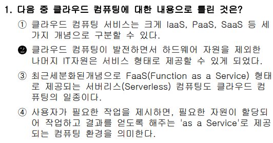

### ✅ 문제 분석 및 개념 정리

---

#### 🔷 **문제 핵심 요점**

"**클라우드 컴퓨팅에 대한 기술 중 틀린 것**"을 묻는 문제.

이 문제의 핵심 키워드:

- **클라우드 컴퓨팅 서비스의 분류**: IaaS, PaaS, SaaS
- **Serverless, FaaS**와 같은 현대 클라우드 개념
- **서비스로서의 제공 모델(as a Service)의 본질**
- **하드웨어 자원과의 관계**

---

### 🧠 출제 의도 해석

이 문제는 단순 용어 암기보다, 다음을 파악하고 있는지를 묻는 문제입니다.

- 클라우드 컴퓨팅이 어떻게 발전해 왔는가?
- 서비스 모델(IaaS, PaaS, SaaS, FaaS)의 구조는 어떻게 되는가?
- "서비스로 제공된다"는 말의 의미는 무엇인가?

즉, **클라우드는 자원을 어떻게 가상화·추상화해서 서비스로 제공하는가**에 대한 근본 개념 이해가 중요합니다.

---

### 📌 기본 개념 정리

#### 1. 클라우드 서비스 분류: IaaS, PaaS, SaaS + FaaS

| 구분                                   | 설명                                                                                                                                                             |
| -------------------------------------- | ---------------------------------------------------------------------------------------------------------------------------------------------------------------- |
| **IaaS** (Infrastructure as a Service) | 서버, 저장소, 네트워크 등의 **하드웨어 리소스를 가상화하여 제공**                                                                                                |
| **PaaS** (Platform as a Service)       | 개발 환경, 미들웨어, OS 등을 플랫폼 형태로 제공                                                                                                                  |
| **SaaS** (Software as a Service)       | 사용자가 **인터넷을 통해 바로 사용하는 애플리케이션** (예: Gmail, Dropbox)                                                                                       |
| **FaaS** (Function as a Service)       | 개발자가 **함수 단위 코드만 업로드하면, 실행 환경과 인프라를 자동으로 관리**해주는 서비스<br>**이벤트 기반으로 실행**되며, 사용한 만큼만 과금됨 (예: AWS Lambda) |

#### 2. FaaS와 Serverless

- **Serverless**: 사용자가 서버를 직접 관리할 필요 없이, 기능 단위로 실행되는 구조.
- **FaaS(Function as a Service)**: 코드(함수)를 이벤트 기반으로 실행 → 사용한 만큼 과금.

#### 3. ‘as a Service’의 의미

- 자원을 물리적으로 소유하지 않고, **필요할 때마다 빌려 쓰는 개념**
- 사용자는 ‘무엇을 할지’를 말하고, 클라우드는 알아서 필요한 자원을 배치하여 실행해줌

---

### 🔍 보기별 상세 분석

#### ✅ 보기 ①: "클라우드 컴퓨팅 서비스는 크게 IaaS, PaaS, SaaS 등 세 가지 개념으로 구분할 수 있다."

- **정확한 설명**
- 클라우드 서비스 분류는 보편적으로 이 3가지로 나뉨 (물론 FaaS 등도 있지만 기본 분류는 맞음)

➡ **문제에 대한 정답은 아님**

---

#### ❌ 보기 ②: "클라우드 컴퓨팅이 발전하면서 하드웨어 자원을 제외한 나머지 IT자원은 서비스 형태로 제공할 수 있게 되었다."

- **틀린 설명입니다.**
- 오히려 클라우드는 **하드웨어 자원(IaaS)** 까지 포함해서 서비스로 제공합니다.
- 서버, 네트워크, 스토리지 등의 **물리적인 자원도 가상화되어 서비스로 제공**되는 것이 클라우드의 핵심입니다.

➡ **정답 (틀린 내용)**

---

#### ✅ 보기 ③: "최근 세분화된 개념으로 FaaS(Function as a Service) 형태로 제공되는 서버리스(Serverless) 컴퓨팅도 클라우드 컴퓨팅의 일종이다."

- **정확한 설명**
- 서버리스 구조에서 클라우드는 서버 관리를 하지 않아도 되도록 제공하며, FaaS는 그 대표적 예임
- 클라우드 환경에서 함수 단위로 코드를 실행할 수 있도록 제공하는 서비스 모델입니다.
- 사용자는 서버 인프라나 OS, 런타임 환경을 신경 쓰지 않아도 되고, 오직 비즈니스 로직 코드만 작성하면 됩니다.
- 함수는 특정 이벤트가 발생할 때만 실행되며, 실행 시간만큼 과금되는 특징이 있습니다.

➡ **문제에 대한 정답은 아님**

---

#### ✅ 보기 ④: "사용자가 필요한 작업을 제시하면, 필요한 자원이 할당되어 작업하고 결과를 얻도록 해주는 'as a Service'로 제공되는 컴퓨팅 환경을 의미한다."

- **정확한 설명**
- 사용자는 **비즈니스 목적(무엇을 할 것인가)** 만 명시하고, 클라우드는 **필요한 리소스를 자동으로 할당**해서 실행

➡ **문제에 대한 정답은 아님**

---

### 🧾 정리

| 보기 번호 | 내용 요약                               | 맞/틀 | 설명                                     |
| --------- | --------------------------------------- | ----- | ---------------------------------------- |
| ①         | IaaS, PaaS, SaaS 분류                   | ✅    | 올바른 클라우드 서비스 분류              |
| ②         | 하드웨어 자원은 제외하고 서비스 제공됨  | ❌    | **IaaS는 하드웨어 자원도 서비스로 제공** |
| ③         | FaaS, Serverless는 클라우드 일종        | ✅    | 최신 트렌드 개념 반영                    |
| ④         | 사용자 요구에 따라 자원을 제공하는 구조 | ✅    | ‘as a Service’ 개념에 충실               |

---

### ✅ 결론 한 줄 요약

**클라우드는 하드웨어 자원까지도 가상화하여 서비스로 제공하므로, 하드웨어를 제외하고 제공된다는 ②번 지문은 틀렸다.**

<br>
<br>
<br>

# 📍

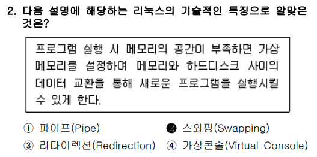

### ✅ 문제 분석 및 개념 정리

---

#### 🔷 **문제 핵심 요점**

"**메모리가 부족할 때, 하드디스크를 이용해 메모리처럼 쓰는 리눅스의 기술**은 무엇인가?"를 묻는 문제입니다.

문제의 핵심 키워드:

- **메모리가 부족할 때**
- **가상 메모리를 설정하여**
- **메모리와 하드디스크 사이의 데이터 교환**
- **새로운 프로그램 실행 가능**

→ 이런 설명은 전형적인 **Swapping (스와핑)** 또는 **가상 메모리(Virtual Memory)** 기능의 핵심입니다.

---

### 🧠 출제 의도 해석

이 문제는 리눅스의 메모리 관리 방식 중, **실제 RAM이 부족한 상황에서 운영체제가 어떻게 처리하는지**를 물어보는 문제입니다.

- 리눅스의 메모리 시스템은 물리 메모리만으로 부족할 경우, **디스크의 일부를 임시 메모리처럼 활용**합니다.
- 이때 사용하는 기술이 바로 **스와핑(Swapping)** 또는 **페이징(Paging)** 기반의 **가상 메모리(Virtual Memory)** 기술입니다.

---

### 📌 기본 개념 정리

#### 🔸 **Swapping(스와핑)** 이란?

- 물리 메모리가 부족할 경우, 현재 **사용하지 않는 프로세스의 메모리 데이터를 하드디스크(스왑 공간)** 로 옮기는 기술입니다.
- 필요 시 다시 메모리로 불러들여서 실행 가능함.

#### 🔸 **Swap 공간이란?**

- 일반적으로 `/swapfile` 또는 별도의 **스왑 파티션**으로 구성됨.
- 메모리처럼 사용되지만 **속도는 느림** (디스크 기반이기 때문)

#### 🔸 Swapping의 동작 흐름

1. 프로세스 A, B, C가 동시에 실행되고 있음.
2. 물리 메모리가 다 차면, **우선순위가 낮은 프로세스 B**의 메모리 내용을 **디스크(Swap 영역)** 로 옮김.
3. 프로세스 D를 실행할 수 있는 **공간을 확보함.**
4. 나중에 B가 필요해지면, 다시 스왑 공간에서 메모리로 **불러옴.**

---

### 🔍 보기별 상세 분석

#### ✅ ② 스와핑(Swapping) → **정답**

- **문제 지문과 정확히 일치**:

  - 메모리 부족 시
  - 하드디스크와 교환(swap)
  - 새로운 프로그램 실행 가능

➡ 정확한 메모리 관리 기법 설명

---

#### ❌ ① 파이프(Pipe)

- **프로세스 간 데이터 전달**을 위한 통로.
- 한 프로세스의 출력을 다른 프로세스의 입력으로 연결.
- `ls | grep txt` 와 같은 명령에 사용됨.

➡ 메모리 부족/스왑과는 **전혀 무관**

---

#### ❌ ③ 리디렉션(Redirection)

- 명령어의 **입출력을 파일이나 다른 장치로 전환**하는 기술
- 예: `ls > output.txt`

➡ 메모리 관리와 관련 없음

---

#### ❌ ④ 가상 콘솔(Virtual Console)

- 리눅스에서 `Ctrl + Alt + F1~F6`을 누르면 나오는 **다중 로그인 화면**
- **물리적으로 하나의 모니터/키보드**를 여러 사용자 콘솔처럼 분할 사용 가능

➡ 메모리 스와핑과 관련 없음

---

### 🧾 정리

| 보기 | 기술명           | 핵심 개념                             | 정답 여부 |
| ---- | ---------------- | ------------------------------------- | --------- |
| ①    | 파이프(Pipe)     | 프로세스 간 데이터 전달               | ❌        |
| ②    | 스와핑(Swapping) | 메모리 부족 시 디스크에 저장/불러오기 | ✅        |
| ③    | 리디렉션         | 입출력 방향 전환 (`>` `<` 등)         | ❌        |
| ④    | 가상 콘솔        | 다중 사용자 텍스트 로그인 화면        | ❌        |

---

### ✅ 결론 한 줄 요약

**리눅스에서 메모리 부족 시 하드디스크를 임시 메모리로 활용하는 기술은 ‘스와핑(Swapping)’이다.**

<br>
<br>
<br>

# 📍

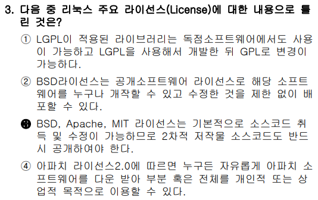

### ✅ 문제 분석 및 개념 정리

---

#### 🔷 **문제 핵심 요점**

"**리눅스에서 주로 사용되는 오픈소스 라이선스에 대한 설명 중 틀린 것**"을 찾는 문제입니다.

**핵심 키워드:**

- LGPL, BSD, MIT, Apache 같은 **대표적인 자유/오픈소스 라이선스(FOSS)**
- **각 라이선스가 소스코드 수정·재배포 시 어떤 의무를 요구하는가?**
- 특히 GPL 계열과 BSD/MIT 계열의 차이점

---

### 🧠 출제 의도 해석

이 문제는 단순히 라이선스 명칭만 아는 것이 아니라:

- 각 라이선스의 **"자유도"**
- 소스코드 **공개 의무 여부**
- **상업적 이용 가능 여부**
- **라이선스 변경 가능성**

등을 근본적으로 이해하고 있는지를 묻는 문제입니다.

---

### 📌 라이선스별 기본 개념 정리

| 라이선스       | 소스코드 공개 의무 | 상업적 이용 | 다른 라이선스로 변경 가능 여부 | 특징 요약           |
| -------------- | ------------------ | ----------- | ------------------------------ | ------------------- |
| **GPL**        | **예 (강제)**      | 가능        | **불가 (항상 GPL 유지)**       | 강력한 카피레프트   |
| **LGPL**       | 예 (라이브러리만)  | 가능        | 가능 (GPL로만 변경 가능)       | 느슨한 GPL          |
| **BSD/MIT**    | **아니오 (자유)**  | 가능        | 가능                           | 가장 자유로운       |
| **Apache 2.0** | 아님 (자유) + 특허 | 가능        | 가능                           | 특허 보호 조항 포함 |

---

### 🔍 보기별 상세 분석

#### ✅ ① "LGPL이 적용된 라이브러리는 독점소프트웨어에서도 사용이 가능하고, LGPL을 사용해서 개발한 뒤 GPL로 변경이 가능하다."

- **맞는 설명**입니다.
- LGPL은 **라이브러리에만 적용되는 느슨한 GPL**로, 독점 소프트웨어에서 사용 가능함.
- 또한 LGPL 라이브러리는 나중에 **GPL로 상향 변경 가능**함 (라이선스를 올릴 수는 있어도, 낮추기는 어려움)

➡ **정답 아님**

---

#### ✅ ② "BSD 라이선스는 공개소프트웨어 라이선스로 해당 소프트웨어를 누구나 개작할 수 있고 수정한 것을 제한 없이 배포할 수 있다."

- **맞는 설명**입니다.
- BSD는 **가장 자유로운 라이선스 중 하나**로, 수정 후 재배포 시 소스 공개 의무 없음.
- 단, 라이선스 문구와 저작권 정보는 유지해야 함.

➡ **정답 아님**

---

#### ❌ ③ "BSD, Apache, MIT 라이선스는 기본적으로 소스코드 취득 및 수정이 가능하므로 2차 저작물 소스코드도 반드시 공개해야 한다."

- **틀린 설명**입니다. → **문제에 대한 정답**
- BSD, Apache, MIT는 **소스코드 공개 '의무'가 없음.**
- 수정해서 배포할 수도 있고, 소스를 비공개로 배포할 수도 있음.
- 이들과 달리 **GPL 계열만 소스코드 공개를 강제함.**

➡ ✅ **정답 (틀린 설명)**

---

#### ✅ ④ "아파치 라이선스 2.0에 따르면 누구든 자유롭게 아파치 소프트웨어를 다운 받아 부분 혹은 전체를 개연적 또는 상업적 목적으로 이용할 수 있다."

- **정확한 설명**입니다.
- Apache 2.0은 **상업적 사용, 수정, 배포 모두 허용**하며, **특허 보호 조항**도 포함된 매우 자유로운 라이선스임.

➡ **정답 아님**

---

### 🧾 정리

| 보기 번호 | 설명 요약                                        | 맞/틀 | 비고           |
| --------- | ------------------------------------------------ | ----- | -------------- |
| ①         | LGPL은 독점SW에서도 사용 가능, GPL로 변경도 가능 | ✅    | LGPL 특성      |
| ②         | BSD는 소스코드 수정/재배포 자유                  | ✅    | BSD 특징       |
| ③         | BSD/MIT도 소스 공개 의무가 있다? → **오답**      | ❌    | GPL과 혼동     |
| ④         | Apache는 자유로운 상업적 활용 가능               | ✅    | 특허 보호 포함 |

---

### ✅ 결론 한 줄 요약

**BSD, Apache, MIT 라이선스는 소스코드 공개 의무가 없기 때문에, ③번은 틀린 설명이다.**

<br>
<br>
<br>

# 📍

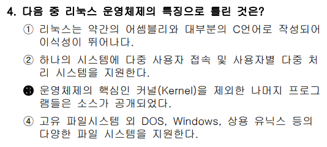

### ✅ 문제 분석 및 개념 정리

---

#### 🔷 **문제 핵심 요점**

"**리눅스 운영체제의 특징에 대해 틀린 것**"을 찾는 문제입니다.

이 문제에서 중요한 판단 기준:

- 리눅스의 철학 = **오픈소스, 유닉스 호환, 이식성, 다중 사용자/다중 작업 지원**
- 핵심 요소인 **커널(Kernel)도 오픈소스인가?**
- 파일 시스템 호환성은 어떤가?

---

### 🧠 출제 의도 해석

이 문제는 단순 암기가 아니라, 리눅스 운영체제의 **전체 구조와 철학(= 오픈소스의 정신)** 을 이해하고 있는지를 평가합니다.

즉, "리눅스의 커널은 비공개다"라는 식의 **잘못된 상식을 걸러낼 수 있는지**를 보는 문제입니다.

---

### 📌 기본 개념 정리

#### ✅ 커널(Kernel)이란?

- 커널은 운영체제의 핵심이자 심장입니다.
- 사용자의 명령과 컴퓨터 하드웨어 사이를 중개해주는 중앙 관리자입니다.

#### 🧠 비유로 쉽게 설명

- 커널은 운영체제의 "사장님" 같은 존재입니다.
- 사용자는 마우스를 클릭하거나 키보드를 입력함
- 사용자의 요청은 운영체제에게 전달됨
- 이 중에서 하드웨어와 직접 통신하는 일은 커널만 할 수 있음

- 즉, 커널은:

  - "CPU야, 이 프로그램 먼저 실행해 줘"
  - "메모리야, 이 앱한테 500MB 줘"
  - "디스크야, 이 파일 좀 읽어줘"
  - 이러한 요청을 하드웨어에게 직접 명령하는 존재입니다.

#### 🔸 리눅스 커널(Linux Kernel)

- 리눅스는 **커널부터 모든 구성 요소가 오픈소스**입니다.
- 1991년 **리누스 토르발스**가 처음 공개했을 때부터 커널도 GPL 라이선스로 제공됨.
- GitHub, kernel.org 등에서 커널 소스코드 전체를 **누구나 열람·수정 가능**

#### 🔸 리눅스의 주요 특징

| 항목                      | 설명                                 |
| ------------------------- | ------------------------------------ |
| **작성 언어**             | 대부분 C, 일부 어셈블리              |
| **다중 사용자/다중 작업** | 기본적으로 지원                      |
| **오픈소스**              | 커널 포함 모든 부분 공개             |
| **파일 시스템 호환성**    | FAT, NTFS, ext, ISO9660 등 다수 지원 |

---

### 🔍 보기별 상세 분석

#### ✅ ① "리눅스는 약간의 어셈블리와 대부분의 C언어로 작성되어 이식성이 뛰어나다."

- **정확한 설명**
- 하드웨어에 독립적인 C 언어로 구성되어 있어 다양한 아키텍처에 포팅 가능

➡ **정답 아님**

---

#### ✅ ② "하나의 시스템에 다중 사용자 접속 및 사용자별 다중 처리 시스템을 지원한다."

- **정확한 설명**
- 리눅스는 기본적으로 **다중 사용자 & 다중 프로세스 환경**을 지원함
- 여러 사용자가 동시에 ssh 접속하고 각자 프로그램 실행 가능

➡ **정답 아님**

---

#### ❌ ③ "운영체제의 핵심인 커널(Kernel)을 제외한 나머지 프로그램들은 소스가 공개되었다."

- **틀린 설명**
- 리눅스는 **커널도 포함하여 전체가 오픈소스**임
- 커널이 오픈되지 않았다면 '리눅스'가 아님

➡ ✅ **정답 (틀린 설명)**

---

#### ✅ ④ "고유 파일시스템 외 DOS, Windows, 상용 유닉스 등의 다양한 파일 시스템을 지원한다."

- **정확한 설명**
- `vfat`, `ntfs`, `iso9660`, `hfs`, `xfs`, `ext4` 등 매우 다양한 파일 시스템 포맷을 지원

➡ **정답 아님**

---

### 🧾 정리

| 보기 번호 | 설명 요약                      | 맞/틀 | 비고                   |
| --------- | ------------------------------ | ----- | ---------------------- |
| ①         | C언어 기반으로 이식성 높음     | ✅    | 작성 언어 관련         |
| ②         | 다중 사용자/프로세스 지원      | ✅    | 운영 환경              |
| ③         | 커널은 소스 비공개? → **오답** | ❌    | 리눅스 커널도 오픈소스 |
| ④         | 다양한 파일 시스템 지원        | ✅    | 파일 시스템 호환성     |

---

### ✅ 결론 한 줄 요약

**리눅스는 커널을 포함한 모든 구성 요소가 오픈소스이므로, ③번 지문은 틀린 설명이다.**

<br>
<br>
<br>

# 📍


### ✅ 문제 분석 및 개념 정리

---

#### 🔷 **문제 핵심 요점**

"**데비안 계열이 아닌 리눅스 배포판은 무엇인가?**"를 묻는 문제입니다.

즉, 다음을 파악해야 합니다:

- **각 리눅스 배포판이 어느 계열에서 파생되었는가**
- 계열은 단순 구분이 아니라 **패키지 관리자, 철학, 파일 구조**에 큰 영향을 줌

---

### 🧠 출제 의도 해석

이 문제는 리눅스 배포판에 대한 **기본 계보 구조를 이해했는지**를 묻습니다.

- 리눅스 배포판은 크게 두 계열로 나뉩니다:

  - **Debian 계열** (패키지 관리자: `apt`, `.deb`)
  - **Red Hat 계열** (패키지 관리자: `yum`, `dnf`, `.rpm`)

---

### 📌 배포판 계열별 정리

#### ✅ Debian 계열

| 배포판         | 설명                                           |
| -------------- | ---------------------------------------------- |
| **Debian**     | 최초의 데비안 계열                             |
| **Ubuntu**     | Debian 기반의 가장 유명한 데스크탑/서버 배포판 |
| **Linux Mint** | Ubuntu를 기반으로 한 데스크탑 최적화 배포판    |
| **Kali Linux** | 보안 및 해킹 테스트 특화, **Debian 기반**      |

#### ✅ Red Hat 계열

| 배포판                              | 설명                                                         |
| ----------------------------------- | ------------------------------------------------------------ |
| **Red Hat Enterprise Linux (RHEL)** | 상용                                                         |
| **CentOS**                          | RHEL의 무료 복제판 (현재는 Rocky Linux, AlmaLinux로 대체 중) |
| **Fedora**                          | Red Hat의 실험용/테스트 배포판, RHEL의 전신                  |

---

### 🔍 보기별 상세 분석

#### ❌ ① **CentOS** → **정답 (틀린 것)**

- **Red Hat 계열**
- `.rpm` 패키지 사용, `yum`/`dnf` 패키지 관리자
- 데비안 계열이 아님

---

#### ✅ ② Ubuntu

- **Debian 기반**
- 데스크탑 및 서버 운영체제용으로 매우 보편적

---

#### ✅ ③ Linux Mint

- **Ubuntu 기반** → 결과적으로 **Debian 계열**

---

#### ✅ ④ Kali Linux

- 보안 도구가 다수 포함된 배포판
- **Debian 기반**으로 `apt` 사용

---

### 🧾 정리

| 보기 | 배포판     | 계열             | 맞/틀     |
| ---- | ---------- | ---------------- | --------- |
| ①    | CentOS     | **Red Hat 계열** | ❌ (정답) |
| ②    | Ubuntu     | Debian 계열      | ✅        |
| ③    | Linux Mint | Debian 계열      | ✅        |
| ④    | Kali Linux | Debian 계열      | ✅        |

---

### ✅ 결론 한 줄 요약

**CentOS는 Red Hat 계열 리눅스 배포판이므로, 데비안 계열이 아닌 ‘틀린 보기’는 ①번이다.**

<br>
<br>
<br>

# 📍

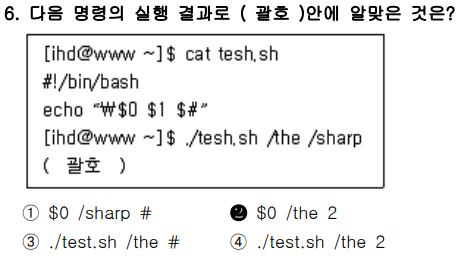

### ✅ 문제 분석 및 개념 정리

---

#### 🔷 **문제 핵심 요점**

쉘 스크립트 실행 시 **위치 매개변수 (\$0, \$1, \$#)** 에 대한 정확한 이해를 요구하는 문제입니다.

---

### 🧠 출제 의도 해석

이 문제는 다음을 평가합니다:

- `$0`, `$1`, `$#`, `"$*"` 등의 **위치 매개변수**를 정확히 알고 있는가?
- 쉘에서 인자(`argument`)가 **어떻게 인식되는가**를 이해하고 있는가?

---

지금부터 **쉘 스크립트의 위치 매개변수**(`$0`, `$1`, `$#`)에 대해 **진짜 완전 쉽게** 설명드릴게요.

예시 중심으로 천천히 따라가볼게요.

---

## ✅ 먼저: 쉘 스크립트란?

> 명령어들을 순서대로 적어놓은 **파일**입니다.

> `.sh` 확장자를 주로 씁니다.

예를 들어 `hello.sh` 파일 안에 다음처럼 작성해둔다고 생각해볼게요:

```bash
#!/bin/bash
echo "Hello"
```

→ 그럼 이건 그냥 "Hello"를 출력하는 스크립트죠.

---

## ✅ 위치 매개변수란?

쉘 스크립트 실행 시 **입력받은 값(=인자, 인수)** 들을 자동으로 담아주는 **특수한 변수**입니다.

| 변수 | 의미                     |
| ---- | ------------------------ |
| `$0` | 실행한 **스크립트 이름** |
| `$1` | 첫 번째 인자             |
| `$2` | 두 번째 인자             |
| ...  | ...                      |
| `$#` | 인자의 **총 개수**       |

---

## ✅ 예제로 설명

### 📄 `myscript.sh` 파일을 이렇게 작성했다고 해요:

```bash
#!/bin/bash
echo "스크립트 이름: $0"
echo "첫 번째 인자: $1"
echo "총 인자 수: $#"
```

---

### ▶ 이렇게 실행해볼게요:

```bash
bash myscript.sh apple banana
```

#### 이때:

- `$0` → `myscript.sh` (스크립트 이름)
- `$1` → `apple` (첫 번째 인자)
- `$2` → `banana` (두 번째 인자, 지금은 안 썼지만 가능)
- `$#` → `2` (총 2개의 인자를 줬음)

#### ✅ 출력 결과는:

```
스크립트 이름: myscript.sh
첫 번째 인자: apple
총 인자 수: 2
```

---

## ✅ 다시! 핵심 요약

| 표현       | 실제 의미                          |
| ---------- | ---------------------------------- |
| `$0`       | "누가 실행됐는지?" (스크립트 이름) |
| `$1`, `$2` | 사용자가 넘겨준 값들 (인자)        |
| `$#`       | 인자가 몇 개인지 숫자로 알려줌     |

---

## 📌 왜 이런 게 필요한가?

이걸 알면 **스크립트에 값을 유연하게 넘겨서 자동화**할 수 있습니다.

예:

```bash
bash backup.sh /home/user /backup
```

- `$1` → `/home/user`
- `$2` → `/backup`

→ "이 폴더(**/home/user**)를 백업해서 저기(**/backup**)에 저장하라"는 자동화 스크립트 가능!

---

## ✅ 결론 한 줄 요약

**쉘 스크립트에서 `$0`은 스크립트 이름, `$1`은 첫 번째 값(인자), `$#`은 총 인자 개수를 자동으로 담아주는 특별한 변수이다.**

---

궁금한 부분을 다시 더 쉽게 예시로 설명해드릴 수 있어요.
어디서 막히셨는지 말씀해주시면 **그 부분만 따로 다시 풀어드릴게요.**

### 📌 기본 개념 정리

| 변수           | 의미                                  |
| -------------- | ------------------------------------- |
| `$0`           | **실행된 스크립트 파일명**            |
| `$1`           | **첫 번째 인자**                      |
| `$2`, `$3` ... | 두 번째, 세 번째 인자                 |
| `$#`           | **전달된 인자의 개수 (숫자)**         |
| `$*`           | 전체 인자를 문자열로                  |
| `$@`           | 전체 인자를 배열로 (따옴표 유지 가능) |

---

### 🔍 명령어 분석

#### ✅ **스크립트 내용**

```bash
#!/bin/bash
echo “\$$0 $1 $#”
```

※ 실제 쉘 해석 기준으로 보면:

```bash
echo "$0 $1 $#"
```

- `"$0"` → 실행된 스크립트 이름 (`./tesh.sh`)
- `$1` → 첫 번째 인자 = `/the`
- `$#` → 인자 개수 = 2 (`/the`, `/sharp`)

---

#### ✅ 실행 명령

```bash
./tesh.sh /the /sharp
```

→ 인자 `/the`, `/sharp`가 `$1`, `$2`로 전달됨

---

#### 🧾 결과 분석

```bash
$0 = ./tesh.sh
$1 = /the
$# = 2

출력 결과:
./tesh.sh /the 2
```

---

### 보기별 분석

| 보기 번호 | 출력 내용          | 판단 | 이유                             |
| --------- | ------------------ | ---- | -------------------------------- |
| ①         | `$0 /sharp #`      | ❌   | `$1`값이 잘못됨 (`/sharp`는 \$2) |
| ②         | `$0 /the 2`        | ✅   | `$0=$0`, `$1=/the`, `$#=2`       |
| ③         | `./test.sh /the #` | ❌   | 파일명이 `tesh.sh`로 다름        |
| ④         | `./test.sh /the 2` | ❌   | 마찬가지로 파일명 불일치         |

---

### ✅ 결론 한 줄 요약

**위치 매개변수에 따라 출력 결과는 `./tesh.sh /the 2`가 되므로, 정답은 ②번이다.**

<br>
<br>
<br>

# 📍

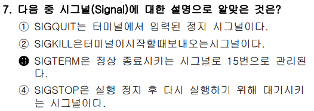

### ✅ 문제 분석 및 개념 정리

---

#### 🔷 **문제 핵심 요점**

"**시그널(Signal)** 에 대한 설명 중 **올바른 것**"을 고르는 문제입니다.

이 문제는 단순 용어 암기가 아닌 다음 내용을 정확히 알고 있어야 맞출 수 있습니다:

- 리눅스의 **프로세스 제어 방식**
- **시그널 번호(Signal Number)** 와 이름
- 각 시그널이 의미하는 **행동과 트리거 조건**

---

### 📌 대표 시그널 목록 요약

| 시그널 이름 | 번호 | Full Name (영문명)   | 의미 요약                                |
| ----------- | ---- | -------------------- | ---------------------------------------- |
| **SIGTERM** | 15   | **Signal Terminate** | **종료 요청** (정상 종료)                |
| **SIGKILL** | 9    | **Signal Kill**      | **강제 종료** (절대 못 막음)             |
| **SIGSTOP** | 19   | **Signal Stop**      | **일시 정지** (pause, catch 불가)        |
| **SIGCONT** | 18   | **Signal Continue**  | **정지된 프로세스 재개**                 |
| **SIGQUIT** | 3    | **Signal Quit**      | **종료 + 코어 덤프 생성**                |
| **SIGINT**  | 2    | **Signal Interrupt** | **인터럽트(중단 요청)** (Ctrl + C)       |
| **SIGHUP**  | 1    | **Signal Hang Up**   | **연결 종료 감지** (데몬 재시작 등 활용) |

---

### 🔍 보기별 상세 분석

#### ✅ ③ "SIGTERM은 정상 종료시키는 시그널로 15번으로 관리된다." → **정답**

- `kill [pid]` 명령어의 기본 시그널
- **정상적인 종료 요청**, 프로세스가 정리 작업 수행 후 종료 가능
- **시그널 번호 15**

---

#### ❌ ① "SIGQUIT는 터미널에서 입력된 정지 시그널이다."

- 틀린 표현
- **SIGQUIT는 '정지'가 아닌, 강제 종료와 core dump** 유발
- **Ctrl + \\** 로 보내며, 보통 디버깅 목적으로 사용

  **✅ core dump란?**

  > 프로그램이 비정상적으로 종료될 때, 메모리의 내용을 그대로 파일로 저장한 것

---

#### ❌ ② "SIGKILL은 터미널이 시작할 때 보내오는 시그널이다."

- 완전히 틀림
- **SIGKILL은 9번 시그널**, 강제 종료용 (catch/ignore 불가)
- 사용자나 커널이 의도적으로 보내야 발생

---

#### ❌ ④ "SIGSTOP은 실행 정지 후 다시 실행하기 위해 대기시키는 시그널이다."

- 절반 맞고 절반 틀림
- **SIGSTOP은 정지** 시그널은 맞지만, **재개는 SIGCONT**가 담당함
- **SIGSTOP만으로는 재실행 불가능**

---

### 🧾 정리

| 보기 번호 | 설명 요약                      | 맞/틀            | 이유 |
| --------- | ------------------------------ | ---------------- | ---- |
| ①         | SIGQUIT = 정지 시그널? → ❌    | core dump용 종료 |      |
| ②         | SIGKILL = 터미널 시작 시? → ❌ | 강제 종료용      |      |
| ③         | SIGTERM = 정상 종료, 15번 → ✅ | 정확             |      |
| ④         | SIGSTOP = 정지 후 실행? → ❌   | 재개는 SIGCONT   |      |

---

### ✅ 결론 한 줄 요약

**SIGTERM은 프로세스를 정상 종료시키는 15번 시그널이므로, 정답은 ③번이다.**

<br>
<br>
<br>

# 📍

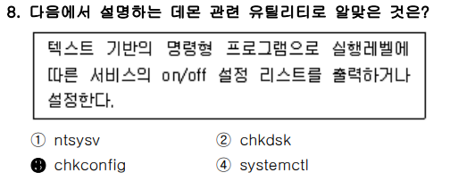

### ✅ 문제 분석 및 개념 정리

---

#### 🔷 **문제 핵심 요점**

> “**실행레벨(runlevel)에 따라 서비스의 on/off 설정을 출력하거나 설정하는 명령어는 무엇인가?**”

이 설명은 리눅스 시스템에서 **init 기반 서비스 관리 방식** 중 하나인 `chkconfig` 명령어에 관한 설명입니다.

---

### 🧠 출제 의도 해석

이 문제는 다음 두 가지 개념을 정확히 구분할 수 있는지를 묻습니다:

1. **전통적인 init 시스템에서 서비스 제어 방식 (SysVinit)**
2. **현대 systemd 방식의 서비스 제어 (`systemctl`)과의 차이점**

#### ✅ 데몬 관련 유틸리티란?

- 데몬을 시작/중지/재시작/상태 확인하는 명령어 도구

- **데몬** = **카페 바리스타** → 손님이 올 때까지 계속 대기, 요청 오면 바로 응답

---

물론입니다. 기존 형식에 맞춰 `chkdsk`와 `ntsysv`의 설명을 자연스럽게 이어서 추가해드리겠습니다:

---

### 📌 개념 정리

#### 🔸 `chkconfig` (정답)

- ✅ chkconfig = check configuration
- **SysVinit 기반 리눅스 배포판(RHEL 6 이하, CentOS 6 이하)** 에서 사용
- 실행레벨(runlevel)에 따라 서비스 시작/중지를 설정
- 대표 명령어:

  ```bash
  chkconfig --list          # 모든 서비스와 runlevel별 상태 출력
  chkconfig httpd on        # 부팅 시 httpd 서비스 실행
  chkconfig sshd off        # 부팅 시 sshd 실행하지 않음
  ```

#### 🔸 `systemctl`

- ✅ systemctl = system control
- **systemd 기반** 서비스 관리 도구
- CentOS 7 이상, RHEL 7 이상에서 사용됨
- `chkconfig`와 비슷한 역할이지만, 실행 방식과 설정 체계가 다름

---

#### 🔸 `chkdsk`

- ✅ chkdsk = check disk
- **Windows 운영체제의 디스크 오류 검사 도구**
- 리눅스와는 무관하며, **파일 시스템 손상 여부 확인 및 복구**용
- 명령 예시:

  ```bash
  chkdsk C:
  chkdsk /f D:
  ```

  > ※ 리눅스에서 동일한 역할을 하는 명령은 `fsck`입니다.

---

#### 🔸 `ntsysv`

- ✅ ntsysv = ncurses-based sysv service selector
  - ntsysv는 ncurses라는 텍스트 UI 도구를 활용해서,
  - SysVinit 방식의 서비스들을 체크박스로 선택할 수 있도록 해주는 설정 도구
  - 즉, 마치 GUI처럼 보이는 텍스트 환경에서 **서비스를 "켜고 끌 수 있는 스위치 박스"를 제공하는 도구**
- **텍스트 기반 GUI로 runlevel별 서비스 on/off 설정 가능**
- `chkconfig`의 TUI (Text User Interface) 버전
- CentOS 6 등 **SysVinit 기반 배포판에서만 사용 가능**
- 사용법:

  ```bash
  ntsysv
  ```

→ 체크 박스로 부팅 시 실행할 서비스를 선택하고 저장 가능

---

### ✅ 결론 한 줄 요약

**`chkconfig`, `systemctl`, `ntsysv`는 리눅스에서 서비스 자동 실행을 제어하는 도구들**

**`chkdsk`는 리눅스와 무관한 Windows 디스크 검사 도구이다.**

---

### 🔍 보기별 상세 분석

| 보기 | 명령어      | 설명                                                                               | 정답 여부 |
| ---- | ----------- | ---------------------------------------------------------------------------------- | --------- |
| ①    | `ntsysv`    | `chkconfig`의 **TUI(그래픽화된 터미널 버전)** → 일부 맞지만 **텍스트 기반은 아님** | ❌        |
| ②    | `chkdsk`    | **Windows**에서 파일시스템 검사하는 명령어                                         | ❌        |
| ③    | `chkconfig` | **runlevel 기반 서비스 설정 도구** (정답)                                          | ✅        |
| ④    | `systemctl` | **systemd 기반 서비스 관리 도구** → `runlevel`이 아닌 `target` 기반                | ❌        |

---

### ✅ 결론 한 줄 요약

**실행레벨에 따라 서비스의 on/off 설정을 제어하는 유틸리티는 `chkconfig`이므로, 정답은 ③번이다.**

<br>
<br>
<br>

# 📍

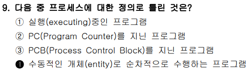

### ✅ 문제 분석 및 개념 정리

---

#### 🔷 **문제 핵심 요점**

“**프로세스(Process)** 에 대한 설명 중 **틀린 것**”을 고르는 문제입니다.

즉, 프로세스의 **\*정의**, **\*특징**, **\*구성 요소(PCB, PC)**, **\*본질(수동적/능동적)** 에 대한 이해가 필요한 문제입니다.

---

### 🧠 출제 의도 해석

이 문제는 다음을 구분할 수 있는지를 묻습니다:

- 프로그램(Program) vs 프로세스(Process)
- **프로세스는 단순히 코드가 아니라 실행 중인 ‘능동적인 존재’라는 점**
- 시스템에서 프로세스를 **어떻게 표현하고 관리하는가 (PCB, PC)**

---

### 📌 기본 개념 정리

#### 🔸 프로세스(Process)의 정의

- **실행 중인 프로그램**
- 단순히 저장된 코드가 아닌, **실행 상태에서 메모리와 자원을 점유하는 능동적인 존재**
- 운영체제가 관리하는 단위

#### 🔸 주요 특징

| 용어                            | 설명                                                           |
| ------------------------------- | -------------------------------------------------------------- |
| **PC (Program Counter)**        | 다음에 실행할 명령어의 주소                                    |
| **PCB (Process Control Block)** | \*프로세스의 ID, \*상태, \*레지스터, \*PC 등을 저장하는 구조체 |
| **프로세스 상태**               | Ready, Running, Waiting, Terminated 등                         |

---

### 🔍 보기별 상세 분석

#### ✅ ① "실행 중인(executing) 프로그램" → **정확한 정의**

- 프로세스의 가장 일반적인 정의

---

#### ✅ ② "PC(Program Counter)를 지닌 프로그램"

- 프로그램이 **실행 중이라는 증거** = PC를 가지고 있음
- PC는 현재 또는 다음에 실행할 명령어 위치를 가리킴

---

#### ✅ ③ "PCB(Process Control Block)를 지닌 프로그램"

- 운영체제가 프로세스를 식별하고 관리하기 위한 정보 저장 구조
- 프로세스 = PCB 존재 여부로 판단 가능

---

#### ❌ ④ "수동적인 개체(entity)로 순차적으로 수행하는 프로그램" → **틀린 설명 (정답)**

- 틀린 이유:

  - **"수동적(passive)"이라는 표현이 잘못됨**
  - 실행 중인 프로그램은 **능동적(active)** 존재로서 CPU를 사용하여 명령을 수행

- "순차적 수행"은 현대 컴퓨팅에서 엄밀히 말하면 **멀티스레드/병렬 처리 등도 있음**

---

### 🧾 정리

| 보기 번호 | 설명 요약          | 맞/틀                   | 이유               |
| --------- | ------------------ | ----------------------- | ------------------ |
| ①         | 실행 중인 프로그램 | ✅                      | 정확한 정의        |
| ②         | PC를 지님          | ✅                      | 실행 상태          |
| ③         | PCB를 지님         | ✅                      | 운영체제 관리 단위 |
| ④         | 수동적 개체? → ❌  | **프로세스는 능동적**임 |                    |

---

### ✅ 결론 한 줄 요약

**프로세스는 실행 중인 능동적인 개체이므로, ‘수동적인 개체’라고 한 ④번이 틀린 설명이다.**

<br>
<br>
<br>

# 📍

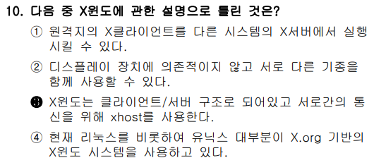

### ✅ 문제 분석 및 개념 정리

---

#### 🔷 **문제 핵심 요점**

> “**X 윈도(X Window System)** 에 대한 설명 중 **틀린 것**을 찾는 문제”

X 윈도는 유닉스/리눅스에서 **GUI 환경을 구현하는 기본 시스템**입니다.
여기서 중요한 개념은:

- X의 **클라이언트/서버 구조**
- **디스플레이 장치와 독립적인 구조**
- **원격 실행 및 통신 도구(xhost, DISPLAY 등)**
- **X.Org vs XFree86 같은 구현체 구분**

---

### 📌 기본 개념 정리

| 개념             | 설명                                                                       |
| ---------------- | -------------------------------------------------------------------------- |
| **X Server**     | **출력을 담당** (디스플레이/마우스/키보드 담당) — 즉, **사용자의 화면 쪽** |
| **X Client**     | **GUI를 요청하는 응용프로그램** — 원격 서버에서 실행되는 프로그램          |
| **xhost**        | X Server 측에서 접근을 **허용할 클라이언트 호스트 지정**                   |
| **DISPLAY 변수** | X Client가 출력을 어느 X Server에 할지 지정                                |
| **X.Org**        | X 윈도 시스템의 대표적인 오픈소스 구현체                                   |
| **Wayland**      | X의 후속 GUI 시스템, 현재 일부 배포판에서 사용되기 시작                    |

---

### 🔍 보기별 상세 분석

#### ✅ ① “원격지의 X클라이언트를 다른 시스템의 X서버에서 실행시킬 수 있다.”

- **정확한 설명**
- 원격 리눅스에서 실행한 프로그램(xclock 등)을 **내 컴퓨터 화면(X Server)에 출력** 가능
- 핵심은: **Client(원격 실행), Server(로컬 디스플레이)**

---

#### ✅ ② “디스플레이 장치에 의존적이지 않고 서로 다른 기종을 함께 사용할 수 있다.”

- **정확한 설명**
- X 윈도는 하드웨어에 독립적임
- 네트워크와 DISPLAY 변수만 설정되면 서로 다른 기종(Linux ↔ macOS ↔ Solaris 등) 간 GUI 출력 가능

---

#### ❌ ③ “X윈도는 클라이언트/서버 구조로 되어있고 **서로간의 통신을 위해 xhost를 사용한다**.” → **틀린 설명 (정답)**

- **부분적으로 맞지만 불완전한 설명 → 출제 포인트**
- `xhost`는 통신 자체가 아닌, **접근 제어** 도구임

  - 즉, **누가 접근할 수 있는지를 제한**
  - 통신 자체는 **\*DISPLAY 변수, \*TCP/UNIX socket 등**으로 이루어짐

- 올바른 표현: **“접근 제어를 위해 xhost를 사용한다”**

➡ ❗ **xhost는 통신을 위한 도구가 아니라, 보안/인증 수단이다.**

---

#### ✅ ④ “현재 리눅스를 비롯하여 유닉스 대부분이 X.Org 기반의 X 윈도 시스템을 사용하고 있다.”

- **정확한 설명**
- XFree86은 오래전에 사용되었으며, 현재는 거의 대부분 **X.Org Server 기반**
- 다만, 최신 GNOME 환경 등은 Wayland로 이동 중

---

### 🧾 정리

| 보기 | 설명 요약                               | 맞/틀 | 이유                     |
| ---- | --------------------------------------- | ----- | ------------------------ |
| ①    | 원격 X Client 실행 → 로컬 X Server 출력 | ✅    | 구조 이해                |
| ②    | 디스플레이 독립적, 기종 간 호환 가능    | ✅    | 플랫폼 독립              |
| ③    | **xhost = 통신 도구? → ❌**             | ❌    | **보안 도구**, 통신 아님 |
| ④    | X.Org 기반 X 시스템 사용                | ✅    | 현대 표준 구현체         |

---

### ✅ 결론 한 줄 요약

**xhost는 X 윈도의 접근 제어 도구이지, 통신 수단이 아니므로 ③번이 틀린 설명이다.**

<br>
<br>
<br>

# 📍

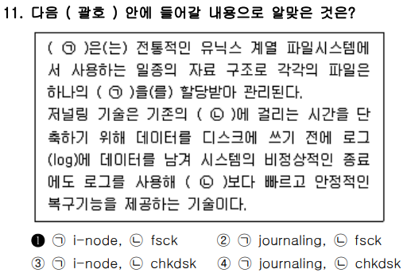

### ✅ 문제 분석 및 개념 정리

---

#### 🔷 **문제 핵심 요점**

두 가지 기술 개념을 구분하고 정확히 채워 넣는 문제입니다:

1. 전통적인 **유닉스 계열 파일 시스템에서 사용하는 자료 구조**
2. **저널링(journaling)** 기술과 관련된 복구 도구

---

### 📌 빈칸별 개념 정리

---

#### 🔸 ( ㉠ ) → `i-node`

- 전통적인 유닉스 계열(ext2, ext3, ext4 등 (Extended Filesystem)) 파일 시스템은 **각 파일의 메타데이터(파일 위치, 크기, 권한 등)** 를 **i-node**에 저장
- 파일 자체와 별개로 관리됨
- i-node는 파일에 직접 연결되지 않고, 파일 이름과 연결된 엔트리가 i-node 번호를 참조함

---

#### 🔸 ( ㉡ ) → `fsck`

- **File System Consistency Check**
  - 파일 시스템의 논리적 일관성(정합성)을 검사하는 것
- 파일 시스템이 비정상 종료되었을 때 **무결성을 점검하고 복구**하는 전통적인 유틸리티
- 저널링이 없던 시절에는 시간이 오래 걸렸으나,

  - **저널링 시스템에서는 로그를 활용해 빠르게 복구 가능**

- `fsck`는 ext 계열 등 리눅스 파일 시스템에서 사용됨

🟡 참고로 `chkdsk`는 **Windows의 파일 시스템 검사 도구**입니다.

---

### 🔍 보기별 분석

| 보기 | ㉠ 내용    | ㉡ 내용 | 판단 | 이유                                  |
| ---- | ---------- | ------- | ---- | ------------------------------------- |
| ①    | i-node     | fsck    | ✅   | 전통적인 유닉스 구조와 복구 도구 일치 |
| ②    | journaling | fsck    | ❌   | journaling은 구조가 아니라 **기술**   |
| ③    | i-node     | chkdsk  | ❌   | chkdsk는 **윈도우 전용 도구**         |
| ④    | journaling | chkdsk  | ❌   | 둘 다 Unix 기준에서는 부정확          |

---

좋습니다. 질문하신 내용은 리눅스마스터 1급 기출문제 중 **“파일 시스템의 특징”** 관련 문제로 보이며,
보기에 나오는 **i-node, 저널링, 메타데이터, 유니버설 파일 포맷** 등의 기술 용어가
각 파일 시스템과 어떻게 연결되는지 개념 중심으로 아주 쉽게 설명드리겠습니다.

---

## 🔍 보기 상세 분석: 주요 개념 키워드별로 정리

---

### ✅ ① i-node

> **i-node = 파일의 메타데이터 저장소**

- **ext2, ext3, ext4** 같은 전통적인 리눅스 파일 시스템에서 사용
- i-node는 **파일의 실제 내용이 아닌 "정보(소유자, 권한, 위치 등)"** 를 저장
- 파일 이름은 디렉토리에서 i-node 번호와 연결됨

📌 **i-node를 사용하는 대표 파일 시스템**

- ext2, ext3, ext4
- XFS, JFS 등도 유사한 개념 있음

---

### ✅ ② 저널링 (Journaling)

> **파일 시스템에 변경사항을 기록해 두는 기능 → 갑작스런 정전, 충돌에도 복구 가능**

- 저널 = 📓 일기장 같은 공간에 먼저 기록한 뒤, 실제 변경
- 전원 오류나 커널 패닉 발생 시도 **파일 시스템 손상 방지**
- 리눅스에서는 **ext3, ext4, XFS** 등이 저널링 지원

📌 대표적인 저널링 파일 시스템

- ext3, ext4, XFS, ReiserFS, Btrfs

> ❗ 반대로 ext2는 저널링 **없음**

---

### ✅ ③ 메타데이터 (Metadata)

> 파일 자체가 아닌, **파일을 설명하는 정보들**

| 메타데이터 종류 | 예시                         |
| --------------- | ---------------------------- |
| 소유자 정보     | 사용자 ID, 그룹 ID           |
| 권한 정보       | `rwx` 권한                   |
| 시간 정보       | 생성/수정/접근 시간          |
| 크기, 링크 수   | 파일 크기, 하드링크 수       |
| 위치 정보       | 하드디스크 블록 위치 주소 등 |

- 메타데이터는 i-node 내부에 저장됨 (ext 계열 파일 시스템 기준)
- 파일 시스템 복구 시, **메타데이터만 정상이면 대부분 복구 가능**

---

### ✅ ④ 유니버설 파일 포맷 (Universal File Format)

> **OS, 기기, 국가, 아키텍처 구분 없이 어디서든 읽고 쓸 수 있는 형식**

- 사실 이는 "파일 시스템"이라기보다는 **파일 형식 개념에 가까움**
- 예: FAT32, exFAT 같은 **Windows-리눅스-맥 공통 호환 포맷**
- USB 메모리, SD카드에 주로 사용

📌 관련 파일 시스템 예시:

- FAT32 (MS-DOS), exFAT (윈도우 호환형)
- ISO 9660 (CD/DVD 파일 포맷)

---

### ✅ ⑤ 블록 기반 파일 시스템 (Block-based Filesystem)

> 디스크를 **작은 블록 단위로 나눠서 파일 저장/관리**

- 리눅스 대부분의 파일 시스템은 블록 기반
- 블록 크기는 보통 4KB 단위
- 대용량 파일의 저장 효율, 빠른 접근 등이 장점

📌 대표 예시:

- ext2, ext3, ext4
- XFS, Btrfs 등

---

## 🔍 보기별 정리 예시 (기출 보기 형태로 추정)

| 보기 내용                           | 개념 설명                                          | 옳고 그름 여부 (예시) |
| ----------------------------------- | -------------------------------------------------- | --------------------- |
| ext3는 저널링을 지원한다            | ✔️ ext3는 대표적인 저널링 파일 시스템              | 맞음 ✅               |
| ext2는 메타데이터를 저장하지 않는다 | ❌ ext2도 i-node를 통해 메타데이터 저장            | 틀림 ❌               |
| i-node는 파일 이름을 저장한다       | ❌ i-node는 이름 저장 안함, 디렉토리에서 별도 관리 | 틀림 ❌               |
| ext4는 블록 기반으로 작동한다       | ✔️ 디스크를 블록 단위로 관리                       | 맞음 ✅               |
| FAT32는 저널링 기능을 제공한다      | ❌ FAT32는 저널링 없음                             | 틀림 ❌               |

---

### ✅ 결론 한 줄 요약

**i-node는 파일 정보를 저장하는 리눅스 파일 시스템의 핵심 구조이며, ext3부터는 저널링 기능이 추가되어 시스템 충돌 시 복구 능력이 강화되었고, 각 보기의 개념은 메타데이터/블록/파일 이름/호환성에 대한 정확한 이해가 필요합니다.**

---

### 🧾 정답 문장 완성

> **i-node**는 전통적인 유닉스 계열 파일 시스템에서 사용하는 일종의 자료 구조로 각 파일의 메타데이터를 관리한다.

> 저널링 기술은 기존의 **fsck**에 걸리는 시간을 줄이기 위해 로그를 활용하여 더 빠르고 안정적인 복구 기능을 제공한다.

---

## ✅ 결론 한 줄 요약

**i-node와 fsck는 전통적인 유닉스 파일 시스템 구조와 복구 도구를 정확히 설명하므로, 정답은 ①번이다.**

<br>
<br>
<br>

# 📍

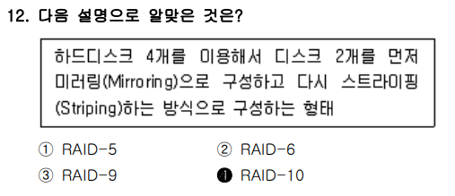

### ✅ 문제 분석 및 개념 정리

---

#### 🔷 **문제 핵심 요점**

> “**디스크 4개를 사용하여 먼저 미러링(Mirroring), 이후 스트라이핑(Striping)** 하는 RAID 구성은?”

이 설명은 **복합 RAID 형태**, 특히 **RAID 10 (1+0)** 의 정의를 정확히 이해하고 있는지를 묻는 문제입니다.

---

### 🧠 출제 의도 해석

- RAID는 데이터 **안정성**과 **속도**를 위해 여러 디스크를 조합하는 기술입니다.
- RAID 10은 **RAID 1 (미러링)** + **RAID 0 (스트라이핑)** 을 결합한 방식입니다.

  - **먼저 RAID 1로 미러링** → 이후 **RAID 0으로 스트라이핑**

이 12번 문제의 핵심은 바로 **미러링(Mirroring)** 과 **스트라이핑(Striping)** 개념을 정확히 이해하는 것입니다.
지문에서 언급된 “디스크 2개씩 미러링하고, 그 후 스트라이핑한다”는 구조가 의미하는 바를 그림과 함께 구조적으로 풀어드리겠습니다.

---

## ✅ 문제 지문 요약

```
“하드디스크 4개를 이용해서 디스크 2개를 먼저 **미러링(Mirroring)**으로 구성하고,
다시 스트라이핑(Striping)하는 방식”
```

→ 이건 RAID 10 구조입니다.

---

<br>
<br>
<br>

# 개념 부터 정리!

## 🔸 1. **미러링 (Mirroring)** 개념

> ❝**같은 데이터를 두 개의 디스크에 복사**해서 저장하는 방식❞

- 데이터를 쓰면 → **두 디스크에 동시에 동일한 내용 기록**
- 디스크 하나가 고장나도 **다른 디스크에서 복구 가능**
- 대표적으로 **RAID 1**에서 사용

### 예시 (RAID 1 구조):

```
쓰기 작업: "A"

  → 디스크1: A
  → 디스크2: A   ← 복제본

📌 안전성 높음. 하지만 저장 공간은 반으로 줄어듦.
```

---

## 🔸 2. **스트라이핑 (Striping)** 개념

> ❝**데이터를 조각내서 여러 디스크에 분산 저장**하는 방식❞

- 데이터를 블록 단위로 나눠서 디스크 여러 개에 **순차적으로 배분**
- 병렬로 읽고 쓰기 때문에 **속도 빠름**
- 대표적으로 **RAID 0**에서 사용

### 예시 (RAID 0 구조):

```
쓰기 작업: ABCD
  → 디스크1: A, C
  → 디스크2: B, D

📌 성능 빠름. 하지만 디스크 하나라도 고장 나면 전체 데이터 손실.
```

---

## ✅ 3. 문제에 나온 구조 = **RAID 10**

> ❝먼저 2개씩 **미러링**한 후, 그 묶음을 **스트라이핑**하는 방식❞

### RAID 10 구조 예시 (디스크 4개 기준):

```
RAID 1 (미러링) 조합 2쌍:
  → [디스크1, 디스크2]  = 미러 쌍 A
  → [디스크3, 디스크4]  = 미러 쌍 B

그 후 RAID 0 (스트라이핑):
  → 데이터를 미러 쌍 A와 B에 번갈아 저장
```

📌 이 구조는 **성능 + 안정성 모두 잡은 고급 방식**입니다.

---

## ✅ 시각적 정리

```
쓰기 작업: 블록1, 블록2, 블록3, 블록4

스트라이핑:
  블록1 → 미러쌍 A → 디스크1, 디스크2
  블록2 → 미러쌍 B → 디스크3, 디스크4
  블록3 → 미러쌍 A → 디스크1, 디스크2
  블록4 → 미러쌍 B → 디스크3, 디스크4
```

---

## ✅ 결론 한 줄 요약

**미러링은 데이터를 복제해서 안전성을 높이고, 스트라이핑은 데이터를 나눠 성능을 높이며, RAID 10은 이 둘을 결합해 성능과 안정성을 모두 확보한 방식이다.** ✅

---

### 📌 각 RAID 방식 비교 정리

| RAID 종류         | 구조 설명                           | 장점                | 최소 디스크 수 |
| ----------------- | ----------------------------------- | ------------------- | -------------- |
| **RAID 0**        | 스트라이핑만 (속도↑)                | 빠름, 장애에 취약   | 2              |
| **RAID 1**        | 미러링만 (복구용)                   | 안정성↑, 저장 효율↓ | 2              |
| **RAID 5**        | 스트라이핑 + 패리티 분산            | 효율+복구 균형      | 3              |
| **RAID 6**        | RAID 5 + 이중 패리티                | 복구 강화           | 4              |
| **RAID 10** (1+0) | **먼저 미러링, 그 위에 스트라이핑** | 고속 + 고안정       | 4              |
| **RAID 01** (0+1) | 먼저 스트라이핑, 그 위에 미러링     | RAID 10보다 안정성↓ | 4 이상         |
| **RAID 9**        | 공식 표준 없음                      | –                   | –              |

---

### 🔍 보기별 분석

| 보기 | RAID 유형   | 구조 설명                      | 맞/틀 |
| ---- | ----------- | ------------------------------ | ----- |
| ①    | RAID 5      | 패리티 기반 복구 (미러링 없음) | ❌    |
| ②    | RAID 6      | 이중 패리티 → 미러링과 무관    | ❌    |
| ③    | RAID 9      | **존재하지 않는 RAID 표준**    | ❌    |
| ④    | **RAID 10** | **미러링 후 스트라이핑**       | ✅    |

---

### ✅ 결론 한 줄 요약

**미러링 후 스트라이핑 방식은 RAID 10이므로, 정답은 ④번이다.**

<br>
<br>
<br>

# 📍

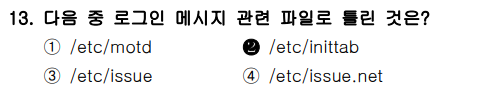

### ✅ 문제 분석 및 개념 정리

---

#### 🔷 **문제 핵심 요점**

> “**로그인 메시지 관련 파일**이 아닌 것은 무엇인가?”
> 즉, 보기 중에서 **로그인 시 표시되는 텍스트 메시지 출력과 무관한 파일**을 골라야 합니다.

---

### 🧠 출제 의도 해석

이 문제는 리눅스 로그인 과정에서 보여지는 **"시스템 환영 메시지", "배너 메시지", "경고 문구" 등**이 어디에 설정되어 있는지를 구분하는지를 묻습니다.

- `/etc/motd`, `/etc/issue`, `/etc/issue.net`은 전형적인 **로그인 관련 메시지 파일**
- `/etc/inittab`은 **init 시스템에서 runlevel, 프로세스 관리**를 담당하는 설정 파일 → 로그인 메시지와는 **무관**

---

### 📌 각 파일의 역할 정리

| 파일명           | 용도                                               | 로그인 메시지 관련성 |
| ---------------- | -------------------------------------------------- | -------------------- |
| `/etc/motd`      | Message of the Day, 로그인 후 표시되는 안내 메시지 | ✅ 있음              |
| `/etc/issue`     | 로그인 **이전**에 표시되는 배너 메시지 (로컬 콘솔) | ✅ 있음              |
| `/etc/issue.net` | 원격 텔넷/SSH 접속 시 배너 메시지                  | ✅ 있음              |
| `/etc/inittab`   | SysVinit에서 runlevel 및 getty 실행 정의           | ❌ 없음              |

---

### 🔍 보기별 분석

| 보기 | 파일명           | 용도                                    | 맞/틀         |
| ---- | ---------------- | --------------------------------------- | ------------- |
| ①    | `/etc/motd`      | 로그인 직후 시스템 메시지 출력          | ✅            |
| ②    | `/etc/inittab`   | runlevel 설정 파일 (로그인 메시지 아님) | ❌ (**정답**) |
| ③    | `/etc/issue`     | 로그인 전 로컬 배너 메시지              | ✅            |
| ④    | `/etc/issue.net` | 텔넷/SSH 원격 접속 시 배너 메시지       | ✅            |

---

### ✅ 결론 한 줄 요약

**`/etc/inittab`은 runlevel 설정 파일로 로그인 메시지와는 무관하므로, 정답은 ②번이다.**

<br>
<br>
<br>

# 📍

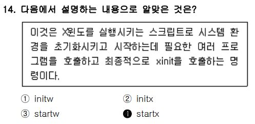

### ✅ 문제 분석 및 개념 정리

---

#### 🔷 **문제 핵심 요점**

> “**X 윈도(X Window System)** 를 실행시키는 스크립트이며, 시스템 환경을 초기화하고 `xinit`을 호출하는 명령은?”

문제에서 설명하는 기능은 **`startx` 명령어**에 대한 전형적인 정의입니다.

---

### 📌 핵심 개념 정리

#### 🔸 `startx`

- **사용자가 X 윈도 환경(GUI)을 시작할 때 사용하는 명령어**

- 내부적으로는 다음 과정을 자동화:

  1. `.xinitrc` 또는 시스템 기본 설정을 로드
  2. 필요한 환경 변수 및 백그라운드 프로그램(예: 윈도 매니저, 바탕화면 등)을 실행
  3. **최종적으로 `xinit`을 호출**하여 X 서버를 시작함

- 즉, `xinit`은 **저수준 도구**, `startx`는 **편의성 스크립트**

---

### 🔍 보기별 분석

| 보기 | 명령어   | 설명                                  | 정답 여부 |
| ---- | -------- | ------------------------------------- | --------- |
| ①    | `initw`  | 존재하지 않는 명령어                  | ❌        |
| ②    | `initx`  | 실제 명령어 아님, `xinit`과 혼동 가능 | ❌        |
| ③    | `startw` | `startx`의 오타, 실제 명령어 아님     | ❌        |
| ④    | `startx` | **GUI 환경을 시작하는 대표 명령어**   | ✅        |

---

### ✅ 결론 한 줄 요약

**X 윈도 환경을 초기화하고 실행하는 명령어는 `startx`이므로, 정답은 ④번이다.**

<br>
<br>
<br>

# 📍

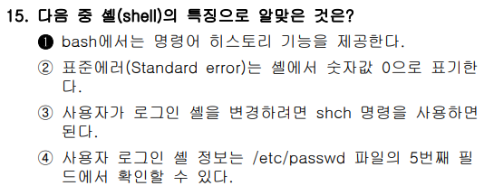

### ✅ 문제 분석 및 개념 정리

---

#### 🔷 **문제 핵심 요점**

> “**셸(shell)** 의 특징에 대한 설명 중 올바른 것은?”

즉, **bash 셸과 관련된 기본 개념, 표준 입출력, 로그인 셸 정보 등**에 대해 정확히 알고 있는지를 묻는 문제입니다.

---

### 📌 셸과 관련된 핵심 개념 정리

| 항목                      | 설명                                                      |
| ------------------------- | --------------------------------------------------------- |
| **bash**                  | Bourne Again Shell, 가장 널리 쓰이는 리눅스 기본 셸       |
| **명령어 히스토리**       | `bash`는 이전 명령을 저장해서 ↑ 방향키 등으로 재실행 가능 |
| **표준 입력(STDIN)**      | 파일 디스크립터 번호: `0`                                 |
| **표준 출력(STDOUT)**     | 파일 디스크립터 번호: `1`                                 |
| **표준 에러(STDERR)**     | 파일 디스크립터 번호: `2`                                 |
| **사용자 로그인 셸 정보** | `/etc/passwd`의 **7번째 필드**                            |
| **셸 변경 명령어**        | `chsh` (change shell)                                     |

---

### 🔍 보기별 상세 분석

#### ✅ ① "bash에서는 명령어 히스토리 기능을 제공한다." → **정답**

- `bash`는 기본적으로 **명령어 이력(history)** 기능 제공

  - 예: ↑ 방향키, `history`, `!123` 등

---

#### ❌ ② "표준에러(Standard error)는 셸에서 숫자값 0으로 표기한다."

- **오답**
- `0`은 **표준 입력(STDIN)**
- `2`가 **표준 에러(STDERR)**

---

#### ❌ ③ "사용자가 로그인 셸을 변경하려면 shch 명령을 사용하면 된다."

- **오타 및 잘못된 명령어**
- **정확한 명령어는 `chsh`** (change shell)

---

#### ❌ ④ "사용자 로그인 셸 정보는 /etc/passwd 파일의 5번째 필드에서 확인할 수 있다."

- **틀림**
- `/etc/passwd` 필드는 **: (콜론)** 으로 구분되며,

| 필드 번호 | 의미          |
| --------- | ------------- |
| 1         | 사용자명      |
| 2         | 암호 (x 등)   |
| 3         | UID           |
| 4         | GID           |
| 5         | 설명 (GECOS)  |
| 6         | 홈 디렉터리   |
| 7         | **로그인 셸** |

➡ **로그인 셸은 7번째 필드!**

---

### 🧾 정리

| 보기 | 설명 요약                                         | 맞/틀 | 이유                 |
| ---- | ------------------------------------------------- | ----- | -------------------- |
| ①    | bash는 명령어 히스토리 제공                       | ✅    | 기본 기능            |
| ②    | stderr = 0? → ❌ (2가 맞음)                       | ❌    | 파일 디스크립터 오류 |
| ③    | `shch` 명령? → ❌ (정답은 `chsh`)                 | ❌    | 명령어 오타          |
| ④    | 로그인 셸은 `/etc/passwd`의 5번째? → ❌ (7번째임) | ❌    |                      |

---

### ✅ 결론 한 줄 요약

**bash는 명령어 히스토리 기능을 제공하므로, 정답은 ①번이다.**

<br>
<br>
<br>

# 📍

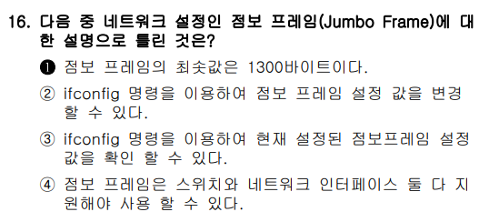

### ✅ 문제 분석 및 개념 정리

---

#### 🔷 **문제 핵심 요점**

> "**점보 프레임(Jumbo Frame)** 에 대한 설명 중 **틀린 것**은?"

즉, **이더넷 프레임의 크기 확장 관련 기술**과 관련된 **기본 지식과 조건**을 이해하고 있는지를 묻는 문제입니다.

---

### 📌 점보 프레임 (Jumbo Frame) 기본 개념

#### ✅ 점보 프레임(Jumbo Frame)이란?

- 기본 Ethernet 프레임(MTU = 1500바이트)을 넘는, 훨씬 큰 데이터 프레임을 사용하는 기술입니다.

#### 📌 일반 이더넷 프레임:

- 기본 전송 단위 (MTU, Maximum Transmission Unit) = 1500 바이트
  - \*Transmission : 전송, 전달, 송신

#### 📌 점보 프레임:

- MTU 크기를 9000바이트 또는 그 이상으로 설정
- 즉, 한 번에 더 많은 데이터를 보내는 방법

<br>

| 항목                                    | 설명                                                                      |
| --------------------------------------- | ------------------------------------------------------------------------- |
| **기본 이더넷 프레임 크기**             | **MTU 1500바이트 (기본값)**                                               |
| **점보 프레임**                         | MTU를 **1500보다 크게 설정**한 프레임 (보통 **9000바이트**까지)           |
| **목적**                                | 네트워크 성능 향상 (CPU 부하 감소, 대역폭 효율 증가 등)                   |
| **조건**                                | 네트워크 경로상의 모든 장비(스위치, NIC 등)가 **점보 프레임 지원**해야 함 |
| **명령어**                              | `ifconfig` 또는 `ip` 명령으로 MTU 설정 가능                               |
| **최소값?**                             | ❌ 점보 프레임은 최소값이 정해져 있는 기술이 아님                         |
| → 1300바이트는 **기본 이더넷보다 작음** |                                                                           |

---

### 🔍 보기별 상세 분석

#### ❌ ① "점보 프레임의 최소값은 1300바이트이다." → **틀린 설명 (정답)**

- 점보 프레임은 **1500바이트를 초과**하는 프레임을 의미
- 1300은 **오히려 기본보다 작은 값**
- **명확한 최소값 기준은 없음**, 보통 1500 초과이면 점보로 간주

➡ **정답**

---

#### ✅ ② "ifconfig 명령을 이용하여 점보 프레임 설정 값을 변경할 수 있다."

```bash
ifconfig eth0 mtu 9000 up
```

- `mtu` 옵션으로 MTU 값을 조절하여 점보 프레임 활성화 가능

---

#### ✅ ③ "ifconfig 명령을 이용하여 현재 설정된 점보 프레임의 설정 값을 확인할 수 있다."

```bash
ifconfig eth0
```

- 출력 정보에 `MTU:XXXX` 항목 포함

---

#### ✅ ④ "점보 프레임은 스위치와 네트워크 인터페이스 둘 다 지원해야 사용할 수 있다."

- 매우 중요!
- **하드웨어 모두가 점보 프레임을 지원해야 MTU 9000 설정이 효과 있음**

  - 스위치, 라우터, NIC, OS 등 전 구간 호환 필요

---

### 🧾 정리

| 보기 | 설명 요약                       | 맞/틀 | 이유               |
| ---- | ------------------------------- | ----- | ------------------ |
| ①    | 점보 프레임 최소값이 1300? → ❌ | ❌    | 1300은 오히려 작음 |
| ②    | `ifconfig`로 설정 가능          | ✅    | `mtu` 옵션         |
| ③    | `ifconfig`로 확인 가능          | ✅    | `MTU` 항목         |
| ④    | 하드웨어 전체 지원 필요         | ✅    | 조건 일치          |

---

### ✅ 결론 한 줄 요약

**점보 프레임은 1500바이트를 초과하는 값부터 적용되므로, ‘최소값 1300바이트’라는 ①번은 틀린 설명이다.**

<br>
<br>
<br>

# 📍

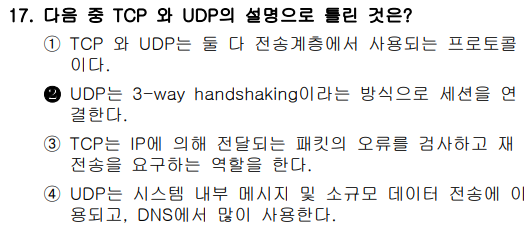

### ✅ 문제 분석 및 개념 정리

---

#### 🔷 **문제 핵심 요점**

> “**TCP와 UDP**의 차이점에 대한 설명 중 **틀린 것**은?”

핵심은 **TCP는 연결 지향**, **UDP는 비연결 지향**이라는 점이며,
특히 **세션 연결(3-way handshaking)** 개념은 **TCP에만 해당**됩니다.

---

### 📌 TCP vs UDP 비교 정리

| 항목            | TCP (Transmission Control Protocol)                  | UDP (User Datagram Protocol)              |
| --------------- | ---------------------------------------------------- | ----------------------------------------- |
| **방식**        | 연결 지향(Connection-oriented) / (3-way handshaking) | 비연결 지향(Connectionless)               |
| **신뢰성**      | 보장 (오류 검사, 재전송, 순서 보장)                  | 보장하지 않음 (단순 송신)                 |
| **속도**        | 느림 (제어 과정 많음)                                | 빠름 (간단한 구조)                        |
| **핵심 개념**   | **3-way Handshaking**으로 연결 수립                  | 없음                                      |
| **사용 예**     | HTTP, FTP, SSH, 웹, 이메일, 파일전송 등              | DNS, VoIP, 스트리밍, 실시간 게임, SNMP 등 |
| **데이터 순서** | 맞춰서 도착 (순서보장)                               | 순서 뒤바뀔 수 있음                       |
| 속도            | 느림 (확실하게 보냄)                                 | 빠름 (그냥 던지고 끝)                     |

---

### 🔍 보기별 상세 분석

#### ✅ ① "TCP와 UDP는 둘 다 전송계층에서 사용되는 프로토콜이다."

- 정확한 설명
- TCP와 UDP 모두 OSI 7계층 중 **전송 계층(4계층)** 에 해당

---

#### ❌ ② "UDP는 3-way handshaking이라는 방식으로 세션을 연결한다." → **정답**

- ❌ 잘못된 설명
- **3-way handshaking은 TCP 전용 절차**이며, UDP는 연결 자체가 필요 없는 **비연결형 프로토콜**
- UDP는 **세션 연결이 없음**, 즉 데이터를 **그냥 보내는 구조**

---

#### ✅ ③ "TCP는 IP에 의해 전달되는 패킷의 오류를 검사하고 재전송을 요구하는 역할을 한다."

- 맞는 설명
- TCP는 수신한 데이터에 대해 ACK 전송 및 **오류 발생 시 재전송 요구 기능** 내장

---

#### ✅ ④ "UDP는 시스템 내부 메시지 및 소규모 데이터 전송에 이용되고, DNS에서 많이 사용한다."

- 맞는 설명
- DNS, DHCP, SNMP, TFTP 등은 대부분 **UDP 기반**
- 빠른 응답성과 단순한 구조가 필요할 때 사용됨

---

### 🧾 정리

| 보기 | 설명 요약                          | 맞/틀 | 비고              |
| ---- | ---------------------------------- | ----- | ----------------- |
| ①    | 둘 다 전송계층                     | ✅    | OSI 4계층         |
| ②    | UDP가 3-way handshaking?           | ❌    | **TCP 전용 절차** |
| ③    | TCP는 오류 검사 및 재전송          | ✅    | 신뢰성 제공       |
| ④    | UDP는 소규모/내부 통신용, DNS 포함 | ✅    | 대표 사용 예      |

---

### ✅ 결론 한 줄 요약

**UDP는 비연결형 프로토콜이므로 ‘3-way handshaking’을 한다는 ②번은 틀린 설명이다.**

<br>
<br>
<br>

# 📍

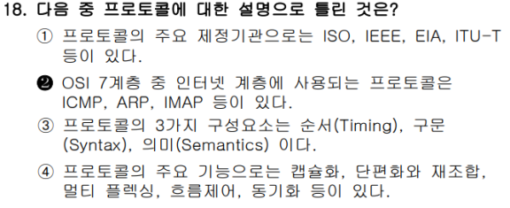

다음은 첨부하신 **리눅스마스터 1급 1차 기출문제 제18번**에 대한 구조적 이해 기반 분석입니다.

---

### ✅ 문제 분석 및 개념 정리

---

#### 🔷 **문제 핵심 요점**

**“다음 중 프로토콜에 대한 설명으로 틀린 것은?”** 을 묻는 문제.

이 문제는 단순 암기가 아닌 **통신 프로토콜의 계층 구조, 동작 원리, 표준화 기관, 기능**에 대한 **기초 개념의 정확한 이해**를 테스트합니다.

---

### 🧠 출제 의도 해석

이 문제는 프로토콜에 대해 다음 세 가지 관점에서 정확히 알고 있는지를 묻습니다:

1. **프로토콜이 무엇이며**, 어떤 **구성 요소**를 가지는지
2. **프로토콜의 기능과 목적**
3. **OSI 7계층 구조에서 각 프로토콜이 어느 계층에 속하는지**

오답을 골라내기 위해서는 **IMAP의 계층 위치**를 정확히 알고 있어야 합니다.

---

### 📌 기본 개념 정리

#### 1. **프로토콜(Protocol)이란?**

* 컴퓨터나 네트워크 장비 간 **데이터를 교환하는 규칙, 약속**
* 일종의 **통신 언어**

#### 2. **OSI 7계층과 주요 프로토콜 예시**

| 계층 | 계층 이름     | 주요 프로토콜 예시                 |
| -- | --------- | -------------------------- |
| 7  | 응용 계층     | HTTP, FTP, SMTP, IMAP, DNS |
| 4  | 전송 계층     | TCP, UDP                   |
| 3  | 네트워크 계층   | IP, ICMP, ARP, IGMP        |
| 2  | 데이터 링크 계층 | Ethernet, PPP, MAC         |

※ IMAP은 이메일을 가져올 때 사용되는 **응용 계층** 프로토콜입니다.

---

### 🔍 보기별 상세 분석

#### ❌ ② OSI 7계층 중 인터넷 계층에 사용되는 프로토콜은 ICMP, ARP, IMAP 등이 있다.

* **틀린 이유**:

  * ICMP, ARP는 **네트워크 계층(3계층)** 에 속합니다.
  * 그러나 **IMAP은 응용 계층(7계층)** 에 속합니다.
* 즉, 하나의 계층(인터넷 계층)에 포함되지 않는 프로토콜들을 섞어 놓았음.
* **IMAP을 인터넷 계층(=네트워크 계층)으로 분류한 것이 명백한 오류**입니다.

→ **정답: ②번**

---

#### ✅ ① 프로토콜의 주요 제정기관으로는 ISO, IEEE, EIA, ITU-T 등이 있다.

* 정확한 설명입니다.
* 각 기관은 다음과 같은 역할을 합니다:

  * **ISO**: 국제표준화기구 (OSI 모델을 제안)
  * **IEEE**: 전기전자기술자협회 (802.3, 802.11 등)
  * **EIA**: 미국전자산업협회 (RS-232C 등)
  * **ITU-T**: 국제전기통신연합 표준화 부문 (통신표준 제정)

---

#### ✅ ③ 프로토콜의 3가지 구성요소는 순서(Timing), 구문(Syntax), 의미(Semantics)이다.

* **정확한 정의입니다.**
* 각 구성요소의 의미:

  * **Syntax**: 데이터의 구조 (패킷 형식, 필드 순서 등)
  * **Semantics**: 의미와 제어 정보 (요청/응답 방식 등)
  * **Timing**: 데이터 전송 타이밍 (속도, 순서, 흐름 제어 등)

---

#### ✅ ④ 프로토콜의 주요 기능으로는 캡슐화, 단편화와 재조합, 멀티플렉싱, 흐름제어, 동기화 등이 있다.

* 프로토콜의 일반적인 기능들을 잘 나열함.
* 간단히 각 개념 설명:

| 기능명         | 설명                             |
| ----------- | ------------------------------ |
| **캡슐화**     | 상위 계층 데이터에 헤더를 붙여 하위 계층에 전달    |
| **단편화/재조합** | 큰 데이터를 작게 나눠 전송하고 수신 측에서 재조립   |
| **멀티플렉싱**   | 여러 응용 프로그램 데이터를 하나의 전송 경로로 다중화 |
| **흐름 제어**   | 송수신 속도 불일치를 조정하여 패킷 손실 방지      |
| **동기화**     | 송수신 장비 간 타이밍 맞추기               |

---

### 🧾 정리

| 보기 | 설명                 | 정오    |
| -- | ------------------ | ----- |
| ①  | 주요 제정기관 정확히 기술     | ✔️ 맞음 |
| ②  | IMAP을 인터넷 계층으로 오분류 | ❌ 틀림  |
| ③  | 프로토콜의 3요소 정확히 설명   | ✔️ 맞음 |
| ④  | 프로토콜 기능 정확히 설명     | ✔️ 맞음 |

---

### ✅ 결론 한 줄 요약

**IMAP은 OSI 응용 계층에 해당하므로, ②번 설명은 틀렸다.**


<br>
<br>
<br>

# 📍


다음은 첨부하신 **리눅스마스터 1급 1차 기출문제 제19번**의 구조적 분석입니다.

---

### ✅ 문제 분석 및 개념 정리

---

#### 🔷 **문제 핵심 요점**

**“IPv6 주소에서 각 블록을 구분하는 구분자 기호는 무엇인가?”** 를 묻는 문제.

이 문제는 **IPv6 주소 형식에 대한 정확한 이해**를 요구합니다.

---

### 🧠 출제 의도 해석

IPv6는 기존 IPv4 주소 공간의 한계를 극복하기 위해 도입된 차세대 IP 주소 체계입니다.
이 문제는 단순히 기호를 외우는 것이 아니라, **IPv6 주소가 어떤 구조로 되어 있는지를 알고 있는지**를 확인하는 문제입니다.

---

### 📌 기본 개념 정리

#### 1. **IPv4와 IPv6의 주소 구조 비교**

| 항목    | IPv4                     | IPv6                                      |
| ----- | ------------------------ | ----------------------------------------- |
| 주소 길이 | 32비트                     | 128비트                                     |
| 표기 방식 | 십진수 4개 블록, **점(.)으로 구분** | 16비트 8개 블록, **콜론(:)으로 구분**                |
| 예시    | `192.168.0.1`            | `2001:0db8:85a3:0000:0000:8a2e:0370:7334` |

---

### 🧠 IPv6 주소 구문 설명

* **128비트 주소**를 16비트씩 8개 **헥사(16진수) 블록**으로 나누어 표현합니다.

* 각 블록은 **콜론 (:)** 으로 구분합니다.

* 예시:

  ```
  2001:0db8:0000:0042:0000:8a2e:0370:7334
  ```

* 연속된 0 블록은 `::` 로 축약 가능 (단, **하나의 구간에서만 가능**)

  ```
  2001:0db8::8a2e:0370:7334
  ```

---

### 🔍 보기별 상세 분석

#### ❌ ① 콤마(,)

* IP 주소에서 **전혀 사용되지 않는 기호**입니다. 오답입니다.

#### ✅ ② 콜론(:)

* **IPv6 주소의 블록 구분자**로 사용됩니다.
* 정확한 정답입니다.

#### ❌ ③ 세미콜론(;)

* 명령어 구분 등에 쓰이는 기호이며 IP 주소에서는 **사용되지 않음**.

#### ❌ ④ 피어리어드(.)

* 이는 **IPv4 주소의 구분자**입니다. (예: `192.168.0.1`)
* **IPv6와는 무관**합니다.

---

### 🧾 정리

| 보기         | 설명                           | 정/오 |
| ---------- | ---------------------------- | --- |
| ① 콤마(,)    | IP 주소에서 사용되지 않음              | ❌   |
| ② 콜론(:)    | **IPv6의 각 블록을 구분하는 공식 구분자**  | ✅   |
| ③ 세미콜론(;)  | 명령어 구분자일 뿐, IP 주소에서는 사용되지 않음 | ❌   |
| ④ 피어리어드(.) | **IPv4 주소 구분자**로만 사용됨        | ❌   |

---

### ✅ 결론 한 줄 요약

**IPv6 주소는 각 블록을 콜론(:)으로 구분하므로, 정답은 ②번이다.**


<br>
<br>
<br>

# 📍

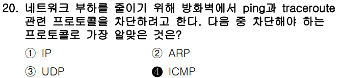

다음은 첨부하신 **리눅스마스터 1급 1차 기출문제 제20번**의 구조적 분석입니다.

---

### ✅ 문제 분석 및 개념 정리

---

#### 🔷 **문제 핵심 요점**

**"방화벽에서 ping과 traceroute를 차단하기 위해 어떤 프로토콜을 막아야 하는가?"** 를 묻는 문제입니다.

핵심 키워드는 다음과 같습니다:

* **ping** → 네트워크 도달 여부 확인
* **traceroute** → 목적지까지 거치는 경로 추적
* 공통적으로 사용되는 프로토콜: **ICMP**

---

### 🧠 출제 의도 해석

이 문제는 단순히 "프로토콜 이름 외우기"가 아니라 다음 내용을 알고 있는지를 확인합니다:

1. **ping/traceroute 명령이 어떻게 동작하는지**
2. 이들 명령이 사용하는 **저수준 네트워크 프로토콜**
3. 실제 방화벽 설정에서 어떤 프로토콜을 차단하는 것이 효과적인지

---

### 📌 기본 개념 정리

#### 1. **ICMP(Internet Control Message Protocol)**

* **IP 프로토콜의 부가 기능 프로토콜**
* 네트워크의 **오류 메시지 전달**, **상태 확인**, **경로 정보 제공** 등의 기능 수행
* 대표적으로 사용되는 명령어:

  * `ping`: **ICMP Echo Request / Reply** 메시지를 사용해 응답 시간 측정
  * `traceroute`: 목적지까지 **ICMP Time Exceeded 메시지** 등을 통해 경로 추적

#### 2. **다른 보기와의 비교**

| 프로토콜       | 설명                                                     |
| ---------- | ------------------------------------------------------ |
| **① IP**   | 네트워크 계층의 기본 프로토콜이지만, `ping`의 핵심 동작에는 **직접적으로 관련 없음**   |
| **② ARP**  | 주소 결정 프로토콜. MAC 주소 ↔ IP 주소 매핑. **ping/traceroute와 무관** |
| **③ UDP**  | 전송 계층 프로토콜. `traceroute`의 변형에서는 사용되지만 **기본은 ICMP 기반**  |
| **④ ICMP** | `ping`과 `traceroute`의 **핵심 프로토콜** — 차단 대상 ✔            |

---

### 🔍 보기별 상세 분석

#### ❌ ① IP

* ICMP는 IP 위에서 동작하지만, IP 전체를 차단하면 모든 통신이 차단됨.
* **과도한 조치**이며 `ping`만 차단할 수 없음.

#### ❌ ② ARP

* 로컬 네트워크에서 **MAC 주소 ↔ IP 주소**를 매핑하기 위한 프로토콜.
* `ping`과 직접적인 관련 없음.

#### ❌ ③ UDP

* 일부 OS에서는 `traceroute`가 **UDP 패킷을 전송한 후**, ICMP 오류를 수신하는 방식으로 동작함.
* 하지만 **ping에는 사용되지 않으며**, **ICMP가 더 직접적인 원인**임.

#### ✅ ④ ICMP

* `ping`은 ICMP Echo Request/Reply
* `traceroute`는 TTL 초과로 인한 ICMP Time Exceeded 메시지를 활용
* **정확한 차단 대상 프로토콜**

---

### 🧾 정리

| 보기     | 설명                                    | 차단 대상 여부 |
| ------ | ------------------------------------- | -------- |
| ① IP   | 너무 광범위하게 차단되며, ping/traceroute만 막지 못함 | ❌        |
| ② ARP  | MAC 주소 해석용. ICMP와 무관                  | ❌        |
| ③ UDP  | traceroute 일부 구현 방식에 쓰이지만, 핵심 아님      | ❌        |
| ④ ICMP | ping과 traceroute의 핵심 프로토콜             | ✅        |

---

### ✅ 결론 한 줄 요약

**ping과 traceroute를 차단하려면 ICMP 프로토콜을 방화벽에서 차단해야 하므로, 정답은 ④번이다.**
