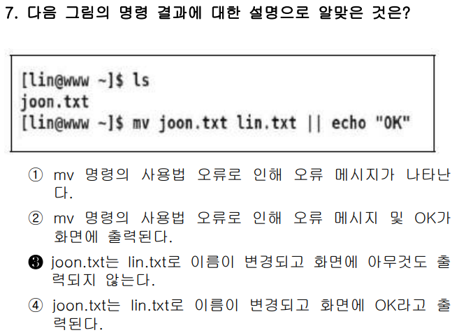

<br>
<br>
<br>

# 📍


### ✅ 문제 분석 및 개념 정리

---

#### 🔷 **문제 핵심 요점**

문제는 다음 조건을 만족하는 **라이선스 유형**을 묻고 있습니다.

> 공개 소프트웨어 중 하나를 선택해서 **상업용 제품을 만들고**,
> **수정된 소스 코드에 대한 공개나 표시를 하지 않으려 한다.**

이 말은 곧 다음 조건을 만족하는 라이선스를 찾으라는 뜻입니다.

- ✅ 상업용 사용 **허용**
- ✅ 소스코드 수정 **허용**
- ✅ 수정한 소스코드의 **공개 의무 없음**

즉, **굉장히 자유로운 라이선스**를 뜻합니다.

---

### 🧠 출제 의도 해석

이 문제는 단순히 "BSD가 뭐였지?"를 묻는 암기형 문제가 아닙니다.

다양한 **오픈소스 라이선스의 제약 조건**을 실제 활용 관점에서 비교하고,
"상업화 시 어떤 제약이 있는지"를 이해하고 있는지를 확인하려는 문제입니다.

---

### 📌 기본 개념 정리: 주요 라이선스 비교

| 라이선스                                         | 상업적 사용 | 수정 후 소스 공개 의무        | 특징                                          |
| ------------------------------------------------ | ----------- | ----------------------------- | --------------------------------------------- |
| **GPL** (General Public License)                 | 가능        | **반드시 공개해야 함**        | 카피레프트 강력 적용. 파생물도 GPL 따라야 함  |
| **LGPL** (Lesser General Public License)         | 가능        | 동적 링크만 공개 요함         | 라이브러리에 적합. 약한 카피레프트            |
| **MPL** (Mozilla Public License)                 | 가능        | **수정한 파일만 공개하면 됨** | 모질라 라이선스. 파일 단위로 카피레프트 적용  |
| **BSD** (Berkeley Software Distribution License) | 가능        | **공개 의무 없음**            | 가장 자유로움. 출처만 명시하면 수정/상업화 OK |

---

### 🔍 보기별 상세 분석

#### ❌ ① GPL (GNU General Public License) (공개된 일반적인 사용 허가서)

- 상업적 사용 가능은 맞지만,
- 소스코드를 수정했을 경우, **수정한 소스를 반드시 공개해야 합니다.**
- 특히 **파생 저작물에도 반드시 GPL 적용**해야 하는 강한 카피레프트 라이선스입니다.
- **오답 이유**: 소스 공개를 원하지 않으므로 조건 불충족

#### ❌ ② MPL (Mozilla Public License) (공개된 모질라 사용 허가서)

- 소스코드를 수정해도 **해당 수정된 파일만 공개하면 됩니다.**
- 비교적 유연한 편이지만, **공개 의무는 여전히 존재**합니다.
- **오답 이유**: "수정된 소스에 대한 어떠한 표시도 하지 않으려 한다"는 조건에 맞지 않음

#### ✅ ③ BSD (Berkeley Software Distribution License) (버클리 소프트웨어 배포 허가서)

- **상업적 사용 자유**
- **수정 가능**
- **수정 후 공개 의무 없음**
- 단, 출처(저작권자) 표기만 하면 자유롭게 사용 가능
- **정답 이유**: 문제 조건(상업용 + 소스 공개 없음)에 정확히 일치

#### ❌ ④ LGPL (GNU Lesser General Public License) (일반적으로 공개된 제한적인 사용 허가서 사용 허가서)

- 동적 링크 방식으로는 공개 의무가 적지만,
- 정적 링크나 코드 수정 시에는 **일부 소스 공개 의무**가 발생할 수 있음
- 라이브러리 개발에 적합한 라이선스
- **오답 이유**: 여전히 공개 의무 존재

---

### 🧾 정리

| 보기 | 라이선스 | 소스코드 공개 의무        | 상업적 사용 | 정답 여부 |
| ---- | -------- | ------------------------- | ----------- | --------- |
| ①    | GPL      | **공개 필수**             | 가능        | ❌        |
| ②    | MPL      | **파일 단위 공개**        | 가능        | ❌        |
| ③    | BSD      | **공개 의무 없음**        | 가능        | ✅        |
| ④    | LGPL     | **링크 방식에 따라 공개** | 가능        | ❌        |

---

### ✅ 결론 한 줄 요약

**수정한 소스를 공개하지 않고 상업적으로 활용하려면, 가장 자유로운 BSD 라이선스를 선택해야 한다.**

<br>
<br>
<br>

# 📍


### ✅ 문제 분석 및 개념 정리

---

#### 🔷 **문제 핵심 요점**

> "다음 중 나머지 셋과 **다른 종류**에 속하는 리눅스 배포판은?"

즉, **공통 기반이 다른 리눅스를 고르는 문제**입니다.

문제의 핵심은 다음과 같은 **배포판 계열(family)** 지식을 기반으로 합니다:

- **Ubuntu 계열인지?**
- **Debian 계열인지?**
- **Slackware 계열인지?**

---

### 🧠 출제 의도 해석

이 문제는 리눅스 배포판을 단순 나열해 암기한 것이 아니라,
**각 배포판이 어느 상위 계열(family)에 속하는지를 이해했는지**를 테스트하는 문제입니다.

즉, "배포판 간 계보(tree 구조)를 알고 있느냐?"를 보는 문제입니다.

---

### 📌 각 보기별 배포판 계열 분석

#### ✅ ① Ubuntu

- **Debian 기반** 대표 배포판
- 가장 대중적이며, 데스크탑/서버 모두에 널리 사용
- 우분투 자체가 하나의 큰 계열로 성장함

#### ✅ ② Linux Mint

- **Ubuntu 기반** 배포판
- Ubuntu의 사용성을 높인 버전 (GUI, 멀티미디어 코덱 등 포함)
- Ubuntu의 모든 저장소와 패키지 시스템을 공유함

#### ✅ ③ Elementary OS

- **Ubuntu 기반**의 배포판
- 사용자 경험(UX)을 강조한 미려한 UI가 특징
- `Pantheon`이라는 자체 데스크탑 환경 사용

#### ❌ ④ Vector Linux → **정답**

- **Slackware 기반** 배포판
- Ubuntu와 Debian 계열이 아님
- 경량화된 성능 위주의 배포판 (저사양 PC용 등)
- `slapt-get` 등 독자적인 패키지 관리 방식 사용

---

### 🧾 정리

| 보기 | 배포판        | 계열               | 설명                                | 정답 여부 |
| ---- | ------------- | ------------------ | ----------------------------------- | --------- |
| ①    | Ubuntu        | Debian 계열        | 가장 대중적인 Debian 기반 리눅스    | ❌        |
| ②    | Linux Mint    | Ubuntu → Debian    | Ubuntu를 기반으로 GUI 사용성 강화   | ❌        |
| ③    | Elementary OS | Ubuntu → Debian    | 미려한 UX, Ubuntu 기반              | ❌        |
| ④    | Vector Linux  | **Slackware 계열** | 경량화, Ubuntu/Debian과 무관한 계열 | ✅        |

---

### ✅ 결론 한 줄 요약

**Vector Linux는 Slackware 계열로, 나머지 셋(Debian/Ubuntu 계열)과 다른 종류의 리눅스 배포판이다.**

---

## 🧭 주요 리눅스 배포판 계열 비교

| 계열명             | 대표 배포판                        | 계열의 기원 / 역사적 배경                                   | 주요 특징                                      |
| ------------------ | ---------------------------------- | ----------------------------------------------------------- | ---------------------------------------------- |
| **Debian 계열**    | **Debian, Ubuntu, Kali, Raspbian** | 1993년 Ian Murdock가 자유 소프트웨어 철학을 실현하고자 시작 | **안정성, 패키지 수, .deb 패키지 사용**        |
| **Ubuntu 계열**    | **Ubuntu, Linux Mint, Pop!\_OS**   | **Debian을 기반**으로 2004년 Canonical이 개발 시작          | **사용자 친화성, GUI 중심, 데스크탑에 최적화** |
| **Slackware 계열** | **Slackware, Salix, Zenwalk**      | 1993년 리눅스 초기 배포판 중 하나. Unix 전통 계승           | **보수적, 수동 설정 많음, 고급 사용자 지향**   |

---

### 🔹 1. **Debian 계열**

- 시작: 1993년, Ian Murdock
- 목적: **자유 소프트웨어 기반의 안정적 운영체제**
- 패키지: `.deb`, APT 패키지 관리자 사용
- 특징:

  - **매우 안정적**
  - 서버 환경에 많이 사용
  - 라이선스에 엄격 (비공개 드라이버는 비활성화됨)

- 대표 배포판: Debian, Kali Linux, Raspbian

---

### 🔹 2. **Ubuntu 계열** (Debian의 하위 계열)

- 시작: 2004년, Canonical Ltd.
- 기원: **Debian Unstable (sid)** 기반에서 파생
- 목적: 일반 사용자에게 친숙한 데스크탑 리눅스를 제공
- 특징:

  - **GUI 중심, 설치 쉬움**
  - 데스크탑, 서버, 클라우드 모두 지원
  - 정기적 릴리스 (6개월 주기 / LTS 2년 주기)

- 대표 배포판: Ubuntu, Linux Mint, Pop!\_OS

---

### 🔹 3. **Slackware 계열**

- 시작: 1993년, Patrick Volkerding
- 목적: **전통적인 UNIX와 유사한 리눅스를 만들기 위함**
- 특징:

  - **수동 설정 위주 (GUI 자동화 적음)**
  - 패키지 관리자 부재(또는 매우 기본적)
  - 최신 기술 반영 느림 → 안정성과 전통성 중시

- 대표 배포판: Slackware, Salix OS, Zenwalk

---

## ⚠️ 배포판 계열을 구분하는 기준은?

| 기준 구분 항목 | Debian 계열   | Ubuntu 계열        | Slackware 계열              |
| -------------- | ------------- | ------------------ | --------------------------- |
| 패키지 형식    | `.deb`        | `.deb`             | `.tgz` or 수동 설치         |
| 패키지 관리자  | `apt`         | `apt`              | `slackpkg`, `installpkg` 등 |
| 설정 방식      | 반자동 설정   | GUI 설정 지원      | 수동 설정 많음              |
| 타깃 사용자    | 서버/개발자용 | 초보자/일반 사용자 | 고급 사용자, 해커           |

---

## ✅ 결론 요약

| 질문                     | 답변 요약                                                                      |
| ------------------------ | ------------------------------------------------------------------------------ |
| **왜 각 계열이 생겼나?** | 사용자층과 철학이 달라서 생김 (자유 소프트웨어, 초보자 친화성, 유닉스 전통 등) |
| **무슨 차이가 있나?**    | **설정 방식, 패키지 형식, 자동화 수준, 철학**에서 차이                         |
| **Ubuntu는 무슨 계열?**  | Debian 기반 → Ubuntu → Mint, Pop!\_OS 등으로 확장된 **하위 계열**              |
| **Slackware는?**         | 가장 오래된 배포판 중 하나. **전통적인 UNIX 스타일**을 따르는 독립 계열        |

---

<br>
<br>
<br>

# 📍


### ✅ 문제 분석 및 개념 정리

---

#### 🔷 **문제 핵심 요점**

> "다음 중 **리눅스 기반** 운영체제로 **틀린 것**은?"

즉, 보기 중 **리눅스 커널을 사용하지 않는 운영체제**를 고르는 문제입니다.

---

### 🧠 출제 의도 해석

이 문제는 다음 두 가지 지식을 확인하기 위해 출제되었습니다:

1. **임베디드용 OS들의 커널 기반 구분**
2. **Linux 기반과 비-Linux 기반의 정확한 이해**

---

### 📌 보기별 커널 구조 분석

#### ✅ ① Tizen

- **리눅스 커널 기반** 운영체제
- 삼성과 인텔이 주도하여 개발
- 주로 스마트워치, 스마트 TV 등에 사용됨
- HTML5 지원에 강점

→ **Linux 기반 맞음**

---

#### ✅ ② webOS

- 원래 Palm 사가 개발 → 이후 LG가 인수
- 스마트 TV, IoT 기기에 사용
- **리눅스 커널 기반**
- Node.js 등 웹 기술 중심으로 구성

→ **Linux 기반 맞음**

---

#### ❌ ③ QNX → **정답**

- **마이크로커널 구조**를 갖는 **비-Linux 커널 운영체제**
- **POSIX 호환**이긴 하나, **리눅스 커널과는 완전히 별개**
- 실시간 운영체제(RTOS)
- 자동차 인포테인먼트 시스템, 의료 기기 등에서 널리 사용됨

→ ❌ **Linux 기반 아님** → **정답**

---

#### ✅ ④ GENIVI (현재: COVESA)

- 자동차 산업을 위한 **오픈소스 소프트웨어 프레임워크**
- **Linux 기반** IVI 시스템을 위한 표준화 프로젝트
- OS라기보다는 플랫폼 구조에 가깝지만, **기반 커널은 Linux**

→ **Linux 기반 맞음**

---

### 🧾 정리

| 보기 | 운영체제 | 커널 기반             | 리눅스 기반 여부 | 설명                                  | 정답 여부 |
| ---- | -------- | --------------------- | ---------------- | ------------------------------------- | --------- |
| ①    | Tizen    | **Linux 커널**        | ✅               | 스마트기기용 Linux 기반 OS            | ❌        |
| ②    | webOS    | **Linux 커널**        | ✅               | LG 스마트 TV 등에 사용되는 OS         | ❌        |
| ③    | QNX      | **자체 마이크로커널** | ❌               | RTOS, 리눅스와 별개 구조              | ✅        |
| ④    | GENIVI   | **Linux 커널**        | ✅               | 자동차용 Linux 기반 소프트웨어 플랫폼 | ❌        |

---

### ✅ 결론 한 줄 요약

**QNX는 자체 마이크로커널 기반의 운영체제로, 리눅스 커널을 사용하지 않으므로 정답이다.**

<br>
<br>
<br>

# 📍


### ✅ 문제 분석 및 개념 정리

---

#### 🔷 **문제 핵심 요점**

다음 그림에서 묘사된 클러스터링 방식은 무엇인가?

- 하나의 **Primary Node**가 서비스를 운영하고,
- **이상 발생 시 Backup Node가 서비스 인계**를 받아 동작
- 사용자(User)는 **장애 없이 서비스를 이용**함
- “이상 유무 체크”와 “서비스 이월”이라는 키워드

👉 이 구조는 대표적인 **고가용성(HA, High Availability) 클러스터**입니다.

---

### 🧠 출제 의도 해석

이 문제는 다음과 같은 개념의 이해를 묻고 있습니다:

- 장애 상황에 대응하는 **이중화/Failover** 구조의 핵심 원리
- 각 클러스터링 기술의 목적 차이
- 단순한 분산 처리가 아닌 **가용성 확보 목적의 구조 파악 능력**

---

### 📌 각 클러스터링 기법의 개념 비교

| **번호** | **클러스터링 기법**                | **목적**                  | **설명**                                                                   | **정답 여부** |
| -------- | ---------------------------------- | ------------------------- | -------------------------------------------------------------------------- | ------------- |
| ①        | 고계산용 클러스터 (HPC)            | 연산 성능 극대화          | 여러 컴퓨터가 병렬 연산 수행. 과학, 공학 시뮬레이션 등에 사용              | ❌            |
| ②        | 부하분산 클러스터 (Load Balancing) | 트래픽 분산               | 여러 서버에 요청을 분산시켜 성능 향상. 서비스는 동시에 여러 서버에서 제공  | ❌            |
| ③        | **고가용성 클러스터 (HA)**         | **서비스 연속성 확보**    | 하나가 죽으면 다른 노드가 **자동으로 takeover**하는 **Failover 중심 구조** | ✅            |
| ④        | 베어울프 클러스터 (Beowulf)        | 고계산 클러스터 구현 방식 | 저가 하드웨어(COTS)와 오픈소스를 조합해 병렬 연산 처리. HPC의 한 형태      | ❌            |

---

### 🔍 왜 정답은 **③ 고가용성 클러스터**인가?

- **주 노드(Primary)** 와 **대기 노드(Backup)** 가 존재하고
- 주 노드 이상 시, 대기 노드가 서비스 인계 (failover) → **고가용성(HA)의 핵심 특징**
- 서비스 중단 없이 장애에 자동 대응하는 구조
- 그림 설명 중 "**서비스를 이월받음**" → 핵심 힌트!

---

### ✅ 관련 개념 정리: 고가용성 클러스터링 (HA Cluster)

| 구성 요소        | 설명                                 |
| ---------------- | ------------------------------------ |
| **Primary Node** | 평소 서비스 제공 담당                |
| **Backup Node**  | 대기 상태로 지속적으로 상태 모니터링 |
| **Failover**     | 장애 시 백업 노드로 자동 전환        |
| **Heartbeat**    | 상태 감지용 주기적 체크 메커니즘     |

---

### 🧾 정리

- **그림 해석 포인트**:

  - 사용자 입장에선 중단 없이 서비스 제공됨
  - 장애 감지 시 자동 인계됨

- **이 구조는 Failover 중심의 고가용성 구조**
- 따라서 정답은 **③ 고가용성 클러스터**

---

### ✅ 결론 한 줄 요약

**주 서버에 장애가 발생하면 백업 서버가 자동으로 서비스를 이어받는 구조는 고가용성 클러스터이다.**

<br>
<br>
<br>

# 📍


### ✅ 문제 분석 및 개념 정리

---

#### 🔷 **문제 핵심 요점**

> 다음 중 **유닉스(UNIX)** 를 **개발한 인물**은 누구인가?

**"UNIX라는 운영체제를 만든 핵심 인물은 누구인가?"**
즉, **유닉스 역사와 주요 개발자**에 대한 이해를 묻는 문제입니다.

---

### 🧠 출제 의도 해석

이 문제는 리눅스와 유닉스를 혼동하지 않고 구분할 수 있는지를 테스트하며,
컴퓨터 운영체제 역사에서 중요한 인물과 그 업적을 알고 있는지를 묻고 있습니다.

---

### 📌 보기별 인물 분석

#### ❌ ① 리누스 토발즈 (Linus Torvalds)

- 1991년 **리눅스 커널(Linux Kernel)** 개발자
- 유닉스를 기반으로 한 무료 운영체제를 만들고자 함
- UNIX가 아니라, **UNIX-like** 시스템 개발자

→ **리눅스는 유닉스가 아님. 유닉스는 더 오래된 OS**
→ 오답

---

#### ✅ ② 켄 톰슨 (Ken Thompson) → **정답**

- **AT\&T 벨 연구소(Bell Labs)** 에서 근무
- **1970년대 초**, UNIX 개발의 **주요 개발자**
- **C언어의 창시자**인 데니스 리치(Dennis Ritchie)와 협업
- 최초의 유닉스 버전(UNICS)을 만들고 확장함

→ 유닉스의 실질적인 창시자 중 한 명
→ **정답**

---

#### ❌ ③ 벨 조이 (Bill Joy)

- BSD 유닉스를 만든 인물 중 하나
- `vi`, `csh` 등의 프로그램을 만든 뛰어난 개발자
- 하지만 **유닉스의 창시자**는 아님

→ 유닉스 확장/파생에는 기여했지만, 원 개발자는 아님
→ 오답

---

#### ❌ ④ 리처드 스톨먼 (Richard Stallman)

- 자유 소프트웨어 운동가
- **GNU 프로젝트** 시작 → “**유닉스와 비슷한 자유 운영체제**” 개발
- 유닉스 기반이 아닌, **대체 OS를 만들려는 운동**의 중심

→ UNIX 개발자가 아님
→ 오답

---

### 🧾 정리

| 보기 | 인물          | 업적/설명                            | 유닉스 개발 여부 | 정답 여부 |
| ---- | ------------- | ------------------------------------ | ---------------- | --------- |
| ①    | 리누스 토발즈 | 리눅스 커널 개발자 (1991)            | ❌               | ❌        |
| ②    | **켄 톰슨**   | **AT\&T 벨연구소, 유닉스 창시자**    | ✅               | ✅        |
| ③    | 벨 조이       | BSD 유닉스 파생 개발자               | ❌               | ❌        |
| ④    | 리처드 스톨먼 | GNU 프로젝트, 자유 소프트웨어 운동가 | ❌               | ❌        |

---

### ✅ 결론 한 줄 요약

**UNIX는 AT\&T 벨 연구소의 켄 톰슨이 데니스 리치와 함께 개발한 운영체제이다.**

<br>
<br>
<br>

# 📍


### ✅ 문제 분석 및 개념 정리

---

#### 🔷 **문제 핵심 요점**

> GRUB 부트로더의 설정 파일인 `grub.conf` 내용 중
> `default=1`, `timeout=100`이 의미하는 바를 정확히 설명한 것은?

즉, **부팅 대기 시간**과 **자동 선택되는 운영체제의 순서**를 묻는 문제입니다.

---

### 🧠 출제 의도 해석

이 문제는 `grub.conf`의 핵심 설정 항목을 정확히 이해했는지를 테스트합니다:

1. `default=1` → 부팅 항목 중 **몇 번째 항목을 자동 선택**할지
2. `timeout=100` → 사용자가 입력하지 않으면 **몇 초 후 자동 부팅**할지

→ **운영체제 부팅 순서와 시간 설정을 명확히 해석하는 능력**을 확인

---

### 📌 `grub.conf`의 주요 설정 항목

| 설정 항목   | 의미                                                         |
| ----------- | ------------------------------------------------------------ |
| `default=n` | 부팅 메뉴 항목 중 기본으로 부팅할 항목의 번호 (`0`부터 시작) |
| `timeout=n` | 몇 초 동안 부팅 메뉴를 보여줄지 (단위: 초)                   |

---

#### 🔍 문제에서 주어진 값

```bash
default=1
timeout=100
```

- `default=1` → **두 번째 부팅 항목**이 기본 선택됨 (`0`부터 시작)
- `timeout=100` → **100초 동안 기다린 후** 선택

---

### 🔍 보기별 상세 분석

#### ❌ ① 10초 동안 대기 후 1번째 항목 부팅 → ❌ `timeout` 틀림, `default` 틀림

#### ❌ ② 100초 후 1번째 항목 부팅 → ❌ `default` 틀림 (0번째 항목이 아님)

#### ❌ ③ 10초 후 2번째 항목 부팅 → ❌ `timeout` 틀림

#### ✅ ④ 100초 후 2번째 항목 부팅 → **정답**

- `timeout=100` → 100초 대기
- `default=1` → 2번째 항목 부팅

---

### 🧾 정리

| 보기 | 대기 시간 | 선택 항목  | 정답 여부 | 오답 사유 (해당 시)        |
| ---- | --------- | ---------- | --------- | -------------------------- |
| ①    | 10초      | 1번째(0번) | ❌        | timeout, default 모두 틀림 |
| ②    | 100초     | 1번째(0번) | ❌        | default 틀림               |
| ③    | 10초      | 2번째(1번) | ❌        | timeout 틀림               |
| ④    | 100초     | 2번째(1번) | ✅        | 모두 일치                  |

---

### ✅ 결론 한 줄 요약

**`default=1`, `timeout=100` 설정은 100초 대기 후 2번째 항목(1번 인덱스)을 자동 부팅함을 의미한다.**

<br>
<br>
<br>

# 📍



### ✅ 문제 분석 및 개념 정리

---

#### 🔷 **문제 핵심 요점**

> `mv joon.txt lin.txt || echo "OK"` 명령이 실행된 결과에 대해 올바른 설명을 고르시오.

**포인트는 두 가지입니다:**

1. `mv` 명령이 성공하는가?
2. `||` 연산자의 동작을 이해하고 있는가?

---

### 🧠 출제 의도 해석

이 문제는 다음 개념을 정확히 알고 있는지를 묻습니다:

- `mv` 명령의 기본 사용법 (파일 이름 변경)
- `||` (OR 연산자)의 **조건부 실행 방식**
- 표준 출력 결과 예측 능력

---

### 📌 명령어 구성 분석

```bash
mv joon.txt lin.txt || echo "OK"
```

#### ▶ `mv joon.txt lin.txt`

- `joon.txt` 파일의 이름을 `lin.txt`로 **변경(rename)**.
- 이 명령은 문법상 **정상적인 mv 사용법**입니다.

> `mv <기존파일> <새이름>`
> ✅ 정상 실행됨 (에러 없음)

---

#### ▶ `|| echo "OK"`

- `||`는 **앞의 명령이 실패(= 종료 코드 0이 아님)** 하면 뒤 명령 실행
- 즉, **`mv`가 실패해야만** `echo "OK"`가 실행됨
- 그런데 현재 `mv`는 **정상 실행**되므로 `echo "OK"`는 **실행되지 않음**

---

### 🧾 정리: 명령 실행 흐름

1. 현재 디렉토리에는 `joon.txt`만 존재
2. `mv joon.txt lin.txt` 실행 → **성공**
3. 따라서 `|| echo "OK"`는 **실행되지 않음**
4. 결과적으로, **출력은 아무것도 없음**

---

### 🔍 보기별 검토

| 보기 | 설명                                                | 정오 판별 | 이유                              |
| ---- | --------------------------------------------------- | --------- | --------------------------------- |
| ①    | mv 사용법 오류로 메시지 출력                        | ❌        | `mv`는 정상 구문                  |
| ②    | mv 오류로 OK 출력됨                                 | ❌        | `mv`는 성공하므로 `OK` 출력 안 됨 |
| ③    | ✅ `joon.txt` → `lin.txt`로 이름 변경되고 출력 없음 | ✅        | 문제 조건과 완전 일치             |
| ④    | 이름 변경되고 OK 출력됨                             | ❌        | `OK`는 출력되지 않음              |

---

### ✅ 결론 한 줄 요약

**`mv` 명령이 성공하면 `||` 뒤 명령은 실행되지 않으므로, `joon.txt`는 `lin.txt`로 바뀌고 출력은 없다.**

<br>
<br>
<br>

# 📍


### ✅ 문제 분석 및 개념 정리

---

#### 🔷 **문제 핵심 요점**

> **X 클라이언트 프로그램을 X 서버로 전송하기 위해 설정해야 하는 환경 변수는?**

이 문제는 **X Window System의 기본 구조**와
**클라이언트 → 서버로 GUI 출력을 전달하는 방식**을 알고 있는지를 묻는 문제입니다.

---

### 🧠 출제 의도 해석

이 문제는 단순한 변수 이름 암기보다도,

- X Server와 X Client의 **관계**
- 출력 경로를 지정하는 **환경변수 역할**
  을 **구조적으로 이해했는지** 확인하기 위한 문제입니다.

---

### 📌 핵심 개념: X Window System의 구조

| 구성 요소            | 역할                                                         |
| -------------------- | ------------------------------------------------------------ |
| **X Server**         | 키보드/마우스 입력 처리, 화면 출력 담당 (📺 **사용자 쪽**)   |
| **X Client**         | 응용 프로그램. `xclock`, `gedit` 등 (💻 **원격 실행**)       |
| **DISPLAY** 환경변수 | X Client가 **출력을 보낼 X Server 위치를 지정**하는 환경변수 |

> ✅ `DISPLAY`가 설정되어 있어야, X Client가 **"어디로 화면을 띄울지"** 알 수 있음

---

### 🔍 보기별 분석

| 보기          | 설명                                                 | 정답 여부 | 이유                 |
| ------------- | ---------------------------------------------------- | --------- | -------------------- |
| ① TERM        | 터미널 종류 설정 (`xterm`, `vt100` 등)               | ❌        | CLI 출력용. X와 무관 |
| ② XTERM       | 터미널 에뮬레이터 프로그램 이름                      | ❌        | 환경변수 아님        |
| ③ **DISPLAY** | **X Server 위치 지정용 환경변수**                    | ✅        | 정답                 |
| ④ TERMINAL    | 잘 알려지지 않은 환경변수 (터미널 명칭용으로 오용됨) | ❌        | 관련 없음            |

---

### ✅ 예시: DISPLAY 설정 방법

```bash
export DISPLAY=192.168.0.100:0.0
```

- 이 설정은 “내가 실행하는 GUI 프로그램을 **192.168.0.100의 0번 디스플레이로 출력하라**”는 의미입니다.
- `xclock`, `gedit` 같은 GUI 프로그램이 실행되면 해당 IP의 화면에 표시됨

  #### 📌 각 구성 요소 설명

  | 항목            | 의미                                                                                     |
  | --------------- | ---------------------------------------------------------------------------------------- |
  | `192.168.0.100` | X 서버가 실행 중인 **리모트 호스트의 IP 주소**                                           |
  | `:0`            | **디스플레이 번호(display number)** – X 서버 인스턴스 번호. 보통 `:0`은 첫 번째 인스턴스 |
  | `.0`            | **스크린 번호(screen number)** – 멀티 모니터 환경에서의 화면 번호. 대부분은 `0`          |

---

### ✅ 결론 한 줄 요약

**X 클라이언트 프로그램이 GUI 출력을 전송할 X 서버를 지정할 때는 `DISPLAY` 환경변수를 설정해야 한다.**

<br>
<br>
<br>

# 📍


### ✅ 문제 분석 및 개념 정리

---

#### 🔷 **문제 핵심 요점**

> 총 **6개의 하드디스크** 중 1개는 **스페어(spare)** 용도로 빼고,
> 나머지 5개로 **RAID-5**를 구성할 때,
> **실제 데이터 저장에 사용 가능한 디스크 비율은?**

이 문제는 **RAID-5의 저장 효율 계산**을
**여분 디스크까지 포함한 상황**에서 정확히 이해하고 있는지를 묻습니다.

---

### 🧠 출제 의도 해석

이 문제는 다음 2단계 사고를 요구합니다:

1. RAID-5의 구조적 특징 (패리티 디스크 1개 필요)
2. 스페어 디스크를 제외한 후 RAID 효율 계산

즉, 단순히 디스크 수만 보는 게 아니라
**사용 가능 용량 / 전체 디스크 수**로 비율을 계산할 수 있어야 합니다.

---

### 📌 RAID-5 기본 구조

- 디스크 **n개** 중 **1개는 패리티용**으로 사용됨
- 나머지 **n - 1개**만 **실제 데이터 저장 공간**으로 사용 가능

#### ✅ RAID-5 저장 효율 공식:

```
저장 가능 비율 = (n - 1) / n
```

---

### 📌 문제 상황 분석

- 총 디스크: 6개
- 이 중 1개는 **여분(스페어)** → 사용하지 않음
- RAID-5 구성 디스크: **5개**
- 따라서 RAID-5에서 **실제 사용 가능 디스크 수**: 5 - 1 = 4

---

### ✅ 저장 효율 계산

```
사용 가능 디스크 수 / 전체 디스크 수 = 4 / 6 = 0.666... = **66.7%**
```

---

### 🧾 정리

| 항목                  | 값        |
| --------------------- | --------- |
| 전체 디스크 수        | 6개       |
| 스페어 디스크 수      | 1개       |
| RAID-5 구성 디스크 수 | 5개       |
| 사용 가능한 디스크 수 | 4개       |
| 최종 비율             | **66.7%** |

---

### ✅ 결론 한 줄 요약

**총 6개 중 1개는 스페어, 5개로 RAID-5 구성 시 실제 데이터 저장에 사용되는 디스크 비율은 66.7%이다.**

<br>
<br>
<br>

# 📍


### ✅ 문제 분석 및 개념 정리

---

#### 🔷 **문제 핵심 요점**

> 다음 시그널 중 **번호값(signal number)** 이 **가장 큰 것**은?

---

### 🧠 출제 의도 해석

리눅스 및 유닉스 계열 운영체제에서 사용하는 시그널(signal)은

각각 고유한 **번호(signal number)** 를 가지며,

시그널 처리 순서나 우선순위, 트래핑 등에 직접적으로 사용됩니다.

이 문제는 단순 시그널 이름이 아니라, **시그널 번호까지 알고 있는지를 테스트**합니다.

---

### 📌 주요 시그널 번호 정리

| 시그널 이름 | 번호 | 의미                         |
| ----------- | ---- | ---------------------------- |
| **SIGINT**  | 2    | 인터럽트 (Ctrl + C)          |
| **SIGQUIT** | 3    | 종료 + 코어 덤프             |
| **SIGTERM** | 15   | 종료 요청 (기본 종료 시그널) |
| **SIGTSTP** | 20   | 일시 정지 (Ctrl + Z)         |

→ 시그널 번호 기준으로 비교하면 다음과 같습니다:

```
SIGINT (2) < SIGQUIT (3) < SIGTERM (15) < SIGTSTP (20)
```

---

### ✅ 정답은 **③ SIGTSTP**

가장 큰 번호인 **20**을 가진 시그널이기 때문입니다.

---

### 🧾 정리

| 보기 번호 | 시그널  | 번호 | 정답 여부 |
| --------- | ------- | ---- | --------- |
| ①         | SIGTERM | 15   | ❌        |
| ②         | SIGINT  | 2    | ❌        |
| ③         | SIGTSTP | 20   | ✅        |
| ④         | SIGQUIT | 3    | ❌        |

---

### ✅ 결론 한 줄 요약

**SIGTSTP의 시그널 번호는 20으로, 보기 중 가장 큰 번호를 가지므로 정답이다.**

<br>
<br>
<br>

# 📍


### ✅ 문제 분석 및 개념 정리

---

#### 🔷 **문제 핵심 요점**

> “부팅 시 프로세스가 **상주(daemon)** 하며 클라이언트 요청을 **항상 대기**하는 방식”의 용어는?

핵심 키워드는 다음과 같습니다:

- **부팅 시 실행**
- **메모리에 상주**
- **클라이언트 요청을 처리**
- **반복적 요청 처리에 적합**

이러한 특징을 가진 서버 실행 방식은 바로 **standalone(상주형)** 방식입니다.

---

### 🧠 출제 의도 해석

이 문제는 리눅스 시스템에서 서버 서비스가 **어떻게 구동되고**,

클라이언트 요청을 어떤 방식으로 처리하는지를 구별할 수 있는지를 묻는 문제입니다.

특히, **standalone 방식 vs 슈퍼데몬 방식(xinetd 등)** 에 대한 개념 이해를 확인하는 데 목적이 있습니다.

---

### 📌 개념 비교: Standalone vs. Inetd/xinetd

| 구분        | Standalone (정답)                       | inetd / xinetd (슈퍼데몬)           |
| ----------- | --------------------------------------- | ----------------------------------- |
| 실행 시점   | **부팅 시 실행되어 항상 메모리에 상주** | 요청이 들어올 때 **on-demand 실행** |
| 특징        | 빠른 응답, **빈번한 서비스에 적합**     | 메모리 절약, **드문 요청에 적합**   |
| 예시 서비스 | **HTTPD (Apache)**, SMTP 등             | finger, telnet 등                   |
| 처리 방식   | 데몬이 항상 요청 대기                   | 요청 시 서비스 프로세스 생성        |

---

### 🔍 보기별 분석

| 보기             | 설명                                     | 정답 여부 | 이유                    |
| ---------------- | ---------------------------------------- | --------- | ----------------------- |
| ① **exec**       | 명령 실행 함수 (시스템 콜 계열)          | ❌        | 실행 방식과 무관        |
| ② **inetd**      | 슈퍼데몬, on-demand 방식                 | ❌        | 상주 방식 아님          |
| ③ **xinetd**     | inetd의 확장형, 보안·로깅 향상           | ❌        | 상주 방식 아님          |
| ④ **standalone** | **상주형 실행 방식** — 부팅 시 데몬 실행 | ✅        | 문제 설명과 정확히 일치 |

🔹 `inetd` : Internet Service Daemon (인터넷 서비스 데몬)

🔹 `xinetd` : Extended Internet Service Daemon

- inetd의 강화 버전

- 보안, 로깅, 접근 제어 등의 기능 추가

- 설정 파일이 /etc/xinetd.conf 또는 /etc/xinetd.d/에 있음

---

### ✅ 결론 한 줄 요약

**클라이언트 요청을 상시 대기하며 처리하는 상주형 방식은 `standalone` 방식이다.**

좋습니다.
리눅스/유닉스 시스템에서 자주 등장하는 **"데몬(daemon)"** 이란 무엇인지, 아래와 같이 아주 쉽게 설명드릴게요.

---

## ✅ Daemon(데몬)이란?

> **백그라운드에서 조용히 동작하며, 특정 작업을 지속적으로 기다리고 수행하는 프로그램**.

### 📌 특징 요약

| 항목          | 설명                                                         |
| ------------- | ------------------------------------------------------------ |
| **실행 위치** | 사용자의 눈에 보이지 않는 **백그라운드**에서 실행됨          |
| **역할**      | **지속적으로 대기**하면서, 누군가 요청하면 바로 작업 처리    |
| **시작 시점** | 보통 **부팅할 때 자동 실행됨**                               |
| **예시**      | `sshd` (원격 접속), `httpd` (웹서버), `crond` (예약 작업) 등 |

---

### 🎯 예를 들어볼게요

#### 🔸 `sshd` – SSH 데몬

- SSH 접속 요청이 오면 이를 **항상 기다리다가**, 누가 접속하면 바로 응답
- 즉, **당신이 ssh로 접속하려 할 때 바로 처리해주는 애** = `sshd`

#### 🔸 `httpd` – Apache 웹 서버 데몬

- 누군가 웹 브라우저로 요청을 보내면 그 요청을 **항상 듣고 있다가**, 응답하는 역할
- 즉, **웹 페이지 보여주는 백그라운드 관리자**

---

### 🧠 이름이 왜 “데몬”인가요?

- **Daemon**은 원래 그리스 신화에서 **보이지 않지만 항상 존재하는 조력자**라는 뜻입니다.
- 컴퓨터에서도 **항상 백그라운드에 존재하며 사용자 대신 일을 처리**해주는 프로그램이기 때문에 이 이름이 붙었어요.

---

### 🔍 데몬 프로세스는 어떤 특징을 가질까?

| 특징                       | 설명                                                         |
| -------------------------- | ------------------------------------------------------------ |
| 터미널과 분리되어 있음     | 직접 실행한 터미널과 연결되지 않음 (`Ctrl+C` 눌러도 안 꺼짐) |
| 보통 이름이 `d`로 끝남     | `crond`, `httpd`, `sshd` 등                                  |
| PID가 있고, ps로 확인 가능 | \`ps -ef                                                     |

---

### ✅ 결론 한 줄 요약

**데몬(Daemon)은 리눅스에서 백그라운드에서 대기하며 요청이 오면 처리하는 조용한 도우미 프로그램이다.**

<br>
<br>
<br>

# 📍


### ✅ 문제 분석 및 개념 정리

---

#### 🔷 **문제 핵심 요점**

> **포어그라운드(foreground) 프로세스를 백그라운드(background)로 전환**할 때 사용하는 **키 조합은?**

즉, **현재 터미널에서 실행 중인 작업을 잠시 중단(suspend)** 하고,
**백그라운드로 보내기 위한 명령 또는 키 조작**에 대한 이해를 묻는 문제입니다.

---

### 🧠 출제 의도 해석

이 문제는 리눅스 셸 환경에서의 **프로세스 제어**에 대한 기본 지식을 묻습니다:

- 일시 중지 (`suspend`)
- 백그라운드로 전환 (`bg`)
- 포어그라운드 복귀 (`fg`)

---

### 📌 키 조합 기능 정리

| 키 조합        | 기능 설명                                                                                              |
| -------------- | ------------------------------------------------------------------------------------------------------ |
| **`Ctrl + C`** | 현재 포어그라운드 프로세스를 **강제 종료**                                                             |
| **`Ctrl + D`** | **EOF(End Of File)** 신호 전달 – 입력 종료 또는 셸 종료                                                |
| **`Ctrl + Z`** | 현재 포어그라운드 프로세스를 **일시 중지(suspend)** 상태로 전환 (→ `bg` 명령으로 백그라운드 실행 가능) |
| **`Ctrl + W`** | 터미널에서 단어 삭제 (텍스트 편집 키)                                                                  |

---

### ✅ 정답: **③ Ctrl + Z**

- `Ctrl + Z`는 현재 실행 중인 **포어그라운드 프로세스를 멈추고(suspend)**,
  작업을 **백그라운드로 전환 가능한 상태**로 만듭니다.
- 이후 `bg` 명령어로 실제 백그라운드 실행 가능

```bash
$ some_command
^Z                          # ← Ctrl + Z 누르면
[1]+  Stopped  some_command
$ bg                        # ← 백그라운드 전환
```

---

### 🧾 보기별 판단

| 보기 | 키 조합      | 동작                                    | 정답 여부 | 이유             |
| ---- | ------------ | --------------------------------------- | --------- | ---------------- |
| ①    | Ctrl + C     | 프로세스 **종료**                       | ❌        | 종료는 전환 아님 |
| ②    | Ctrl + D     | 입력 종료 / 셸 종료                     | ❌        | EOF 처리일 뿐    |
| ③    | **Ctrl + Z** | ✅ **일시 정지 → 백그라운드 전환 가능** | ✅        | 정답             |
| ④    | Ctrl + W     | 단어 삭제 (편집 기능)                   | ❌        | 프로세스와 무관  |

---

### ✅ 결론 한 줄 요약

**포어그라운드 프로세스를 백그라운드로 전환하려면 `Ctrl + Z`로 일시 정지한 뒤 `bg` 명령으로 실행해야 한다.**

<br>
<br>
<br>

# 📍


### ✅ 문제 분석 및 개념 정리

---

#### 🔷 **문제 핵심 요점**

> **장치 파일명의 종류가 나머지 셋과 다른 것**은?

**장치 파일명**이란 리눅스에서 하드웨어 장치를 `/dev` 디렉터리 하에
**파일 형태로 추상화**하여 접근할 때 쓰이는 **디바이스 이름 형식**을 말합니다.

---

### 🧠 출제 의도 해석

이 문제는 **저장 장치의 연결 방식과 리눅스 장치 파일명 규칙**을 이해하고 있는지를 확인합니다.

즉, 단순히 “디스크 종류”만 아는 게 아니라
**리눅스에서 어떤 파일명(`/dev/xxx`)으로 표시되는지**를 알고 있는지를 테스트합니다.

---

### 📌 리눅스 장치 파일명 매핑

| 디스크 종류         | 연결 방식                      | 리눅스 장치 파일명 형태        |
| ------------------- | ------------------------------ | ------------------------------ |
| **IDE 디스크**      | `/dev/hd[a-d]`                 | → **`hd`** 로 시작             |
| **SCSI 디스크**     | `/dev/sd[a-z]`                 | → `sd`로 시작                  |
| **SATA 디스크**     | `/dev/sd[a-z]`                 | → `sd`로 시작 (SCSI 방식 사용) |
| **SSD (SATA/NVMe)** | `/dev/sd[a-z]` or `/dev/nvme*` | → 대부분 `sd` or `nvme` 시작   |

---

### ✅ 핵심 포인트

- **IDE 디스크만** `hd` 접두어 사용
- 나머지 세 가지(SCSI, SATA, SSD)는 **모두 `sd` 또는 `nvme`** 접두어 사용

---

### 🧾 보기 분석

| 보기 | 디스크 종류 | 장치 파일명              | 나머지와 다른가?           | 정답 여부 |
| ---- | ----------- | ------------------------ | -------------------------- | --------- |
| ①    | **IDE**     | `/dev/hd[a-d]`           | ✅ `hd` 접두어 → **다름**  | ✅ 정답   |
| ②    | SCSI        | `/dev/sd[a-z]`           | ❌ 동일한 `sd` 접두어 사용 | ❌        |
| ③    | SATA        | `/dev/sd[a-z]`           | ❌ 동일한 `sd` 접두어 사용 | ❌        |
| ④    | SSD         | `/dev/sd*`, `/dev/nvme*` | ❌ 현대적 `sd`/`nvme` 사용 | ❌        |

---

### ✅ 결론 한 줄 요약

**IDE 디스크는 `/dev/hd*`로 표시되어 나머지 디스크들의 `/dev/sd*`와 다른 장치 파일명을 사용하므로 정답이다.**

좋습니다.
"**장치 파일명이 다르다**"는 말은, **리눅스에서 해당 장치를 식별하는 방식(접두어 네이밍 규칙)이 다르다**는 뜻입니다.

---

## ✅ 장치 파일명이라는 건 뭘까?

리눅스에서는 **모든 장치를 `/dev` 디렉터리 아래의 "파일"처럼 다룹니다.**

이 장치 파일을 통해 실제 하드웨어에 접근하게 되는데,

이때 하드웨어 종류마다 **이름 규칙(접두어)이 정해져** 있습니다.

예를 들어:

- **IDE 하드디스크**: `/dev/hd[a-d]` → **`hd`로 시작**
- **SCSI/SATA/SSD 디스크**: `/dev/sd[a-z]` → **`sd`로 시작**
- **NVMe SSD**: `/dev/nvme0n1` → **`nvme`로 시작**

✅ IDE 하드디스크란?

> IDE(Integrated Drive Electronics) 하드디스크는
> 1980~2000년대 초반까지 PC에서 널리 사용된 하드디스크 인터페이스 규격입니다.

✅ SCSI 디스크란?

> SCSI (Small Computer System Interface) 디스크는
> 고속 데이터 전송을 지원하기 위해 서버, 워크스테이션 등에서 주로 사용되는 스토리지 인터페이스 규격

---

## ✅ "파일명이 다르다"는 말의 정확한 의미

| 항목                | 의미                                                                      |
| ------------------- | ------------------------------------------------------------------------- |
| **장치**            | 실제 컴퓨터에 연결된 저장장치 (IDE, SCSI, SATA, SSD 등)                   |
| **장치 파일명**     | 리눅스에서 이 장치를 접근하는 **파일 경로 이름** (`/dev/hd*`, `/dev/sd*`) |
| **파일명이 다르다** | **접두어가 다르다** = **다른 방식의 장치로 인식된다**는 뜻                |

---

## 🔍 예시로 설명

```plaintext
/dev/hd0    → IDE 하드디스크 (Integrated Drive Electronics)
/dev/sda    → SCSI, SATA, SSD
/dev/nvme0n1 → NVMe SSD
```

이런 파일명들은 리눅스가:

- 이 장치를 어떤 인터페이스(SATA, SCSI, NVMe 등)로 인식했는지
- 그리고 어떤 방식으로 접근할지를 결정하기 위한 **장치 구분자 역할**을 합니다.

---

## ✅ 이 문제에서의 의미

문제는 다음을 묻는 겁니다:

> "이 중에서, 나머지 3개와 **접두어 네이밍 규칙이 다른 장치**는?"

→ 답은 `① IDE 디스크` = `/dev/hd*`
→ 나머지 ②③④는 전부 `/dev/sd*` 또는 `/dev/nvme*` 방식으로 **같은 계열 규칙**을 따릅니다.

---

### ✅ 결론 한 줄 요약

**"장치 파일명이 다르다"는 말은 해당 장치를 식별하는 `/dev` 경로 이름의 접두어(`hd`, `sd`, `nvme` 등)가 달라, 리눅스가 다른 종류의 장치로 취급한다는 뜻입니다.**

<br>
<br>
<br>

# 📍


### ✅ 문제 분석 및 개념 정리

---

#### 🔷 **문제 핵심 요점**

> **"런레벨 5 부팅 시 사용자 로그인 정보를 받아 세션을 시작하는 구성 요소는?"**

이 설명은 다음 특징을 포함합니다:

- **런레벨 5 (Runlevel 5)**: GUI 환경으로 부팅
- **로그인 화면 제공**
- **사용자 인증 수행**
- **세션(예: GNOME, KDE) 시작을 트리거**

이런 기능을 담당하는 구성 요소는 바로 **디스플레이 매니저(Display Manager)** 입니다.

---

### 🧠 출제 의도 해석

이 문제는 리눅스 GUI 구성 요소 중에서도 **사용자 인증과 세션 시작을 담당하는 핵심 컴포넌트**가 무엇인지를 묻습니다.

즉, 아래 요소들을 정확히 구별할 수 있어야 합니다:

- **디스플레이 매니저 (로그인 화면 + 세션 관리)**
- **윈도 매니저 (창 배치와 조작)**
- **데스크탑 환경 (GUI 전체 환경)**
- **X 프로토콜 (입출력 전송을 위한 프로토콜)**

---

<br>
<br>

**런레벨(Runlevel) 5**는 리눅스에서 **시스템이 부팅되었을 때 어떤 상태로 진입할지 결정하는 부팅 모드** 중 하나입니다.

아주 쉽게 말하면:

> **"부팅되자마자 GUI 환경(그래픽 화면)으로 진입하는 모드"** 입니다.

---

## ✅ 런레벨(Runlevel) 기본 개념

리눅스는 부팅될 때 **init 프로세스**가 시스템 상태를 정합니다.
이 상태를 \*\*"런레벨(runlevel)"\*\*이라고 부릅니다.

각 숫자에 따라 **다른 부팅 목적**을 가집니다:

| Runlevel | 의미                               | 설명                            |
| -------- | ---------------------------------- | ------------------------------- |
| 0        | **시스템 종료**                    | shutdown 시 사용                |
| 1        | **단일 사용자 모드 (Single user)** | 복구/점검용, root만 사용        |
| 3        | **멀티유저 (콘솔 모드)**           | GUI 없이 텍스트 기반 로그인     |
| **5**    | **멀티유저 + GUI 로그인**          | ✅ 데스크탑 환경(GNOME, KDE 등) |
| 6        | **재부팅**                         | reboot 시 사용                  |

---

### ✅ Runlevel 5 = GUI 로그인 환경

- 부팅 후 자동으로 `gdm`, `lightdm`, `sddm` 같은 **디스플레이 매니저 실행**
- 사용자는 **그래픽 로그인 화면**을 보고 마우스로 로그인 가능
- 보통 **데스크탑 배포판(Ubuntu Desktop, CentOS GNOME 등)** 에서 사용됨

---

## 🔍 systemd에서는 runlevel 대신 target 사용

최근 리눅스 배포판(systemd 기반)에서는 `runlevel 5` 대신 아래처럼 표현합니다:

| 전통적인 runlevel | systemd target 이름 |
| ----------------- | ------------------- |
| 3                 | `multi-user.target` |
| **5**             | `graphical.target`  |

```bash
# 현재 실행 중인 target 확인
systemctl get-default

# 런레벨 5와 동일한 환경으로 설정
sudo systemctl set-default graphical.target
```

✅ sudo란?

> superuser do 의 줄임말로,
> **"관리자 권한(root 권한)으로 명령을 실행하라"**

---

### ✅ 결론 한 줄 요약

**런레벨 5는 리눅스 시스템이 부팅될 때 자동으로 GUI 그래픽 로그인 화면으로 진입하도록 설정된 모드입니다.**

### 📌 각 보기별 구성 요소 기능 비교

| 보기                    | 구성 요소                                          | 주요 역할                      | 정답 여부 |
| ----------------------- | -------------------------------------------------- | ------------------------------ | --------- |
| ① 데스크톱 환경         | GNOME, KDE 등 전체 GUI 환경 구성                   | 로그인 이전이 아니라 이후 구성 | ❌        |
| ② 윈도 매니저           | 창의 위치/크기/전환 제어 (예: Metacity, i3)        | 로그인 이후 창 관리 전용       | ❌        |
| ③ **디스플레이 매니저** | **로그인 화면 제공, 세션 실행** (ex. GDM, LightDM) | ✅ 문제 설명과 일치            | ✅        |
| ④ X 프로토콜            | X 서버와 클라이언트 간 그래픽 전송 방식            | 로그인과 무관한 통신 프로토콜  | ❌        |

---

### ✅ 디스플레이 매니저란?

| 항목 | 설명                                         |
| ---- | -------------------------------------------- |
| 기능 | GUI 로그인 화면 제공, 사용자 인증, 세션 시작 |
| 예시 | `GDM`, `LightDM`, `SDDM`, `XDM` 등           |
| 연동 | 인증 후 X 세션 및 데스크탑 환경 실행 트리거  |

---

### ✅ 결론 한 줄 요약

**런레벨 5에서 로그인 화면을 제공하고 세션을 시작하는 구성 요소는 디스플레이 매니저이다.**

<br>
<br>
<br>

# 📍


### ✅ 문제 분석 및 개념 정리

---

#### 🔷 **문제 핵심 요점**

> **"바로 직전에 실행한 명령을 다시 실행"할 때 사용하는 명령어는?**

즉, 리눅스 셸에서 **가장 최근에 실행했던 명령을 반복 실행**하려면 어떤 명령을 쓰는지 묻는 문제입니다.

---

### 🧠 출제 의도 해석

이 문제는 리눅스/유닉스 셸 환경에서의 **명령어 이력(history)** 활용 능력을 평가합니다.

- `history` 명령으로 과거 명령어를 확인 가능
- `!`(bang)을 이용해 이전 명령어를 빠르게 재실행할 수 있음

---

### 📌 각 명령어 비교

| 명령어       | 기능 설명                                            |
| ------------ | ---------------------------------------------------- |
| `!!`         | ✅ **가장 최근 명령어 1개를 즉시 재실행**            |
| `!0`         | 첫 번째 단어 (예: `sudo`)만 재실행 → 일반적으로 무효 |
| `!1`         | `history`에서 **1번 번호**에 해당하는 명령어 실행    |
| `history -1` | `-1` 옵션 없음 (에러 발생) → 잘못된 명령어           |

좋습니다.
`!0` 명령어는 리눅스 셸(Bash)에서 **이전 명령어의 "첫 번째 단어"만 다시 실행**하라는 의미입니다.

---

## ✅ `!0`이란?

> `!0` = **이전에 실행한 명령어의 첫 단어만 꺼내서 실행하라**는 뜻입니다.

> 여기서 `0`은 **히스토리에서 명령어를 공백 기준으로 나눈 첫 번째 단어** (즉, 명령 자체)를 뜻합니다.

---

## 📌 예시로 설명

```bash
$ tar -xvf archive.tar
```

- 이 명령어에서 첫 단어(`$0`)는 `tar`입니다.

그다음 이렇게 입력하면:

```bash
$ !0
```

→ 해석: **"방금 전에 썼던 명령어의 첫 단어(tar)만 다시 실행하라"**

실행 결과:

```bash
$ tar
```

→ 단순히 `tar` 명령어만 다시 실행된 것이고, 인자(`-xvf archive.tar`)는 포함되지 않습니다.

---

## 📌 비교: `!!` vs `!0`

| 명령어 | 의미                             | 실행 결과 (위 예제 기준) |
| ------ | -------------------------------- | ------------------------ |
| `!!`   | **직전 명령 전체** 재실행        | `tar -xvf archive.tar`   |
| `!0`   | **직전 명령의 첫 단어만** 재실행 | `tar`                    |

---

### 🔍 추가 예시

```bash
$ python3 myscript.py
```

- `!!` → `python3 myscript.py` 전체 재실행
- `!0` → `python3` 만 다시 실행됨

---

## ✅ 결론 한 줄 요약

**`!0`은 직전에 입력한 명령의 첫 단어만 꺼내 실행하는 것으로, 전체 명령이 아닌 "명령어 이름만" 반복할 때 사용합니다.**

---

### 🔍 정답: **③ !!**

```bash
$ echo Hello
Hello

$ !!
echo Hello
Hello
```

> echo는 "메아리"처럼 내가 입력한 내용을 그대로 다시 출력해주는 명령어이며, 영어에서도 "되풀이하다"는 뜻

- `!!`는 **직전 명령 전체**를 다시 실행함
- 매우 자주 사용되는 **히스토리 단축 명령어**

---

### 🧾 보기별 분석

| 보기 | 명령어       | 설명                            | 정답 여부 | 비고                |
| ---- | ------------ | ------------------------------- | --------- | ------------------- |
| ①    | `!0`         | 첫 단어 반복 (정상 동작 어려움) | ❌        | 혼동 주의           |
| ②    | `!1`         | `history`의 1번 항목 실행       | ❌        | 항상 직전 명령 아님 |
| ③    | `!!`         | ✅ **직전 명령어 전체 재실행**  | ✅        | 정답                |
| ④    | `history -1` | 잘못된 옵션 (존재하지 않음)     | ❌        | 에러 발생           |

---

### ✅ 결론 한 줄 요약

**직전에 실행한 명령을 다시 실행하려면 `!!` 명령어를 사용한다.**

<br>
<br>
<br>

# 📍


### ✅ 문제 분석 및 개념 정리

---

#### 🔷 **문제 핵심 요점**

> **C 클래스 IP 주소를 2개의 네트워크로 나눴을 때 총 호스트 수가 252개라면, 적절한 서브넷 마스크 접두어는?**

즉, **사용 가능한 호스트 수가 252개**가 되려면
**서브넷 마스크(/?)는 몇 비트여야 하는가**를 묻는 문제입니다.

---

### 🧠 출제 의도 해석

이 문제는 IP 서브넷팅 개념에서 가장 기본적인 원리를 이해했는지를 확인합니다:

1. **C 클래스 주소 = 기본적으로 /24 (255.255.255.0)**
2. 네트워크를 **2개로 나누었다는 것** → **1비트를 서브넷팅**했다는 뜻 → `/25`
3. `/25` → 각 네트워크당 호스트 수 계산 → 총 252개

<br>
<br>
<br>
<br>

`서브넷 마스크(subnet mask)`가 **왜 네트워크를 나타내는지**,

그리고 **‘서브넷 마스크’라는 이름이 무슨 뜻인지**를

완전 쉽게, 단계적으로 설명드릴게요.

---

## ✅ 먼저 용어부터 풀자

| 용어            | 뜻                                                               |
| --------------- | ---------------------------------------------------------------- |
| **Subnet**      | **Sub-network (하위 네트워크)** 의 줄임말                        |
| **Mask**        | **가리다, 구분하다**는 뜻의 마스크(mask)                         |
| **Subnet Mask** | IP 주소 중에서, **어디까지가 네트워크 영역인지 표시해주는 도구** |

---

## ✅ 왜 필요한가?

### 문제 상황

- IP 주소만 봐서는 **어디까지가 네트워크고**,
  **어디부터가 개별 컴퓨터(호스트)인지** 알 수 없음

예:

```
192.168.10.25 ← 이게 IP 주소인데,
이 중 어떤 부분이 네트워크이고, 어떤 부분이 호스트일까?
```

> 그래서 **어디까지가 "같은 네트워크"인가를 구분해주는 마스크**가 필요합니다.

> 이게 바로 **Subnet Mask**입니다!

---

## ✅ 예시로 설명 (가장 쉬운 예)

```plaintext
IP 주소:         192.168.10.25
서브넷 마스크:   255.255.255.0    ← 즉 /24
```

이 뜻은:

- 앞의 `192.168.10`까지는 **네트워크 주소**
- 뒤의 `25`는 **호스트 번호**

> 즉, 이 서브넷 마스크는
> "IP 주소의 앞 24비트는 네트워크로 보고, 뒤 8비트는 호스트로 봐!"
> 라고 알려주는 **구분선 역할**을 하는 거예요.

---

## ✅ '마스크(mask)'라는 말의 뜻

마스크(mask)는 **필터, 선택, 구분**의 의미입니다.

> IP 주소에서 "이 앞부분은 네트워크로 취급할게!"
> 라고 표시하는 **비트 필터(가림막)** 인 거죠.

그래서 `Subnet Mask`는:

- **"어디까지가 같은 네트워크인지 알려주는 구분선"** 역할을 하고
- 이 구분선 덕분에 컴퓨터는 **IP 주소들을 네트워크별로 나눌 수 있습니다**

---

## ✅ /24, /25 같은 건 뭘 의미해?

- `/24` → 서브넷 마스크가 **앞에서부터 24비트가 1로 채워졌다는 뜻**

  - 11111111.11111111.11111111.00000000
  - 즉, **255.255.255.0**

- `/25` → 앞 25비트가 네트워크, 나머지 7비트는 호스트

> 이 숫자는 **마스크의 크기**이자, **네트워크 범위의 크기를 결정**합니다.

---

## ✅ 그림 없이 정리 요약

| 항목             | 설명                                                      |
| ---------------- | --------------------------------------------------------- |
| 서브넷 마스크란? | IP 주소 중에서 네트워크/호스트 부분을 **나눠주는 기준선** |
| 왜 필요할까?     | 같은 네트워크인지 판단하고, 라우팅하려면 필요함           |
| 마스크의 뜻은?   | **구분해주는 필터**, 어디까지가 네트워크인지 알려줌       |
| `/24`의 의미는?  | **앞 24비트는 네트워크, 나머지 8비트는 호스트**           |

---

### ✅ 결론 한 줄 요약

**서브넷 마스크는 IP 주소에서 ‘어디까지가 네트워크이고 어디부터가 호스트인지’를 구분해주는 필터 역할을 하며,**

**이 구분선 덕분에 네트워크를 나눌 수 있습니다.**

---

### 📌 서브넷별 호스트 수 공식

```bash
사용 가능 호스트 수 = 2^(32 - 서브넷 비트수) - 2
```

- `-2`는 **네트워크 주소와 브로드캐스트 주소**를 제외하기 때문

#### ✅ /25 계산:

- `32 - 25 = 7비트` → `2^7 = 128`
- **사용 가능한 호스트 수 = 128 - 2 = 126**
- 그런데 **2개 네트워크**로 나누면 → `126 * 2 = 252`

---

### 🧾 보기별 분석

| 보기    | 접두어 | 호스트 수 (1개 네트워크당) | 전체 호스트 수 (2개 네트워크) | 정답 여부 |
| ------- | ------ | -------------------------- | ----------------------------- | --------- |
| ① `/24` | 254    | 254                        | 254                           | ❌        |
| ② `/25` | 126    | 126 × 2 = **252**          | ✅                            | ✅        |
| ③ `/26` | 62     | 62 × 4 = 248               | ❌                            | ❌        |
| ④ `/27` | 30     | 30 × 8 = 240               | ❌                            | ❌        |

---

### ✅ 결론 한 줄 요약

**C 클래스 주소를 /25로 나누면 126 × 2 = 총 252개의 호스트를 사용할 수 있다.**

<br>
<br>
<br>

# 📍


### ✅ 문제 분석 및 개념 정리

---

#### 🔷 **문제 핵심 요점**

> `netstat` 명령에서 **State 값이 `ESTABLISHED`** 일 때
> 해당 TCP 연결의 상태 설명으로 **올바른 것은?**

---

### ✅ 1. established 뜻 (영어 원뜻)

| 형태            | 품사   | 뜻                              |
| --------------- | ------ | ------------------------------- |
| **established** | 형용사 | **확립된, 성립된, 자리를 잡은** |

- 동사형은 establish = 설립하다, 세우다, 확립하다
- 과거분사형 established = “이미 확립된 상태”

---

### 🧠 출제 의도 해석

이 문제는 TCP 통신에서 **연결 상태(State)** 가 의미하는 바를 정확히 알고 있는지를 묻습니다.

즉, TCP의 **3-Way Handshake 이후의 동작 상태**를 이해해야 정답을 고를 수 있습니다.

<br>
<br>
<br>

**3-Way Handshake**는 TCP 통신에서 **서버와 클라이언트가 서로 “연결 준비가 되었는지 확인하고 연결을 맺는 과정”** 입니다.

단순히 “서버에 접속 요청을 보낸다”로 끝나지 않고,

**안전하고 정확한 연결을 보장하기 위해 총 3번의 메시지 교환이 필요해서 "3-Way"** 라는 이름이 붙었습니다.

---

## ✅ 한눈에 보는 개념 요약

| 단계 | 주체       | 메시지    | 의미                              | 상태 전이      |
| ---- | ---------- | --------- | --------------------------------- | -------------- |
| ①    | 클라이언트 | SYN       | "연결하고 싶습니다"               | `SYN_SENT`     |
| ②    | 서버       | SYN + ACK | "좋아요, 나도 연결할 준비 됐어요" | `SYN_RECEIVED` |
| ③    | 클라이언트 | ACK       | "확인했습니다, 연결합니다!"       | `ESTABLISHED`  |

<br>

→ 이렇게 세 번의 신호가 오가며, 양쪽이 모두 "나도 준비됐고, 너도 준비됐구나"를 확인한 후 연결이 성립됩니다.

---

## ✅ 각 단계 자세히 보기

### ① 클라이언트 → 서버 : `SYN`

- **SYN = Synchronize (동기화 요청)**
- 클라이언트는 "나 연결하고 싶어요"라고 요청
- 동시에 자신의 **초기 순서 번호(ISN)** 도 함께 보냄

```plaintext
[SYN]  ▶────────▶
```

---

### ② 서버 → 클라이언트 : `SYN + ACK`

- 서버가 SYN을 받음 → "나도 준비됐어요"
- SYN에 대한 응답 ACK, 그리고 **자신의 ISN**도 보냄
- **ACK = Acknowledgment(승인, 확인, 응답)**

```plaintext
         ◀───────◀ [SYN + ACK]
```

---

### ③ 클라이언트 → 서버 : `ACK`

- 마지막으로 클라이언트가 서버의 SYN에 대해 ACK 보냄
- 이걸로 **서로 준비가 되었고, 서로 번호를 공유했음이 확인됨**
- **ACK = Acknowledgment(승인, 확인, 응답)**

```plaintext
[ACK]  ▶────────▶
```

---

## ✅ 3-Way Handshake가 왜 필요한가?

| 이유                       | 설명                                                               |
| -------------------------- | ------------------------------------------------------------------ |
| 양방향 통신을 위해         | TCP는 **양방향 연결**이므로, **양쪽 모두 연결 의사 확인 필요**     |
| 패킷 유실 방지             | TCP는 **신뢰성 보장**이 핵심 → 중간에 끊기면 다시 시작할 수 있도록 |
| 순서 번호(ISN) 교환을 위함 | 서로 보낼 데이터에 대한 **시작 번호**를 정해야 하기 때문           |

---

## ✅ 시각적 요약

```
[클라이언트]                           [서버]

   SYN      ───────────────▶    (SYN 요청 받음)

                                        ↓

            ◀──────────────   SYN + ACK (응답 + 준비)
   ACK      ───────────────▶    (연결 성립 완료)
```

→ 둘 다 ESTABLISHED 상태

### ✅ TCP 3-Way Handshake 구성

| 단계 | 주체       | 메시지        | 요약 의미                                  | 상태           |
| ---- | ---------- | ------------- | ------------------------------------------ | -------------- |
| ①    | 클라이언트 | **SYN**       | "나 연결하고 싶어요"                       | `SYN_SENT`     |
| ②    | 서버       | **SYN + ACK** | "좋아요, 나도 연결할게요 + 네 요청 받았음" | `SYN_RECEIVED` |
| ③    | 클라이언트 | **ACK**       | "응답 받았어요. 이제 연결하세요!"          | `ESTABLISHED`  |

---

### ✅ 그림으로 보면 딱 감이 옵니다

```
1. 클라이언트 ───────▶ 서버   : SYN      (연결 요청)
2. 클라이언트 ◀─────── 서버   : SYN + ACK (연결 수락 + 요청 수신 확인)
3. 클라이언트 ───────▶ 서버   : ACK      (SYN+ACK 수신 확인)

```

→ 연결 성립 (ESTABLISHED)

### ✅ 결론 한 줄 요약

**3-Way Handshake는 TCP 연결을 시작할 때,**

**`클라이언트`와 `서버`가 서로 `연결 의사`를 `확인`하고 준비가 되었는지 점검하는 3단계의 신호 교환 과정입니다.**

---

### 📌 TCP 연결 상태 요약 (State)

| 상태명                                                        | 의미                                            |
| ------------------------------------------------------------- | ----------------------------------------------- |
| **LISTEN**                                                    | 서버가 연결 요청 기다림                         |
| **SYN_SENT**                                                  | 클라이언트가 서버로 연결 요청 보냄              |
| **SYN_RECEIVED**                                              | 서버가 요청을 받아 응답을 보낸 상태             |
| **ESTABLISHED**                                               | ✅ **3-Way Handshake 완료 후 연결 성립된 상태** |
| **FIN_WAIT_1/2**, **TIME_WAIT**, **CLOSE_WAIT**, **LAST_ACK** | 연결 종료 관련 상태                             |

<br>
<br>
<br>
<br>
 
TCP 상태 이름들은 모두 **간단한 영어 단어**로 되어 있어서,
그 **단어 뜻만 제대로 이해하면 해당 상태가 무엇인지 거의 다 이해**할 수 있습니다.

그래서 이번엔 각 상태 이름을 **정확한 원래 영어 단어 뜻** 중심으로 해석해드릴게요.
(단순 줄임말이 아닌 영어 단어 의미를 기준으로)

---

## ✅ TCP 상태 이름별 영어 단어 뜻 정리

| 상태 이름        | 단어 구성                  | 영어 단어 뜻 (직역)                               | 상태 의미 요약                                            |
| ---------------- | -------------------------- | ------------------------------------------------- | --------------------------------------------------------- |
| **LISTEN**       | `listen`                   | **귀 기울이다**, 요청을 기다리다                  | 서버가 연결 요청을 **대기**하고 있는 상태                 |
| **SYN_SENT**     | `SYN`(synchronize), `sent` | SYN = **동기화**, sent = **보냄**                 | 클라이언트가 연결을 위해 SYN을 **보낸 상태**              |
| **SYN_RECEIVED** | `SYN`, `received`          | received = **받음**                               | 서버가 클라이언트 SYN을 **받고**, SYN-ACK를 응답한 상태   |
| **ESTABLISHED**  | `establish`                | **설립하다**, **확립하다**                        | 연결이 **완전히 성립된 상태** (정상 통신 가능)            |
| **FIN_WAIT_1**   | `FIN`(finish), `wait`      | FIN = **끝내다**, wait = **기다림**               | 연결 종료 요청(FIN)을 보내고 응답 **기다리는 중**         |
| **FIN_WAIT_2**   | (same)                     | 같은 의미                                         | 응답은 받았고, **상대의 FIN을 기다리는 중**               |
| **TIME_WAIT**    | `time`, `wait`             | 시간, 기다림 → **정해진 시간 동안 대기**          | 모든 종료 처리가 끝났지만, **혹시 남은 패킷 대비해 대기** |
| **CLOSE_WAIT**   | `close`, `wait`            | 연결 종료 요청을 **받고**, 응답을 **기다리는 중** | 상대가 먼저 종료했을 때 내 응답을 대기하는 상태           |
| **LAST_ACK**     | `last`, `acknowledgment`   | 마지막 확인(응답)                                 | 내가 종료 요청 보내고, **상대의 마지막 응답(ACK)** 기다림 |

---

## 🔍 핵심 키워드만 정리해보면

| 단어          | 의미                                 |
| ------------- | ------------------------------------ |
| **listen**    | 듣다, 기다리다 (요청 대기)           |
| **sent**      | 보냈다                               |
| **received**  | 받았다                               |
| **establish** | 확립하다, 연결을 성립시키다          |
| **fin**       | finish = 끝내다                      |
| **wait**      | 기다리다                             |
| **close**     | 닫다 = 연결 종료 요청을 받음         |
| **ack**       | acknowledgment = 응답, 확인          |
| **last**      | 마지막 (마무리 응답을 주고받는 단계) |

---

## ✅ 그림 없이도 이해 가능한 방식으로 요약

> 🧠 이해 포인트는 이거예요:
>
> - **SYN = 연결 시작을 위한 신호 (Synchronize)**
> - **FIN = 연결 종료를 알리는 신호 (Finish)**
> - **ACK = 응답 / 확인 (Acknowledge)**
> - 그리고 대부분의 상태는 “보냄(sent) / 받음(received) / 기다림(wait)” 으로 구성됨

---

### ✅ 결론 한 줄 요약

**TCP 상태 이름은 단순한 영어 동사(syn, fin, wait, sent, ack 등)로 구성되어 있어서, 각 단어의 기본 뜻만 알면 상태의 흐름과 역할이 자연스럽게 이해됩니다.**

---

### ✅ ESTABLISHED 상태란?

- **클라이언트와 서버 간 연결이 성공적으로 완료된 상태**
- **3-Way Handshake (SYN → SYN-ACK → ACK)** 가 모두 완료됨
- 데이터 송수신이 자유롭게 가능한 시점

즉, 실제로 **"연결이 맺어진(active connection)" 상태**

---

### 🔍 보기별 판단

| 보기                                         | 설명 | 정오 판별                   | 이유 |
| -------------------------------------------- | ---- | --------------------------- | ---- |
| ① ✅ **3-Way Handshake 완료 후 연결된 상태** | ✅   | **정확히 ESTABLISHED 의미** |      |
| ② LISTEN 상태 설명 (서버가 기다림)           | ❌   | ESTABLISHED 아님            |      |
| ③ SYN_SENT 상태 설명 (연결 요청 중)          | ❌   | ESTABLISHED 아님            |      |
| ④ LAST_ACK 설명 (연결 종료 대기)             | ❌   | ESTABLISHED 아님            |      |

---

### ✅ 결론 한 줄 요약

**ESTABLISHED 상태는 TCP 3-Way Handshake가 완료되어 서버와 클라이언트가 연결된 상태이다.**

<br>
<br>
<br>

# 📍


### ✅ 문제 분석 및 개념 정리

---

#### 🔷 **문제 핵심 요점**

> 리눅스에서 지원하는 **네트워크 하드웨어 장치명과 설명** 중
> **정확히 일치하는 것을 고르시오.**

문제는 장치명(`lo`, `enpx`, `pppx`, `docker0`)과
그에 맞는 **역할 및 특징**을 정확히 연결할 수 있는지를 묻습니다.

---

### 📌 보기별 장치명과 설명 분석

#### ① `lo`: **루프백(Loopback) 장치**

- **논리적 장치**이며, 실제 네트워크 하드웨어가 아님
- 자기 자신을 가리키는 네트워크
- 주소는 `127.0.0.1` 사용
- ❌ 설명 중 "**물리적으로 존재하는 인터페이스**" → 잘못됨

  | 항목            | 설명                                                                         |
  | --------------- | ---------------------------------------------------------------------------- |
  | 실제 용도       | 자기 자신에게 패킷을 보내는 테스트용 가상 네트워크 장치 (예: ping 127.0.0.1) |
  | 인터페이스 이름 | `lo`                                                                         |
  | IP 주소         | `127.0.0.1` (localhost)                                                      |
  | 왜 틀렸나?      | 설명에 **"물리적으로 존재하는 인터페이스"** 라고 했는데,                     |

#### ② `enpx`: **신규 네이밍 방식의 NIC 장치명**

- 정확히는 `enpXsY` 형식
- CentOS 7 이상 등 systemd 기반에서 사용
- ❌ 설명에서 "**CentOS 6 이전에서 사용**"이라 했는데, **반대로 이후 버전에서 사용**됨 → 오답

  | 항목           | 설명                                                    |
  | -------------- | ------------------------------------------------------- |
  | 실제 이름 형식 | `enp0s3`, `enp2s0` 등                                   |
  | 등장 시점      | **CentOS 7 이상, Ubuntu 16.04 이상** 등 systemd 기반 OS |
  | 네이밍 의미    | `en` = Ethernet, `pX` = PCI 위치, `sY` = 슬롯 번호      |
  | 왜 틀렸나?     | 보기에서는 **"CentOS 6 이전"에 쓰였다**고 했지만,       |

  - 실제로는 **CentOS 7부터 등장**한 새로운 네이밍 방식입니다.

#### ③ `pppx`: **PPP 인터페이스**

- `ppp0`, `ppp1` 등으로 표현됨
- **전화선이나 시리얼/모뎀 기반** Point-to-Point 연결
- ❌ **패러럴 케이블(parallel cable)** 사용 설명은 오류 → 오답

  | 항목               | 설명                                                            |
  | ------------------ | --------------------------------------------------------------- |
  | 인터페이스 이름 예 | `ppp0`, `ppp1` 등                                               |
  | 연결 방식          | 전화선, 시리얼 포트, 모뎀 기반 통신 (예: 인터넷 연결 초창기)    |
  | 왜 틀렸나?         | 보기에서는 **패러럴 케이블(parallel cable)** 이라고 설명했지만, |

  - PPP는 **패러럴이 아니라 시리얼(Serial) 통신 프로토콜**입니다.

- 📌 핵심 틀린 부분: 통신 매체 종류 자체가 잘못됨

- → **시리얼(Serial)** 이어야 하는데 **패러럴(Parallel)** 로 잘못 설명됨.

  ***

  ## ✅ 1. 패러럴(parallel)의 기본 뜻

  | 구분       | 의미                                                 |
  | ---------- | ---------------------------------------------------- |
  | 영어 뜻    | **나란히**, **동시에 여러 줄로** 진행하는 것         |
  | 컴퓨터에서 | **여러 비트(데이터)를 동시에 한 번에 전송하는 방식** |

  ***

  ## ✅ 2. 패러럴 전송 vs 시리얼 전송

  | 구분      | Parallel (패러럴)                         | Serial (시리얼)                         |
  | --------- | ----------------------------------------- | --------------------------------------- |
  | 전송 방식 | **여러 비트를 동시에 나란히 전송**        | **비트를 한 줄로 하나씩 순서대로 전송** |
  | 전송 속도 | 짧은 거리에서는 빠름                      | 긴 거리에서도 안정적                    |
  | 케이블 수 | 여러 개의 선로 필요 (8, 16, 32핀 등)      | 1\~2개의 선로로 가능                    |
  | 사용 예시 | 옛날 프린터(패러럴 포트), PATA 하드디스크 | 전화선(모뎀), USB, 시리얼 콘솔 등       |

  ***

  ## ✅ 3. 비유로 쉽게 이해하기

  | 상황            | 예시                                                       |
  | --------------- | ---------------------------------------------------------- |
  | **패러럴 전송** | 고속도로에 **차선이 8개** 있어 8대의 차가 동시에 달리는 것 |
  | **시리얼 전송** | **1차선 도로에 1대씩** 차가 줄 서서 지나가는 것            |

  → 패러럴은 한 번에 많이 보내지만, **선이 많고 멀어지면 간섭이 생김**
  → 시리얼은 하나씩 보내지만, **간섭이 적고 길게 전송 가능**

  ***

  ## ✅ 패러럴 케이블(Parallel Cable)이란?

  | 항목 | 내용                                                    |
  | ---- | ------------------------------------------------------- |
  | 구성 | 데이터 라인을 여러 개 가진 넓은 케이블 (예: 25핀, 36핀) |
  | 용도 | 구형 프린터, 스캐너, 하드디스크(PATA 등)에 사용         |
  | 단점 | 케이블 두껍고 거리 제한이 심함 → 요즘은 거의 사용 안 함 |

  ***

  ## ✅ 실제 예시로 기억하면 쉬움

  | 장치        | 전송 방식             |
  | ----------- | --------------------- |
  | 예전 프린터 | **패러럴** (LPT 포트) |
  | 모뎀        | **시리얼** (전화선)   |
  | USB         | **시리얼**            |
  | SATA, PCIe  | **시리얼**            |

  ***

  ### ✅ 결론 한 줄 요약

  **패러럴(parallel)은 여러 비트의 데이터를 동시에 여러 선로를 통해 전송하는 방식으로, ‘동시에 나란히 보낸다’는 개념이며, 시리얼(serial) 방식과는 반대로 동작합니다.**

#### ✅ ④ `docker0`: **도커 네트워크 브리지**

- Docker 설치 시 자동으로 생성되는 **가상 브리지 네트워크**
- 컨테이너 간 통신, 외부 접속용 가상 NIC
- **정확한 설명**

  | 항목      | 설명                          |
  | --------- | ----------------------------- |
  | 이름      | `docker0`                     |
  | 생성 조건 | Docker 설치 시 자동 생성      |
  | 역할      | **가상 브리지 인터페이스**로, |

  - 도커 컨테이너 간 통신과 외부 인터넷 연결 중개

---

### 🧾 정리

| 보기 | 장치명      | 설명 요약                           | 정답 여부 | 오답 사유 (있다면)      |
| ---- | ----------- | ----------------------------------- | --------- | ----------------------- |
| ①    | lo          | 루프백, ❌ 물리적 장치 아님         | ❌        | "물리적" 설명 오류      |
| ②    | enpx        | CentOS 7+에서 사용됨                | ❌        | CentOS 6 이전 설명 오류 |
| ③    | pppx        | PPP 장치, ❌ 병렬 케이블 아님       | ❌        | 연결 매체 설명 오류     |
| ④    | **docker0** | ✅ 도커용 가상 브리지 네트워크 장치 | ✅        | 설명과 완벽히 일치      |

---

### ✅ 결론 한 줄 요약

**Docker를 사용할 때 자동 생성되는 가상 브리지 네트워크 장치인 `docker0`가 설명과 정확히 일치하므로 정답이다.**

<br>
<br>
<br>

# 📍


### ✅ 문제 분석 및 개념 정리

---

#### 🔷 **문제 핵심 요점**

> 데이터 전송 시 **"패킷 단위로 분할", "경로 선택", "중간 시스템(라우터)"**,
> "정확한 목적지까지 전송"이라는 키워드가 반복됨 →
> 이는 OSI 7계층 중 **어느 계층의 역할**인가?

---

### 📌 핵심 키워드 분석

설명 중 등장하는 핵심 표현을 정리해보면:

- ✅ **데이터를 패킷 단위로 분할**
- ✅ **경로(route) 선택**
- ✅ **여러 중간 시스템을 거쳐 전송**
- ✅ **정확한 수신지까지 도달하게 함**

→ 이 모든 역할은 **OSI 3계층: 네트워크 계층(Network Layer)** 의 기능입니다.

---

### 🧠 출제 의도 해석

OSI 7계층을 단순 암기한 게 아니라,
**각 계층의 실제 네트워크 동작 속 역할(패킷, 주소지정, 경로 설정)** 을
정확히 구분할 수 있는지를 테스트하는 문제입니다.

---

### 📌 OSI 계층별 주요 역할 요약

| 계층 번호 | 계층 이름           | 주요 역할 및 키워드                             |
| --------- | ------------------- | ----------------------------------------------- |
| 2         | **데이터링크 계층** | 프레임 전송, MAC 주소 기반 로컬 전송            |
| 3         | **네트워크 계층**   | ✅ **패킷**, IP 주소, 라우팅, 경로 설정         |
| 4         | 전송 계층           | TCP/UDP, 세그먼트, 종단 간 전송, 흐름/오류 제어 |
| 5         | 세션 계층           | 세션 관리, 로그인, 연결 유지/종료               |

---

### ✅ 정답: **② 네트워크 계층**

- 패킷 단위 전송
- 중간 라우터 거침
- 최적 경로 선택
- 목적지 IP 주소 기반

→ 모두 **네트워크 계층의 핵심 기능**

---

### 🧾 보기별 정오 판별

| 보기 | 계층              | 설명                               | 정답 여부 | 이유                        |
| ---- | ----------------- | ---------------------------------- | --------- | --------------------------- |
| ①    | 데이터링크 계층   | 프레임 전송, 로컬 네트워크 내 동작 | ❌        | 경로 설정과 무관            |
| ②    | **네트워크 계층** | **IP 주소, 패킷, 라우팅**          | ✅        | 문제 설명과 일치            |
| ③    | 전송 계층         | TCP/UDP, 세그먼트 전송             | ❌        | 연결/에러 제어 담당         |
| ④    | 세션 계층         | 세션 연결/해제 관리                | ❌        | 경로, 전송과 직접 관련 없음 |

---

### ✅ 결론 한 줄 요약

**패킷 전송과 경로 선택을 담당하는 계층은 OSI 3계층인 네트워크 계층이다.**

<br>
<br>
<br>

# 📍


### ✅ 문제 분석 및 개념 정리

---

#### 🔷 **문제 핵심 요점**

> 주어진 설명에 해당하는 네트워크 장치 이름은?

> - **물리 계층, 데이터 링크 계층, 네트워크 계층 기능을 지원**
> - **연결된 네트워크/호스트 정보를 유지/관리**
> - **최적 경로 판단 후 전송 결정**

이 설명은 **라우터(Router)**의 기능과 정확히 일치합니다.

---

### 🧠 출제 의도 해석

이 문제는 각 네트워크 장치(Router, Bridge, Gateway, Repeater)가
**OSI 7계층 중 어디까지 동작하고**,
**어떤 방식으로 데이터를 전달하는지를 구분할 수 있는지**를 묻습니다.

특히 "**경로 판단, 호스트 정보 유지, 계층 3까지 동작**"이라는 키워드는 **Router**만 해당됩니다.

---

### 📌 장치별 기능 비교

| 장치       | OSI 계층            | 주요 기능                                             |
| ---------- | ------------------- | ----------------------------------------------------- |
| **Router** | **3계층 (Network)** | **IP 기반으로 경로 선택 및 전달**, 라우팅 테이블 유지 |
| Bridge     | 2계층 (Data Link)   | MAC 주소 기반 **로컬 네트워크 구분**                  |
| Gateway    | 4\~7계층까지 포함   | **프로토콜 변환**, 이기종 네트워크 연결               |
| Repeater   | 1계층 (Physical)    | 신호 증폭/재생. **단순 신호 중계기**                  |

---

### 🔍 문제 핵심 표현과 매칭

- **“네트워크 계층까지 지원”** → **Router**
- **“경로를 선택하여 빠르게 전달”** → **라우팅 기능 = Router**
- **“호스트 정보 관리”** → **라우팅 테이블 유지 = Router**

→ 다른 장치는 이 조건을 만족하지 않음

---

### 🧾 보기별 판단

| 보기 | 장치       | 기능 요약                        | 정답 여부 | 이유                 |
| ---- | ---------- | -------------------------------- | --------- | -------------------- |
| ①    | **Router** | ✅ IP 경로 선택, 3계층 장치      | ✅        | 모든 설명과 일치     |
| ②    | Bridge     | 2계층, MAC 기반 연결만           | ❌        | 경로 선택 기능 없음  |
| ③    | Gateway    | 프로토콜 변환 (ex. TCP/IP → SNA) | ❌        | 설명과 방향성이 다름 |
| ④    | Repeater   | 1계층 신호 증폭                  | ❌        | 경로 판단 불가능     |

---

### ✅ 결론 한 줄 요약

**라우터(Router)는 네트워크 계층까지 작동하며, 경로 선택과 호스트 정보 관리를 수행하므로 정답이다.**
