# <1과목 : 리눅스 실무의 이해>

# 📍

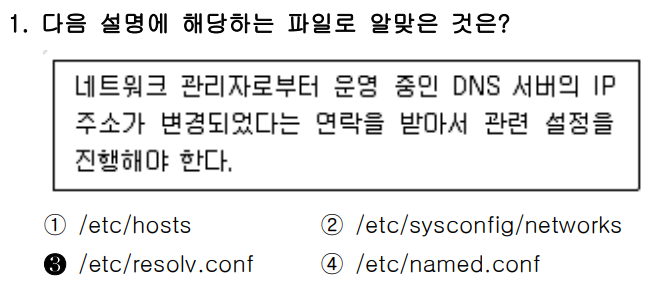

### ✅ 문제 분석 및 개념 정리

---

#### 🔷 **문제 핵심 요점**

“**DNS 서버의 IP 주소가 변경되었고, 관련 설정을 해야 한다**”는 지문을 바탕으로,
**어떤 설정 파일을 수정해야 하는가**를 묻는 문제입니다.

**핵심 키워드:**

* DNS 서버
* IP 주소 변경
* 설정 파일

---

### 📌 기본 개념 정리

리눅스에서 DNS 서버를 설정하는 주요 파일은 다음과 같습니다:

| 파일 경로                                                         | 용도 설명                               |
| ------------------------------------------------------------- | ----------------------------------- |
| `/etc/hosts`                                                  | 도메인 이름과 IP 주소를 수동으로 매핑              |
| `/etc/sysconfig/network-scripts/` 또는 `/etc/sysconfig/network` | 네트워크 인터페이스 설정 (IP, GATEWAY 등)       |
| `/etc/resolv.conf`                                            | **DNS 서버의 IP 주소를 설정하는 파일**          |
| `/etc/named.conf`                                             | BIND 서버의 설정 파일 (DNS 서버로 동작하는 경우 설정) |

---

### 🔍 보기별 상세 분석

#### ✅ ③ `/etc/resolv.conf` → **정답**

* **설명**: 이 파일은 **클라이언트 시스템이 사용할 DNS 서버의 주소**를 정의합니다.
* 예시:

  ```bash
  nameserver 8.8.8.8
  nameserver 8.8.4.4
  ```

  위 예시는 Google DNS를 사용하는 설정입니다.
* 만약 DNS 서버의 IP가 변경되었다면, 바로 이 파일에서 기존 IP를 새로운 IP로 바꿔야 **정상적으로 도메인 이름을 해석**할 수 있습니다.

---

#### ❌ ① `/etc/hosts`

* IP 주소와 호스트 이름의 **고정 매핑**을 기록하는 파일입니다.

* 소규모 내부망에서만 의미 있고, DNS 서버를 변경하는 데는 관련 없습니다.

* 예시:

  ```bash
  127.0.0.1   localhost
  192.168.0.10 myserver.local
  ```

* **오답 이유**: DNS 서버 IP와는 무관합니다.

---

#### ❌ ② `/etc/sysconfig/networks`

* 이 파일은 \*\*네트워크 인터페이스의 설정(호스트명, 게이트웨이 등)\*\*을 담고 있을 수 있습니다.
* 하지만 **DNS 서버 설정과는 직접적인 관련이 없습니다.**
* **오답 이유**: DNS 관련 파일이 아닙니다.

---

#### ❌ ④ `/etc/named.conf`

* 이 파일은 **DNS 서버(BIND)를 운영할 때** 사용하는 설정 파일입니다.
* 즉, **클라이언트가 아닌 서버 측** 설정입니다.
* **오답 이유**: 문제에서 말한 환경은 클라이언트 측이며, named.conf는 서버 운영자가 설정합니다.

---

### 🧠 출제 의도 해석

이 문제는 수험자가 다음을 명확히 알고 있는지를 묻습니다:

* 리눅스에서 DNS 클라이언트 설정은 어디서 하는가?
* `/etc/resolv.conf` 파일의 역할을 정확히 이해하고 있는가?

---

### 🧾 정리

| 보기 | 파일 경로                     | 설명                        | 정답 여부 |
| -- | ------------------------- | ------------------------- | ----- |
| ①  | `/etc/hosts`              | 도메인과 IP 매핑 수동 설정 파일       | ❌     |
| ②  | `/etc/sysconfig/networks` | 네트워크 기본 설정 (게이트웨이 등)      | ❌     |
| ③  | `/etc/resolv.conf`        | **클라이언트 DNS 서버 주소 설정 파일** | ✅     |
| ④  | `/etc/named.conf`         | DNS 서버용 BIND 설정 파일        | ❌     |

---

### ✅ 결론 한 줄 요약

**DNS 서버 IP 변경 시 클라이언트는 반드시 `/etc/resolv.conf` 파일을 수정해야 한다.**


---

<br>
<br>
<br>

# 📍

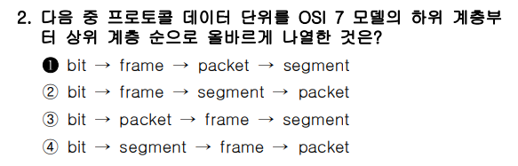

이 문제는 **OSI 7계층에서 사용되는 데이터 단위(Data Unit)** 를

**하위 계층(1계층) → 상위 계층(4계층)** 방향으로 **올바르게 나열**하는 것을 묻고 있습니다.

---

### ✅ OSI 7계층과 데이터 단위 정리

| 계층 번호 | 계층 이름     | 데이터 단위             |
| ----- | --------- | ------------------ |
| 1계층   | 물리 계층     | **비트 (bit)**       |
| 2계층   | 데이터 링크 계층 | **프레임 (frame)**    |
| 3계층   | 네트워크 계층   | **패킷 (packet)**    |
| 4계층   | 전송 계층     | **세그먼트 (segment)** |

※ 그 위의 계층(5\~7계층)은 일반적으로 데이터, 메시지 단위로 취급됨.

---

### 🔍 보기 분석

1. `bit → frame → packet → segment` ✅
   → **물리 → 데이터링크 → 네트워크 → 전송 계층 순서로 정확하게 맞음** (정답)

2. `bit → frame → segment → packet` ❌
   → 전송계층이 네트워크계층보다 먼저 나옴 → 순서 오류

3. `bit → packet → frame → segment` ❌
   → 프레임과 패킷 순서 바뀜 → 순서 오류

4. `bit → segment → frame → packet` ❌
   → 전송 계층이 제일 먼저 나옴 → 완전히 틀림

---

### ✅ 정답

**①번**: `bit → frame → packet → segment`

---

### ✅ 결론 한 줄 요약

**OSI 7계층에서 하위 계층부터 데이터 단위는 bit → frame → packet → segment 순이다.**


---

<br>
<br>
<br>

# 📍

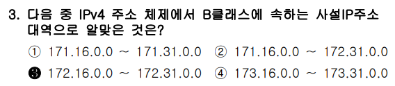

다음은 문제 **「IPv4 주소 체계에서 B클래스에 속하는 사설 IP주소 대역」** 을
아래 방식에 맞춰 상세히 정리한 내용입니다.

---

### ✅ 문제 분석 및 개념 정리

---

#### 🔷 **문제 핵심 요점**

"**IPv4 주소 체계에서 B클래스에 해당하는 사설 IP 주소 범위를 고르시오**"라는 문제.

이 문제의 핵심 키워드:

1. IPv4 주소 클래스(Classful IP)의 **기본 구조**
2. B클래스(Class B)의 정의와 **범위**
3. **사설 IP(Private IP)** 의 범위
4. **서브넷 마스크(Subnet Mask)** 의 기본 개념

* **사설 IP 주소 (Private IP Address)**:

  * 인터넷에 직접 연결되지 않고 **내부 네트워크 전용**으로 사용되는 IP
  * 공유기, 사무실 네트워크, 가상머신 등에서 사용

* **클래스 B 주소**:

  * 전체 IPv4 주소 체계에서 중간 크기 범위를 담당 (10.x.x.x는 A, 192.168.x.x는 C)

---

### 🧠 출제 의도 해석

이 문제는 단순히 IP 주소를 외우는 게 아니라:

* IPv4에서 **사설 IP 주소의 용도**와 **범위를 정확히 알고 있는지**
* **클래스별 주소 구조**를 이해하고 구분할 수 있는지를 묻고 있음

실제 네트워크 설정 시, 사설 IP 범위에 맞는 주소를 정확히 설정하지 않으면
**외부 통신 불가 또는 충돌 문제**가 발생할 수 있음.

---

## 📌 기본 개념 정리

### 1️⃣ IPv4 주소란?

IPv4 주소는 총 **32비트**로 구성된 주소이며, **8비트씩 4개의 옥텟(octet)** 으로 구분됩니다.

예시: `172.16.0.0`
→ 이진: `10101100.00010000.00000000.00000000` (32bit)

---

### 2️⃣ 클래스(Classful) 구조란?

전통적인 IP 주소 체계는 **클래스 A/B/C/D/E**로 나뉩니다. 여기서 A/B/C는 호스트 수와 서브넷에 따라 다릅니다.

| 클래스   | 시작 주소         | 끝 주소                | 기본 서브넷 마스크            | 사용 목적       |
| ----- | ------------- | ------------------- | --------------------- | ----------- |
| A     | 1.0.0.0       | 126.255.255.255     | 255.0.0.0 (/8)        | 대형 네트워크     |
| **B** | **128.0.0.0** | **191.255.255.255** | **255.255.0.0 (/16)** | **중형 네트워크** |
| C     | 192.0.0.0     | 223.255.255.255     | 255.255.255.0 (/24)   | 소형 네트워크     |

💡 참고: `127.x.x.x` → 루프백(Loopback) 주소로, 클래스 A이지만 제외됨

---

### 3️⃣ 사설 IP 주소란?

사설 IP는 **인터넷에 직접 연결되지 않는 내부 네트워크 전용 주소**입니다. 즉, 라우터, 기업 내 네트워크, 개인용 공유기 등에서 사용됩니다.

**RFC 1918**에 의해 정의된 사설 IP 범위:

| 클래스   | 사설 IP 범위                          | 서브넷 마스크               |
| ----- | --------------------------------- | --------------------- |
| A     | 10.0.0.0     \~ 10.255.255.255    | 255.0.0.0 (/8)        |
| **B** | **172.16.0.0  \~ 172.31.255.255** | **255.255.0.0 (/16)** |
| C     | 192.168.0.0  \~ 192.168.255.255   | 255.255.255.0 (/24)   |

> 🔍 **B클래스 사설 IP 주소**는 정확히 `172.16.0.0`부터 `172.31.255.255`까지만 해당합니다.

> 즉, **16개의 연속된 /16 네트워크 블록 (172.16/16 \~ 172.31/16)** 이 포함됩니다.


### 💡 클래스는 전체 IP 구조의 분류 방식
* A 클래스 전체 범위: 1.0.0.0 ~ 126.255.255.255

* B 클래스 전체 범위: 128.0.0.0 ~ 191.255.255.255

* C 클래스 전체 범위: 192.0.0.0 ~ 223.255.255.255

이 전체 범위 중에서 아래처럼 일부만 사설 IP로 사용합니다:

| 클래스   | 전체 범위                         | 사설 IP로 지정된 일부 범위                  |
| ----- | ----------------------------- | --------------------------------- |
| A 클래스 | `1.0.0.0 ~ 126.255.255.255`   | ✅ `10.0.0.0 ~ 10.255.255.255`     |
| B 클래스 | `128.0.0.0 ~ 191.255.255.255` | ✅ `172.16.0.0 ~ 172.31.255.255`   |
| C 클래스 | `192.0.0.0 ~ 223.255.255.255` | ✅ `192.168.0.0 ~ 192.168.255.255` |


---

### 4️⃣ 서브넷 마스크(Subnet Mask)란?

**서브넷 마스크**는 IP 주소 중에서 **어디까지가 네트워크 주소이고**, 어디부터가 **호스트 주소인지**를 구분하는 데 사용됩니다.

#### 📌 예시: `172.16.0.0/16`

* **IP 주소**: `172.16.0.0`
* **서브넷 마스크**: `255.255.0.0` → `/16`
  (앞 16비트가 네트워크, 뒤 16비트가 호스트)

| 부분   | 이진 표현             | 의미      |
| ---- | ----------------- | ------- |
| 네트워크 | 10101100.00010000 | 고정됨     |
| 호스트  | 00000000.00000000 | 변할 수 있음 |

→ 따라서, 이 네트워크에서 사용할 수 있는 전체 IP는
`172.16.0.1` \~ `172.16.255.254` (브로드캐스트 제외)

---


---

### 🔍 보기별 상세 분석

#### ✅ ③ `172.16.0.0 ~ 172.31.0.0` → **정답**

* 정확하게 **B클래스 사설 IP 주소 범위**입니다.
* 이 범위는 **CIDR 표현으로는 `172.16.0.0/12`** 에 해당함.
* ✔️ 정확히 RFC1918에서 지정한 **B클래스 사설 IP 대역**
* 시작: `172.16.0.0`
* 끝: `172.31.255.255`
* 총 16개의 /16 네트워크 → `172.16.0.0/16` \~ `172.31.0.0/16`
* 기본 서브넷 마스크: `255.255.0.0 (/16)`
* ✅ 완벽하게 맞는 보기
* 실제 주소 범위는 다음과 같음:

  * 시작 주소: `172.16.0.0`
  * 끝 주소: `172.31.255.255`

---

#### ❌ ① `171.16.0.0 ~ 171.31.0.0`

* `171.x.x.x` 대역은 **공인 IP 주소**입니다.
* `171.x.x.x`는 **B클래스**이긴 하나, **사설 IP 범위에 포함되지 않음**
* 이 범위는 **공인 IP 주소 영역**임
* ✅ 클래스는 B지만 ❌ 사설 IP 아님
* 사설 IP 범위에 포함되지 않음.

---

#### ❌ ② `171.16.0.0 ~ 172.31.0.0`

* 시작이 잘못됨 (`171.x.x.x`는 공인 IP)
* `171.x.x.x`는 공인 IP (사설 X)
* `172.16.x.x ~ 172.31.x.x`는 사설 IP 맞음
* 하지만 **혼합된 범위**라서 틀림 (정확한 사설 IP 범위를 벗어남)
* 끝 주소는 맞아보이지만 전체 범위가 사설 IP 범위가 아님.

---

#### ❌ ④ `173.16.0.0 ~ 173.31.0.0`

* `173.x.x.x` 대역도 마찬가지로 **공인 IP 주소 범위**입니다.
* `173.x.x.x`는 **B클래스**이지만,
* 사설 IP 주소가 아닌 **공인 IP 영역**
* ❌ 틀린 보기
* 사설 IP와는 무관.


---

### 🧾 정리

| 보기 | 범위                       | 클래스 | 사설 여부   | 설명                   | 정답 여부    |
| -- | ------------------------ | --- | ------- | -------------------- | -------- |
| ①  | 171.16.0.0 \~ 171.31.0.0 | B   | ❌ 공인 IP | B클래스지만 사설 아님         | ❌        |
| ②  | 171.16.0.0 \~ 172.31.0.0 | 혼합  | ❌ 일부 공인 | 일부는 공인 IP라서 정확하지 않음  | ❌        |
| ③  | 172.16.0.0 \~ 172.31.0.0 | B   | ✅ 사설 IP | RFC1918에서 정의한 정확한 범위 | ✅ **정답** |
| ④  | 173.16.0.0 \~ 173.31.0.0 | B   | ❌ 공인 IP | B클래스지만 사설 아님         | ❌        |

---

### ✅ 결론 한 줄 요약

**IPv4에서 B클래스 사설 IP 주소는 `172.16.0.0`부터 `172.31.255.255`까지이며,**

**기본 서브넷 마스크는 `255.255.0.0 (/16)`이다. 정답은 ③번이다.**


---

<br>
<br>
<br>

# 📍

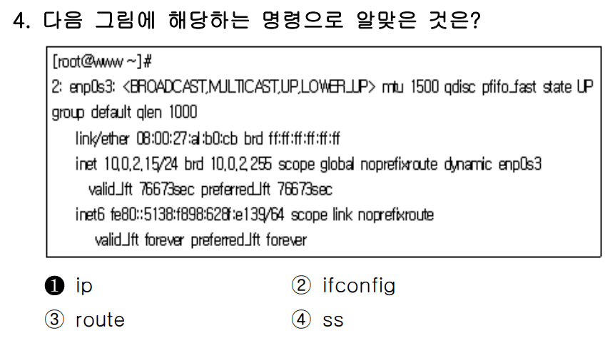

### ✅ 문제 분석 및 개념 정리

---

#### 🔷 **문제 핵심 요점**

문제는 다음 그림에 해당하는 명령어가 무엇인지 **리눅스 네트워크 인터페이스 확인 명령어**에 대해 묻고 있음.

화면에는 다음과 같은 정보가 출력됨:

* 인터페이스 이름: `enp0s3`
* MAC 주소: `08:00:27:a1:b0:cb`
* IPv4 주소: `10.0.2.15/24`
* IPv6 주소: `fe80::...`
* 인터페이스 상태: `UP`
* 기타 정보: `mtu`, `scope`, `qlen`, `valid_lft` 등

---

### 🧠 출제 의도 해석

이 문제는 리눅스에서 **네트워크 인터페이스 상태 및 IP 정보를 확인할 때 사용하는 명령어**를 묻는 것이다.

즉, 아래의 명령 중 어느 것이 위와 같은 상세한 결과를 출력하는지를 알아야 한다.

---

### 📌 보기별 상세 분석

#### ✅ ① `ip` → **정답**

* `ip addr` 또는 `ip a` 명령어 실행 시 해당 화면과 **거의 동일한 형식**으로 출력됨.
* 특히, `2: enp0s3: <BROADCAST,...` 같은 인터페이스 정보,

  * `inet`, `inet6` 주소
  * `valid_lft`, `preferred_lft`
  * `scope global`, `dynamic` 등도 `ip` 명령어만이 상세하게 보여줌.

> ✅ `ip addr show` 명령의 대표 출력 예시:

```bash
2: enp0s3: <BROADCAST,MULTICAST,UP,LOWER_UP> mtu 1500 ...
    link/ether 08:00:27:a1:b0:cb brd ff:ff:ff:ff:ff:ff
    inet 10.0.2.15/24 brd 10.0.2.255 ...
    inet6 fe80::.../64 ...
```

---

#### ❌ ② `ifconfig`

* `ifconfig` 명령은 오래된 명령이며,
* 출력 형식이 다름: `<BROADCAST,MULTICAST>` 같은 정보는 있지만 `valid_lft`, `scope`, `qlen` 등의 정보가 없음.
* 특히 **IPv6 주소 출력 형식**, **동적 할당 여부(dynamic)** 등을 표시하지 않음.

> 🔻 출력 예시는 아래와 같이 단순:

```bash
enp0s3: flags=4163<UP,BROADCAST,...>
        inet 10.0.2.15 netmask 255.255.255.0 broadcast 10.0.2.255
```

---

#### ❌ ③ `route`

* `route` 명령은 **라우팅 테이블을 출력**할 때 사용.
* **인터페이스의 IP 정보나 MAC 주소 등은 보여주지 않음**.
* 주로 게이트웨이, 목적지 네트워크 등의 경로 정보만 확인 가능.

---

#### ❌ ④ `ss`

* `ss`는 **소켓 상태 확인 명령어**.
* TCP/UDP 포트, 연결 상태 등을 보여주는 도구.
* IP 주소는 보여줄 수 있으나, **인터페이스 자체의 상태 및 MAC 주소 등은 알 수 없음**.

---

### 🧾 정리

| 보기 | 명령어        | 설명                                 | 맞/틀 |
| -- | ---------- | ---------------------------------- | --- |
| ①  | `ip`       | `ip addr`로 상세 네트워크 인터페이스 정보 확인 가능  | ✅   |
| ②  | `ifconfig` | 구버전 명령어이며, IPv6·valid\_lft 등 정보 없음 | ❌   |
| ③  | `route`    | 라우팅 테이블 확인용, 인터페이스 IP 정보와 무관       | ❌   |
| ④  | `ss`       | 포트 및 소켓 상태 확인용, 네트워크 카드 정보는 아님     | ❌   |

---

### ✅ 결론 한 줄 요약

**해당 화면은 `ip addr` 명령어로 출력되는 결과이며, 정답은 ① `ip` 이다.**


---

<br>
<br>
<br>

# 📍

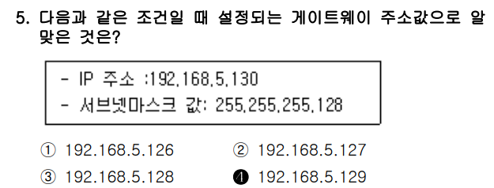

### ✅ 문제 분석 및 개념 정리

---

#### 🔷 **문제 핵심 요점**

IP 주소: `192.168.5.130`
서브넷 마스크: `255.255.255.128`
→ 이 조건일 때 **게이트웨이 주소로 알맞은 값**을 찾는 문제

**즉, 이 IP가 속한 네트워크의 기본 게이트웨이 주소가 무엇인지 묻는 것.**

---

### 📌 기본 개념: 서브넷 계산

#### 1. 서브넷 마스크 `255.255.255.128`은 CIDR로 `/25`

* 이는 **하위 7비트만 호스트 번호**, 상위 25비트는 네트워크 주소.
* **1개의 서브넷에 128개의 IP 주소 사용 가능**

  * 사용 가능한 **호스트 주소**는: 126개 (128 - 네트워크주소 1 - 브로드캐스트주소 1)

  #### 📌 255.255.255.128 분석

  * 10진수 → 2진수 변환

  ```
  255     .255     .255     .128
  ↓
  11111111.11111111.11111111.10000000
  ```

  * 총 32비트 중 앞의 25비트가 1, 뒤의 7비트가 0임

  #### 🔹 해석:
  | 비트 구분          | 비트 수 | 의미                    |
  | -------------- | ---- | --------------------- |
  | 1 (1로 채워진 부분)  | 25비트 | 네트워크 주소(Network bits) |
  | 0 (0으로 채워진 부분) | 7비트  | 호스트 주소(Host bits)     |


  * 몇 개의 호스트가 가능한가?

  * 호스트 비트가 7비트라는 것은...?

  ```
  2⁷ = 128개의 주소
  → 그 중 2개는 예약 (네트워크 주소 + 브로드캐스트 주소)
  → 사용 가능한 호스트 수 = 128 - 2 = 126개
  ```

    * 서브넷 마스크를 2진수로 변환했을 때, 앞의 1은 네트워크, 뒤의 0은 호스트 비트이며 255.255.255.128은 25비트 네트워크, 7비트 호스트를 의미한다.

#### 2. `192.168.5.130`은 어느 네트워크에 속해 있는가?

* **서브넷 간격은 128**

      서브넷 마스크와 네트워크 주소 계산 원리


      ✅ 서브넷 간격(Subnet Interval)이란?

      서브넷 간격이란:

      > 각 서브넷이 어디서 시작하고 어디서 끝나는지를 결정짓는 “네트워크 주소 간 간격” 을 의미

      이 값은 호스트 비트 중 가장 왼쪽의 1이 나타나는 자리의 값, 즉 서브넷에서 증가되는 단위입니다.

      ---

       🔍 `255.255.255.128` 마스크를 예로 설명

      1. 먼저 서브넷 마스크를 이진수로 봅시다:

      ```
      255.255.255.128
      ↓
      11111111.11111111.11111111.10000000
      ```

      * 앞 25비트가 네트워크 (1)
      * 뒤 7비트가 호스트 (0)

      2. 어떤 옥텟(8비트 블록)에 변화가 생기는가?

      * 네 번째 옥텟 (맨 끝)만 보면:

        ```
        10000000 → 10진수로 128
        ```

      * 이 뜻은 서브넷이 128 단위로 증가한다는 뜻입니다.

      ---

      📌 즉, 서브넷 간격은 호스트 비트가 시작되는 자리의 값이다

      서브넷 간격은 아래와 같은 공식으로 구할 수 있습니다:

      ```
      서브넷 간격 = 256 - 해당 옥텟의 서브넷 마스크 값
      ```

      예: `255.255.255.128`

      ```
      서브넷 간격 = 256 - 128 = 128
      ```

      → 즉, 서브넷은 다음처럼 나눠짐:

      * `192.168.5.0/25`   → 유효 호스트 범위: `192.168.5.1` \~ `192.168.5.126`
      * `192.168.5.128/25` → 유효 호스트 범위: `192.168.5.129` \~ `192.168.5.254`

      → 서브넷 주소가 128씩 증가하므로, 간격이 128

      

      🧠 예를 더 들어볼까요?

      | 서브넷 마스크       | 256에서 뺀 값    | 서브넷 간격 | 서브넷 예시 IP 대역                                |
      | ----------------- | --------------- | --------- | --------------------------------------------------- |
      | `255.255.255.0`   | 256 - 0 = 256   | 256       | `192.168.1.0`, `192.168.2.0`, ...                   |
      | `255.255.255.128` | 256 - 128 = 128 | 128       | `192.168.1.0`, `192.168.1.128`                      |
      | `255.255.255.192` | 256 - 192 = 64  | 64        | `192.168.1.0`, `192.168.1.64`, `192.168.1.128`, ... |

      ---

      ✅ 결론 한 줄 요약

      서브넷 간격은 `256 - 서브넷 마스크 값`으로 계산하며,
      
      `255.255.255.128`일 경우 간격은 `256 - 128 = 128`이므로 서브넷은 128 단위로 나눠진다.


* 즉:

  * `192.168.5.0/25` (0\~127)
  * `192.168.5.128/25` (128\~255)

→ `192.168.5.130`은 두 번째 서브넷인 `192.168.5.128/25`에 속함

#### 3. 이 네트워크에서의 유효 IP 범위:

* **네트워크 주소**: `192.168.5.128`
* **브로드캐스트 주소**: `192.168.5.255`
* **사용 가능한 IP 범위**: `192.168.5.129` \~ `192.168.5.254`

> 🧠 일반적으로 **게이트웨이 주소는 사용 가능한 IP 중 첫 번째 주소를 사용**하는 것이 관례

---

### ✅ 정답 도출

* 사용 가능한 첫 IP: `192.168.5.129`
* → 따라서 **게이트웨이 주소로 가장 일반적으로 설정되는 값**

✅ **정답: ④ 192.168.5.129**

---

### 🧾 보기별 검토

| 보기              | 설명                                | 맞/틀 |
| --------------- | --------------------------------- | --- |
| ① 192.168.5.126 | `192.168.5.0/25` 범위에 속함 (다른 네트워크) | ❌   |
| ② 192.168.5.127 | 브로드캐스트 직전 주소 (다른 네트워크임)           | ❌   |
| ③ 192.168.5.128 | 네트워크 주소 (호스트로 사용 불가)              | ❌   |
| ④ 192.168.5.129 | 유효한 첫 번째 호스트 주소 → 게이트웨이로 적합       | ✅   |

---

### ✅ 결론 한 줄 요약

**IP가 `192.168.5.130`이고 서브넷 마스크가 `255.255.255.128`일 때, 게이트웨이 주소는 `192.168.5.129`가 가장 적합하다.**


---

<br>
<br>
<br>

# 📍

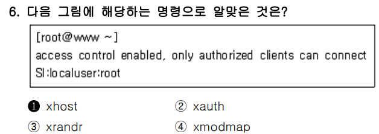

### ✅ 문제 분석 및 개념 정리

---

#### 🔷 **문제 핵심 요점**

다음 출력:

```
access control enabled, only authorized clients can connect  
SI:localuser:root
```

이 출력은 **X 서버의 접근 제어 상태**를 보여주는 내용입니다.
즉, 현재 `root` 사용자만 X 서버에 접근 가능한 상태임을 의미합니다.

---

## 📌 이 출력은 어떤 명령어로 확인할 수 있을까?

정답은 바로 ✅ `xhost` 명령입니다.

---

## 🔍 보기별 분석

| 번호 | 명령어       | 설명                                             | 정답 여부 |
| -- | --------- | ---------------------------------------------- | ----- |
| ①  | `xhost`   | **X 서버 접근 제어 리스트** 확인 및 제어 가능. 출력 내용과 정확히 일치함. | ✅ 정답  |
| ②  | `xauth`   | X 인증 쿠키(`.Xauthority`)를 관리하는 도구. 출력 형식이 다름.    | ❌ 오답  |
| ③  | `xrandr`  | 해상도/디스플레이 회전 등을 설정하는 도구. 접근 제어와 무관.            | ❌ 오답  |
| ④  | `xmodmap` | 키보드 키 매핑 설정 도구. 접근 제어나 사용자 인증과 관련 없음.          | ❌ 오답  |

---

## ✅ xhost 명령 실제 예시

```bash
$ xhost
access control enabled, only authorized clients can connect
SI:localuser:root
```

* `SI:localuser:root` → 현재 X 서버 접근이 허용된 사용자
* `access control enabled` → 접근 제어가 **활성화됨**

---

## ✅ 결론 한 줄 요약

**해당 출력은 X 서버 접근 제어를 확인하는 `xhost` 명령 결과이며, 정답은 ①번이다.**


---

<br>
<br>
<br>

# 📍


### ✅ 문제 분석 및 개념 정리

---

#### 🔷 **문제 핵심 요점**

> 최근에 실행한 명령어 중에서 `'al'`이 **포함된** 명령어를 **찾아서 재실행**하려고 할 때 사용할 수 있는 **히스토리 확장(history expansion)** 문법을 묻는 문제입니다.

---

## 🧠 Bash 히스토리 확장 기본 개념

| 문법          | 의미                                       |
| ----------- | ---------------------------------------- |
| `!string`   | 최근에 실행한 명령어 중 `string`으로 **시작하는** 명령 재실행 |
| `!?string?` | 최근에 실행한 명령어 중 `string`을 **포함하는** 명령 재실행  |
| `!!`        | 바로 직전에 실행한 명령어 재실행                       |
| `history`   | 명령어 히스토리 전체를 출력                          |

---

### 📌 정답 분석: `al`이 **포함된 명령 재실행**

#### ✅ ② `!?al?` → **정답**

* 의미: **최근 명령 중 'al'이 포함된 것 중 가장 마지막**에 실행한 명령을 다시 실행
* 예시:

  ```bash
  $ cal
  $ ls
  $ !?al?
  cal  ← 자동으로 다시 실행됨
  ```

---

## 🔍 보기별 상세 분석

| 번호 | 명령어          | 설명                                         | 정답 여부      |      |
| -- | ------------ | ------------------------------------------ | ---------- | ---- |
| ①  | `!al`        | `'al'`로 **시작하는** 가장 마지막 명령 재실행. 포함은 불가     | ❌ 오답       |      |
| ②  | `!?al?`      | `'al'`이 **포함된** 최근 명령 재실행 → 정확한 정답         | ✅ 정답       |      |
| ③  | `!!al`       | 잘못된 문법. `!!`는 직전 명령 재실행, `al`은 뒤에 붙을 수 없음  | ❌ 오답       |      |
| ④  | `history al` | `history` 출력 후 grep과 결합해야 사용 가능 (\`history | grep al\`) | ❌ 오답 |

---

## ✅ 결론 한 줄 요약

**최근 명령어 중 ‘al’이 **포함된 명령을 재실행**하려면 `!?al?`을 사용하는 것이 가장 정확한 방법이다.**


---

<br>
<br>
<br>

# 📍

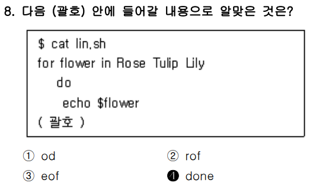

### ✅ 문제 분석 및 개념 정리

---

#### 🔷 **문제 핵심 요점**

쉘 스크립트 구문에서 `for` 반복문을 사용할 때, **반복문 블록을 닫는 키워드**를 묻는 문제입니다.

---

## 📌 주어진 코드 구조 분석

```bash
for flower in Rose Tulip Lily
do
  echo $flower
(괄호)
```

→ 여기서 `do`로 시작한 반복 블록을 **끝내야 하는 위치**입니다.

---

### 🔍 Bash에서 `for` 반복문의 기본 문법

```bash
for 변수 in 값1 값2 값3
do
   명령어
done
```

* `do` → 반복 블록 시작
* `done` → 반복 블록 종료

---

## ✅ 정답: ① `done`

* `done`은 `do`로 시작한 블록을 닫는 예약어이며,
* `if`, `while`, `case` 등 모든 제어문에서 각각 맞는 종료 키워드가 필요함
* 이 예시는 `for`문이므로 `done`으로 닫아야 함

---

## 🔍 오답 보기 분석

| 번호 | 보기     | 의미/이유                           | 정답 여부 |
| -- | ------ | ------------------------------- | ----- |
| ①  | `done` | `for-do` 블록을 닫는 예약어 → 정확함       | ✅ 정답  |
| ②  | `rof`  | `for`를 뒤집은 단어일 뿐, Bash에 존재하지 않음 | ❌ 오답  |
| ③  | `eof`  | 파일 끝을 의미할 때 사용 (`<<EOF` 등에서 사용) | ❌ 오답  |
| ④  | `od`   | `octal dump` 유틸리티이며, 반복문 종료와 무관 | ❌ 오답  |

---

## ✅ 결론 한 줄 요약

**쉘 스크립트에서 `for-do` 반복문을 종료할 때는 `done`을 사용해야 하므로 정답은 ①번이다.**


---

<br>
<br>
<br>

# 📍


### ✅ 문제 분석 및 개념 정리

---

#### 🔷 **문제 핵심 요점**

다음 중 \*\*할당된 시그널 번호 값(signal number)\*\*이 가장 큰 시그널은?

---

## 📌 UNIX/Linux Signal 번호 요약

| 시그널 이름    | 시그널 번호             | 설명                    |
| --------- | ------------------ | --------------------- |
| `SIGQUIT` | 3                  | quit 신호 (core 덤프 생성)  |
| `SIGKILL` | 9                  | 강제 종료 (무조건 종료, 무시 불가) |
| `SIGTERM` | 15                 | 종료 요청 (기본 종료 신호)      |
| `SIGTSTP` | 20 (또는 시스템에 따라 18) | 터미널 일시 중지 (Ctrl + Z)  |

※ 대부분의 Linux 배포판에서 `SIGTSTP = 20`으로 지정되어 있음

---

## 🔍 보기별 번호 정리

| 보기 번호 | 시그널     | 시그널 번호 | 설명                 |
| ----- | ------- | ------ | ------------------ |
| ①     | SIGTSTP | 20     | Ctrl+Z, 프로세스 일시 정지 |
| ②     | SIGKILL | 9      | 강제 종료              |
| ③     | SIGTERM | 15     | 정상 종료 요청           |
| ④     | SIGQUIT | 3      | 종료 + core 덤프 생성    |

---

## ✅ 정답: ① **SIGTSTP** (시그널 번호 20)

* 네 가지 시그널 중 **가장 번호 값이 큰 시그널**은 `SIGTSTP` (20)
* 따라서 **정답은 ①번**

---

### ✅ 결론 한 줄 요약

**시그널 번호가 가장 큰 것은 `SIGTSTP (20)`이며, 정답은 ①번이다.**


---

<br>
<br>
<br>

# 📍


### ✅ 문제 분석 및 개념 정리

---

#### 🔷 **문제 핵심 요점**

> **포그라운드(Foreground)** 에서 실행 중인 프로세스를 **백그라운드(Background)** 로 전환하는 정확한 조작 순서를 묻는 문제입니다.

---

## ✅ 포그라운드 → 백그라운드 전환 순서 요약

| 단계  | 설명                                          |
| --- | ------------------------------------------- |
| 1️⃣ | `Ctrl + Z` 입력 → **작업을 일시 정지 (stop) 상태로 전환** |
| 2️⃣ | `bg` 명령어 입력 → **해당 작업을 백그라운드에서 실행 재개**      |

> 💡 이때 `jobs` 명령어로 현재 중지된 작업들을 확인 가능하며, `%1` 같은 형식으로 특정 작업을 `bg %1`로 실행 가능

---

## 🔍 보기별 분석

| 보기                  | 설명                                                  | 정오 |
| ------------------- | --------------------------------------------------- | -- |
| ① `Ctrl + C` 후 `fg` | `Ctrl + C`는 **프로세스를 강제 종료**시키므로, 이후 `fg`는 실행 대상이 없음 | ❌  |
| ② `Ctrl + C` 후 `bg` | 마찬가지로 프로세스를 종료했기 때문에 `bg` 대상 없음                     | ❌  |
| ③ `Ctrl + Z` 후 `fg` | `fg`는 다시 **포그라운드에서 실행**이므로 문제 의도와 반대                | ❌  |
| ④ `Ctrl + Z` 후 `bg` | ✔ 일시정지 후 **백그라운드에서 실행**으로 전환하는 정확한 절차               | ✅  |

---

## ✅ 결론 한 줄 요약

**포그라운드 작업을 백그라운드로 전환하려면 `Ctrl + Z`로 일시정지 후 `bg` 명령어를 사용해야 하며, 정답은 ④번이다.**


---

<br>
<br>
<br>

# 📍

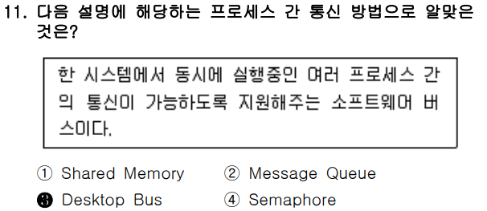

### ✅ 문제 분석 및 개념 정리

---

#### 🔷 **문제 핵심 요점**

> "한 시스템에서 동시에 실행 중인 **여러 프로세스 간 통신이 가능**하도록 지원해주는 **소프트웨어 버스**"는 무엇인가?

즉, **프로세스 간 통신(IPC, Inter-Process Communication)** 수단 중에서
**"소프트웨어 버스(software bus)"라는 표현**에 주목해야 합니다.

---

## 📌 보기별 개념 정리

| 보기                        | 통신 방식                                                         | 설명 |
| ------------------------- | ------------------------------------------------------------- | -- |
| ① **Shared Memory**       | 공유 메모리를 통해 프로세스 간 데이터를 주고받는 방식<br>⟶ 속도 빠름, 직접 메모리 접근 필요       |    |
| ② **Message Queue**       | 커널에 큐를 만들어 메시지를 주고받는 구조<br>⟶ 구조적이고 안정적, 시스템 콜 기반              |    |
| ③ **Desktop Bus (D-Bus)** | **소프트웨어 버스** 기반의 IPC<br>⟶ GUI 환경에서 **시스템/세션 수준 프로세스 간 통신** 지원 |    |
| ④ **Semaphore**           | 동기화 도구로, 데이터 통신 목적이 아닌 **경쟁 조건 해결**에 사용<br>⟶ 통신 목적 X          |    |

---

### ✅ 핵심 키워드: **소프트웨어 버스 (software bus)**

* 이는 \*\*D-Bus (Desktop Bus)\*\*의 정의입니다.
* `D-Bus`는 Linux/Unix 환경에서 **그래픽 환경(GNOME, KDE)** 등에서 널리 사용됩니다.
* 예) Bluetooth 데몬, 네트워크 매니저, 알림 시스템 간 신호 전달

---

## ✅ 정답: **③ Desktop Bus**

---

### ✅ 결론 한 줄 요약

**"소프트웨어 버스"를 통해 여러 프로세스 간 통신을 지원하는 방법은 D-Bus(Desktop Bus)이므로, 정답은 ③번이다.**


---

<br>
<br>
<br>

# 📍

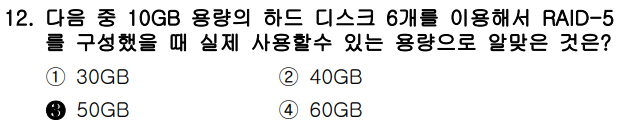

### ✅ 문제 분석 및 개념 정리

---

#### 🔷 **문제 핵심 요점**

> RAID-5 구성 시, **10GB 디스크 6개**를 사용할 때 **실제 usable(사용 가능한) 용량**이 얼마인지 묻는 문제입니다.

---

## 📌 RAID-5 기본 개념

* RAID-5는 **패리티(parity) 기반의 분산 저장 방식**
* 최소 3개의 디스크 필요
* **총 디스크 수 - 1** 만큼의 용량만 **실제 데이터 저장용**으로 사용 가능
  → 나머지 1개 디스크 용량만큼은 **패리티 정보 저장용**으로 사용됨

### 📌 RAID-5 실제 사용 가능 용량 공식

```
사용 가능 용량 = (디스크 수 - 1) × 각 디스크 용량
```

---

## 🔍 적용: 10GB × 6개 디스크

```
(6 - 1) × 10GB = 5 × 10GB = ✅ 50GB
```

---

## ✅ 정답: **③ 50GB**

---

### ✅ 결론 한 줄 요약

**RAID-5는 1개의 디스크를 패리티용으로 사용하므로, 10GB × 6개 중 5개만 데이터 저장에 사용되어 실제 용량은 50GB가 된다.**


---

<br>
<br>
<br>

# 📍

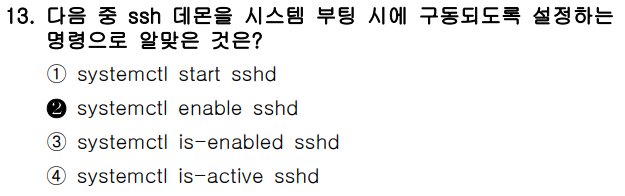

### ✅ 문제 분석 및 개념 정리

---

#### 🔷 **문제 핵심 요점**

> SSH 데몬(`sshd`)이 **시스템 부팅 시 자동으로 시작되도록 설정**하려면 어떤 명령어를 사용해야 하는가?

이 문제는 systemd 환경에서 **서비스의 부팅 시 자동 시작 설정**을 어떻게 하는지를 묻습니다.

---

## 📌 systemctl 명령어 정리

| 명령어                         | 설명                                  |
| --------------------------- | ----------------------------------- |
| `systemctl start sshd`      | SSHD 서비스를 **즉시 시작**함 (부팅 시 자동 실행 X) |
| `systemctl enable sshd`     | SSHD 서비스를 **부팅 시 자동 시작되도록 설정**      |
| `systemctl is-enabled sshd` | SSHD가 **부팅 시 자동 실행 설정되어 있는지 확인**    |
| `systemctl is-active sshd`  | SSHD가 **현재 실행 중인지 확인**              |

---

### ✅ 정답: ② `systemctl enable sshd`

* 해당 명령은 `sshd.service`를 **부팅 시 자동 실행되도록 등록**합니다.
* `/etc/systemd/system/multi-user.target.wants/` 아래에 symlink가 생성됨

---

## ✅ 결론 한 줄 요약

**sshd를 시스템 부팅 시 자동으로 시작되게 설정하려면 `systemctl enable sshd` 명령어를 사용해야 하므로, 정답은 ②번이다.**


---

<br>
<br>
<br>

# 📍

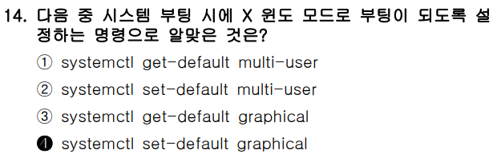

### ✅ 문제 분석 및 개념 정리

---

#### 🔷 **문제 핵심 요점**

> 시스템이 **부팅될 때 X 윈도우(GUI) 모드로 자동 부팅되도록 설정**하려면 어떤 `systemctl` 명령을 사용해야 하는가?

이 문제는 systemd 기반 시스템에서 \*\*부팅 시 기본 실행 타겟(runlevel)\*\*을 설정하는 방법을 묻는 문제입니다.

---

## 📌 Target 개념 (systemd에서 runlevel 대체)

| Target 이름           | 설명                                   |
| ------------------- | ------------------------------------ |
| `multi-user.target` | 텍스트 콘솔 모드 (기본 runlevel 3에 해당)        |
| `graphical.target`  | GUI(X 윈도우 포함) 모드 (기본 runlevel 5에 해당) |

---

## 📌 관련 명령어 비교

| 명령어                                | 설명                                 |
| ---------------------------------- | ---------------------------------- |
| `systemctl get-default`            | 현재 기본 target 확인                    |
| `systemctl set-default graphical`  | GUI(X 윈도우)로 부팅되도록 설정 ✅             |
| `systemctl set-default multi-user` | 텍스트 모드 부팅으로 설정                     |
| `systemctl get-default graphical`  | 잘못된 명령어 (get-default는 인자를 받지 않음) ❌ |

---

### ✅ 정답: ④ `systemctl set-default graphical`

* 해당 명령을 실행하면 `/etc/systemd/system/default.target`이 `graphical.target`을 가리키도록 설정됨
* 즉, **GUI 환경으로 부팅됨**

---

## ✅ 결론 한 줄 요약

**부팅 시 X 윈도우(GUI) 모드로 전환하려면 `systemctl set-default graphical`을 사용하므로, 정답은 ④번이다.**


---

<br>
<br>
<br>

# 📍


### ✅ 문제 분석 및 개념 정리

---

#### 🔷 **문제 핵심 요점**

> CentOS 7에서 **GRUB 환경 설정 파일을 수정한 후**, **그 변경 내용을 반영(저장)하기 위해 사용하는 명령어**는?

---

## 📌 GRUB2 설정 변경 시 사용되는 명령어

CentOS 7부터는 GRUB2가 기본 부트로더입니다.
설정 변경을 마친 뒤, 변경 내용을 **`grub.cfg` 파일에 반영(재생성)** 해야 하는데
그때 사용하는 명령어가 다음과 같습니다.

### ✅ 정답: `grub2-mkconfig`

```bash
grub2-mkconfig -o /boot/grub2/grub.cfg
```

* `/etc/default/grub` 파일이나 `/etc/grub.d/` 스크립트를 수정한 후 이 명령으로 변경 내용을 반영
* `-o` 옵션 뒤에는 실제 grub 설정 파일 경로 지정 (`/boot/grub2/grub.cfg`)

---

## 🔍 보기별 설명

| 보기                 | 명령어                                   | 설명 |
| ------------------ | ------------------------------------- | -- |
| ① `grub`           | GRUB Legacy에서 사용됨 (GRUB2에서는 사용 안 함) ❌ |    |
| ② `grub2-mkconfig` | **변경된 설정을 grub.cfg로 저장**함 → ✅ 정답      |    |
| ③ `grub2-install`  | 부트로더 자체를 디스크에 설치할 때 사용 (설정 반영 아님) ❌   |    |
| ④ `grub2-probe`    | 루트 장치 등 시스템 정보를 조사하는 도구 (설정 저장 아님) ❌  |    |

---

## ✅ 결론 한 줄 요약

**CentOS 7에서 GRUB 설정 변경 후 적용하려면 `grub2-mkconfig` 명령으로 설정 파일을 재생성해야 하므로 정답은 ②번이다.**


---

<br>
<br>
<br>

# 📍

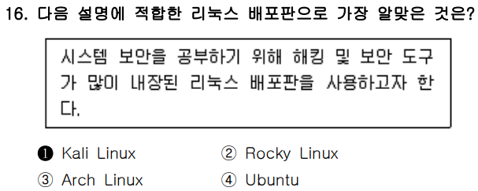

### ✅ 문제 분석 및 개념 정리

---

#### 🔷 **문제 핵심 요점**

> "**해킹 및 보안 도구가 많이 내장된** 리눅스 배포판"을 찾는 문제입니다.
> 즉, **보안 테스트(Penetration Testing)**, **시스템 보안 학습**, **모의 해킹**을 위한 전문 배포판을 묻고 있습니다.

---

## 📌 보기별 리눅스 배포판 특징 비교

| 번호               | 배포판                                                   | 설명 |
| ---------------- | ----------------------------------------------------- | -- |
| ① **Kali Linux** | ✅ **보안 분석 및 해킹 도구 특화** 배포판 (정답)<br>많은 해킹/포렌식/무선 도구 내장 |    |
| ② Rocky Linux    | CentOS 대체 배포판으로 **기업 서버용 안정성 중심**                     |    |
| ③ Arch Linux     | 사용자 설정 중심의 **초경량/롤링 릴리스** 배포판                         |    |
| ④ Ubuntu         | 사용하기 쉬운 데스크탑/서버용 범용 배포판                               |    |

---

## 🔍 Kali Linux 특징

* Offensive Security에서 개발
* 대표적인 해킹 툴: `nmap`, `Wireshark`, `Metasploit`, `Aircrack-ng`, `Burp Suite`, `Hydra` 등 기본 내장
* 모의 해킹, 보안 전문가 교육 및 CTF 실습용으로 널리 사용됨

---

## ✅ 정답: **① Kali Linux**

---

### ✅ 결론 한 줄 요약

**보안 공부 및 해킹 도구가 내장된 리눅스 배포판은 Kali Linux이므로, 정답은 ①번이다.**


---

<br>
<br>
<br>

# 📍


### ✅ 문제 분석 및 개념 정리

---

#### 🔷 **문제 핵심 요점**

> 리눅스(Linux)의 탄생에 영향을 준 **MINIX 운영체제**를 **개발한 인물**은 누구인가?

---

## 📌 MINIX란?

* **MINIX**: **MINI + UNIX**
* **교육용 목적으로 개발된 유닉스 호환 운영체제**
* 리눅스를 만든 **리누스 토르발스**가 MINIX에서 영감을 받아 Linux를 개발함

---

## ✅ MINIX의 개발자:

> **앤드류 스튜어트 타넨바움 (Andrew S. Tanenbaum)**

* 컴퓨터 과학자이며, 운영체제 교재로도 유명함
* 대표 저서: 『Modern Operating Systems』
* MINIX는 그의 교육용 OS 프로젝트

---

## 🔍 보기별 인물 분석

| 보기                  | 인물                                  | 설명 |
| ------------------- | ----------------------------------- | -- |
| ① 빌 조이              | BSD UNIX의 핵심 개발자, vi 편집기 개발자 ❌      |    |
| ② 데니스 리치            | C언어와 유닉스 공동 개발자 (AT\&T Bell Labs) ❌ |    |
| ③ 리처드 스톨먼           | GNU 프로젝트 창시자, 자유 소프트웨어 운동가 ❌        |    |
| ④ **앤드류 스튜어트 타넨바움** | ✅ MINIX 개발자, 리눅스의 간접적 모델     ✅      |    |

---

### ✅ 정답: **④ 앤드류 스튜어트 타넨바움**

---

### ✅ 결론 한 줄 요약

**리눅스의 모델이 된 MINIX 운영체제를 개발한 인물은 앤드류 스튜어트 타넨바움이며, 정답은 ④번이다.**


---

<br>
<br>
<br>

# 📍

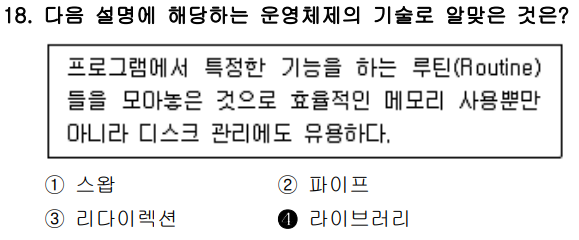

### ✅ 문제 분석 및 개념 정리

---

#### 🔷 **문제 핵심 요점**

> 프로그램에서 **특정한 기능을 하는 루틴들을 모아놓은 것**,
> 메모리 효율, 디스크 관리에 유용한 운영체제 기술은 무엇인가?

---

## 📌 키워드 분석

* "루틴(Routine)을 모아놓은 것"
* "효율적인 메모리 사용"
* "디스크 관리에 유용"

이 키워드를 만족하는 개념은 바로 \*\*라이브러리(library)\*\*입니다.

---

## ✅ 정답: **④ 라이브러리 (Library)**

### ✅ 라이브러리란?

* 프로그램에서 자주 사용하는 함수나 루틴을 **모듈화하여 모아놓은 집합**
* 프로그램이 필요할 때마다 가져다 쓸 수 있도록 설계됨
* 메모리 및 디스크 중복 사용을 줄이고, 재사용성 향상

> 예: `libc.so`, `libm.so` 등 C 표준 함수 모음

---

## 🔍 오답 보기 분석

| 보기          | 항목                                       | 설명 |
| ----------- | ---------------------------------------- | -- |
| ① 스왑        | 메모리가 부족할 때 디스크 공간을 임시 메모리로 사용하는 기능 ❌     |    |
| ② 파이프       | 프로세스 간 데이터를 전달하는 통신 수단 (IPC) ❌           |    |
| ③ 리다이렉션     | 표준 입출력을 다른 대상으로 연결하는 셸 기능 (예: `>` `<`) ❌ |    |
| ④ **라이브러리** | ✅ 루틴 모음, 메모리/디스크 효율화에 사용됨 — 정답 ✅         |    |

---

### ✅ 결론 한 줄 요약

**루틴을 모아놓아 메모리·디스크 효율에 유리한 운영체제 기술은 '라이브러리'이므로, 정답은 ④번이다.**


---

<br>
<br>
<br>

# 📍


### ✅ 문제 분석 및 개념 정리

---

#### 🔷 **문제 핵심 요점**

> "**2차적 저작물**의 소스 코드 비공개가 **불가능한 라이선스**"는?

즉, 어떤 라이선스가 \*\*수정하거나 결합한 소스코드도 반드시 공개해야 하는가?\*\*를 묻는 문제입니다.

---

## 📌 주요 오픈소스 라이선스 비교

| 라이선스                             | 공개 의무성             | 2차 저작물 비공개 가능 여부 | 특징                  |
| -------------------------------- | ------------------ | ---------------- | ------------------- |
| **MPL (Mozilla Public License)** | **중간 강도 copyleft** | **✖ 불가 (공개 의무)** | 수정한 파일 단위로 소스 공개 필수 |
| MIT                              | 매우 자유로움            | ✔ 가능             | 저작권 표시만 유지하면 재사용 자유 |
| Apache                           | 매우 자유로움            | ✔ 가능             | 특허 보호 조항 포함         |
| BSD                              | 매우 자유로움            | ✔ 가능             | MIT와 유사, 상업적 사용 허용  |

---

## ✅ MPL(Mozilla Public License)의 핵심

* **소스 공개 강제됨** (단, LGPL보다는 약하고, GPL보다는 약함)
* **파일 단위로 소스 공개 의무**

  * 원본이나 수정된 파일은 반드시 공개
  * 단, 그 외 다른 독립 모듈은 비공개 가능

→ 따라서, **2차 저작물이라도 수정한 소스는 공개해야 하므로, 비공개 불가**

---

### ✅ 정답: **① MPL**

---

## 🔍 보기별 요약

| 번호 | 라이선스    | 비공개 가능 여부 | 공개 의무성         | 정답 여부 |
| -- | ------- | --------- | -------------- | ----- |
| ①  | **MPL** | ✖ 불가능     | ✅ 수정된 소스 공개 의무 | ✅ 정답  |
| ②  | MIT     | ✔ 가능      | ❌ 공개 의무 없음     | ❌ 오답  |
| ③  | Apache  | ✔ 가능      | ❌ 공개 의무 없음     | ❌ 오답  |
| ④  | BSD     | ✔ 가능      | ❌ 공개 의무 없음     | ❌ 오답  |

---

### ✅ 결론 한 줄 요약

**MPL은 수정한 소스 코드의 공개를 요구하므로, 2차 저작물의 소스 코드 비공개가 불가능한 라이선스로 정답은 ①번이다.**


---

<br>
<br>
<br>

# 📍

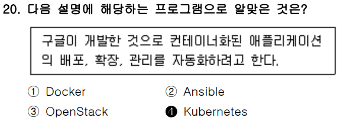

### ✅ 문제 분석 및 개념 정리

---

#### 🔷 **문제 핵심 요점**

> “**구글이 개발한** 것으로, **컨테이너화된 애플리케이션의 배포, 확장, 관리**를 자동화하는 프로그램은?”

---

## 📌 핵심 키워드 요약

* 구글(Google) 개발
* **컨테이너 기반 애플리케이션** 대상
* **배포, 확장(Scaling), 관리 자동화**

이 조건에 딱 들어맞는 기술은 바로 **Kubernetes**입니다.

---

## ✅ 정답: **④ Kubernetes**

---

### 📌 Kubernetes란?

* **Google이 개발**하고 CNCF(Cloud Native Computing Foundation)로 이관
* 컨테이너(보통 Docker 기반)를 **자동 배포, 로드밸런싱, 복구, 확장** 등 클러스터 수준으로 관리
* **"쿠버네티스 = 컨테이너 오케스트레이션 시스템"**

---

## 🔍 보기별 비교

| 보기 번호 | 항목             | 개발사/소속      | 핵심 역할 및 용도                                         | 관련성        | 정답 여부 |
| ----- | -------------- | ----------- | -------------------------------------------------- | ---------- | ----- |
| ①     | **Docker**     | Docker Inc. | 컨테이너 **생성 및 실행** 도구. 애플리케이션을 컨테이너로 패키징.            | 컨테이너 생성 도구 | ❌     |
| ②     | **Ansible**    | Red Hat     | **서버 설정 및 자동화** 도구. 배포 스크립트, 구성 관리에 사용.            | 구성 자동화 도구  | ❌     |
| ③     | **OpenStack**  | 오픈소스 프로젝트   | **가상머신 기반 클라우드 인프라 관리 플랫폼**. VM 자원, 네트워크, 스토리지 관리. | 가상화 플랫폼    | ❌     |
| ④     | **Kubernetes** | Google      | 컨테이너의 **배포, 확장, 관리 자동화**를 위한 오케스트레이션 플랫폼           | 컨테이너 관리 도구 | ✅ 정답  |


---

### ✅ 결론 한 줄 요약

**컨테이너의 배포·확장·관리를 자동화하기 위해 구글이 개발한 기술은 Kubernetes이므로 정답은 ④번이다.**