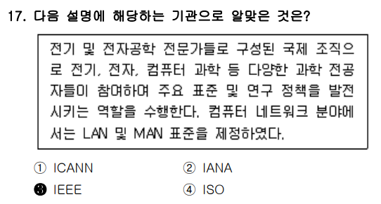
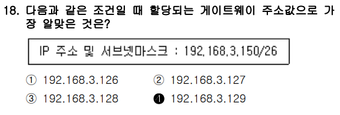
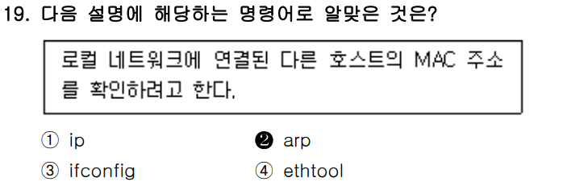
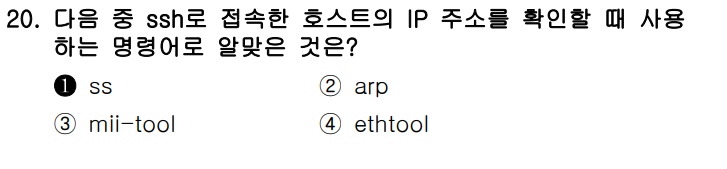

# <1과목 : 리눅스 실무의 이해>

# 📍


리눅스 커널은 `리누스 토발즈`가 만들었는데, 이것은 `앤드루 S. 타넨바움`이 개발한 교육용 유닉스인 `미닉스`를 참고해서 만들었다.

---

<br>
<br>
<br>

# 📍


    *해당 문제는 **리눅스 프로세스 간 통신(IPC, Inter-Process Communication)** 관련 기술에 대한 이해를 묻는 문제.


---

### 🔎 문제 지문 해석:

> **"특정 프로세스의 표준 출력을 다른 프로세스의 표준 입력으로 쓰이게 하는 것으로 대표적인 프로세스 간 통신 기술이다."**

* **표준 출력(Standard Output)** → `stdout`, 일반적으로 터미널에 출력되는 데이터
* **표준 입력(Standard Input)** → `stdin`, 일반적으로 사용자로부터 입력받는 데이터
* 하나의 프로세스에서 출력한 데이터를 **다른 프로세스에서 입력으로 사용**하게 하는 메커니즘을 말함.

→ 이 설명은 리눅스에서 가장 기본적인 **파이프(pipe)** 기능에 해당.

---

### ✅ 정답: **② 파이프**

* **파이프(pipe)** 는 리눅스에서 **하나의 프로세스 출력(stdout)** 을 **다른 프로세스 입력(stdin)** 으로 연결해주는 기능.
* 예:

  ```bash
  ls | grep txt
  ```

  * `ls`의 출력이 `grep`의 입력으로 전달.
  * 이는 **익명 파이프**(anonymous pipe)로 불리며, 가장 대표적인 프로세스 간 통신 방식.

---

### ❌ 오답 분석:

#### ① 리다이렉션 (Redirection)

* `>`, `<`, `>>` 등을 이용하여 **표준 입출력을 파일로 전환**하는 기능.

  * 예: `ls > file.txt` (출력을 파일로 저장)
* 하지만 **다른 프로세스와 연결하는 것은 아님** → 프로세스 간 통신이 아님
* 따라서 지문과 일치하지 않음

#### ③ 라이브러리 (Library)

* 특정 기능을 제공하는 **재사용 가능한 코드 묶음**.

  * 예: `glibc`, `math.h` 등
* **프로세스 간 통신과는 무관**하며, 입출력 연결 개념도 아님

#### ④ 가상 콘솔 (Virtual Console)

* 리눅스에서 Ctrl + Alt + F1 \~ F6 등의 단축키로 전환 가능한 **가상 터미널**.

  * 물리적인 콘솔 없이 여러 개의 콘솔 환경을 제공함
* 이는 **사용자 인터페이스 환경**이며, **프로세스 간 입출력 연결과는 관련 없음**

---

### 🧠 정리

* **파이프(pipe)**는 **프로세스 간 통신 기술**이며, 한 **프로세스의 출력(stdout)**을 **다른 프로세스의 입력(stdin)** 으로 연결해줌.
* 따라서 지문의 설명과 **정확히 일치** 함.
* 다른 선택지들은 모두 **프로세스 간 입출력 전달과는 관련이 없음**.

---

### ✅ 결론 한 줄 요약:

> 특정 프로세스의 출력을 다른 프로세스의 입력으로 전달하는 통신 기술은 리눅스의 **파이프(pipe)** 기능이다.


---

<br>
<br>
<br>


# 📍


- dpkg는 Debian Package의 줄임말.


---

이러한 특징은 다음과 같은 **라이선스 조건**을 내포합니다:

* 상업적 사용 가능 ✅
* 소스코드 수정 후 **공개 강제 없음** ✅
* 오픈소스이지만, **강한 Copyleft 아님** ✅
* 사용 예시: **Hadoop, Tomcat** ✅

---

### ✅ 정답: **① Apache License**

#### ✔ Apache License 특징:

* **자유로운 사용/배포/수정/상업적 이용** 가능
* 소스코드 수정 후 **공개할 의무 없음**
* 단, 재배포 시 **라이선스와 저작권 표시를 유지**해야 함
* **Hadoop**, **Tomcat** 등의 대표 프로젝트에 적용됨

---

### ❌ 오답 해설:

#### ② LGPL (Lesser General Public License)

* 부분적 **Copyleft** 특성을 가짐
* 수정 시 라이브러리 부분은 공개해야 함 (완전 자유 X)
* **상업적 사용 가능**하나, 조건이 Apache보다 까다로움
* 지문의 "소스 코드 공개 필요 없음" 조건과 **불일치**

#### ③ BSD (Berkeley Software Distribution)

* Apache License와 **비슷하게 자유로움**
* 하지만 **Hadoop, Tomcat**은 BSD가 아님
* 또한 **특허권 관련 조항이 없음**
* Apache License가 좀 더 보안된 조건을 갖춤 → 지문에 **명시된 예시와 불일치**

#### ④ MPL (Mozilla Public License)

* **파일 단위 공개 의무** 있음
* 전체는 아니지만, 수정된 부분은 반드시 공개해야 함
* 따라서 "공개할 필요가 없다"는 지문 조건과 **정면 충돌**

---

### 🔎 결론 한 줄 요약:

> 지문에 제시된 ‘상업적 사용 가능, 소스 코드 공개 의무 없음, Hadoop/Tomcat’ 조건을 모두 만족하는 라이선스는 **Apache License**이다.


<br>
<br>
<br>


# 📍


`Debian`은 패키지 설치 및 업데이트 할 때, dpkg 또는 apt-get명령을 사용하고, 칼리 리눅스도 이 리눅스 배포판을 기반으로 만들었다.

이 문제는 **패키지 관리 도구(dpkg, apt-get)** 와 **배포판 계열**에 대한 이해를 묻는 문제.

---

### 📘 지문 분석:

> **"dpkg 또는 apt-get 명령을 사용하고, 칼리 리눅스도 이 리눅스 배포판을 기반으로 만들었다."**

이 설명의 핵심 키워드 :

* `dpkg`, `apt-get` → **Debian 계열의 패키지 관리 시스템**
* **Kali Linux의 기반** → Debian 기반임

따라서 지문은 **Debian 계열 배포판**을 가리키고 있으며, **Kali Linux의 직접적인 기반**을 정확히 설명.

---

### ✅ 정답: **③ Debian**

#### ✔ Debian의 특징:

* `dpkg`와 `apt`, `apt-get`, `aptitude` 등 **패키지 관리 도구**를 사용
* Ubuntu, Kali Linux, Linux Mint 등 다수의 **파생 배포판의 모태**
* 안정성과 자유 소프트웨어 철학에 기반

---

### ❌ 오답 해설:

#### ① Rocky Linux

* \*\*Red Hat 계열 (RHEL)\*\*의 클론
* `yum`, `dnf` 명령 사용
* `dpkg`, `apt-get` 사용하지 않음 → ❌

#### ② CentOS

* 역시 **RHEL 기반 배포판**
* `rpm`, `yum`, `dnf` 사용
* Kali와는 무관 → ❌

#### ④ Ubuntu

* **Debian 기반**이긴 하지만, **Kali의 기반은 Ubuntu가 아니라 Debian**
* Ubuntu는 Debian을 기반으로 만들어졌고, Kali는 Debian을 **직접 기반**으로 함
* 따라서 **지문에서 직접적으로 해당되는 배포판은 아님** → ❌

---

### 🧠 결론 한 줄 요약:

> `dpkg`와 `apt-get`을 사용하고 Kali Linux의 기반이 되는 배포판은 **Debian**이다.


---

<br>
<br>
<br>


# 📍


`고가용성 클러스터`는 다수의 웹 서버를 운영중으로 웹 서버 앞단에 로드 밸런서를 이용하여 부하분산 역할을 수행하도록 구성하였다. 로드 밸런서 역할을 수행하는 시스템의 오류에 대비하려고 한다.

- #### 로드 밸런서의 의미(Load Balancere)
    - 여러 대의 웹 서버(또는 애플리케이션 서버)들 사이에 **들어오는 네트워크 트래픽(예: 사용자의 요청)** 을 적절히 분산시키는 장치 또는 소프트웨어
    - 이 역할을 통해 특정 서버 하나에 트래픽이 집중되어 과부하가 걸리는 상황을 방지하고, 전체 서비스의 안정성, 속도, 가용성을 높일 수 있음


해당 문제는 **클러스터링 기술의 목적에 따른 분류**를 묻는 문제.

---

### 📘 지문 핵심 요약:

> * "다수의 웹 서버 운영"
> * "웹 서버 앞에 **로드 밸런서를 두어** 부하 분산"
> * "로드 밸런서 장애에 대비"
>   → 즉, **시스템 장애 대비 + 부하 분산이 목적**

이러한 목적은 바로 **고가용성(High Availability, HA)** 환경을 구축하는 것.

---

### ✅ 정답: **① 고가용성 클러스터 (High-Availability Cluster)**

#### ✔ 특징:

* 장애 발생 시 **서비스 중단 없이 대체 서버로 자동 전환(Failover)**
* **로드 밸런서 및 웹 서버 다중 구성**이 일반적
* **24/7 서비스 연속성 유지**가 목적
* 실제 예: `Keepalived + LVS`, `HAProxy + Pacemaker` 등

---

### ❌ 오답 분석:

#### ② 고계산용 클러스터 (High-Performance Computing, HPC Cluster)

* → 병렬 연산을 통해 대규모 과학, 공학, 시뮬레이션 작업을 빠르게 처리하는 컴퓨터 시스템
* 과학/공학적 **대규모 수치 계산**, 시뮬레이션 등에 사용
* 목적은 **성능 극대화**, 분산 병렬 계산
* 로드밸런서/웹 서버와는 무관 → ❌

#### ③ 베어울프 클러스터 (Beowulf Cluster)

* → 저비용 일반 PC들을 리눅스와 오픈소스 소프트웨어로 연결해 고성능 병렬 처리를 구현한 클러스터
* **저가형 PC + Linux**로 구성한 **병렬 처리용 클러스터**
* 대부분 **HPC 목적**에 활용됨
* **고가용성이나 부하 분산이 주 목적이 아님** → ❌

#### ④ HPC 클러스터

* → 고계산용 클러스터와 동일한 의미로, 연산 성능 극대화를 위한 병렬 컴퓨팅 환경을 뜻
* ②와 동일 계열
* **초고속 연산 성능 확보용 병렬 시스템**
* 로드 밸런싱, 장애 대비보다는 **계산 성능 확보**가 목적 → ❌

---

### 🧠 결론 한 줄 요약:

> **웹 서버 부하 분산 및 장애 대비를 위한 인프라 구성**은 고가용성(HA) 클러스터가 적절한 기술.


---

<br>
<br>
<br>


# 📍


---

## 🧱 개념 정리: RAID, 패리티, 스페어 디스크

### 1. ✅ RAID란?

* **RAID (Redundant Array of Independent Disks)**
  → "독립적인 디스크의 여분 배열"
* 여러 개의 디스크를 하나처럼 묶어 **데이터 안정성과 성능**을 향상시키는 기술.

* 대표적인 RAID 유형:

  * **RAID 0**: 속도 ↑ (여분 없음, 위험도 높음)
  * **RAID 1**: 미러링 (안정성 ↑, 저장 공간 ↓)
  * **RAID 5**: 패리티 기반, **성능 + 안정성 균형**
  * **RAID 6**: 패리티 2개, 더 높은 안정성
  * **RAID 10**: RAID 1 + RAID 0 혼합

---

### 2. 🧮 RAID-5 특징

* **디스크가 최소 3개 이상 필요**
* **데이터 + 패리티 정보를 분산 저장**
* **1개의 디스크가 고장 나도 데이터 복구 가능**
* 사용 가능한 용량:
  → `(총 디스크 수 - 1) × 각 디스크 용량`

📌 예:

* 디스크 5개 × 10GB → RAID-5 적용 시
* **1개는 패리티 용도**
* 실사용 가능 용량: **4개 × 10GB = 40GB**

---

### 3. 🧮 패리티(Parity)란?

* **오류 검출 및 복구용 수학적 정보**
* 예를 들어, 3개의 디스크에 아래와 같이 저장할 때:

  ```
  A 디스크: 1011  
  B 디스크: 1100  
  C 디스크: 패리티 (XOR 결과) → 0111
  ```
* 어떤 디스크가 손상되어도 나머지 + 패리티를 통해 **데이터 복구 가능**

---

### 4. 🔄 스페어 디스크(Spare Disk)란?

* \*\*핫 스페어(Hot Spare)\*\*라고도 불림
* **RAID 어레이에 직접 참여하지 않고**,
  RAID 디스크 중 하나가 고장났을 때 자동으로 교체되며 데이터 재구성용으로 사용됨
* 안정성을 높이기 위한 **대기용 디스크**

📌 본 문제에서는 6개의 디스크 중 **1개를 스페어로 사용**한다고 했기 때문에,
RAID-5는 **나머지 5개 디스크로 구성**됨

---

## 🧠 최종 요약

| 항목             | 내용                     |
| -------------- | ---------------------- |
| 총 디스크 수        | 6개                     |
| 스페어 디스크        | 1개 (대기용, RAID에 포함 안됨)  |
| RAID-5 구성 디스크  | 5개                     |
| 패리티 용도 디스크     | 1개                     |
| 실제 사용 가능 디스크 수 | 4개                     |
| 실제 사용 가능 용량    | **4개 × 10GB = 40GB** ✅ |

---

## 🧠 한 줄 요약:

> RAID-5는 데이터와 패리티 정보를 분산 저장하여 1개 디스크 장애에도 복구 가능

> 스페어 디스크 1개를 제외한 나머지 중 1개는 패리티용이므로

> 실제 사용 가능한 용량은 **(6 - 1 스페어 - 1 패리티) × 10GB = 40GB**이다.


---

<br>
<br>
<br>


# 📍

    

    
- ### 📖 문제 분석

    - 이 문제는 root 계정의 비밀번호를 잊어버린 경우, 비밀번호를 재설정하기 위해, GRUB에서 부팅 시 직접 커널 파라미터를 조작해 root 쉘에 진입하려는 상황.

        - *GRUB은 리눅스 시스템에서 부팅할 때 사용되는 **부트로더(Boot Loader)**. (GRand Unified Bootloader)

    - 🔑 왜 GRUB에서 커널 인자 변경으로 해결하는가?
        
        - 📌 문제 상황:
        
            - root 비밀번호를 잊었음 → 로그인 불가.
            - root 권한이 없으면 /etc/shadow 등의 중요한 설정을 수정할 수 없음.
            - 운영체제를 정상 부팅하면 로그인 단계에서 막히기 때문에 우회가 필요.

                - ### 🔥 왜 GRUB에서 root 계정까지 조작할 수 있을까?
                    - #### GRUB은 운영체제보다 먼저 실행.
                    - BIOS/UEFI → GRUB → 커널 → systemd 순으로 부팅
                    - 즉, 운영체제가 올라오기 전에 GRUB에서 커널에게 “어떻게 부팅할지” 지시 가능.
                    
                    <br>

                    - 2. GRUB에서 커널 인자를 통해 쉘로 직접 진입 가능.
                        - GRUB 메뉴에서 linux 줄을 수정해  `rw init=/bin/sh` 입력.
                        - 그러면 운영체제가 정상 부팅되는 대신, 커널이 직접 /bin/sh를 실행.
                        - 이때는 로그인 없이 바로 root 권한의 쉘에 들어가게 됨.


- 🎯 해결 방법
    - root 비밀번호를 초기화하기 위해서는

        - 루트 파일 시스템을 읽기-쓰기 모드로 마운트해야 하므로 ro를 rw로 바꿔야 하고,
        - 초기화 프로그램을 쉘로 지정해야 하므로 `init=/bin/sh` 또는 `systemd.unit=rescue.target` 등을 추가해야 함.

            - `rw` : 루트 파일 시스템을 읽기/쓰기(read-write)로 마운트
            - `init=/bin/sh` : 부팅 후 가장 먼저 실행할 init 프로세스를 `/bin/sh`로 지정 → 즉, bash 쉘 하나만 띄워주는 모드로, 비밀번호 재 설정에 유리함.

- ❌ 오답 분석

    | 선택지                    | 내용                                 | 왜 틀렸는가 또는 정답 이유                                     |
    |---------------------------|--------------------------------------|--------------------------------------------------------------|
    | ① `rw single`             | 단일 사용자 모드 (single user mode)   | CentOS 7 이상에서는 이 상태에서도 root 패스워드를 요구함       |
    | ② `rw rescue`             | 구조 모드 진입                        | rescue 모드 역시 root 비밀번호를 요구함                        |
    | ③ `rw systemd=/bin/sh`    | `systemd`를 `/bin/sh`로 대체          | 문법이 틀렸음. `systemd.unit=/bin/sh` 형식이어야 하며, 효과적이지 않음 |
    | ④ `rw init=/bin/sh`       | 쉘로 직접 진입 (init 프로세스를 쉘로 지정) | ✅ **정답**: 비밀번호 없이 root 쉘에 직접 접근 가능함             |

    - `init=/bin/sh`는
        - **리눅스 커널이 시스템을 부팅할 때, 평소처럼 systemd나 init 프로세스를 타지 않고 곧바로 /bin/sh를 실행하도록 지시하는 명령어.**
        - `/bin/sh`는 리눅스 시스템에 기본적으로 존재하는 "쉘(Shell)"을 실행하는 파일

---

<br>
<br>
<br>


# 📍


| 번호 | 명령어                     | 의미                                                    | 정오                      |
| -- | ----------------------- | ----------------------------------------------------- | ----------------------- |
| ①  | `systemctl enable sshd` | **sshd 서비스를 부팅 시 자동 실행되도록 설정 (Enable at boot)**       | ✅ **정답**                |
| ②  | `systemctl status sshd` | 현재 sshd 서비스의 상태(status)를 확인                   | ❌ 자동 실행 설정과는 무관         |
| ③  | `systemctl active sshd` | 존재하지 않는 명령어 `active` → 올바른 systemctl 명령 아님            | ❌ **잘못된 명령어**           |
| ④  | `systemctl start sshd`  | sshd 서비스를 즉시 시작(start)하지만, **부팅 시 자동 실행은 아님** | ❌ 일시적 실행일 뿐, enable은 아님 |

- ssh 데몬이란, 리눅스 시스템에서 원격 접속을 가능하게 해주는 백그라운드 서비스

---

<br>
<br>
<br>


# 📍


| 번호 | 명령                | 설명                                            | 정오       |
| -- | ----------------- | --------------------------------------------- | -------- |
| ①  | `xauth`           | X 서버 인증을 관리하는 명령이지만, **서버 주소 설정은 아님**         | ❌        |
| ②  | `xhpst`           | ❌ 존재하지 않는 명령어. 오타 또는 허구의 명령                   | ❌        |
| ③  | `DISPLAY` 환경변수 설정 | **X 서버의 주소와 화면 번호를 지정하는 핵심 환경변수**             | ✅ **정답** |
| ④  | `TERM` 환경변수 설정    | 터미널 종류를 지정 (`xterm`, `vt100` 등), **X 서버와 무관** | ❌        |

- 📖 문제 분석

    - ✅ 용어 : X Window 시스템이란?
        
        - 리눅스/유닉스 계열에서 GUI 환경을 사용하는 시스템은 보통 **X Window System (X11)** 이라는 구조를 따름.
        - 이 구조는 **"입출력 방향이 일반적인 서버-클라이언트 구조와 반대"** 라는 특징.
    
    - ✅ "원격지 X 서버에 응용 프로그램을 전송한다"는 뜻
        
        - 원격 리눅스 서버에서 GUI 프로그램(ex. xclock, gedit, firefox)을 실행하고,
        
            그 프로그램의 창을 내 컴퓨터 화면(=X 서버)에 출력하는 것을 의미.

        - 응용 프로그램은 서버에서 실행

            - 화면은 내 컴퓨터에 표시

        - 🎯 이것이 바로 "X 클라이언트 → X 서버로 전송"의 의미

    - 개념

        | 용어                           | 의미                                                   |
        | ---------------------------- | --------------------------------------------------------|
        | **X Window System (X11)**    | 리눅스 GUI를 위한 전체 시스템 (X Server + X Client 포함)    |
        | **X Server**                 | 키보드/마우스 입력 받고, **화면에 출력하는 주체 (내 컴퓨터)**  |
        | **X Client**                 | GUI 프로그램 (gedit, firefox 등), X Server에게 출력 요청함 |
        | **DISPLAY 변수**              | "이 프로그램을 어디 X Server에 띄울까?"를 지정하는 주소      |
        | **xclock, gedit, wireshark** | X Client 역할을 하는 프로그램들                           |

---

<br>
<br>
<br>


# 📍               


### ✅ 문제 분석 및 개념 정리

---

#### 🔷 **문제 핵심 요점**

"**원격지 X 서버에 응용 프로그램을 전송하기 위해 X 클라이언트에서 진행해야 하는 과정**"을 묻는 문제.

이 문제의 핵심 키워드:

* **X 서버 (X Server)**:
    - 그래픽 **출력**을 담당하는 서버.
    - 사용자 **디스플레이가 있는 컴퓨터**.
* **X 클라이언트 (X Client)**:
    - 실행되는 응용 프로그램.
    - **출력을 원격 디스플레이로 보내고 싶어하는 쪽**.

---

### 📌 기본 개념 정리

#### 1. **X Window System의 구조**

| 구성요소           | 역할                                              |
| -------------- | ----------------------------------------------- |
| **X Server**   | 키보드/마우스 입력을 받고 화면에 그래픽을 출력. 즉, **사용자의 PC**      |
| **X Client**   | 원격에서 실행되는 응용 프로그램. gedit, xclock, etc.          |
| **DISPLAY 변수** | X Client가 **출력을 보낼 X Server를 지정**할 때 사용하는 환경 변수 |

> 💡 **X Server는 사용자 디바이스에 존재하고, X Client는 원격 서버에서 실행됩니다.**

예: SSH로 접속한 리눅스 서버에서 `xclock`을 실행하면, \*\*사용자 PC(=X Server)\*\*의 화면에 시계가 뜸.

---

### 🔍 보기별 상세 분석

#### ✅ ③ 환경변수인 `DISPLAY`의 값을 서버 주소로 변경한다. → **정답**

* **설명**: X Client가 어느 X Server로 화면 출력을 보낼지를 지정하는 핵심 변수.
* 예시:

  ```bash
  export DISPLAY=192.168.0.10:0.0
  ```
    | 항목            | 의미                                         |
    | -------------- | -------------------------------------------- |
    | `192.168.0.10` | **X Server**, 즉 GUI 화면을 출력할 PC의 IP 주소 |
    | `:0`           | 첫 번째 디스플레이 세션                         |
    | `.0`           | 첫 번째 스크린 (대부분 0만 사용함)               |


  → 원격지 응용프로그램이 **192.168.0.10의 화면(:0.0)에 출력됨**
* **출제 의도**: X Client가 X Server에 출력하기 위한 필수 환경 설정을 물어봄.

    - DISPLAY는 리눅스나 유닉스 계열 시스템에서 사용하는 X 윈도우 시스템의 핵심 환경 변수
    - **"그래픽 화면을 어디에 출력할지"** 를 X 클라이언트 프로그램에게 알려주는 역할

---

#### ❌ ① `xauth` 명령으로 서버 주소를 등록한다.

* `xauth`는 \*\*X 인증 정보(cookie)\*\*를 관리하는 명령어.
* 보안상 인증된 X Server만 연결할 수 있도록 도와줌.
* 하지만 `xauth`는 **DISPLAY 환경 설정을 대신할 수 없고**, 부가적인 설정일 뿐.
* **오답 이유**: DISPLAY 설정이 없이 `xauth`만으로는 출력이 되지 않음.

---

#### ❌ ② `xhpst` 명령으로 서버 주소를 등록한다.

* **존재하지 않는 명령어입니다.**
* `xhost`와 오타로 보이며, `xhost`는 다음을 의미할 수 있음:

  ```bash
  xhost + 192.168.0.20
  ```

  → X Server에서 **특정 클라이언트 IP에 접근 권한을 허용**.
* 즉, `xhost`는 **서버 측에서 수행하는 보안 설정**일 뿐,
  **클라이언트에서 X Server 주소를 지정하지는 않음.**
* **오답 이유**: 명령어 자체가 틀렸거나, 오해의 소지가 있음.

---

#### ❌ ④ `TERM` 환경변수의 값을 서버 주소로 변경한다.

* `TERM`은 터미널 타입(bash, xterm, vt100 등)을 나타내는 환경 변수.
* 이는 **텍스트 기반 터미널 출력**에만 영향이 있고, **X 윈도우 GUI 출력과는 무관**.
* **오답 이유**: X 윈도우와 무관한 변수 설정임.

    - `TERM`은 리눅스/유닉스 환경에서 사용되는 **터미널 종류(터미널 에뮬레이터의 타입)** 를 지정하는 **환경 변수(Environment Variable)**.
    - 텍스트 기반 프로그램이 어떤 방식으로 글자와 색을 출력해야 할지를 결정하는 데 사용
---

### 🧠 출제 의도 해석

이 문제는 단순 지식보다도 **X Server와 Client의 관계, DISPLAY 설정이 왜 필요한지**를 이해하고 있는지를 묻는 문제.

즉, GUI 환경에서 원격지 응용 프로그램이 **어디에 출력되는가**에 대한 **기본 구조 이해**를 테스트.

* DISPLAY 설정은 **X Client가 X Server에게 ‘여기로 출력해라’라고 알려주는 것**
* 실제 환경에서도 원격지에 `gedit`, `xclock` 등을 실행할 때 반드시 설정해야 함

---

### 🧾 정리

| 보기                | 설명                             | 맞/틀 |
| ----------------- | ------------------------------ | --- |
| ① xauth 명령        | 인증 설정 도구이나 DISPLAY 설정은 아님      | ❌   |
| ② xhpst 명령        | 존재하지 않음 (오타 or 잘못된 지문)         | ❌   |
| ③ DISPLAY 환경변수 설정 | X Client가 X Server를 지정하는 핵심 설정 | ✅   |
| ④ TERM 환경변수 설정    | 터미널 타입 설정, GUI와 무관             | ❌   |

---

### ✅ 결론 한 줄 요약

**X Client가 원격지 X Server에 GUI 출력을 보내려면 반드시 `DISPLAY` 환경변수를 통해 서버 주소를 지정해야 한다.**

### ✅ 핵심 요지
- X Client는 그래픽 프로그램을 실행하는 쪽
- X Server는 그래픽을 실제로 **출력해주는 쪽(=모니터, 마우스, 키보드가 있는 PC)**

---

<br>
<br>
<br>


# 📍               


이 문제는 리눅스 실기 환경 또는 GUI 설정 이해를 묻는 **시각형 식별 문제** ,

"**로그인 화면을 담당하는 프로그램이 무엇인지 정확히 알고 있는가?**"를 확인하는 것이 출제 의도.

---

## ✅ 문제 해석

> **그림**은 사용자 계정 목록을 보여주는 GUI 로그인 화면

> → 이는 \*\*리눅스 GUI 환경에서 로그인 세션을 시작하기 위해 사용하는 ‘디스플레이 매니저(Display Manager)’\*\*의 화면입니다.

---

## ✅ 보기별 해설

| 번호        | 보기                        | 의미                           | 정답 여부 | 이유                                |
| --------- | ------------------------- | ---------------------------- | ----- | --------------------------------- |
| ① **GDM** | **GNOME Display Manager** | 로그인 화면(디스플레이 매니저)을 담당하는 프로그램 | ✅ 정답  | 그림에 보이는 GUI 로그인 화면은 GDM이 출력한 화면   |
| ② KDE     | **K Desktop Environment** | 전체 데스크탑 환경 이름 (GNOME과 같은 계열) | ❌ 오답  | 로그인 화면 자체를 담당하는 프로그램은 아님          |
| ③ GNOME   | **데스크탑 환경 전체(GUI 환경)**    | 창, 패널, 설정 등 포함하는 사용자 환경      | ❌ 오답  | 로그인 전 단계에서 GNOME은 아직 실행되지 않음      |
| ④ Mutter  | **GNOME의 윈도우 매니저**        | 창 배치 및 효과 등 렌더링 담당           | ❌ 오답  | 로그인 화면이 아니라, 로그인 **후**에 동작하는 구성요소 |


## ❌ 오답 해설

### ② KDE
* KDE는 데스크탑 환경(플랫폼) 이름입니다.
* KDE에서 사용하는 디스플레이 매니저는 SDDM이 대표적
* 이미지처럼 생기지 않음 → 오답

### ③ GNOME
* GNOME은 전체 데스크탑 환경(GUI 시스템) 이름
* GDM은 GNOME 환경의 로그인 관리자임
* 하지만 직접적인 답은 디스플레이 매니저를 묻고 있으므로 GDM이 정확

### ④ Mutter
* Mutter는 **GNOME에서 사용하는 윈도우 매니저(창 관리자)**입니다.
* 로그인 화면과는 무관

---

## 🧠 출제 의도 분석

이 문제는 **단순 용어 암기인지**, 또는
\*\*리눅스 GUI의 구조(GDM → GNOME → Mutter 순서)\*\*를 제대로 이해하고 있는지를 확인하려는 문제입니다.

> ⛳ 출제자는 수험자가 **GDM(로그인) ↔ GNOME(환경) ↔ Mutter(창 매니저)** 역할을 명확히 구분할 수 있는지를 보고 싶었던 것.

---

## 📌 GDM이 하는 일 요약

| 역할        | 설명                                    |
| --------- | ------------------------------------- |
| 로그인 화면 출력 | 사용자 목록, 비밀번호 입력 UI                    |
| 세션 선택     | GNOME, KDE, XFCE 등 어떤 데스크탑 환경으로 로그인할지 |
| 로그인 처리    | PAM을 통한 사용자 인증 후, 세션 실행               |

---

## ✅ 정답

> ✅ **1번 GDM**

---

### ✅ 결론 한 줄 요약

* **이 문제는 리눅스 GUI 로그인 구조에서 GDM의 역할을 알고 있는지를 묻는 문제
GDM은 로그인 화면을 출력하는 프로그램이므로 정답은 ①번.**
* KDE, GNOME, Mutter는 로그인 이후 동작하는 구성요소들로 오답.
* 제시된 그래픽 로그인 화면은 GNOME 데스크탑 환경에서 사용하는 로그인 관리자 GDM의 화면이므로, 정답은 ① GDM

---

<br>
<br>
<br>


# 📍


이 문제는 **백틱(back quotes: `` ` ` ``)** 을 이용한 **명령어 치환(command substitution)** 의 동작 원리를 이해하고 있는지를 묻는 문제.

---

## ✅ 명령어 분석

```
echo "My Home is `pwd`"
```

* **`pwd`**: 현재 작업 디렉토리를 출력하는 명령어
* **`` `pwd` ``**: **백틱** (`back quote`)으로 감싸면 → `pwd` 명령의 **실행 결과가 문자열 안에 치환됨**
* 따라서 이 명령은 아래와 같이 동작:

```bash
echo "My Home is /home/ihd"
```

→ 실제 출력 결과는:

```
My Home is /home/ihd
```

---

## 🔍 보기별 분석

| 번호 | 보기                       | 의미                                    | 정답 여부 | 이유                                         |
| -- | ------------------------ | ------------------------------------- | ----- | ------------------------------------------ |
| ①  | `My Home is 'pwd'`       | `pwd`라는 문자열이 작은따옴표와 함께 그대로 출력됨        | ❌     | 작은따옴표 안에 있으므로 명령어로 인식되지 않고 문자열로 출력됨        |
| ②  | `My Home is '/home/ihd'` | `/home/ihd` 문자열을 작은따옴표 포함하여 출력함       | ❌     | 실제 명령 실행 결과에는 작은따옴표가 포함되지 않음               |
| ③  | `My Home is /home/ihd`   | 현재 디렉터리 경로(`/home/ihd`)가 명령어 치환되어 출력됨 | ✅     | `` `pwd` `` 명령어가 실행되어 현재 경로가 치환되어 출력되므로 정답 |
| ④  | `My Home is pwd`         | `pwd`라는 단어가 그대로 출력됨                   | ❌     | 명령어로 인식되지 않고 일반 문자열로 출력됨                   |


---

## 🧠 출제 의도

* `echo`, `pwd`, `` `command` ``의 동작 원리를 함께 아는지 확인
* 특히 \*\*명령어 치환(backquote)\*\*이 실제 문자열 내부에서 **어떻게 동작하는지를 묻는 응용형 문제**

---

### ✅ 결론 한 줄 요약

**echo "My Home is `pwd`"는 pwd 명령의 실행 결과를 문자열 안에 치환하여 출력하므로, 정답은 ③번 "My Home is /home/ihd"입니다.**

---

## ✅ JavaScript의 `${}` (템플릿 리터럴)과 차이 

JavaScript의 `${}` (템플릿 리터럴)과, **핵심 개념은 비슷하지만 동작 원리는 다름.**

JavaScript의 `${}` 와 리눅스 쉘(Bash)에서의 `` `command` `` 또는 `$(command)`는

**"치환(Substitution)"이라는 측면에서 유사하지만, 구체적인 동작 방식은 서로 다름.**

---

### ✅ JavaScript의 `${}` (템플릿 리터럴)

```javascript
const data = "home";
console.log(`My Home is ${data}`);
```

* 템플릿 문자열 안에서 `${변수}`를 사용하여 변수 값을 삽입함
* **정적 문자열 안에 동적으로 값을 삽입하는 문법**
* 작동 시점: **자바스크립트 엔진이 문자열 생성 시 해석**

---

### ✅ 리눅스 쉘의 `` `command` `` 또는 `$(command)`

```bash
echo "My Home is `pwd`"
# 또는
echo "My Home is $(pwd)"
```

* **쉘 명령어의 실행 결과를 치환해서 문자열에 삽입**
* 예: `pwd` → `/home/user`가 되므로 전체 문자열은 `"My Home is /home/user"`
* 작동 시점: **쉘이 명령어를 파싱하고 실행할 때 해석**

---

<br>
<br>
<br>


# 📍


이 문제는 셸 명령에서 조건식(`test`)의 **종료 상태 코드(\$?)** 를 이해하고 있는지를 묻는 문제.

---

## ✅ 명령어 분석

```bash
# test 20 -gt 30
# echo $?
```

### 🔍 `test 20 -gt 30` 의 의미

* `test` 명령은 조건식을 평가하여 **참이면 0, 거짓이면 1** 을 반환.
* `20 -gt 30`은 **20이 30보다 크냐?** → ❌ **거짓**


## ✅ 먼저 -gt는 무슨 뜻인가?
- -gt는 greater than의 약자.
- 즉, **`a -gt b`는 “a가 b보다 크냐?”** 를 판단.

    예시 :

    ```
    test 5 -gt 3    → 참 (exit code: 0)
    test 3 -gt 5    → 거짓 (exit code: 1)
    ```

## ✅ 그러면 test 20 -gt 30은?

```
test 20 -gt 30
```
→ 해석: “20이 30보다 큰가?”

→ 20 < 30 이므로 조건은 거짓
→ test 명령은 거짓이면 exit code 1을 반환

```
echo $?
```

결과: 1


---

## ✅ `$?` 의 의미

* `$?` 는 **가장 최근 실행된 명령어의 종료 상태(exit code)** 를 반환
* 셸에서:

  * `0` → **성공 (참)**
  * `1` → **실패 (거짓)**

---

## 🎯 따라서

```bash
test 20 -gt 30    # → 거짓이므로 종료 상태는 1
echo $?           # → 1 출력
```

---

## 보기 분석

| 번호    | 보기              | 의미   | 정답 여부 |
| ----- | --------------- | ---- | ----- |
| ① 0   | 조건이 참일 때 나오는 값  | ❌    |       |
| ② 1   | 조건이 거짓일 때 나오는 값 | ✅ 정답 |       |
| ③ 10  | 무관              | ❌    |       |
| ④ -10 | 무관              | ❌    |       |

---

### ✅ 결론 한 줄 요약

**`test 20 -gt 30`은 거짓이므로 종료 상태는 1이며, `echo $?`의 결과는 1이므로 정답은 ②번.**


---

### 🔍 JavaScript와 Bash 비교

| 항목       | JavaScript                 | Bash (Shell)            |
| -------- | -------------------------- | ----------------------- |
| 문법       | `` `My home is ${data}` `` | `` `pwd` `` 또는 `$(pwd)` |
| 치환 대상    | **변수 또는 표현식**              | **명령어 실행 결과**           |
| 평가 시점    | 템플릿 문자열 해석 시               | 명령어 실행 시점               |
| 내부 작동 방식 | 자바스크립트 런타임에서 처리            | Bash 파서 + 명령어 실행 결과로 처리 |

---

### 💡 공통점과 차이

| 구분 | 공통점                                      | 차이점                                     |
| -- | ---------------------------------------- | --------------------------------------- |
| ✔  | 문자열 안에 동적 값 삽입 가능                        | JavaScript는 변수/표현식, Bash는 **명령어 실행 결과** |
| ✔  | 런타임 시점에 치환됨                              | JavaScript는 엔진 해석, Bash는 셸 명령어 실행 후 치환  |
| ❌  | Bash는 `${변수}`는 변수 참조이고 `${command}`는 불가능 | Bash의 `${}`와 `` ` ` ``은 완전히 다른 역할       |

---

#### ✅ 결론 한 줄 요약

**JavaScript의 `${}`와 Bash의 `` `command` `` 또는 `$(command)`는 모두 문자열 안에서 동적인 값을 치환하는 문법이라는 점에서 유사하지만,**

**JS는 변수/표현식을 치환하고, Bash는 명령어 실행 결과를 치환한다는 점에서 근본적으로 다름.**


---

<br>
<br>
<br>


# 📍


이 문제는 **리눅스 시스템에서 프로세스 생성 방식**을 이해하고 있는지를 묻는 대표적인 이론 문제.

---

## ✅ 문제 핵심 요약

> **"하나의 프로세스가 다른 프로세스를 실행할 때 사용하는 시스템 호출"**

> → **"자식 프로세스가 생성된다"**

> 이 설명은 명확하게 **`fork()` 시스템 호출**에 대한 설명.

---

## ✅ 보기별 해설

| 번호 | 보기       | 설명                                                     | 정답 여부          |
| -- | -------- | ------------------------------------------------------ | -------------- |
| ①  | **fork** | 부모 프로세스가 자신을 복제해 **자식 프로세스를 생성**함                      | ✅ 정답           |
| ②  | exec     | 기존 프로세스의 메모리 공간을 **다른 프로그램으로 덮어쓰는 시스템 호출**             | ❌ (fork 이후 사용) |
| ③  | init     | **PID 1번**: 부팅 후 최초로 실행되어 시스템 초기화 및 서비스 관리 수행          | ❌              |
| ④  | systemd  | 현대 리눅스 시스템의 대표적인 **init 시스템**으로, 서비스 단위(Unit) 관리 등을 수행 | ❌              |

---

## ✅ fork vs exec 차이

| 항목  | fork                 | exec                      |
| --- | -------------------- | ------------------------- |
| 역할  | **새로운 프로세스 생성**      | 기존 프로세스를 **다른 프로그램으로 교체** |
| 결과  | 부모 + 자식 프로세스 존재      | 자식 프로세스만 존재 (덮어쓰기됨)       |
| 메모리 | 부모와 거의 동일한 메모리 공간 생성 | 완전히 새로운 프로그램으로 메모리 교체     |

---

## 🧠 출제 의도

* **프로세스 생성 구조 (`fork` → `exec`)의 이해**
* 자식 프로세스 구조와 시스템 호출 흐름에 대한 기초 지식

---

### ✅ 결론 한 줄 요약

**프로세스가 새로운 자식 프로세스를 생성할 때 사용하는 시스템 호출은 `fork()`이므로 정답은 ①번 fork.**


---

<br>
<br>
<br>


# 📍


해당 문제는 **"다음 중 시그널 번호 숫자 없이 가장 큰 시그널로 알맞은 것은?"** 이라는 질문입니다.

즉, **숫자 자체가 가장 큰 시그널 번호**를 묻는 것이 아니라,

**시그널의 강제성(무시 불가능한 정도)** 을 기준으로 **가장 강력한 시그널**을 묻는 것입니다.

---

### 각 시그널 설명:

| 시그널 이름    | 시그널 번호        | 설명                         | 무시 가능 여부 |
| --------- | ------------- | -------------------------- | -------- |
| `SIGINT`  | 2             | 인터럽트 (Ctrl+C)로 종료 요청       | ✅ 무시 가능  |
| `SIGKILL` | 9             | 강제 종료, **무조건 종료됨**         | ❌ 무시 불가능 |
| `SIGSTOP` | 19 (시스템마다 다름) | **강제 중지 (정지)**, 프로세스 일시 정지 | ❌ 무시 불가능 |
| `SIGQUIT` | 3             | 종료 + Core dump (Ctrl+)     | ✅ 무시 가능  |

---

### 핵심 비교: SIGKILL vs SIGSTOP

* `SIGKILL`과 `SIGSTOP`은 **사용자가 무시하거나 핸들링할 수 없는 강력한 시그널**입니다.
* 하지만 `SIGKILL`은 **프로세스를 완전히 종료**하고,
  `SIGSTOP`은 **프로세스를 일시 정지**시킵니다.

---

### 정답: **③ SIGSTOP**

> 질문에서 **"숫자 없이 가장 큰 시그널"** 이란 표현은 **번호의 크기**가 아니라,**프로세스를 제어할 수 없는 강한 시그널** 중 가장 효과가 큰 것을 묻는 것으로 보며, `SIGSTOP`은 커널 레벨에서도 무조건 정지시키는 **가장 강력한 시그널 중 하나**로 평가받습니다.
> (단, 종료는 아니며, `SIGCONT`로 다시 재개할 수 있습니다)

---


## 🔍 "번호 없이 가장 큰 시그널"이란 말은 무슨 뜻인가?

### 문장 구조:

> **"번호 없이"** + **"가장 큰 시그널"**

보통 우리가 문제에서 "**가장 크다**"라고 하면 수치적 비교(숫자)를 떠올립니다.
하지만 여기서 **"번호 없이"** 라는 조건이 붙었다는 건 곧바로:

> ❗ \*"숫자(시그널 번호)를 가지고 단순히 비교하지 말고, 시그널의 본질적 영향력, 강제성, 시스템 제어력을 기준으로 판단하라"\*는 의도입니다.

---

## ✅ 이 표현이 왜 이렇게 쓰였는가? (문제 출제자의 의도)

### ✔️ 출제자의 숨은 의도:

| 표현         | 의도된 의미                                                     |
| ---------- | ---------------------------------------------------------- |
| "번호 없이"    | 단순히 SIGINT=2, SIGKILL=9, SIGSTOP=19 같은 **숫자 크기 비교는 하지 마라** |
| "가장 큰 시그널" | 시스템 입장에서 **가장 강력하게 프로세스를 제어하는 시그널** (무시 불가, 즉시 정지/종료 등)    |

즉, 출제자는 **"번호를 기준으로 하지 않고 의미로만 비교할 때 가장 강력한 시그널은 무엇인가?"** 를 묻고 있습니다.

---

## ✅ 예시로 비교

| 시그널 이름  | 번호 | 강제성     | 설명                    |
| ------- | -- | ------- | --------------------- |
| SIGINT  | 2  | ❌ 무시 가능 | Ctrl+C → 핸들링 가능       |
| SIGQUIT | 3  | ❌ 무시 가능 | Ctrl+\ → Core Dump 가능 |
| SIGKILL | 9  | ✅ 무시 불가 | 즉시 종료 (핸들러도 등록 불가)    |
| SIGSTOP | 19 | ✅ 무시 불가 | 즉시 정지 (재개 가능하나 무시 불가) |

> 이 중 **번호만 보면 SIGSTOP이 가장 크지만**, 번호 없이 의미만 보면 `SIGKILL`, `SIGSTOP`이 강력한 시그널임을 알 수 있음.

---

## ❗ "강제성"이 왜 중요한가?

시그널의 진짜 힘은 "번호"가 아니라 다음 요소에서 나옵니다:

| 기준       | 설명                          |
| -------- | --------------------------- |
| 무시 불가 여부 | 프로세스가 핸들러로 무시하거나 대체할 수 없는가? |
| 즉시 반응성   | OS가 시그널을 보내자마자 즉시 효과가 있는가?  |
| 시스템 통제성  | OS가 강제로 프로세스를 제어하는가?        |

이런 측면에서 보면, `SIGKILL`, `SIGSTOP`은 OS의 **최종 무기**에 해당합니다.


---

"단순 우열이 아니라 역할이 다르다"고 했는데, 왜 특정 시그널(`SIGSTOP`)을 **정답**으로 선택하는가?
이건 **시험 문제의 문장 구조와 출제 의도**, 그리고 **시그널에 대한 깊은 이해**가 함께 작용한 해석의 문제입니다.

---

## 🧠 문제 다시 보기:

> **“다음 중 시그널 번호 숫자 없이 가장 큰 시그널로 알맞은 것은?”**

---

## ✅ 1. "번호 없이"란 조건의 의미 복습

이 조건은 \*\*시그널 번호(숫자 값)\*\*로 비교하지 말고,
시그널의 **시스템적 영향력, 강제성, 우선 처리성** 등 **의미적 크기**를 기준으로 판단하라는 뜻입니다.

---

## ✅ 2. `SIGKILL` vs `SIGSTOP`: 역할은 다르지만, 공통점은 있다

| 항목                | `SIGKILL` | `SIGSTOP` |
| ----------------- | --------- | --------- |
| 프로세스 핸들링 가능 여부    | ❌ 무시 불가   | ❌ 무시 불가   |
| 커널이 강제로 즉시 처리     | ✅         | ✅         |
| Signal Mask 적용 여부 | ❌ 적용 안됨   | ❌ 적용 안됨   |
| signal handler 등록 | 불가        | 불가        |

→ 이 둘은 모두 **OS가 프로세스를 “절대 제어”하는 시그널**입니다.

→ 그러니 시험문제에서 이 둘 중 하나가 답일 가능성이 높다는 것까지는 누구나 생각합니다.

---

## ✅ 3. 출제자의 선택 기준 추론

여기서 중요한 건:

> **“죽이는 것과 멈추는 것 중, 어떤 것이 더 강제적인가?”**

보통의 UNIX/LINUX 시스템 설계 철학에서 보면:

* `SIGKILL`은 **최후의 수단**입니다. 그러나 **한 번만 작동**합니다.
* `SIGSTOP`은 **강제 정지**이며, 프로세스를 **살린 상태로 완전 통제**합니다.

  * 사용자가 다시 `SIGCONT` 하기 전까지, **일체의 동작이 불가**
  * 백그라운드 프로세스 제어, 디버깅, job control 등에서 매우 중요한 시그널

즉, **지속적인 시스템 제어권 관점에서 보면 `SIGSTOP`이 더 “큰 영향”을 가집니다.**

> `SIGKILL`은 "죽이면 그만", 하지만
> `SIGSTOP`은 "살려두고도 아무것도 못하게 한다" → **더 통제력 강함**

---

## ✅ 시험 출제자의 논리 구조

| 조건         | 설명                                  |
| ---------- | ----------------------------------- |
| "번호 없이"    | 단순 번호 비교 금지 (2, 3, 9, 19 등 비교하지 마라) |
| "가장 큰 시그널" | 시스템이 프로세스를 가장 완전히 제어할 수 있는 시그널      |
| 해석 기준      | 강제성, 무시 불가성, 통제력 (죽이기 vs 지배하기)      |

→ 따라서 출제자는 **죽이는 SIGKILL보다**,

**지속적으로 통제 가능한 SIGSTOP을 더 "강한 지배력"을 가진 시그널**로 본 것입니다.

---

## ✅ 보너스: 실무에서도 SIGSTOP이 더 무서운 이유

* `SIGSTOP`된 프로세스는 **죽지도 않고, 움직이지도 않고, CPU도 안 씀**
* 하지만 **/proc에도 살아있고, 종료도 안 되고, 오랫동안 시스템에 남아있을 수 있음**
* 리눅스에서 zombie보다 더 해로운 **멈춰버린 프로세스**가 됨

이런 면에서, SIGSTOP은 **정말 시스템이 강제로 프로세스를 완전히 "가둬두는" 시그널**입니다.

---

## ✅ 정리: "왜 SIGSTOP이 정답인가?"

| 항목         | 이유                                    |
| ---------- | ------------------------------------- |
| 번호 비교 배제   | “번호 없이” 조건 때문에 숫자 크기 비교 불가            |
| SIGKILL 한계 | 죽이고 끝. 제어는 1회성                        |
| SIGSTOP 강점 | 살아있으면서 완전 통제. 무시 불가. 재개 전까지 무조건 정지    |
| 출제자의 기준    | "시스템 통제권" 기준으로 판단한 시그널의 강제성           |
| 결론         | **통제 측면에서 가장 강력한 시그널은 SIGSTOP**이므로 정답 |

---

✅ **한 줄 요약:**
`SIGSTOP`은 프로세스를 강제로 “살아있는 채로 완전히 멈추게” 하여 시스템이 가장 강력하게 통제할 수 있는 시그널로,

번호를 배제한 의미 중심 판단 기준에서는 `SIGKILL`보다 더 큰 시그널로 간주되어 정답이 됩니다.


---

## ✅ 결론 정리

* **"번호 없이"** 란 표현은 **숫자 크기가 아닌 의미와 효과의 크기로 판단하라는 암시**
* **"가장 큰 시그널"** 은 **가장 강력하고 제어 불가능한 시그널**을 의미
* 따라서 이 문제는 **단순 숫자 문제처럼 보이지만, 사실은 시그널의 본질적 강제성에 대한 개념 이해를 묻는 문제**

---

✅ **한 줄 요약:**
"번호 없이 가장 큰 시그널"이란 숫자 비교를 배제하고,

**시그널의 강제성과 시스템 제어력을 기준으로 가장 강력한 시그널을 고르라**는 의미입니다.

---

<br>
<br>
<br>


# 📍


### 문제 15 분석

> **“다음 중 백그라운드로 수행 중인 프로세스를 확인하는 명령으로 알맞은 것은?”**
>
> ① `bg`
> ② `fg`
> ③ ✅ `jobs`
> ④ `nohup`

---

## ✅ 정답: **③ `jobs`**

---

## 🔍 보기별 분석

| 보기 | 명령어     | 기능 설명                              | 백그라운드 프로세스 확인 여부       |
| -- | ------- | ---------------------------------- | ---------------------- |
| ①  | `bg`    | **중지된 작업(job)을 백그라운드로 재개**         | ❌ (확인 X, 재개용)          |
| ②  | `fg`    | **백그라운드 작업을 포그라운드로 전환**            | ❌ (확인 X, 전환용)          |
| ③  | `jobs`  | **현재 쉘에서 실행 중인 백그라운드/정지 작업 목록 확인** | ✅ (정확히 이 목적)           |
| ④  | `nohup` | **세션 종료 시에도 프로세스를 계속 실행하게 함**      | ❌ (실행 방식 제어, 확인 기능 아님) |

---

## ✅ `jobs` 명령어란?

* `bash` 같은 **셸 내부(builtin)** 명령어입니다.
* **현재 셸 세션 내에서 실행 중인 작업 목록 (백그라운드 or 정지 상태)** 을 보여줍니다.
* 출력 예:

  ```bash
  $ jobs
  [1]+  Running                 myscript.sh &
  [2]-  Stopped                top
  ```

---

## ⚠️ 주의할 점

* `jobs`는 **현재 셸 세션에서 실행한 작업만** 보여줍니다.

  즉, 다른 터미널이나 다른 세션에서 실행된 백그라운드 프로세스는 **보이지 않습니다.**

* 시스템 전체 프로세스를 보려면 `ps`, `top`, `htop`, `pgrep` 등을 사용해야 합니다.

---

## ✅ 한 줄 요약:

`jobs` 명령어는 현재 셸에서 실행 중인 백그라운드 작업이나 중지된 작업 목록을 확인할 수 있는 명령어로,

 **백그라운드 프로세스를 확인하는 데 정확히 사용됩니다.**


---

<br>
<br>
<br>


# 📍


### 문제 16 해설:

> **‘전송 계층 → 네트워크 계층 → 데이터링크 계층’ 순서로 나열된 PDU(Protocol Data Unit) 단위로 알맞은 것은?**

> ① frame - packet - segment

> ② ✅ segment - packet - frame

> ③ packet - frame - segment

> ④ packet - segment - frame

---

## ✅ 정답: **② segment - packet - frame**

---

## 🔍 핵심 개념: OSI 7계층과 PDU 단위

OSI 참조 모델(7계층)에서, **각 계층마다 사용하는 PDU(Protocol Data Unit)** 이름이 다릅니다.


아래는 하위 3계층과 해당 PDU 단위:

| 계층 이름                    | PDU 이름      | 설명                       |
| ------------------------ | ----------- | ------------------------ |
| **전송 계층** (Transport)    | **Segment** | TCP/UDP에서의 단위 (포트 포함)    |
| **네트워크 계층** (Network)    | **Packet**  | IP 패킷 (IP 주소 포함)         |
| **데이터링크 계층** (Data Link) | **Frame**   | 실제 물리 전송용 단위 (MAC 주소 포함) |

---

### 계층과 단위의 정확한 순서:

```
[전송 계층]   →    [네트워크 계층]    →    [데이터링크 계층]
 Segment     →       Packet        →        Frame
```

* 예를 들어 TCP 전송을 할 때:

  * 데이터를 **세그먼트(segment)** 로 쪼갬 →
  * **IP 패킷(packet)** 에 캡슐화 →
  * 그걸 다시 **프레임(frame)** 에 담아 실제 네트워크를 통해 전송

---

## ✅ 보기 분석

| 보기 번호 | 순서                       | 올바른가? | 이유                                                         |
| ----- | ------------------------ | ----- | ---------------------------------------------------------- |
| ①     | frame → packet → segment | ❌     | PDU가 계층 순서(전송→네트워크→데이터링크)와 반대로 되어 있음                       |
| ②     | segment → packet → frame | ✅     | 전송 계층(Segment) → 네트워크 계층(Packet) → 데이터링크 계층(Frame) 순으로 정확함 |
| ③     | packet → frame → segment | ❌     | PDU 순서가 전송 계층(Segment)이 마지막에 있어 잘못됨                        |
| ④     | packet → segment → frame | ❌     | 네트워크 계층(Packet) → 전송 계층(Segment) 순으로 뒤바뀜                   |

---

## ✅ 한 줄 요약:

OSI 모델에서 ‘전송 → 네트워크 → 데이터링크 계층’ 순서의 PDU 단위는 각각 `Segment → Packet → Frame`이며, 정답은 **②번**입니다.


---

<br>
<br>
<br>


# 📍





---

## ✅ 문제 원문

> 다음 설명에 해당하는 기관으로 알맞은 것은?

**지문:**

> 전기 및 전자공학 전문가들로 구성된 국제 조직으로 전기, 전자, 컴퓨터 과학 등 다양한 과학 전공자들이 참여하며
> 주요 표준 및 연구 정책을 발전시키는 역할을 수행한다.
> **컴퓨터 네트워크 분야에서는 LAN 및 MAN 표준을 제정하였다.**

---

## 🎯 출제 의도

| 항목           | 내용                                                                              |
| ------------ | ------------------------------------------------------------------------------- |
| **주요 학습 목표** | 국제 인터넷/네트워크 관련 표준화 기관들의 역할 구분 능력                                                |
| **출제 초점**    | ICANN, IANA, IEEE, ISO와 같은 **비슷해 보이는 기관들의 기능 차이**를 이해하고, 기술 표준 제정 기관을 구분할 수 있는가 |
| **핵심 포인트**   | "LAN 및 MAN 표준"이라는 **키워드 단서**를 통해 정답을 도출할 수 있도록 유도함                              |
| **오답 유도 요소** | ICANN, IANA, ISO 같은 국제기구들도 ‘표준’이나 ‘인터넷 관련’ 역할이 있어 혼동을 유도                        |

---

## 🧠 지문 분석

### 1. **“전기 및 전자공학 전문가들로 구성된 국제 조직”**

* 이 문장은 `IEEE`(Institute of Electrical and Electronics Engineers)를 **직접 묘사**하고 있음
* IEEE는 실제로 전기·전자·컴퓨터공학 분야 **전문가 중심 조직**임

> 📌 **키워드 분석**: “전기”, “전자공학”, “국제 조직” → IEEE 연상

---

### 2. **“표준 및 연구 정책을 발전시키는 역할”**

* 이 역시 **표준화 기구의 기능**을 강조
* 하지만 ISO, IEEE, IETF 등도 모두 "표준"을 만들기 때문에 이 문장만으로는 확정이 어려움
  → 핵심은 다음 문장

---

### 3. **“LAN 및 MAN 표준을 제정하였다” ← 결정적 단서**

* **LAN(Local Area Network)**, \*\*MAN(Metropolitan Area Network)\*\*는
  **IEEE 802 시리즈**에서 규정

  * `IEEE 802.3` → 이더넷 (LAN)
  * `IEEE 802.11` → Wi-Fi (무선 LAN)
  * `IEEE 802.16` → WiMAX (무선 MAN)

> ❗ 즉, LAN과 MAN을 **표준화한 유일한 보기 = IEEE**

---

## ❌ 오답 분석

| 보기      | 이름                      | 혼동 포인트                   | 왜 오답인가?                                            |
| ------- | ----------------------- | ------------------------ | -------------------------------------------------- |
| ① ICANN | 인터넷 도메인 이름과 IP 주소 체계 관리 | "인터넷 관련 국제기구"라서 헷갈릴 수 있음 | **표준 제정 기구가 아님**, 주소 할당 관리 역할                      |
| ② IANA  | 포트 번호, IP 주소 블록 등 관리    | "주소 자원" 때문에 유사하게 느껴짐     | **표준 제정과 무관**, 기술 자원 배분 담당                         |
| ④ ISO   | 국제 표준화 기구               | "표준"이란 단어 때문에 오답 유도      | **네트워크 표준은 IEEE 담당**, ISO는 광범위 산업 표준 담당 (품질, 문서 등) |

---

## ✅ 정답: **③ IEEE**

---

## ✅ 한 줄 요약:

이 문제는 **LAN 및 MAN 표준을 제정한 주체가 누구인가**를 묻는 개념 이해형 문제로,
지문에 등장하는 “전기·전자 전문가”, “표준 제정”, “LAN/MAN”이라는 단서를 종합하면
**IEEE를 정확히 떠올릴 수 있도록 설계된 출제**.


---

<br>
<br>
<br>


# 📍



해당 문제는 **IP 주소와 서브넷 마스크를 이해하고** ,

**그에 따라 게이트웨이 주소를 추론할 수 있는지**를 묻는 **네트워크 기본 개념 이해도 평가** 문제입니다. 

---

## ✅ 1. 출제 의도

| 항목            | 설명                                                                                             |
| ------------- | ---------------------------------------------------------------------------------------------- |
| **목표 개념**     | IP 주소, 서브넷 마스크, 게이트웨이 주소, 서브넷 범위 계산                                                            |
| **의도**        | IP 주소가 특정 서브넷에 속할 때, 해당 서브넷의 **유효 IP 범위**를 정확히 계산할 수 있는지, 그리고 게이트웨이로 통상 사용되는 주소를 판단할 수 있는지를 평가 |
| **난이도 조절 요소** | CIDR 표기(`/26`)와 이진 연산 없이도 **게이트웨이가 첫 번째 유효 호스트 주소**라는 사실을 알고 있는지를 체크                           |

---

## ✅ 2. 문제 접근 방법 (전공자 시점)

### ✔️ 주어진 정보:

* IP 주소: `192.168.3.150/26`
* 이 뜻은?

  * `/26` → **26비트가 네트워크**, **6비트가 호스트 영역**
  * → 즉, **호스트당 2⁶ = 64개의 주소 가능**

### ✔️ IP 범위 계산:

| 항목                   | 계산                                  |
| -------------------- | ----------------------------------- |
| 블록 크기                | 64개 IP (2⁶)                         |
| 해당 블록                | `192.168.3.128` \~ `192.168.3.191`  |
| 네트워크 주소              | `192.168.3.128` (사용 ❌)              |
| 브로드캐스트 주소            | `192.168.3.191` (사용 ❌)              |
| 유효 호스트 IP 범위         | **192.168.3.129 \~ 192.168.3.190**  |
| 일반적으로 게이트웨이로 사용하는 주소 | **가장 첫 번째 유효 IP** → `192.168.3.129` |

---

## ✅ 3. 비전공자를 위한 초간단 풀이법 (비유로 설명)

> 💡 **비유: 아파트 단지 배정**

* IP 주소는 집 주소.
* `/26`은 **한 블록(서브넷)에 총 64채의 집이 있음**을 의미.
* 그 중에서 1호(맨 처음)와 64호(맨 마지막)은 **관리실(네트워크/방송용)** 이라 사람이 못 살고,
* **2호부터 63호까지가 실제 사람이 거주할 수 있는 집**.
* 이럴 때 **게이트웨이 주소(인터넷 나가는 문)** 는 보통 제일 첫 번째 사는 집, 즉 **2호(192.168.3.129)** .

---

## ✅ 4. 보기 분석

| 보기              | 주소                            | 설명 | 정/오 |
| --------------- | ----------------------------- | -- | --- |
| ① 192.168.3.126 | `/26` 범위 밖 (이전 블록)            | ❌  |     |
| ② 192.168.3.127 | 이전 블록의 **브로드캐스트 주소**          | ❌  |     |
| ③ 192.168.3.128 | 현재 블록의 **네트워크 주소** (사용 불가)    | ❌  |     |
| ④ 192.168.3.129 | 현재 블록의 **첫 번째 유효 주소 (게이트웨이)** | ✅  |     |

---

# 보충 설명


## ✅ 당신이 이미 이해한 내용부터 정리

* `/26`은 IP 주소에서 **총 64개의 주소가 들어있는 블록**이라는 뜻. → ✅ 
* 그래서 사용할 수 있는 **호스트 주소도 64개** 정도 된다고 생각했다. → 거의 맞음 (실제 사용 가능한 건 62개)

이제 **그 64개가 어디부터 어디까지냐**를 우리가 알고 싶은 것

---

## ✅ 쉽게 설명: IP 주소도 "번호표"다!

생각해보세요,
우리가 **192.168.3.150**이라는 주소를 갖고 있음음.
이 주소는 "3동에 있는 150호 집"처럼 생각하면 됨.

그런데 `/26`이라는 건 \*\*"한 줄에 64집씩 있는 블록"\*\*이라는 뜻.

그러면 150번 집은 몇 번 블록일까?

---

## ✅ 실제로는 0\~255까지 256개의 집이 있고,

| 블록 번호 | 시작 번호 | 끝 번호 |
| ----- | ----- | ---- |
| 1블록   | 0     | 63   |
| 2블록   | 64    | 127  |
| 3블록   | 128   | 191  |
| 4블록   | 192   | 255  |

→ 이건 **64개씩 끊은 것**.

→ `/26`이니까 → **256 ÷ 4 = 64개씩 총 4개 블록**.

---

## ✅ 당신의 IP: 192.168.3.150

* 마지막 숫자 150은 위 표에서 보면 **128 \~ 191 블록** 안에 들어감
* 그래서 이 블록의 **시작 주소 = 128**, **마지막 주소 = 191**임

즉, **192.168.3.128 \~ 192.168.3.191**이 당신이 속한 블록이고,
그 블록의 **가장 마지막 주소가 192.168.3.191**인 것.

---

## ✅ 왜 191이 마지막이냐고?

* **128부터 시작해서 64개** 주소가 있어야 하니까:

  ```
  128 + 63 = 191
  ```

  👉 64개의 주소는 숫자로 따지면 0부터 63까지니까,
  👉 시작점 128에 63을 더한 191이 끝점.

---

## 🧠 이해 비유: 128번 아파트부터 64세대 들어오면?

* 128호부터 시작해서 64가구가 들어오면

  * 128, 129, 130, ..., 191호까지가 딱 64개.
* 그래서 191이 마지막 호실(=IP 주소)이 되는 것!

---

## ✅ 한 줄 요약:

**/26**은 IP 주소 64개를 묶는 거고,
**192.168.3.150**은 **128 \~ 191번 묶음(블록)** 안에 있으니,
**마지막 주소는 192.168.3.191**.

---


## ✅ 한 줄 요약:

이 문제는 **서브넷 범위 내에서 유효 호스트 주소를 계산하고**,

**게이트웨이로 적절한 주소(보통 첫 유효 주소)를 판단할 수 있는지**를 평가하며,

**정답은 **④번 192.168.3.129**.

---

<br>
<br>
<br>


# 📍



### ✅ 문제 19 해설

> **지문:**
> "로컬 네트워크에 연결된 다른 호스트의 MAC 주소를 확인하려고 한다."

---

## ✅ 정답: **② arp**

---

## ✅ 출제 의도

| 항목       | 설명                                                                |
| -------- | ----------------------------------------------------------------- |
| 핵심 평가 능력 | 네트워크 기본 도구 명령어의 역할 구분                                             |
| 초점       | MAC 주소 확인은 **ARP (Address Resolution Protocol)** 를 통해 이뤄진다는 개념 이해 |
| 오답 유도 요소 | `ip`, `ifconfig`처럼 널리 쓰이는 명령어들을 통해 혼동 유도                          |

---

## ✅ 보기별 상세 분석

| 번호 | 명령어        | 용도 설명                                                           | 정/오 | 비고                                                  |
| -- | ---------- | --------------------------------------------------------------- | --- | --------------------------------------------------- |
| ①  | `ip`       | IP 주소, 라우팅, 링크 상태 등을 확인하거나 설정하는 최신 명령어 (`ip addr`, `ip link` 등) | ❌   | MAC 주소 확인은 가능하나 **자기 자신 인터페이스**만 확인 가능, 타 호스트 확인 불가 |
| ②  | `arp`      | **로컬 네트워크의 IP ↔ MAC 주소 매핑 테이블 확인** (`arp -a` 등)                 | ✅   | **타 호스트의 MAC 주소 확인 가능**, ARP 프로토콜 기반                |
| ③  | `ifconfig` | 네트워크 인터페이스의 설정 확인 및 변경 (예: 본인 IP/MAC 확인 등)                      | ❌   | **자신의 MAC 주소 확인 가능**, **타 호스트의 MAC은 확인 불가**         |
| ④  | `ethtool`  | 네트워크 카드의 하드웨어 속성 확인 및 설정 (속도, 듀플렉스 모드 등)                        | ❌   | **MAC 주소 조회 목적이 아님**, 디바이스 레벨 도구                    |

---

## ✅ `arp` 명령어 사용 예시

```bash
$ arp -a
```

예시 출력:

```
192.168.0.1  ether  00:11:22:33:44:55  C  eth0
192.168.0.105  ether  00:ab:cd:ef:12:34  C  eth0
```

→ **로컬 네트워크에 연결된 IP 주소와 그에 매핑된 MAC 주소가 나옵니다.**

---

## ✅ 한 줄 요약:

로컬 네트워크에서 **다른 장치의 MAC 주소를 확인하는 명령어는 `arp`**

 정답은 **②번**.


---

<br>
<br>
<br>


# 📍



### ✅ 문제 20 해설

> **“ssh로 접속한 호스트의 IP 주소를 확인할 때 사용하는 명령어는?”**

---

## ✅ 정답: **① ss**

---

## ✅ 출제 의도

| 항목       | 설명                                                                   |
| -------- | -------------------------------------------------------------------- |
| 핵심 개념    | TCP 연결 상태 확인을 통해 **현재 접속 중인 세션(예: ssh)의 IP 정보 확인** 능력 평가             |
| 실전 적용    | ssh 접속 시, 현재 연결된 클라이언트의 IP를 확인하는 명령어를 알고 있는지                         |
| 오답 유도 요소 | `arp`, `mii-tool`, `ethtool` 등의 명령어를 통해 MAC 또는 네트워크 하드웨어 정보 확인 혼동 유도 |

---

## ✅ `ss` 명령어란?

`ss`는 `netstat`의 대체 명령어로, **소켓 상태 및 연결 정보를 확인**.

### 🔹 예시: ssh 접속 확인

```bash
$ ss -tnp | grep ssh
```

**출력 예시:**

```
ESTAB 0 0 192.168.0.10:ssh 192.168.0.101:50432 users:(("sshd",pid=1234,fd=3))
```

* 왼쪽: 서버 IP (`192.168.0.10`)
* 오른쪽: **접속한 클라이언트 IP (`192.168.0.101`)**
  → 바로 여기서 **접속자의 IP 주소를 확인할 수 있음**

---

## ✅ 보기별 비교 정리

| 번호           | 명령어                                | 용도 설명 | 정/오                 | 비고 |
| ------------ | ---------------------------------- | ----- | ------------------- | -- |
| ① `ss`       | **현재 TCP/UDP 연결 상태 확인 (포트/IP 포함)** | ✅     | ssh 접속자의 IP 확인 가능   |    |
| ② `arp`      | ARP 테이블 (IP↔MAC 매핑) 확인             | ❌     | MAC 주소 확인용, ssh와 무관 |    |
| ③ `mii-tool` | NIC의 링크 상태 확인 (하드웨어 연결)            | ❌     | 물리적 링크 상태 확인용       |    |
| ④ `ethtool`  | 네트워크 카드 하드웨어 설정 확인                 | ❌     | IP나 세션 상태 확인 불가     |    |

---

## ✅ 한 줄 요약:

**SSH 접속자의 IP 주소를 확인하려면 TCP 소켓 정보를 확인해야 하며**,

 이를 위해 사용하는 명령어는 `ss`이므로,
 
  정답은 **①번**.


---

<br>
<br>
<br>


