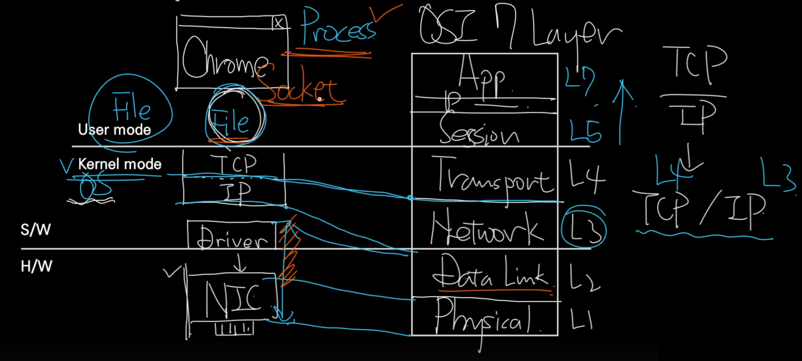

# 📖 Layer와 Layerd 구조

- `박스 하나` = `요소`

- 계층 간의 `관계`를 표현하고 설명하기 위해 도식화 한다.

    - 4는 3에 존립이 의존적.

    - 3은 4의 전제 조건이 됨

- 즉, 4는 3이 존재해야만 존재할 수 있다.

 
 
 

# 📖 Network, Networking

## Network

Network = 관계

## Networking

Networking = 상호 작용

- 상호 작용을 위한 요소

    - L3 : 언어(영어)
    - L2 : 말(글)
    - L1 : 2m이내의 거리(소리 전달)

> OSI 7 Layer = 개념/이론

 

### 개념과 구현(혹은 실체)
   

- 박은빈과 친해지기 위해서는 박은빈을 알아가야 함.
- 연예인이 무엇인지 알아봤자 박은빈과 친해질 수 없음
- 연예인 = OSI 7 Layer
- 박은빈 = TCP/IP의 문법 및 규칙

> OSI 7 Layer 자체를 깊게 공부하는 것은 비효율적

 
 
 

# 📖 User Mode, Kernel Mode

- `NIC` : Network Interface Card
    - 이 하드웨어를 제어하기 위한 S/W가 필요

- `Kernal Mode` : 신계

- `User Mode` : 인간계

- `Socket` : TCP/IP를 추상화 한 인터페이스 파일
    - mp3와 같은 파일.
    - 특별히 네트워크 추상화가 이루어진 파일
    - Socket을 열고 닫는 주체 = `process`

- OSI 7 Layer

    - `TCP` : L4 / Trans Port 계층에 해당

    - `IP` : L3 / Network 계층에 해당

    - `Driver` : L2 / Data Link 계층에 해당

    - `NIC` : L1 / Physical 계층에 해당