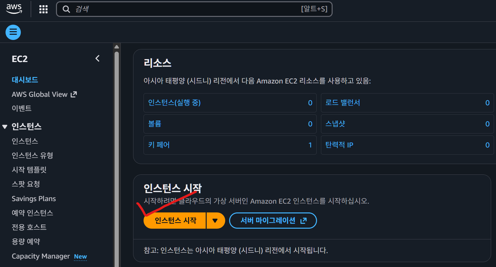
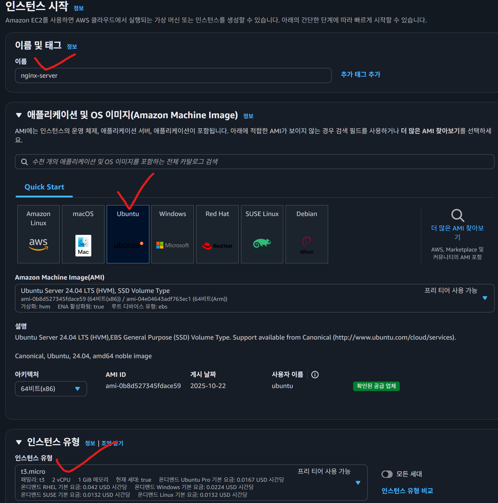
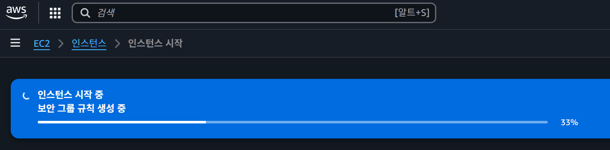
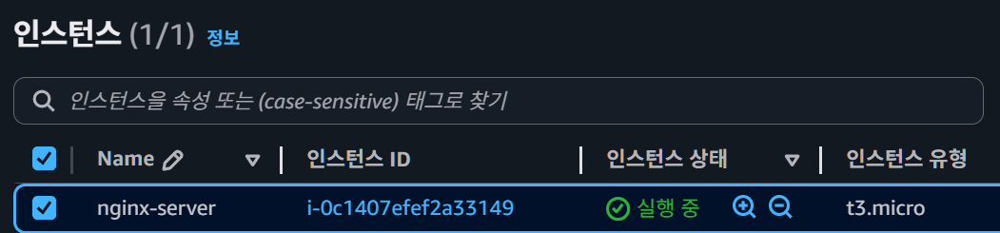
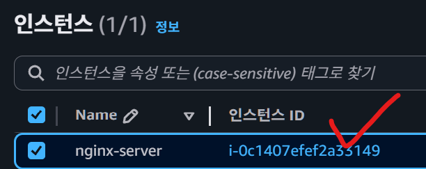
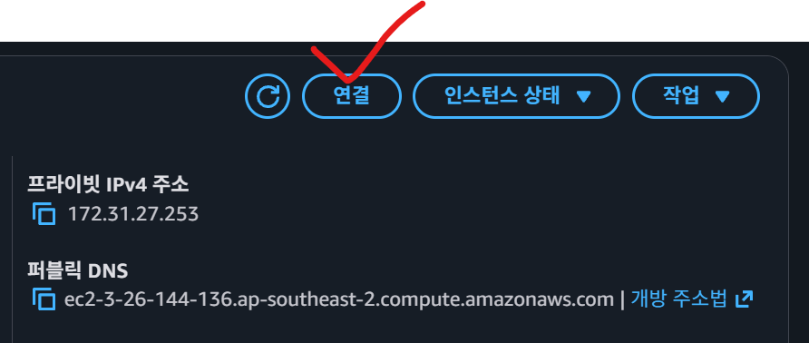
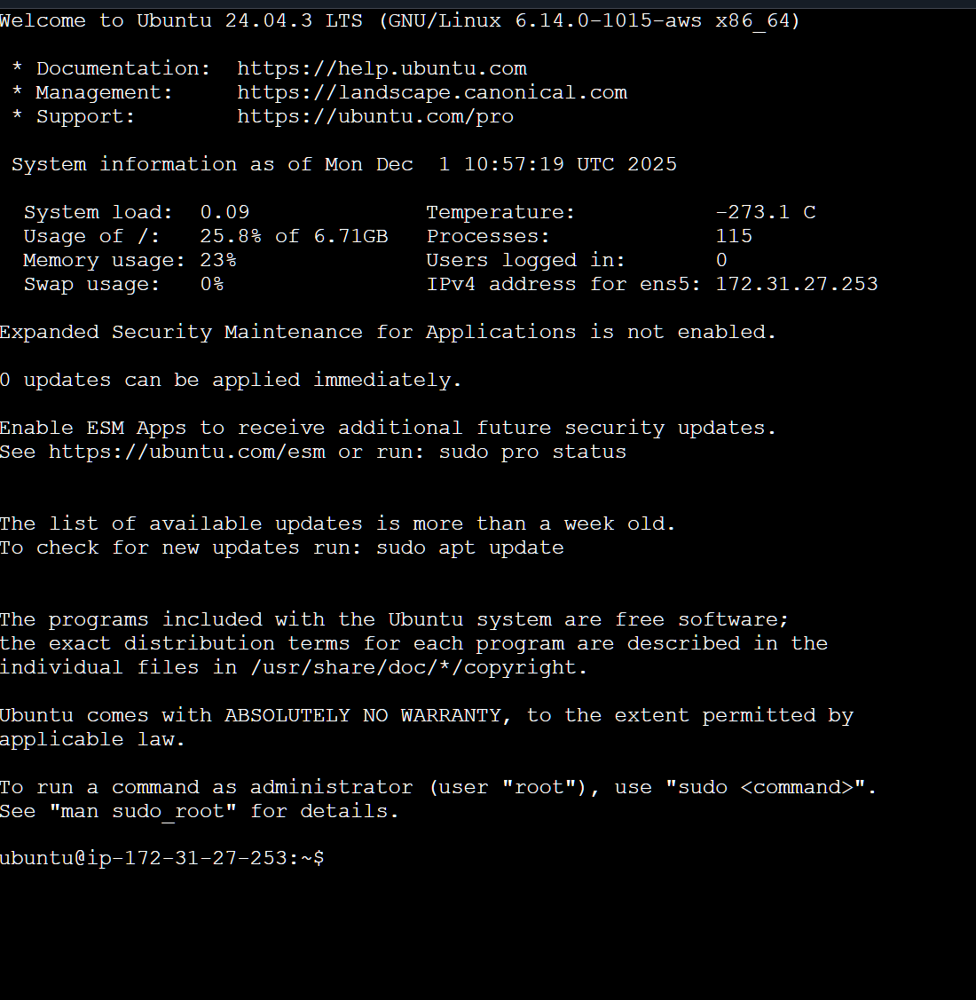
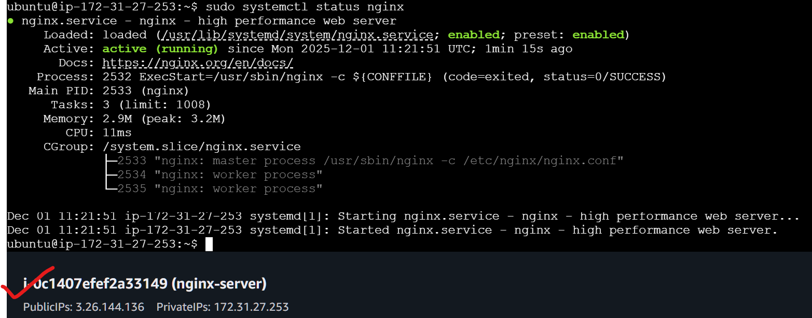
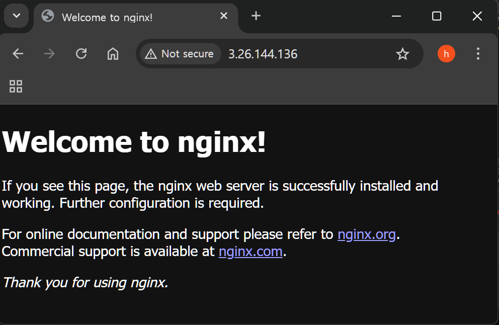

# Nginx를 왜 배우는 걸까?

현업에서 Nginx를 안 쓰고 있는 기업을 찾기가 어려울 정도로 많이 사용하는 프로그램이다. 

현업에서 많이 쓰고 있다는 건, (백엔드) 개발자로 취업을 하기 위해 필수로 알아야 하는 기술일 가능성이 높다는 뜻이다.

그럼 Nginx가 도대체 어떤 역할을 하길래 Nginx를 사용하는 걸까?

Nginx는 다양한 기능들을 가지고 있는 소프트웨어이다.

```
정적 컨텐츠 제공
SSL 처리
로드 밸런싱
장애 대응
캐싱
보안 처리 (IP 차단, 요청 수 제한)
```
위의 기능들은 실제 서비스를 운영할 때 필수적으로 사용하게 되는 기능들이다.

그렇기 때문에 Nginx를 필연적으로 많이 사용하게 된다.

<br>
<br>
<br>

# Apache 쓰면 안 되나요? 왜 굳이 Nginx를 써야 되는거죠?

## ✅ Apache vs Nginx

Apache와 Nginx의 차이를 디테일하게 설명하면 내용이 어려워지고 재미없어진다. 

Nginx를 배우는 데 지금이 내용은 크게 중요하지 않기 때문에 간단하게만 설명하겠다.

Nginx가 등장하기 전에는 대부분의 회사에서 Apache를 많이 사용했다.

그러나 근래에는 Nginx(25년 1월 기준 점유율 1위)의 사용량이 Apache(25년 1월 기준 점유율 2위)를 뛰어넘었다.

Nginx를 더 많이 사용하는 가장 큰 이유는 Apache에 비해 훨씬 많은 트래픽을 처리할 수 있는 구조를 가지고 있었기 때문이다.

즉, Nginx가 Apache보다 훨씬 성능이 좋았던 것이다.

이런 이유 때문에 최근 기업에서는 Apache보다 Nginx를 선호하게 되었다. 

<br>
<br>
<br>

# AWS EC2 인스턴스 생성하기

- 인스턴스 시작 버튼 누르기
    
    

<br>

- 이름 작성
- Ubuntu 선택
- t3.micro 선택

    

- 키 페어 없음(실습이기 때문)
- 인터넷에서 HTTPS 트래픽 허용 - 체크
- 인터넷에서 HTTP 트래픽 허용 - 체크
    - Nginx가 두 트래픽을 받는 것을 기반으로 연습할 것이기 때문

- 인스턴스 시작 버튼 클릭

    

    


- 인스턴스가 생성됨

    

<br>
<br>
<br>

- 인스턴스 클릭하기

    

- 우측 상단 '연결하기' 버튼 클릭

    

- EC2에 연결된 화면

    

<br>
<br>
<br>

# Nginx 설치 및 실행

```
sudo apt update
```
- 관리자 권한으로 패키지 목록(저장소의 최신 버전 정보)을 갱신하는 명령어

<br>

```
sudo apt install curl gnupg2 ca-certificates lsb-release ubuntu-keyring
```
- 관리자 권한으로 curl, gnupg2, ca-certificates, lsb-release, ubuntu-keyring 패키지를 새로 설치하거나 최신 버전으로 설치하는 명령어

<br>

```
curl https://nginx.org/keys/nginx_signing.key | gpg --dearmor \
 | sudo tee /usr/share/keyrings/nginx-archive-keyring.gpg >/dev/null
```

- curl로 NGINX 서명 키를 내려받아 gpg --dearmor로 바이너리 키링 형식으로 변환한 뒤, sudo tee로 /usr/share/keyrings/nginx-archive-keyring.gpg에 저장하는 명령어

<br>

```
gpg --dry-run --quiet --no-keyring --import --import-options import-show /usr/share/keyrings/nginx-archive-keyring.gpg
```

- gpg로 /usr/share/keyrings/nginx-archive-keyring.gpg 파일의 공개키를 실제 키링에 저장하지 않고(dry-run, no-keyring) 조용히 불러와(import-show) 어떤 키인지 정보만 확인하는 명령어

<br>

```
echo "deb [signed-by=/usr/share/keyrings/nginx-archive-keyring.gpg] \
http://nginx.org/packages/ubuntu `lsb_release -cs` nginx" \
 | sudo tee /etc/apt/sources.list
```

- 현재 우분투 배포판 코드명(lsb_release -cs)을 사용해 NGINX APT 저장소 설정 라인을 만들고, 그 라인을 signed-by 옵션과 함께 /etc/apt/sources.list 파일에 써 넣는 명령어

<br>

```
sudo apt update
```

- 새로 추가된 NGINX 저장소를 포함해 모든 APT 저장소의 패키지 목록을 최신 상태로 갱신하는 명령어


<br>

```
sudo apt install nginx
```

- 관리자 권한으로 NGINX 웹 서버 패키지를 설치(또는 이미 있다면 최신 버전으로 재설치)하는 명령어

<br>
<br>
<br>

## Nginx 설치 확인 하기

```
sudo systemctl status nginx

○ nginx.service - nginx - high performance web server
     Loaded: loaded (/usr/lib/systemd/system/nginx.service; enabled; preset: enabled)
     Active: inactive (dead)
       Docs: https://nginx.org/en/docs/
```
- 관리자 권한으로 NGINX 서비스(데몬)가 현재 실행 중인지, 상태/로그 등을 요약해 보여주는 명령어


- `Active` : inactive 

    -  설치는 됐으나 실행되고 있지 않음

<br>

```
sudo systemctl start nginx

sudo systemctl status nginx

● nginx.service - nginx - high performance web server
     Loaded: loaded (/usr/lib/systemd/system/nginx.service; enabled; preset: enabled)
     Active: active (running) since Mon 2025-12-01 11:21:51 UTC; 1min 15s ago
       Docs: https://nginx.org/en/docs/
    Process: 2532 ExecStart=/usr/sbin/nginx -c ${CONFFILE} (code=exited, status=0/SUCCESS)
   Main PID: 2533 (nginx)
      Tasks: 3 (limit: 1008)
     Memory: 2.9M (peak: 3.2M)
        CPU: 11ms
     CGroup: /system.slice/nginx.service
             ├─2533 "nginx: master process /usr/sbin/nginx -c /etc/nginx/nginx.conf"
             ├─2534 "nginx: worker process"
             └─2535 "nginx: worker process"
```

- nginx 설치됐는지 접속해서 확인하기

    

    

<br>
<br>
<br>

## Nginx 로그 확인하는 방법

### ✅ 로그 확인하는 방법을 알아야 하는 이유
    Spring Boot 또는 Nest.js와 같은 프레임워크를 활용해서 개발할 때 콘솔창을 자주 확인하게 된다.

    콘솔창을 보면서 에러 메시지가 뜨는 지, 잘 작동하는 지 확인하면서 개발 작업을 한다.

    리눅스에서 콘솔창 역할을 하는 게 바로 로그 파일이다.

    로그 파일을 통해서 Nginx가 잘 실행됐는 지, 에러가 발생한건 아닌 지, 에러가 발생했다면 어떤 에러가 발생했는 지 확인할 수 있다.

    따라서 어떤 프로그램을 사용하든 간에 로그 확인하는 방법을 알아두는 게 중요하다.

### ✅ Nginx 로그 확인하는 방법
    Nginx의 로그 파일 위치는 `/var/log/nginx/`이다.

    이 경로로 이동하면 `access.log` 와 `error.log` 파일이 있다.

    `access.log` 파일에는 Nginx 서버로 접근한 요청에 대한 정보가 기록으로 남아있고,

    `error.log` 파일에는 에러 메시지에 대한 내용이 담겨있다.

### Nginx 로그 파일이 위치한 곳으로 이동

```
$ cd /var/log/nginx

# 파일의 마지막 10줄을 출력
$ tail access.log
$ tail error.log        # 실시간으로 access.log가 쌓이는 걸 확인 가능

# 파일의 마지막 10줄을 출력 + 실시간으로 파일에 추가되는 내용을 출력
$ tail -f access.log
```

