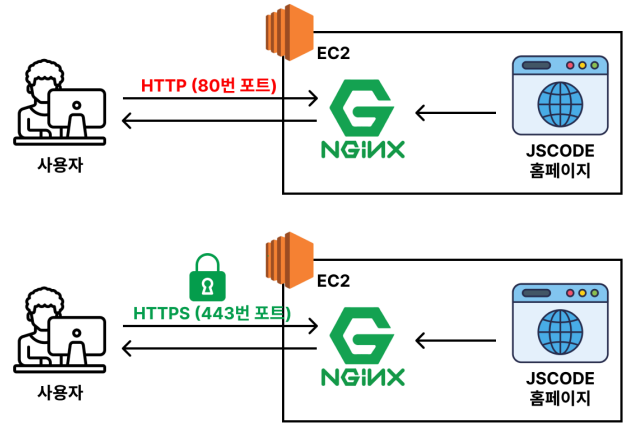

# 📖 웹 서버(Web Server)란?


## ✅ 우리는 어떻게 네이버에 접속할 수 있는걸까?
- 웹 서버(Web Server)가 뭔지 이해하기 위해서는, 어떤 과정을 거쳐서 웹 사이트에 접속할 수 있는 지를 먼저 이해해야 한다.

- 네이버에 접속하기 위해 주소창에 www.naver.com 이라는 주소를 입력한다.
- 그러면 www.naver.com 이라는 웹 사이트를 찾아 들어가는 것처럼 느껴진다. 하지만 실제로 이렇게 작동하지 않는다.


## ✅ 웹 서버(Web Server)란?
웹 서버(Web Server)는 사용자의 요청(www.naver.com으로 접속하는 행위)이 들어올 때마다 HTML, CSS, JS, 이미지와 같은 파일들을 제공하는 컴퓨터를 의미한다.

## ✅ Nginx의 웹 서버(Web Server) 기능
Nginx는 웹 서버(Web Server) 역할을 할 수 있다.

풀어서 설명하자면 Nginx가 사용자의 요청이 들어올 때마다 파일(HTML, CSS, JS, 이미지 등)을 제공할 수 있는 기능을 가지고 있다.

따라서 Nginx를 활용하면 웹 사이트를 배포할 수 있다.

---

<br>
<br>
<br>

# 📖 Nginx 기본 문법 해석하기

## ✅ Nginx의 기본적인 문법을 알아야 하는 이유
Nginx를 설치하고 실행시키면 아래와 같은 웹 페이지가 뜬다.

하지만 아래 웹 페이지가 아닌 우리가 직접 만든 웹 페이지를 띄우고 싶을 것이다.

그러려면 Nginx의 기본적인 문법을 어느 정도 알고 있어야, 설정값을 직접 수정해서 응용할 수 있다.

<br>

## ✅ Nginx의 설정 파일 위치

### 1. /etc/nginx/nginx.conf

    Nginx에서 가장 근본이 되는 설정 파일(루트 설정 파일)

전역적으로 설정되어야 하는 내용(워커 프로세스 개수, 로그 저장 위치 등)이 포함되어 있다.

<br>

### 2. /etc/nginx/conf.d/default.conf

    기본 웹 서버(Web Server) 설정 파일

이렇게 크게 2가지 설정 파일이 존재한다.

여기서 /etc/nginx/conf.d/default.conf 파일 위주로 코드를 해석해보자.

<br>

## ✅ 기본적인 Nginx 문법 해석

`/etc/nginx/conf.d/default.conf`

```bash
# server : '하나의 웹 사이트에 관련된 설정'을 관리하는 단위 ('server 블럭'이라고 부름)
server {
    # localhost:80으로 들어오는 요청을 이 server 블럭에서 처리하도록 설정
    # (server_name이 일치하는 server 블럭이 없는 경우 첫 번째 정의되어 있는 server 블럭을 기반으로 처리)
    # (아직은 정확히 몰라도 된다. 나중에 '멀티 도메인' 기능을 배우면 쉽게 이해할 수 있다.)
    listen 80;
    server_name localhost;

    # / 으로 시작하는 모든 경로를 처리 (ex. /index.html)
    location / {
        # /jscode.html로 요청이 들어오면 /usr/share/nginx/html/jscode.html 파일로 응답
        root /usr/share/nginx/html;

        # /로 요청이 들어오면 /usr/share/nginx/html/index.html로 응답
        # 만약 /usr/share/nginx/html/index.html이 없을 경우, /usr/share/nginx/html/index.htm으로 응답
        index index.html index.htm;
    }

    # Nginx에서 500, 502, 503, 504의 상태 코드가 발생했을 때 /50x.html로 redirect
    error_page 500 502 503 504 /50x.html;

    # /50x.html과 완전히 일치하는 경로를 처리
    location = /50x.html {
        # /50x.html로 요청이 들어오면 /usr/share/nginx/html/50x.html 파일로 응답
        root /usr/share/nginx/html;
    }
}

```
#### 주의)

 ‘중괄호( {...} ) 형태의 구문’과 ‘세미 콜론( ; )으로 끝나는 구문’ 2가지가 있다.
 
 설정 파일을 작성할 때 세미 콜론( ; )을 빠트려서 에러가 뜨는 경우가 많으니 주의. 

---

<br>
<br>
<br>

# Nginx 기본 문법 응용해보기 - 1
 
기본 문법을 해석하고 정리했다면 하나씩 바꿔가면서 응용해봐야 한다.

이렇게도 가지고 놀아보고, 저렇게도 가지고 놀아봐야 한다.

그러면서 코드를 하나씩 수정하면서 의도한대로 작동하는 지 눈으로 확인하는 작업을 반드시 거쳐야 한다.

이렇게 학습하면 정말 빠르게 배울 수 있다.

## ✅ Nginx 기본 웹 사이트 수정해보기

### 1. 설정 파일 확인하기
```
$ cd /etc/nginx/conf.d/default.conf
```

<br>

`/etc/nginx/conf.d/default.conf`

```bash
server {
    listen 80;
    server_name localhost;
    location / {
        root /usr/share/nginx/html;
        index index.html index.htm;
    }

    # / 으로 시작하는 모든 경로를 처리 (ex. /index.html)
    location / {
    
        # /jscode.html로 요청이 들어오면 /usr/share/nginx/html/jscode.html 파일로 응답
        root /usr/share/nginx/html;

        # /로 요청이 들어오면 /usr/share/nginx/html/index.html로 응답
        # 만약 /usr/share/nginx/html/index.html이 없을 경우, /usr/share/nginx/html/index.htm으로 응답
        index index.html index.htm;
    }

    error_page 500 502 503 504 /50x.html;

    location = /50x.html {
        root /usr/share/nginx/html;
    }
}
```

### 2. 기존 웹 페이지 접속해보기

http://{EC2 IP 주소} 로 접속.


### 3. 기본 웹 페이지 수정하기

```
$ cd /usr/share/nginx/html
$ sudo vi index.html
```

<br>

`/usr/share/nginx/html/index.html`

```html
<!DOCTYPE html>
<html>
    <head>
        <title>Welcome to nginx!</title>
        <style>
        html { color-scheme: light dark; }
        body { width: 35em; margin: 0 auto;
        font-family: Tahoma, Verdana, Arial, sans-serif; }
    </style>
    </head>
    <body>
        <h1>Welcome to JSCODE!</h1>
        <p>If you see this page, the nginx web server is successfully installed and
        working. Further configuration is required.</p>
        <p>For online documentation and support please refer to
        <a href="http://nginx.org/">nginx.org</a>.<br/>
        Commercial support is available at
        <a href="http://nginx.com/">nginx.com</a>.</p>
        <p><em>Thank you for using nginx.</em></p>
    </body>
</html>
```

### 4. 웹 페이지가 수정됐는 지 확인하기

http://{EC2 IP 주소} 로 접속

---

<br>
<br>
<br>

# Nginx 기본 문법 응용해보기 - 2

## ✅ Nginx 에러 페이지 수정해보기

### 1. 설정 파일 확인하기

```
$ cd /etc/nginx/conf.d/default.conf`
```

`/etc/nginx/conf.d/default.conf`
```bash
server {
    listen 80;
    server_name localhost;
    location / {
        root /usr/share/nginx/html;
        index index.html index.htm;
    }

    error_page 500 502 503 504 /50x.html;

    # /50x.html과 완전히 일치하는 경로를 처리
    location = /50x.html {
        # /50x.html로 요청이 들어오면 /usr/share/nginx/html/50x.html 파일로 응답
        root /usr/share/nginx/html;
    }
}
```

### 2. 기존 에러 페이지 접속해보기

http://{EC2 IP 주소} 로 접속

<br>

### 3. 기본 에러 페이지 수정하기

```
$ cd /usr/share/nginx/html
$ sudo vi 50x.html
```

`/usr/share/nginx/html/50x.html`

```html
<!DOCTYPE html>
<html>
    <head>
        <title>Error</title>
        <style>
        html { color-scheme: light dark; }
        body { width: 35em; margin: 0 auto;
        font-family: Tahoma, Verdana, Arial, sans-serif; }
        </style>
    </head>
    <body>
        <h1>Error!</h1>
        <p>Sorry, the page you are looking for is currently unavailable.<br/>
        Please try again later.</p>
        <p>If you are the system administrator of this resource then you should check
        the error log for details.</p>
        <p><em>Faithfully yours, nginx.</em></p>
    </body>
</html>
```

### 4. 에러 페이지가 수정됐는 지 확인하기

http://{EC2 IP 주소}/50x.html 로 접속


<br>
<br>
<br>

# Nginx 기본 문법 응용해보기 - 2

## ✅ Nginx의 기본 웹 페이지를 Hello World 페이지로 바꿔보기

사용자가 / 라는 주소로 접속했을 때 /usr/share/nginx/html/index.html 페이지가 아니라, /usr/share/nginx/html/hello.html 페이지로 응답하도록 바꿔보자.

<br>

### 1. Hello World 페이지 만들기

```
$ cd /usr/share/nginx/html
$ sudo vi hello.html
```

`hello.html`

```html
<h1>Hello World!</h1>
```

<br>

### 2. Nginx 설정 파일 수정하기

```
$ cd /etc/nginx/conf.d
$ sudo vi default.conf
```

`/etc/nginx/conf.d/default.conf`

```cmd
server {
    listen 80;
    server_name localhost;

    location / {
        # /로 요청이 들어오면 /usr/share/nginx/html/hello.html로 응답
        root /usr/share/nginx/html;
        index hello.html
    }

    error_page 500 502 503 504 /50x.html;

    location = /50x.html {
        root /usr/share/nginx/html;
    }
}
```

<br>

### 3. Nginx 설정 파일 문법 에러있는 지 확인하기

```
# Nginx 설정 파일 중 문법 에러가 있는 지 체크
$ sudo nginx -t
```

<br>

### 4. 문법 에러 고치기

```cmd
server {
    listen 80;
    server_name localhost;
    
    location / {
        root /usr/share/nginx/html;
        index hello.html;
    }
    
    error_page 500 502 503 504 /50x.html;

    location = /50x.html {
        root /usr/share/nginx/html;
    }
}
```

<br>

### 5. 변경된 Nginx 설정 파일 반영하기


```cmd
# Nginx 설정 파일 중 문법 에러가 있는 지 체크
$ sudo nginx -t

# Nginx의 설정 파일이 바뀐 경우 아래 명령어를 입력해줘야 설정 파일이 반영된다.
$ sudo nginx -s reload
```

<br>

### 6. 웹 페이지에 접속해보기

Nginx의 설정이 잘 적용됐는 지 http://{EC2 IP 주소} 주소로 접속

<br>
<br>
<br>

# Nginx 디버깅 방법
 개발을 하다보면 에러를 디버깅하고 해결하는 데에만 대부분의 시간을 쓴다.
 
 따라서 어떤 기술을 익힐 때 반드시 에러를 디버깅 할 수 있는 방법을 정리해두어야 한다.

## ✅ 에러 상황

`/etc/nginx/conf.d/default.conf`

```bash
server {
    listen 80;
    server_name localhost;
    location / {
        root /usr/share/nginx/htlm;
        index hello.html;
    }
    error_page 500 502 503 504 /50x.html;

    location = /50x.html {
        root /usr/share/nginx/html;
    }
}
```

위 코드에서 /usr/share/nginx/html 이라고 작성해야 하는 걸, 실수로 /usr/share/nginx/htlm 로 작성했다고 가정해보자.

이 상황에서 에러를 어떻게 디버깅해야 하는 지 알아보자.

<br>

## ✅ Nginx 에러 디버깅 방법

### 1. Nginx가 정상적으로 실행되고 있는 지 체크

```bash
$ sudo systemctl status nginx
```

<br>

### 2. 문법 에러 체크하기

```bash
$ sudo nginx -t
```

<br>

### 3. 로그 파일 실시간으로 확인하기
```bash
# 제대로 요청이 들어오고 있는 지 확인
$ sudo tail -f /var/log/nginx/access.log

# 에러 메시지 확인
$ sudo tail -f /var/log/nginx/error.log
```

<br>
<br>
<br>

# 웹 프론트엔드 프로젝트(HTML, CSS, JS) 배포하기

## ✅ 웹 프론트엔드 프로젝트(HTML, CSS, JS) 배포하기
 
### 1. HTML, CSS, JS 웹 프로젝트를 EC2로 가져오기

```bash
$ cd /usr/share/nginx
$ sudo git clone https://github.com/JSCODE-COURSE/nginx-frontend-html.git
```

### 2. Nginx 설정 파일 수정하기

```bash
$ cd /etc/nginx/conf.d
$ sudo vi default.conf
```

`/etc/nginx/conf.d/default.conf`

```bash
server {
    listen 80;
    server_name localhost;
    location / {
        root /usr/share/nginx/nginx-frontend-html;
        index index.html;
    }
    error_page 500 502 503 504 /50x.html;

    location = /50x.html {
    root /usr/share/nginx/html;
    }
}
```

### 3. Nginx 설정 파일 반영하기

```bash
# Nginx 설정 파일 중 문법 에러가 있는 지 체크
$ sudo nginx -t

# Nginx의 설정 파일이 바뀐 경우 아래 명령어를 입력해줘야 설정 파일이 반영된다.
$ sudo nginx -s reload
```

### 4. 웹 페이지 접속해보기

- Nginx의 설정이 잘 적용됐는 지 http://{EC2 IP 주소} 주소로 접속하기 

---

<br>
<br>
<br>

# 웹 프론트엔드 프로젝트(React + Vite) 배포하기

## ✅ 웹 프론트엔드 프로젝트(React + Vite) 배포하기
 이전에 웹 프론트엔드 프로젝트를 완성시켜서 Github Repository에 올려뒀다고 가정하자.


### 1. React 프로젝트를 EC2로 가져오기

```bash
$ cd /usr/share/nginx
$ sudo git clone https://github.com/JSCODE-COURSE/nginx-frontend-react.git
```

### 2. React 프로젝트 빌드를 위해 Node.js 설치하기

```bash
$ sudo apt-get update && \
sudo apt-get install -y ca-certificates curl gnupg && \
sudo mkdir -p /etc/apt/keyrings && \
curl -fsSL https://deb.nodesource.com/gpgkey/nodesource-repo.gpg.key | sudo gpg --dearmor -o /etc/apt/keyrings/
NODE_MAJOR=20 && \
echo "deb [signed-by=/etc/apt/keyrings/nodesource.gpg] https://deb.nodesource.com/node_$NODE_MAJOR.x nodis
sudo apt-get update && \
sudo apt-get install nodejs -y

# Node.js가 잘 설치됐는 지 확인하기
$ node -v
```

### 3. React 프로젝트 빌드하기

```bash
$ cd nginx-frontend-react
$ sudo npm i
$ sudo npm run build
```

### 4. Nginx 설정 파일 수정하기

```bash
$ cd /etc/nginx/conf.d
$ sudo vi default.conf
```

<br>

`/etc/nginx/conf.d/default.conf`

```bash
server {
    listen 80;
    server_name localhost;
    location / {
        root /usr/share/nginx/nginx-frontend-react/dist;
        index index.html;
    }
    error_page 500 502 503 504 /50x.html;

    location = /50x.html {
        root /usr/share/nginx/html;
    }
}
```

### 5. Nginx 설정 파일 반영하기

```bash
# Nginx 설정 파일 중 문법 에러가 있는 지 체크
$ sudo nginx -t

# Nginx의 설정 파일이 바뀐 경우 아래 명령어를 입력해줘야 설정 파일이 반영된다.
$ sudo nginx -s reload
```

### 5. 웹 페이지 접속해보기
Nginx의 설정이 잘 적용됐는 지 http://{EC2 IP 주소} 주소로 접속해서 확인하기

<br>
<br>
<br>

# 웹 프론트엔드 프로젝트(Next.js) 배포하기

## ✅ 웹 프론트엔드 프로젝트(Next.js) 배포하기
 이전에 웹 프론트엔드 프로젝트를 완성시켜서 Github Repository에 올려뒀다고 가정하자.

### 1. Next.js 프로젝트를 EC2로 가져오기

```bash
$ cd /usr/share/nginx
$ sudo git clone https://github.com/JSCODE-COURSE/nginx-frontend-next.git
```

### 2. Next.js 프로젝트 빌드를 위해 Node.js 설치하기
(이전 실습에서 설치함)

### 3. Next.js 프로젝트 빌드하기
$ cd nginx-frontend-next
$ sudo npm i
$ sudo npn run build
주의) 빌드한 결과물이 정상적으로 생성되려면 반드시 아래와 같이 설정해야 한다.
next.config.mjs
/** @type {import('next').NextConfig} */
const nextConfig = {
 output: 'export'
};
export default nextConfig;

### 4. Nginx 설정 파일 수정하기
```bash
$ cd /etc/nginx/conf.d
$ sudo vi default.conf
```

<br>

`/etc/nginx/conf.d/default.conf`
```bash
server {
    listen 80;
    server_name localhost;
    location / {
        root /usr/share/nginx/nginx-frontend-next/out;
        index index.html;
    }
    error_page 500 502 503 504 /50x.html;

    location = /50x.html {
        root /usr/share/nginx/html;
    }
}
```

### 5. Nginx 설정 파일 반영하기
```bash
# Nginx 설정 파일 중 문법 에러가 있는 지 체크
$ sudo nginx -t

# Nginx의 설정 파일이 바뀐 경우 아래 명령어를 입력해줘야 설정 파일이 반영된다.
$ sudo nginx -s reload
```

### 6. 웹 페이지 접속해보기
Nginx의 설정이 잘 적용됐는 지 http://{EC2 IP 주소} 주소로 접속

<br>
<br>
<br>

# 📖HTTPS를 왜 적용시켜야 할까?

## ✅ HTTPS를 왜 적용시켜야 할까?

### 1. 보안적인 이유
데이터를 서버와 주고 받을 때 암호화를 시켜서 통신을 한다.

암호화를 하지 않으면 누군가 중간에서 데이터를 가로채서 해킹할 수도 있다.

보안에 좋지 않다.

### 2. 사용자 이탈
어떤 사이트에 들어갔는데 아래와 같이 보인다면 왠지 믿음직스럽지 못한 사이트라고 생각할 것이다.

## ✅ 현업에서는 ?
대부분의 웹 사이트에서 HTTPS를 적용시킨다.

## ✅ Nginx를 활용한 HTTPS 적용
Nginx가 사용자(클라이언트)와 통신할 때, HTTPS를 활용해 암호화 된 정보를 주고 받는다. 



<br>
<br>
<br>

# Nginx, Certbot을 활용해 HTTPS 적용시키기

참고 문서 : https://certbot.eff.org/instructions?ws=nginx&os=snap

## 1. Certbot 설치하기

```bash
$ sudo snap install --classic certbot
$ sudo ln -s /snap/bin/certbot /usr/bin/certbot
```

## 2. HTTPS 인증서 발급받기

```bash
$ sudo certbot --nginx -d <도메인 주소>

# 예시
$ sudo certbot --nginx -d jscode.p-e.kr
$ sudo certbot --nginx -d admin.jscode.p-e.kr
```

** 반드시 도메인을 먼저 연결한 뒤에 위 명령어를 쳐야 정상 작동한다.
## 3. HTTPS 잘 적용됐는 지 확인하기

<br>
<br>
<br>

# 📖 Nginx, Certbot이 작성한 HTTPS 관련 코드 해석하기

 Certbot이 작성한 아래 코드는 직접 작성할 수 있을 필요까지는 없다. 다만, 대략적으로 어떤 의미를 가지고 있는 지 해석할 수는 있어야 한다.

`/etc/nginx/conf.d/default.conf`

```bash
# server 블록에서는 일반적으로 listen, server_name을 가장 먼저 처리한다.
server {
    # jscode.p-e.kr 주소로 들어온 요청이면서
    # 443번 포트(https)로 들어오는 요청일 때
    # 이 server 블럭에서 처리하도록 설정
    server_name jscode.p-e.kr;
    location / {
        root /usr/share/nginx/nginx-frontend-react/dist;
        index index.html;
    }
    listen 443 ssl; # managed by Certbot

    # (HTTPS 처리 과정에 필요한 로직 -> 자세히는 몰라도 됨)
    ssl_certificate /etc/letsencrypt/live/jscode.p-e.kr/fullchain.pem; # managed by Certbot
    ssl_certificate_key /etc/letsencrypt/live/jscode.p-e.kr/privkey.pem; # managed by Certbot
    include /etc/letsencrypt/options-ssl-nginx.conf; # managed by Certbot
    ssl_dhparam /etc/letsencrypt/ssl-dhparams.pem; # managed by Certbot
}

server {
    # admin.jscode.p-e.kr 주소로 들어온 요청이면서
    # 443번 포트(https)로 들어오는 요청일 때
    # 이 server 블럭에서 처리하도록 설정
    server_name admin.jscode.p-e.kr;
    location / {
        root /usr/share/nginx/nginx-frontend-next/out;
        index index.html;
    }
    listen 443 ssl; # managed by Certbot

    # (HTTPS 처리 과정에 필요한 로직 -> 자세히는 몰라도 됨)
    ssl_certificate /etc/letsencrypt/live/admin.jscode.p-e.kr/fullchain.pem; # managed by Certbot
    ssl_certificate_key /etc/letsencrypt/live/admin.jscode.p-e.kr/privkey.pem; # managed by Certbot
    include /etc/letsencrypt/options-ssl-nginx.conf; # managed by Certbot
    ssl_dhparam /etc/letsencrypt/ssl-dhparams.pem; # managed by Certbot
}

server {
    # 2. 들어온 요청의 주소의 Host가 jscode.p-e.kr일 경우 (ex. http://jscode.p-e.kr/about)
    # https://jscode.p-e.kr/...(ex. https://jscode.p-e.kr/about)로 리다이렉트(301) 처리
    if ($host = jscode.p-e.kr) {
        return 301 https://$host$request_uri;
    } # managed by Certbot

    # 1. jscode.p-e.kr 주소로 들어온 요청이면서
    # 80번 포트(http)로 들어오는 요청일 때
    # 이 server 블럭에서 처리하도록 설정
    listen 80;
    server_name jscode.p-e.kr;

    # 3. 그 이외의 경우에는 404(Not Found)로 응답
    return 404; # managed by Certbot
}

server {
        # 2. 들어온 요청의 주소의 Host가 admin.jscode.p-e.kr일 경우 (ex. http://admin.jscode.p-e.kr/about)
        # https://admin.jscode.p-e.kr/...(ex. https://admin.jscode.p-e.kr/about)로 리다이렉트(301) 처리
        if ($host = admin.jscode.p-e.kr) {
        return 301 https://$host$request_uri;
        } # managed by Certbot
        # 1. adminjscode.p-e.kr 주소로 들어온 요청이면서
        # 80번 포트(http)로 들어오는 요청일 때
        # 이 server 블럭에서 처리하도록 설정
        listen 80;
        server_name admin.jscode.p-e.kr;

        # 3. 그 이외의 경우에는 404(Not Found)로 응답
        return 404; # managed by Certbot
}
```
## ✅ HTTP로 요청 보내보기, HTTPS로 요청 보내보기

### 1. HTTP로 요청 보내기
Nginx, Certbot이 작성한 HTTPS 관련 코드 해석하기 2
http:// 를 명시해서 요청을 보내면 브라우저가 자동으로 80번 포트로 요청을 보낸다. http:// 요청을 보내보면 Nginx의 리다이렉트 설정 때
문에 https:// 로 변경되어 접속이 된다.

### 2. HTTPS로 요청 보내기
https:// 를 명시해서 요청을 보내면 브라우저가 자동으로 443번 포트로 요청을 보낸다.

### 3. HTTP, HTTPS를 명시적으로 작성하지 않고 요청 보내기
Nginx, Certbot이 작성한 HTTPS 관련 코드 해석하기 3
http:// 또는 https:// 를 명시하지 않고 요청을 보내면, 브라우저는 자동으로 HTTP(80번 포트)로 요청을 보낸다. 하지만 Nginx의 설정에
따라 HTTP(80번 포트)로 요청을 보내면 HTTPS로 리다이렉트 되어 https:// 로 변경되어 접속이 된다.

<br>
<br>
<br>

# 📖 설정 파일 분리해서 관리하기 (include)

## ✅ 설정 파일을 분리해야 하는 이유
지금까지 셋팅된 설정 관련 코드만으로도 꽤 복잡해졌다.

`default.conf`

```bash
server {
    server_name jscode.p-e.kr;
    location / {
        root /usr/share/nginx/nginx-frontend-react/dist;
        index index.html;
    }

    listen 443 ssl; # managed by Certbot
    ssl_certificate /etc/letsencrypt/live/jscode.p-e.kr/fullchain.pem; # managed by Certbot
    ssl_certificate_key /etc/letsencrypt/live/jscode.p-e.kr/privkey.pem; # managed by Certbot
    include /etc/letsencrypt/options-ssl-nginx.conf; # managed by Certbot
    ssl_dhparam /etc/letsencrypt/ssl-dhparams.pem; # managed by Certbot
}

server {
    server_name admin.jscode.p-e.kr;
    location / {
        root /usr/share/nginx/nginx-frontend-next/out;
        index index.html;
    }

    listen 443 ssl; # managed by Certbot
    ssl_certificate /etc/letsencrypt/live/admin.jscode.p-e.kr/fullchain.pem; # managed by Certbot
    ssl_certificate_key /etc/letsencrypt/live/admin.jscode.p-e.kr/privkey.pem; # managed by Certbot
    include /etc/letsencrypt/options-ssl-nginx.conf; # managed by Certbot
    ssl_dhparam /etc/letsencrypt/ssl-dhparams.pem; # managed by Certbot
}

server {
    if ($host = jscode.p-e.kr) {
        return 301 https://$host$request_uri;
    } # managed by Certbot
    listen 80;
    server_name jscode.p-e.kr;
    return 404; # managed by Certbot
}

server {
    if ($host = admin.jscode.p-e.kr) {
        return 301 https://$host$request_uri;
    } # managed by Certbot
    listen 80;
    server_name admin.jscode.p-e.kr;
    return 404; # managed by Certbot
}
```
서비스가 커지면 커질수록 아래 설정 파일도 점점 더 거대해질 것이다.

한 파일에 너무 많은 코드가 담겨있으면 가독성이 떨어지고 유지보수가 어려워진다.

이걸 해결하기 위해 여러 파일로 분리해서 설정 파일들을 관리해보자.

## ✅ 설정 파일 분리해서 관리하기

### 1. 폴더 만들기

```bash
$ cd /etc/nginx/conf.d
$ sudo mkdir websites
```

### 2. 설정 파일 분리하기
/etc/nginx/conf.d/default.conf 파일에 있는 코드 내용을 각 파일에 분리해서 넣는다.

<br>

`/etc/nginx/conf.d/websites/jscode.p-e.kr.conf`

```bash
server {
    server_name jscode.p-e.kr;
    location / {
        root /usr/share/nginx/nginx-frontend-react/dist;
        index index.html;
    }
    listen 443 ssl; # managed by Certbot
    ssl_certificate /etc/letsencrypt/live/jscode.p-e.kr/fullchain.pem; # managed by Certbot
    ssl_certificate_key /etc/letsencrypt/live/jscode.p-e.kr/privkey.pem; # managed by Certbot
    include /etc/letsencrypt/options-ssl-nginx.conf; # managed by Certbot
    ssl_dhparam /etc/letsencrypt/ssl-dhparams.pem; # managed by Certbot
}

server {
    if ($host = jscode.p-e.kr) {
        return 301 https://$host$request_uri;
    } # managed by Certbot
    listen 80;
    server_name jscode.p-e.kr;
    return 404; # managed by Certbot
}
```

<br>

`/etc/nginx/conf.d/websites/admin.jscode.p-e.kr.conf`

```bash
server {
    server_name admin.jscode.p-e.kr;
    location / {
        root /usr/share/nginx/nginx-frontend-next/out;
        index index.html;
    }
    listen 443 ssl; # managed by Certbot
    ssl_certificate /etc/letsencrypt/live/admin.jscode.p-e.kr/fullchain.pem; # managed by Certbot
    ssl_certificate_key /etc/letsencrypt/live/admin.jscode.p-e.kr/privkey.pem; # managed by Certbot
    include /etc/letsencrypt/options-ssl-nginx.conf; # managed by Certbot
    ssl_dhparam /etc/letsencrypt/ssl-dhparams.pem; # managed by Certbot
}

server {
    if ($host = admin.jscode.p-e.kr) {
        return 301 https://$host$request_uri;
    } # managed by Certbot

    listen 80;
    server_name admin.jscode.p-e.kr;
    return 404; # managed by Certbot
}
```

<br>

### 3. default.conf 파일에서 분리한 설정 파일 불러오기
`/etc/nginx/conf.d/default.conf`

```bash
include conf.d/websites/jscode.p-e.kr.conf;
include conf.d/websites/admin.jscode.p-e.kr.conf;
```

기준 경로가 /etc/nginx 이기 때문에 위와 같이 주소를 입력했다.

<br>

### 4. 변경된 Nginx 설정 파일 반영하기

```bash
# Nginx 설정 파일 중 문법 에러가 있는 지 체크
$ sudo nginx -t
# Nginx의 설정 파일이 바뀐 경우 아래 명령어를 입력해줘야 설정 파일이 반영된다.
$ sudo nginx -s reload
```

<br>

### 5. 잘 작동하는 지 확인하기

<br>

### 6. include를 한 줄 삭제해보기
`/etc/nginx/conf.d/default.conf`

```bash
include conf.d/websites/jscode.p-e.kr.conf;
include conf.d/websites/admin.jscode.p-e.kr.conf;

# Nginx 설정 파일 중 문법 에러가 있는 지 체크
$ sudo nginx -t
# Nginx의 설정 파일이 바뀐 경우 아래 명령어를 입력해줘야 설정 파일이 반영된다.
$ sudo nginx -s reload
```

<br>

### 7. 작동 안 하는 지 확인하기

<br>

### 8. 와일드카드(*)를 활용해 설정 간결하게 추가하기

`/etc/nginx/conf.d/default.conf`

```bash
include conf.d/websites/*.conf;
# Nginx 설정 파일 중 문법 에러가 있는 지 체크
$ sudo nginx -t

# Nginx의 설정 파일이 바뀐 경우 아래 명령어를 입력해줘야 설정 파일이 반영된다.
$ sudo nginx -s reload
```

### 9. 잘 작동하는 지 확인하기