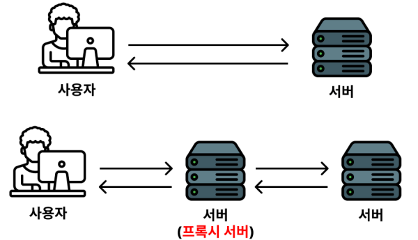
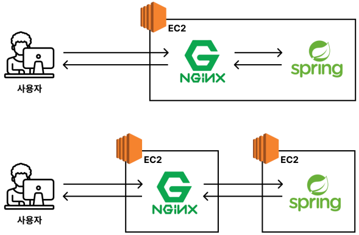
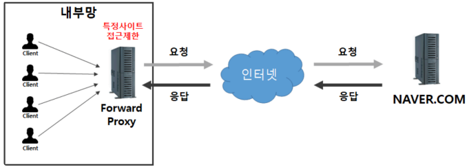
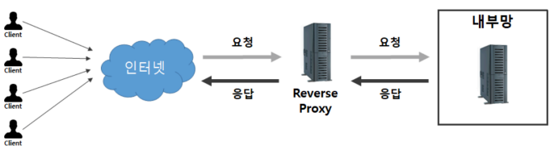
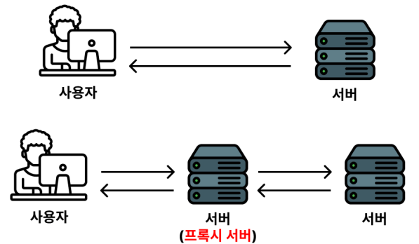

# 📖 리버스 프록시(Reverse Proxy)란?

## ✅ 프록시(Proxy)란?
프록시(Proxy)란 ‘중계(중간에서 연결해주는 것)’의 의미를 가진다.

그러면 프록시 서버(Proxy Server)는 중간 역할을 해주는 서버다.

그림으로 바로 살펴보자.

위 그림에서 두 번째 그림을 보면 클라이언트(사용자)와 서버가 직접 통신하지 않고 중간 역할을 하는 서버를 거쳐서 통신을 하고 있다.

여기서 중간 역할을 하는 서버를 보고 프록시 서버(Proxy Server)라고 부른다.

프록시 서버(Proxy Server)는 아래와 같이 다양한 형태로 구성할 수 있다.

참고) 프록시 서버로 사용하는 소프트웨어는 Nginx 이외에도 다양한 소프트웨어가 존재한다.

 

## ✅ 포워드 프록시(Forward Proxy)란?

보내려고 하는 요청을 관리 또는 보안 처리를 위한 용도로 사용하는 서버를 포워드 프록시(Foward Proxy) 서버라고 얘기를 한다.

포워드 프록시 서버의 대표적인 예시로 회사 방화벽이 있다.

회사 내부에 있는 컴퓨터로 ChatGPT에 접속하려는데 차단되는 경우가 있다.

포워드 프록시 서버가 보내려고 하는 요청을 감시하면서 위험하다고 판단되는 사이트에 접속하지 못하게 차단 설정을 한 것이다.

 

## ✅ 리버스 프록시(Reverse Proxy)란?

들어오는 요청을 관리 또는 보안 처리를 하기 위한 용도로 사용하는 서버를 리버스 프록시(Reverse Proxy) 서버라고 얘기를 한다.

리버스 프록시 서버의 대표적인 예시가 HTTPS 처리, 요청 수 제한, 로드 밸런싱을 하는 용도로 사용하는 Nginx가 있다.

리버스 프록시 서버가 들어오는 요청의 보안 처리를 하기 위해 HTTPS 처리를 한다.

그리고 들어오는 요청을 감시하다가 일정 요청 수 이상을 보낼 때도 차단을 하게끔 설정할수 있다.

또한 들어오는 요청을 여러 대의 서버로 분배해주는 역할인 로드밸런싱 기능을 하게끔 세팅할 수 있다.

 

## ✅ 리버스 프록시(Reverse Proxy)는 왜 활용할까?

들어오는 요청을 관리 또는 보안 처리를 하기 위해 사용한다.

만약 리버스 프록시 서버를 사용하지 않고 직접적으로 들어오는 요청을 백엔드 서버가 바로 받아 처리하는 식으로 구성하면 보안적으로 문제되는 경우가 많다. 

가장 대표적인 예시로 누군가가 악의적으로 수많은 요청을 갑자기 보내는 경우,

실제 백엔드 서버가 그 요청을 다 받아서 처리하려고 하기 때문에 과부하가 걸려 서버 장애가 발생한다. 
