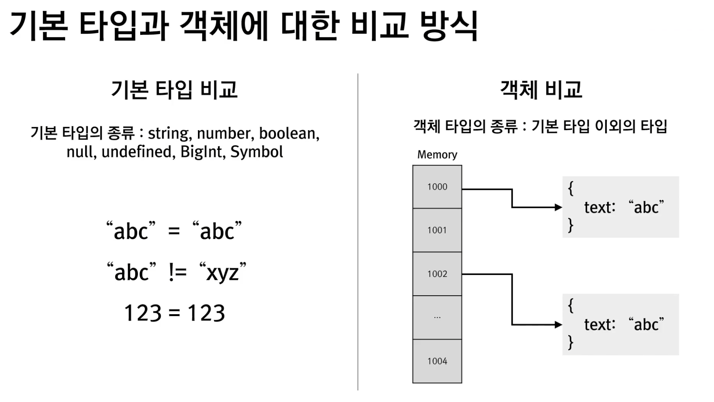

## ✅ 리액트란?

-  React는 웹 어플리케이션 개발을 위한 라이브러리
-  웹 프론트엔드 개발 라이브러리 중 많이 사용
-  컴포넌트 중심의 개발 방식을 추구
-  컴포넌트들을 조합하여 하나의 웹 어플리케이션을 만듦

## ✅ 리액트 구조

-  node_modules

   -  개발에 필요한 패키지 (또는 라이브러리)들이 설치된 폴더

-  public

   -  웹 서버가 호스팅하는 홈 폴더

-  src

   -  소스 코드 파일이 존재하는 폴더

-  index.html

   -  홈 페이지 파일로 시작할때 처음 뜨는 페이지

<br>

## ✅ JSX란?

-  JavaScript를 확장한 문법
-  파일 하나에 JS 코드와 HTML Tag 요소를 함께 작성

<br>

## ✅ Root DOM

-  컴포넌트가 렌더링되는 최상위 DOM

<br>

## ✅ Virtual DOM (가상 돔)이란?

-  리액트는 웹 브라우저의 DOM 구조와 동일한 **가상 DOM(Virtual DOM)** 을 메모리에 생성
-  컴포넌트가 새롭게 렌더링될 때, 변경된 내용을 **가상 DOM과 실제 DOM을 비교(Diffing)** 하여 **변경된 부분만 실제 DOM에 반영(최소 업데이트)**
-  이를 통해 웹 브라우저는 **불필요한 전체 DOM 업데이트 없이**, **변경된 부분만 효율적으로 렌더링**하여 **성능을 최적화**

## ✅ 컴포넌트(Component)

-  **재사용 가능한 UI의 기본 구성 단위**로, 여러 컴포넌트를 조합하여 하나의 웹 애플리케이션을 만들 수 있음
-  **HTML 관점에서** 보면, 리액트 컴포넌트는 사용자 정의 태그처럼 동작함
-  **컴포넌트 개발**은 **함수형**과 **클래스형** 방식으로 가능하며, 현재는 **함수형 컴포넌트**가 더 많이 사용됨

<br>

## ✅ Props

-  Props는 컴포넌트에 데이터를 전달할 때 사용한다.
-  전달받은 props는 **읽기 전용**이며, 직접 수정하면 안 된다.
-  값이 변경되어야 한다면 props가 아닌 **state로 관리**해야 한다.

<br>

## ✅ 이벤트(Event)

-  이벤트 이름은 `on` + 카멜케이스(CamelCase) 형식으로 작성한다.  
   예: `onClick`, `onChange`, `onSubmit`

   ### 🧩 사용자 정의 이벤트

   -  사용자 정의 이벤트는 **props로 함수를 전달**하고,  
      자식 컴포넌트에서 **전달받은 함수를 호출**하는 방식으로 구현한다.

<br>

## ✅ Hook(훅)이란?

-  함수형 컴포넌트에서 **상태(state)**, **생명주기(lifecycle)** 등을 관리하기 위한 **React의 내장 API**
-  더 나은 컴포넌트 개발을 위한 기능을 제공

### 🔧 주요 Hook API

-  `useState`, `useEffect`, `useRef`, `useMemo`, `useCallback` 등

### ⚠️ 사용 시 주의사항

-  Hook의 **호출 순서는 항상 동일해야** 하며, 이를 기반으로 내부적으로 상태를 구분
-  Hook은 **반복문, 조건문, 중첩 함수 내에서 호출하면 안 된다.**

<br>

## ✅ useState Hook

-  `useState`는 컴포넌트에서 **변경 가능한 상태(state)**를 관리할 때 사용하는 Hook

### 🧩 상태(State)란?

-  컴포넌트 내부에서 **변경될 수 있는 값**을 의미
-  상태가 변경되면 해당 컴포넌트는 **자동으로 다시 렌더링**

### 🔄 Props와의 차이

-  Props는 **부모 컴포넌트로부터 전달된 값**으로, 자식 컴포넌트 내부에서 \*\*직접 변경하지 않음.
-  반면, State는 **컴포넌트 내부에서 선언하고 변경**할 수 있음

<br>

## ✅ useEffect


## ✅ Mounting

컴포넌트가 웹 브라우저에 처음 추가되어 렌더링될 때 발생

### Updating

컴포넌트가 상태(state)나 속성(props)의 변경으로 인해 다시 렌더링될 때 발생

### Unmounting

컴포넌트가 웹 브라우저에서 제거될 때 발생

---

<br>

## ✅ useEffect Hook

-  컴포넌트가 Mounting, Updating, Unmounting 될 때 특정 작업을 실행하기 위해 사용
-  첫 번째 인자는 실행할 작업을 담은 함수이며, useEffect의 콜백 함수
-  두 번째 인자는 의존성 배열(Dependency Array)

### 동작 방식

-  의존성 배열을 **지정하지 않으면**, 컴포넌트가 업데이트될 때 마다 useEffect의 콜백 함수가 호출
-  의존성 배열을 **빈 배열([])** 로 지정하면, 컴포넌트가 마운트될 때 한 번만 useEffect의 콜백 함수가 호출
-  useEffect의 콜백 함수 내에서 **정리 함수(return 함수)** 를 작성하면, 컴포넌트가 Unmounting 될 때 해당 작업이 실행

<br>

## ✅ useRef Hook

-  `useRef`의 값은 `useState`처럼 컴포넌트가 유지되는 동안 동일하게 유지, 변경도 가능
-  하지만 `useState`와는 달리, **`useRef`의 값이 변경되어도 컴포넌트는 다시 렌더링되지 않음**
-  `useRef`의 실제 값은 `.current` 속성에 저장

<br>

## ✅ Memoization이란?

-  **Memoization**은 어떤 값을 메모리에 저장해 두고, 동일한 계산을 반복하지 않도록 재사용하는 기법입니다.
-  React에서는 `useMemo` 훅을 사용해 특정 계산 결과를 **캐싱**할 수 있습니다.

<br>

## ✅ useMemo 작동 방식

-  `useMemo`는 첫 번째 인자인 **콜백 함수**를 호출해 값을 계산합니다.
-  두 번째 인자인 **의존성 배열**의 항목 중 하나라도 변경되면,
   이전에 메모된 값을 폐기하고 **콜백 함수를 다시 실행**하여 새 값을 저장합니다.

   

<br>

## ✅ useCallback Hook

-  `useCallback`은 `useMemo`와 유사한 동작
-  **차이점은 "함수(Function)"을 메모이제이션한다는 것**
-  즉, 특정 함수가 의존성 배열에 명시된 값이 변경되지 않는 한 **같은 함수 객체를 반환**

<br>

## ✅ useContext


-  전역적으로 사용할 수 있는 객체를 정의한 후
-  **부모 컴포넌트의 상태(State)를 자식 컴포넌트에서 사용할 수 있도록** 전달하는 데 활용

<br>

### 📘 컴포넌트 트리 구조 및 상태 전달 흐름


-  `App` 컴포넌트는 `count`라는 상태(state)를 가지고 있음
-  `App` → `BlackChild` → `GreenChild` → `BlueChild` 순으로 하위 컴포넌트가 연결됨
-  `count` 값을 `BlueChild`에서 사용하고자 할 경우,
   일반적인 방식으로는 props를 통해 아래로 계속 전달해야 함 → **prop drilling 발생**
-  이런 구조에서는 Context API 또는 전역 상태 관리 도구의 도입을 고려할 수 있음

<br>

## ✅ 고차 컴포넌트 (Higher Order Component, HOC)

-  **기존 컴포넌트를 입력으로 받아**, **특정 기능이 추가된 새로운 컴포넌트를 반환하는 함수**
-  즉, 컴포넌트를 **재사용 가능하게 확장**하는 패턴
-  대표적인 예: `React.memo`, `React.forwardRef` 등

### 📘 React.memo 는 어떤 객체인가?

```js
const MemoizedComponent = React.memo(MyComponent);
```

-  `React.memo`는 함수 컴포넌트(Function Component)를 인자로 받아,  
   내부적으로 props가 바뀌지 않으면 리렌더링하지 않도록 최적화한  
   컴포넌트를 반환하는 고차 컴포넌트(HOC, Higher Order Component)

-  반환값은 **새로운 함수 컴포넌트**

-  따라서 `React.memo` 자체는 **객체가 아니라 함수**이며, **반환된 값은 기억(memoized)된 컴포넌트 객체**

<br>

## ✅ forwardRef 고차 함수

-  `forwardRef`는 **부모 컴포넌트에서 `useRef`를 사용하여, 자식 컴포넌트 내부 DOM 또는 요소에 직접 접근할 수 있도록** 해주는 고차 함수
-  일반적으로 함수형 컴포넌트는 ref를 직접 전달받지 못하지만, `forwardRef`를 사용하면 예외적으로 허용

### 이해를 돕기 위한 예시

#### ✅ ref로 input을 "가리키기"

<br>
<br>

```js
const refInput = useRef();
```

-  input DOM을 직접 참조할 수 있는 변수 생성

<br>
<br>

```js
<CustomInput ref={refInput} label='아이디' />
```

-  refInput을 CustomInput에 props처럼 전달
-  일반 컴포넌트는 ref를 받을 수 없기 때문에 forwardRef() 사용

<br>
<br>

```js
<input ref={ref} />
```

-  부모 컴포넌트 refInput.current는는 해당 input tag를 가리킴

<br>
<br>

```js
useEffect(() => {
   refInput.current.focus();
}, []);
```

-  refInput.current가 가리키는 input에 자동으로 커서 이동

<br>

## ✅ useImperativeHandle Hook

-  컴포넌트의 **내부 상태나 메서드**를 외부(부모 컴포넌트)에서 사용할 수 있도록 공개할 때 사용하는 Hook
-  주로 `forwardRef`와 함께 사용되어, 부모가 자식 컴포넌트에 접근할 수 있는 **특정 메서드나 속성을 커스터마이징**할 수 있음

---

### 📘 인자 설명

```ts
useImperativeHandle(ref, createHandle, [deps]);
```

| 인자           | 설명                                                                   |
| -------------- | ---------------------------------------------------------------------- |
| `ref`          | 부모로부터 전달받은 `ref` 객체 (React가 이 객체에 `.current`를 설정함) |
| `createHandle` | 부모가 사용할 수 있도록 노출할 값(객체)을 반환하는 함수(or 상태)       |
| `[deps]`       | 이 값이 언제 갱신될지를 결정하는 **의존성 배열** (예: 상태 값 등)      |

<br>

## ✅ useReducer Hook 이해하기

-  `useState`와 마찬가지로 **상태(state)** 를 만들고, 이 상태가 바뀌면 **컴포넌트는 자동으로 다시 렌더링**
-  하지만 `useState`와 **가장 큰 차이점**은 **상태를 "액션(action)"을 통해 변경**
-  즉, 상태를 직접 수정하는 게 아니라, **'무엇을 할지'를 설명하는 액션**을 보내고,  
   이걸 처리하는 함수(`reducer`)가 상태를 **어떻게 바꿀지 결정**

   

### 🔄 useState vs useReducer 상태값 변경 방식 비교

| 항목             | `useState`                                     | `useReducer`                                                 |
| ---------------- | ---------------------------------------------- | ------------------------------------------------------------ |
| 상태 정의        | `const [count, setCount] = useState(0)`        | `const [count, dispatch] = useReducer(reducer, 0)`           |
| 상태 변경 방식   | 상태 값을 직접 계산하여 전달                   | 액션(`action`)을 전달하고, 로직은 리듀서가 처리              |
| 사용 예          | `setCount(count + 1)`<br>`setCount(count - 1)` | `dispatch("inc")`<br>`dispatch("dec")`                       |
| 복잡한 로직 처리 | 여러 조건을 set함수에서 처리해야 함            | 조건 분기나 복잡한 처리 로직을 `reducer` 함수에 분리 가능    |
| 구조화 수준      | 단순하고 직관적이나, 로직이 분산될 수 있음     | 상태 변경 로직이 한 곳에 집중되어 가독성과 유지보수에 유리함 |

---

### ✅ 정리

-  `useState`는 **단순한 상태 관리**에 적합
-  `useReducer`는 **여러 상태 변경 조건**이 있거나 **로직을 분리하고 싶을 때** 유용
-  `dispatch("명령어")` 방식으로 **명령 중심(액션 기반)** 으로 동작하는 것이 핵심

<br>

## ✅ useLayoutEffect Hook


-  `useEffect` 훅과 같은 훅으로 볼 수 있으며, **차이점은 콜백 함수의 실행 시점**에 있음

   -  `useLayoutEffect`: **DOM이 그려지기 직전**에 실행
   -  `useEffect`: **DOM이 화면에 나타난 후**에 실행됨

-  따라서 `useLayoutEffect`는 **레이아웃에 영향을 주는 작업(예: 크기 측정, 위치 계산 등)** 이 필요할 때 사용됨

   -  예: DOM 요소의 너비를 계산하거나 스크롤 위치를 제어할 때

-  반대로 `useEffect`는 **비동기 작업, API 호출, 로그 출력 등 렌더링과 무관한 작업**에 적합함

-  ⚠️ 성능 최적화를 위해 **특별한 이유가 없다면 기본적으로는 `useEffect`를 사용하는 것이 좋음**
   -  `useLayoutEffect`는 렌더링을 **블로킹(막음)** 하므로, **잘못 사용하면 깜빡임(flicker)** 이 발생하거나 성능에 악영향을 줄 수 있음

---

### 🧪 실행 순서 예시

```jsx
useLayoutEffect(() => {
   console.log('🟨 useLayoutEffect 실행');
});

useEffect(() => {
   console.log('🟦 useEffect 실행');
});
```

브라우저 콘솔 출력 순서

```
🟨 useLayoutEffect 실행
🟦 useEffect 실행
```

<br>

## ✅ useSyncExternalStore

-  외부 상태와의 **정확한 동기화 보장**
-  **동기적 상태 읽기** 가능
-  **SSR(Server Side Rendering)** 지원
-  **구독 해제 자동 처리**

   ```ts
   useSyncExternalStore(
   subscribe: (onStoreChange: () => void) => () => void,
   getSnapshot: () => any,
   getServerSnapshot?: () => any
   )
   ```

| 인자                | 설명                                                                                                                            |
| ------------------- | ------------------------------------------------------------------------------------------------------------------------------- |
| `subscribe`         | 외부 상태 변화 시 호출될 콜백을 등록하는 함수. 리렌더링을 트리거할 수 있도록 구독을 설정한다. 반환값은 **구독 해제 함수**.      |
| `getSnapshot`       | 외부 상태의 **현재 값을 동기적으로 반환**하는 함수. 상태 값이 변경되었는지 판단할 기준이 된다.                                  |
| `getServerSnapshot` | _(선택)_ SSR 환경에서 사용될 **초기 상태 값을 반환**하는 함수. 클라이언트에서 `getSnapshot`과 동일한 형태의 값을 반환해야 한다. |

<br>
<br>
<br>
<br>
<br>

# React + Vite

This template provides a minimal setup to get React working in Vite with HMR and some ESLint rules.

Currently, two official plugins are available:

-  [@vitejs/plugin-react](https://github.com/vitejs/vite-plugin-react/blob/main/packages/plugin-react/README.md) uses [Babel](https://babeljs.io/) for Fast Refresh
-  [@vitejs/plugin-react-swc](https://github.com/vitejs/vite-plugin-react-swc) uses [SWC](https://swc.rs/) for Fast Refresh

## Expanding the ESLint configuration

If you are developing a production application, we recommend using TypeScript and enable type-aware lint rules. Check out the [TS template](https://github.com/vitejs/vite/tree/main/packages/create-vite/template-react-ts) to integrate TypeScript and [`typescript-eslint`](https://typescript-eslint.io) in your project.

```

```

```

```
