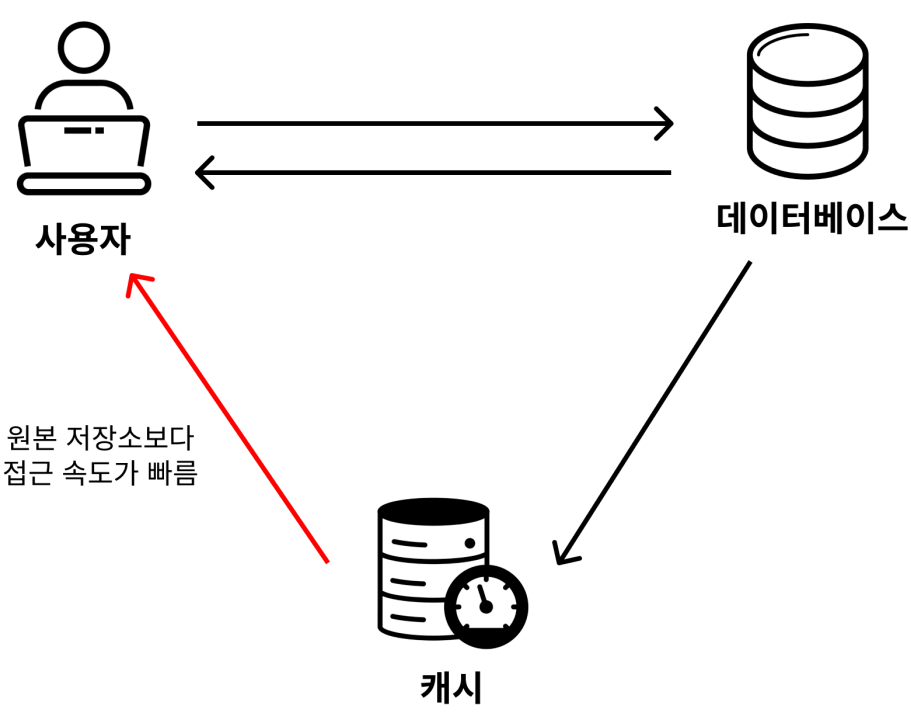
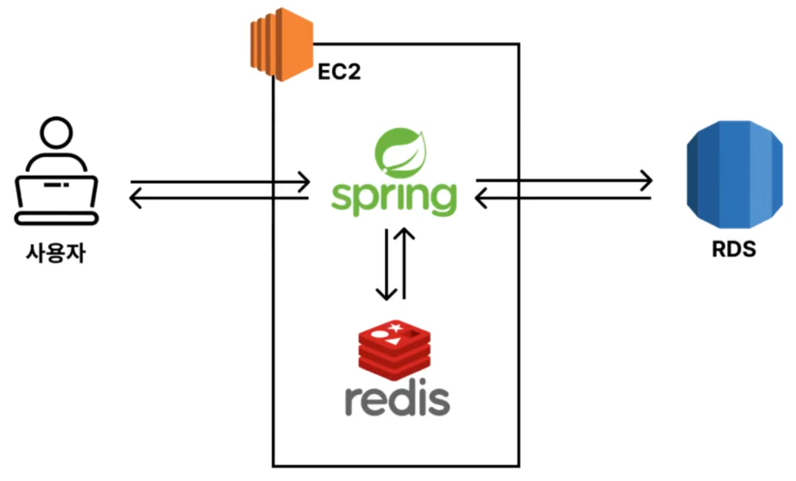
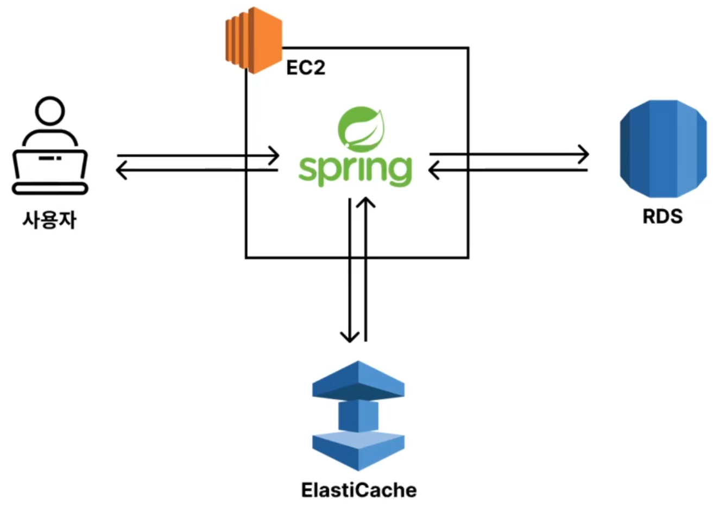

# 📍 Redis란?

레디스(Redis)는 Remote Dictionary Server의 약자.

“키-값” 구조의 비정형 데이터를 저장하고 관리하기 위한, 오픈 소스 기반의 비관계형 데이터베이스 관리 시스템(DBMS)

> Redis는 데이터 처리 속도가 엄청 빠른 NoSQL 데이터베이스

---

### ✅ Redis의 장점

- MySQL과 같은 RDBMS의 데이터베이스는 디스크(Disk)에 데이터를 저장. 
- Redis는 메모리(RAM)에 데이터를 저장.
- 디스크(Disk)보다 메모리(RAM)에서의 데이터 처리속도가 월등하게 빠름.    

> 레디스(Redis)는 인메모리(in-memory)에 모든 데이터를 저장.
> 그래서 데이터의 처리 성능이 굉장히 빠름.

---

### ✅ Redis 사용 사례

- ✅ **캐싱 (Caching)** 
- 세션 관리 (Session Management)
- 실시간 분석 및 통계 (Real-time Analystics)
- 메시지 큐 (Message Queue)
- 지리공간 인덱싱 (Geospatial Indexing)
- 속도 제한 (Rate Limiting)
- 실시간 채팅 및 메시징 (Real-time Chat And Messaging)

---

<br>
<br>

## Redis 기본 명령어

### ✅ 데이터(Key, Value) 저장하기

```
# set [key 이름] [value]

$ set vedivero:hobby soccer

# 띄워쓰기 해서 저장하려면 쌍따옴표로 묶어주면 됨

$ set vedivero:name "vedivero lee" 
```

### ✅ 데이터 조회하기 (Key로 Value 값 조회하기)

```
# get [key 이름]
$ get vedivero:name
$ get vedivero:hobby

# 없는 데이터를 조회할 경우 (nil)이라고 출력됨
$ get james:name 
```

### ✅ 저장된 모든 key 조회하기

```
$ keys *
```

### ✅ 데이터 삭제하기 (Key로 데이터 삭제하기)

```
# del [key 이름]
$ del vedivero:hobby
$ get vedivero:hobby # 삭제됐는 지 확인
Redis 기본 명령어 익히기 1
```

### ✅ 데이터 저장 시 만료시간(TTL) 정하기
```
레디스는 RDBMS와는 다르게 데이터 저장 시 만료시간을 설정할 수 있다. 즉, 영구적으로 데이터를 저장하지 않고 일정 시간이 되면 데이터가
삭제되도록 셋팅할 수 있다.
레디스의 특성상 메모리 공간이 한정 되어 있기 때문에 모든 데이터를 레디스에 저장할 수 없다. 따라서 만료시간(TTL)을 활용해 자주 사용하
는 데이터만 레디스에 저장해놓고 쓰는 식으로 활용한다.
# set [key 이름] [value] ex [만료 시간(초)]
$ set vedivero:pet dog ex 30
```

### ✅ 만료시간(TTL) 확인하기

```
# ttl [key 이름]

# 만료 시간이 몇 초 남았는 지 반환
# 키가 없는 경우 -2를 반환
# 키는 존재하지만 만료 시간이 설정돼 있지 않은 경우에는 -1을 반환

$ ttl vedivero:pet
$ ttl vedivero:name
$ ttl james:name
```

### ✅ 모든 데이터 삭제하기
```
$ flushall
```


---

<br>
<br>

# 📍 네이밍 컨벤션

회사마다 사용하는 컨벤션이 다름.

> 콜론( : )을 활용해 계층적으로 의미를 구분해서 사용

### 예시
`users:100:profile`

- 사용자들(users) 중에서 PK가 100인 사용자(user)의 프로필(profile)

`products:123:details`

- 상품들(products) 중에서 PK가 123인 상품(product)의 세부사항(details)


---

<br>
<br>

# 📍 캐시(Cache), 캐싱(caching)

✅ 캐시(Cache)란, 원본 저장소보다 빠르게 가져올 수 있는 임시 데이터 저장소를 의미



### 현업에서 사용하는 예시

> “이 API는 응답 속도가 너무 느린데? 이 데이터는 캐싱(Cahing) 해두고 쓰는 게 어때?’

이 말을 풀어서 설명하자면 ‘API 응답 결과를 원본 저장소보다 빠르게 가져올 수 있는 임시 데이터 저장소에 저장해두고, 빠르게 조회할 수 있게
만드는 게 어때?’라는 의미


<br>
<br>

# 📍 데이터 캐싱 전략

## ✅ Cache Aside (= Look Aside, Lazy Loading) 전략

- 데이터를 조회할 때 주로 사용하는 전략이 Cache Aside 전략.
- Look Aside 전략 또는 Lazy Loading 전략이라고 부른다. 

### Cache Aside 작동 방식 이해하기

> 처음으로 게시판 서비스를 배포한 상황을 가정 

1. 처음 게시판 서비스를 배포했기 때문에 데이터베이스와 레디스에는 아무런 데이터도 저장이 안 되어 있다.
2. 일부 사용자가 들어와 게시글 작성을 함으로써 데이터를 저장한다. 이 데이터는 데이터베이스에 저장된다. (레디스에는 저장되지 않는다.)
3. 사용자가 데이터를 조회하려고 요청한다. 이 때, 데이터베이스로부터 바로 데이터 조회를 하기 전에 레디스에 있는 지 먼저 확인한다.
4. 레디스에 데이터가 없는 걸 확인한 뒤에 데이터베이스로부터 데이터를 조회해서 응답한다.
5. 데이터베이스로부터 조회한 데이터를 응답한 뒤에 레디스에도 데이터를 저장해둔다.
6. 다시 한 번 사용자가 데이터를 조회하려고 요청한다.
7. 레디스에 조회하고자 하는 데이터가 있는 지 확인했더니, 데이터가 존재해서 레디스로부터 데이터를 바로 가져온다.

---

1. 캐시에 데이터가 있을 경우 (= Cache Hit)
2. 캐시에 데이터가 없을 경우 (= Cache Miss)

> Cache Aside 전략은 캐시(Cache)에서 데이터를 확인하고, 없다면 DB를 통해 조회해오는 방식

<br>
<br>

## ✅ Write Around 전략

Cache Aside 전략이 데이터를 어떻게 조회할 지에 대한 전략이었다면, Write Around 전략은 데이터를 어떻게 쓸 지(저장, 수정, 삭제)에 대
한 전략이다.

Write Around 전략은 Cache Aside 전략과 같이 자주 활용되는 전략이다. Write Around 전략이 어떤 방식인지 ‘저장’의 예시
로 알아보자.

Write Around 전략은 생각보다 너무 간단하다. 데이터를 저장할 때는 레디스에 저장하지 않고 데이터베이스에만 저장하는 방식이다.

그러다가 데이터를 조회할 때 레디스에 데이터가 없으면 데이터베이스로부터 데이터를 조회해와서 레디스에 저장시켜주는 방식이다.


> Write Around 전략은 `쓰기 작업(저장, 수정, 삭제)`을 캐시에는 반영하지 않고, DB에만 반영하는 방식.

---

<br>
<br>

## Cache Aside, Write Around 전략의 한계점 / 해결 방법

### 캐시의 한계점

1. 캐시된 데이터와 DB 데이터가 일치하지 않을 수 있다.

    Cache Asdie와 Write Around 전략을 같이 썼을 때의 한계점 중 하나는 캐시된 데이터와 DB 데이터가 일치하지 않을 수 있다는 점.

    조금 어렵게 표현하자면 데이터의 일관성을 보장할 수 없다는 뜻.
    Write Around 전략에 따르면 데이터를 수정할 때 DB만 업데이트를 시키기 때문에 기존에 저장된 레디스의 데이터 값과 DB의 데이터 값
    은 다를 수 밖에 없다.

    예를 들어, 분명 프로필 수정에서 내 이름을 ‘이현석’에서 ‘이석현’로 변경하고 내 프로필 조회를 해봤더니 내 이름이 여전히 ‘이현석’이라고 표시된다는 것이다.

2. 캐시에 저장할 수 있는 공간이 비교적 작다.

    DB는 디스크(Disk)에 저장해서 많은 양을 저장하기 용이하지만, 캐시는 메모리(RAM)에 저장하기 때문에 DB에 비해 많은 양의 데이터를 저장할 수가 없다. 


<br>
<br>

## 이 한계를 어떻게 극복할까?

### 1. 캐시된 데이터와 DB 데이터가 일치하지 않을 수 있다.

캐시와 DB의 데이터를 일치시키기 위해, 데이터를 수정할 때마다 동시에 업데이트 시키면 성능적으로 느려진다. 그렇다고 성능 향상을 위해 DB의 데이터만 업데이트 시키면 캐시와 DB의 데이터가 일치하지 않게 된다.

하지만 어쩔 수 없다.

어떤 선택을 하든 기회 비용(Trade Off)이 발생한다.

무언가를 얻으면 무언가를 포기해야 한다.

대부분의 개발 기술들이 장점이 있으면 단점이 있다.

따라서 데이터 조회 성능 개선 목적으로 레디스를 쓰는 경우에는 데이터의 일관성을 포기하고 성능 향상을 택한 것이다.

이러한 이유로 인해 캐시를 적용시키기에 적절한 데이터는 다음과 같다.

- 자주 조회되는 데이터잘 변하지 않는 데이터
- 실시간으로 정확하게 일치하지 않아도 되는 데이터
- 하지만 장기간 데이터가 일치하지 않는 건 문제가 될 수 있다.

따라서 적절한 주기로 데이터를 동기화시켜주어야 한다. 

이 때 활용하는 기능이 레디스의 TTL 기능(만료 시간 설정 기능)이다.

일정 시간이 지나면 데이터가 캐시에서 삭제된다.

그럼 특정 사용자가 조회를 하는 순간 Cache Miss가 발생한다.

DB의 데이터를 새로 조회해와서 캐시에 데이터를 넣게 된다.

> 즉, 데이터가 새롭게 갱신되는 효과가 있는 것이다.

### 2. 캐시에 저장할 수 있는 공간이 비교적 작다.

위에서 활용했던 TTL 기능(만료 시간 설정 기능)을 활용하면 캐시의 공간을 효율적으로 쓸 수 있다.

왜냐면 자주 조회하지 않는 데이터는
만료 시간에 의해 데이터가 삭제되기 때문이다. 


<br>
<br>

## 캐싱으로 조회 성능 개선을 하기 전 OOO을 항상 먼저해야 한다!

### ✅ 데이터 조회 성능을 개선하는 방법

데이터 조회 성능을 개선하는 방법은 다양.
- SQL 튜닝
- 캐싱 서버 활용 (Redis 등)
- 레플리케이션 (Master/Slave 구조)
- 샤딩
- DB 스케일업 (CPU, Memory, SSD 등 하드웨어 업그레이드)

### ✅ 많은 성능 개선 방법 중 ‘SQL 튜닝’을 왜 먼저 고려해야 할까?

#### 1. SQL 튜닝을 제외한 나머지 방법은 추가적인 시스템을 구축해야 함.   
    
- 따라서 금전적, 시간적 비용이 추가적으로 발생.
- 조금 더 복잡해진 시스템 구조로 인해 관리 비용 증가.
- 그에 비해 SQL 튜닝은 기존의 시스템 변경 없이 성능 개선.

#### 2. 근본적인 문제를 해결하는 방법이 SQL 튜닝일 가능성이 높다. 

SQL 자체가 비효율적으로 작성됐다면 아무리 시스템적으로 성능을 개선한
다고 하더라도 한계가 있다.

하지만 SQL 튜닝을 통해 기본적으로 성능을 향상시킨다면, 시스템적인 성능 개선이 필요없거나 훨씬 간단한 개선으로 큰 성능 개선 효과를 얻을 수 있다.

> DB 성능 개선 방법들 중 가장 가성비가 좋은 방법이 SQL 튜닝.


---

<br>
<br>

# 📍 Docker Compose로 Redis, Spring Boot 가동하기

## 1. Dockerfile 만들기


파일 명 : project/`Dockerfile`
```
FROM openjdk:17-jdk

COPY build/libs/*SNAPSHOT.jar app.jar

ENTRYPOINT ["java", "-jar", "/app.jar"]
```

---

## 2. compose.yml 만들기

파일 명 : project/`compose.yml`

```
services:
    api-server:
        build: .           # Dockerfile 파일로 빌드
        ports:
            - 8080:8080    # Port끼리 Mapping
        depends_on:
            cache-server:
                condition: service_healthy     # Redis가동 후, Spring Boot Server 가동
    cache-server:
        image: redis        # Image로 Redis 사용
        ports:
            - 6379:6379     # Redis 기본 Port
    healthcheck:            # Redis가 잘 가동된다는 조건
        test: [ "CMD", "redis-cli", "ping" ]
        interval: 5s
        retries: 10
 ```

 ---

 ### Local 환경에서 Docker Compose 실행 TEST

 - Test를 위한 기존 Redis, Spring Boot 종료

#### Redis 종료 명령어

    brew services stop redis


#### Redis 종료 확인 명령어

    brew services info redis

#### Spring Boot Server 종료 확인 명령어

    lsof -i:8080


---

## 3. application.yml 수정

```
# local 환경
spring:
    profiles:
        default: local
    datasource:
        # 스프링 부트가 가동되는 컨테이너 안에서의 주소(해당 컨테이너에는 MySQL이 미설치)
        # url: jdbc:mysql://localhost:3306/mydb 
        url: jdbc:mysql://host.docker.internal:3306/mydb 
        username: root
        password: password
        driver-class-name: com.mysql.cj.jdbc.Driver
    jpa:
       hibernate:
            ddl-auto: update
        show-sql: true
    data:
        redis:
            # Redis도 마찬가지
            # host: localhost
            host: cache-server  # compose.yml에서 정의한 Redis Name과 일치
            port: 6379
logging:
    level:
    org.springframework.cache: trace
---
# prod 환경
spring:
    config:
    activate:
    on-profile: prod
    datasource:
        url: jdbc:mysql://instagram-db.coseefawhrzc.ap-northeast-2.rds.amazonaws.com:3306/mydb
    username: admin
    password: password
```

---

## 4. Build

- server build

    ```
    ./gradlew clean build -x test
    ```

- docker build

    ```
    docker compose up --build -d
    ```

#### Redis 생성 ➡️ Redis 체크 ➡️ Spring Boot Server 가동
    
    

---

### docker compose

- 실시간 로그 출력 설정 명령어

    ```
    docker compose logs -f
    ```


<br>
<br>
<br>

# AWS EC2에서 Docker Compose로 Redis, Spring Boot 가동하기

## production에서 사용할 설정 파일 분리

<br>

파일 명 : project/`Dockerfile-prod` 

```
FROM openjdk:17-jdk

COPY build/libs/*SNAPSHOT.jar app.jar

ENTRYPOINT ["java", "-jar", "-Dspring.profiles.active=prod", "/app.jar"]
```

<br>

파일 명 : project/`compose-prod.yml`

```
services:
    api-server:
        build:
        context: .  # 현재 경로를 의미
        dockerfile: ./Dockerfile-prod   # 파일이름을 의미
        ports:
            - 8080:8080
        depends_on:
            cache-server:
             condition: service_healthy
    cache-server:
        image: redis
        ports:
            - 6379:6379
        healthcheck:
            test: [ "CMD", "redis-cli", "ping" ]
            interval: 5s
            retries: 10
```

---

<br>

## Github에 소스 코드 Push

```
git add .
git commit -m "docker"
git push origin main

```


---
<br>

## EC2에서 소스 코드 Pull

```
git pull origin main
```

---

<br>

## EC2에 Docker Compose 설치하기

- Docker Compose 설치 명령어
    ```
    $ sudo apt-get update && \
    sudo apt-get install -y apt-transport-https ca-certificates curl software-properties-common && \
    curl -fsSL https://download.docker.com/linux/ubuntu/gpg | sudo apt-key add - && \
    sudo apt-key fingerprint 0EBFCD88 && \
    sudo add-apt-repository "deb [arch=amd64] https://download.docker.com/linux/ubuntu $(lsb_release -cs) stable"
    sudo apt-get update && \
    sudo apt-get install -y docker-ce && \
    sudo usermod -aG docker ubuntu && \
    newgrp docker && \
    sudo curl -L "https://github.com/docker/compose/releases/download/2.27.1/docker-compose-$(uname -s)-$(unam
    sudo chmod +x /usr/local/bin/docker-compose && \
    sudo ln -s /usr/local/bin/docker-compose /usr/bin/docker-compose
    ```


- Docker 버전 확인 명령어
    ```
    $ docker -v

    Docker version xx.x.x, build xxxxxxx
    ```

- Docker Compose 버전 확인 명령어
    ```
    $ docker compose version

    Docker Compose version vx.xx.x
    ```

---

- Redis 중지 명령어

    ```
    sudo systemctl stop redis


    ```

- Redis 상태 확인 명령어

    ```
    sudo systemctl status redis

    # 실행 중
    ...
    Active : active
    ...

    # 중지
    ...
    Active : inactive (dead)
    ...
    ```

---

- Spring Boot 가동 여부 확인

    ```
    sudo lsof -i:8080
    ```

- Spring Boot 정지 명령어

    ```
    kil <PID Number>
    ```

---

## Spring Boot 가동하기

- 빌드

    ```
    ./gradlew clean build -x test
    ```

## Docker Compose

- 빌드
    ```
    docker compose -f compose-prod.yml up --build -d
    ```

- Docker 가동 체크

    ```
    docker ps
    ```

- Dokcer Compose 종료

    ```
    docker compose down
    ```

---

## API호출 테스트

```
xx.xxx.xxx.xxx:xxxx/boards
```

<br>
<br>
<br>

# 📍 ElastiCache

## 현업에서 EC2에 Redis말고, ElastiCache를 쓰는 이유

- Redis 

    일일이 Redis를 설치하고 셋팅하고 관리하면서 확장까지 하려면 신경쓸 게 생각보다 많다.

- ElastiCache

    쉬운 세팅, 쉬운 확장, 모니터링 기능 기본 제공, 장애 발생 가능성도 훨씬 적다.

> 사용은 쉽게 가능하나, 작동 원리를 이해하는 것이 중요.


<br>
<br>
<br>

## ElastiCache

### 기존 아키텍처
    


### ElastCache 아키텍처



- 사용자가 스프링에 API요청
- 데이터 베이스 조회 전, 캐시 서버를 체크
- 캐시 서버에 데이터가 있으면 데이터를 응답
- 캐시 서버에 데이터가 없으면 데이터 베이스에서 조회
- 데이터베이스에서 응답한 데이터를 ElastiCache에 저장

    > Cache Aside

<br>
<br>
<br>

## Spring Boot, ElastiCache 연결

- ElastiCache 연결하기 위한 옵션 수정

    - application.yml
        - 캐시 정보 변경하기
        ```
        spring:
            config:
                activate:
                    on-profile: prod
            datasource:
                url: jdbc:mysql://coseefawhrzc.ap-northeast-2.rds.amazonaws.com:3306/mydb
                username: admin
                password: password
            data:
                redis:
                    # AWS ElastiCache 기본 엔드포인트 URL
                    host: s8nyjv.ng.0001.apn2.cache.amazonaws.com
                    port: 6379
        ```


- git push

- EC2에서 git pull

- EC2에서 Build

    ```
    ./gradlew clean build -x test
    ```

- EC2에서 Spring Boot 가동

    - 빌드된 jar 파일 위치로 이동 

    - jar 파일 싱행
        ```
        java -jar -Dspring.profiles.active=prod redis-in-spring-0.0.1-SNAPSHOT.jar
        ```

---

## ElastiCache Server로 요청

xx.xxx.xxx.xxx:xxx/boards

---

## ElastiCache에 Cache가 저장되고 있는지 체크

- EC2(ubuntu)
    ```
    redis-cli -h <엔드포인트 URL>

    keys *

    get getBoards::boards:page:1:size:10
    ```