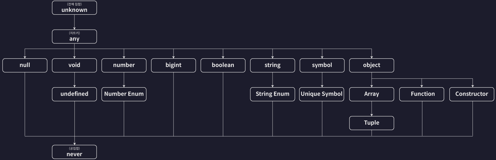

# Number 타입과 Number 리터럴 타입 정리

1. Number 타입
   -  정의: 모든 숫자형 값을 포함.
   -  예시: 1, -20, 123123, 0.123, Infinity.
2. Number 리터럴 타입
   -  정의: 특정 숫자 하나로 제한된 타입.
   -  예시: 20이라는 리터럴 타입은 20 값만 포함.
   -  코드 예시:
      -  `let num: 20 = 20;`

---

# Number 타입과 Number 리터럴 타입의 관계

-  Number 타입
   -  부모 타입 또는 슈퍼타입.
-  Number 리터럴 타입
   -  자식 타입 또는 서브타입.
-  관계 설명:
   -  Number 리터럴 타입(20)은 Number 타입(모든 숫자)의 하위 집합.
   -  따라서 리터럴 타입은 Number 타입으로 업캐스팅(Up Casting) 가능.
   -  반대로 Number 타입을 리터럴 타입으로 다운캐스팅(Down Casting) 하려면 추가적인 조건 필요.

---

# 타입 호환성(Type Compatibility)

-  정의
   -  한 타입을 다른 타입으로 취급해도 되는지 결정하는 기준.
-  업캐스팅 가능

   -  Number 리터럴 타입 → Number 타입
      ```
      let num1: number = 10;
      let num2: 10 = 10;
      num1 = num2; // OK
      ```

-  다운캐스팅 불가
   -  Number 타입 → Number 리터럴 타입.
      ```
      let num1: number = 10;
      let num2: 10 = 10;
      num2 = num1; // Error
      ```

---

# 업캐스팅(Up Casting)과 다운캐스팅(Down Casting)

1. 업캐스팅 (Up Casting):

   -  설명
      -  하위 타입 → 상위 타입으로 변환.
   -  예시
      ```
      let num1: number = 10; // Number 타입
      let num2: 10 = 10; // Number 리터럴 타입
      num1 = num2; // OK
      ```
   -  특징
   -  모든 상황에서 가능.

2. 다운캐스팅 (Down Casting):

   -  설명: 상위 타입 → 하위 타입으로 변환.
   -  예시
      ```
      let num1: number = 10; // Number 타입
      let num2: 10 = 10; // Number 리터럴 타입
      num2 = num1; // Error
      ```
      -  특징
         -  대부분의 경우 불가능. 특정 조건 필요

---

# 타입계층도


