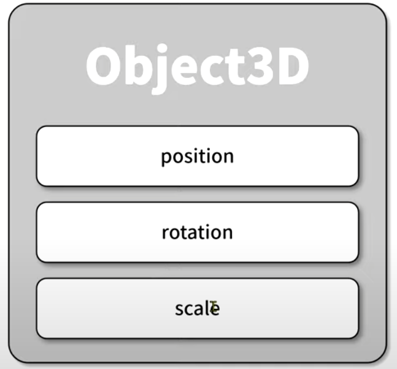

# 기본 구성요소

- ### Renderer(출력)

  - 모니터와 같은 출력 장치에 출력할 수 있는, 즉 렌더링 할 수 있는 렌더러
  - Scene을 렌더링 할 때, 어떤 시점에서 보느냐에 따라 다양한 모습으로 렌더링 됨
  - ### Scene(장면)

    - 3차원 객체로 구성되는 Scene

    - ### Light(광원)

      - 3차원 형상이 화면에 표시되기 위해 적절한 광원이 필요

    - ### Mesh(Object3D의 파생 Class)

      - 3차원 객체를 화면에 표시하기 위한 Class
      - Object 3D의 파생 Class
        

        - Mesh : 삼각형 면으로 구성된 객체를 표현
        - Line : 선형 객체를 표현
        - Points : 점 객체를 표현

        > Mesh, Line, Points 3차원 객체는 3차원 공간에 표출

        

        - 3D Object가 3차원 공간 상에 놓여지기 위해 위치, 회전, 크기 값이 필요
        - 이를 위해 부모 클래스인 Object3D에는 위치, 회전, 크기 속성을 가짐

          - 위치(position)
            - x,y,z 축에 대한 위치 값(default:0,0,0)
          - 회전(rotation)
            - x,y,z 축에 대한 회전 값(default:0,0,0)
          - 크기(scale)
            - x,y,z 축에 대한 크기의 배수 값(default:1,1,1)(=원래 크기)

        

      - ### Geometry(형상 정의)

        - Mesh를 구성하는 요소
        - 3차원 객체의 형상을 정의

      - ### Material(색상 및 투명도 정의)
        - Mesh를 구성하는 요소
        - 3차원 객체의 색상 및 투명도 정의

  - ### Camera(시점)
    - 바라보는 시점을 정의

 
 

# 🧱 BufferGeometry 구성 요소 요약

## ✅ 기본 도형 (Primitive Geometry)

| 클래스              | 설명                     |
| ------------------- | ------------------------ |
| `BoxGeometry`       | 직육면체(상자) 생성      |
| `CircleGeometry`    | 원 생성                  |
| `ConeGeometry`      | 원뿔 생성                |
| `CylinderGeometry`  | 원기둥 생성              |
| `SphereGeometry`    | 구 생성                  |
| `RingGeometry`      | 가운데가 뚫린 링 생성    |
| `PlaneGeometry`     | 평면(2D 사각형) 생성     |
| `TorusGeometry`     | 도넛 모양 생성           |
| `TorusKnotGeometry` | 꼬여 있는 도넛 형태 생성 |

 
 

---

## ✅ 고급/사용자 정의 도형 (Advanced Geometry)

| 클래스            | 설명                              |
| ----------------- | --------------------------------- |
| `ExtrudeGeometry` | 2D 도형을 입체적으로 밀어서 생성  |
| `TextGeometry`    | 3D 텍스트 생성                    |
| `LatheGeometry`   | 2D 선을 축 기준으로 회전시켜 생성 |
| `TubeGeometry`    | 경로(곡선)를 따라 튜브 생성       |
| `ShapeGeometry`   | 2D 도형을 평면으로 생성           |

## 📐 선 기반 형상

| 클래스              | 설명                              |
| ------------------- | --------------------------------- |
| `WireframeGeometry` | 형상을 선으로 표현 (와이어프레임) |
| `EdgesGeometry`     | 외곽선만 추출하여 표시            |

## 🧮 수학 기반

| 클래스               | 설명                                 |
| -------------------- | ------------------------------------ |
| `ParametricGeometry` | 수학 함수로 곡면 생성 _(비활성화됨)_ |
